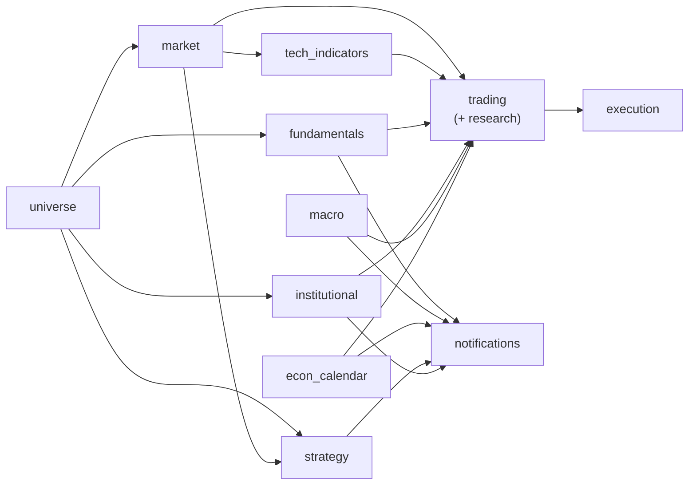

# CLAUDE.md — 이 저장소의 개발 규칙

이 저장소에서 작업할 때 따라야 할 안내서입니다. **작업 전에 먼저 읽으세요.**
알림 카드 템플릿(`src/investment_agent/notifications/*/templates/*.html.j2`)이나 대시보드 UI를 만지기 전에는
[DESIGN-system.md](DESIGN-system.md)(디자인 시스템 SSOT)를 읽으세요.

이 문서에는 **모르면 조용히 틀리는 것**만 둡니다. 찾아보기만 하면 되는 것은 갈라 뒀습니다 —
환경변수는 [docs/ENV.md](docs/ENV.md), 실행 스크립트와 CI 상세는
[docs/OPERATIONS.md](docs/OPERATIONS.md), 영역별 규칙은 이 문서와 `DESIGN-system.md`에 있습니다.

## 프로젝트 개요

S&P 500 종목을 대상으로 한 **투자 분석용 데이터 파이프라인 + Discord 알림** 시스템입니다.
공개 데이터(SEC EDGAR, yfinance, FRED/ECOS/EIA)를 수집·표준화·계산해 Supabase(Postgres)에
적재하고, 중요한 이벤트를 성격에 맞는 **PNG 대시보드 카드 또는 Discord embed**로 구성해 Discord에 보냅니다.

- 런타임: **Python 3.11**(GitHub Actions 기준), 로컬은 3.12도 사용.
- 저장소: **Supabase Postgres**. 데이터·연구 owner는 `src/investment_agent/` 아래에 두고,
  관심종목은 `universe`, 전송 설정·outbox는 `notifications`가 소유합니다.
- 스케줄링: 수집·정규 알림은 **GitHub Actions cron** (`.github/workflows/`). 토스 고정 IP가 필요한
  AI 판단·Discord 승인·실행은 `investment_agent.operations.commands`를 통해 호출하고,
  operations 하네스 라이브러리(`investment_agent.operations.harness`)는 Windows/Mac mini의 로컬 서비스에서 별도 운영합니다.
- 알림: 대시보드는 **Jinja2 → Playwright(Chromium) 헤드리스 캡처 → PNG**, 목록·근거 중심 알림은
  **Discord embed**로 전송.

## 아키텍처

### 데이터·연구 owner (`src/investment_agent/`)

```text
src/investment_agent/
  data/<domain>/          universe · market · fundamentals · macro · institutional
    domain/               그 데이터가 무엇인지 (순수 규칙)
    application/          그것으로 무엇을 하는지 (수집·변환·적재 흐름)
    infrastructure/sources/ 외부 provider 어댑터
    repository.py/persistence.py/db.py
                            해당 도메인의 Supabase read/write 경계
    commands/             증분·backfill CLI 진입점
  intelligence/           뉴스·소셜 (같은 4계층, 저장소는 로컬 DuckDB·Parquet)
  research/               features · datasets · models · backtest · RL
  trading/                decision · evidence · portfolio · risk · performance
  notifications/          outbox · producers · Discord · discord_admin
  operations/              harness(로컬 오케스트레이터) · monitoring(예정된 것이 실제로
                           돌았는지) · commands(CLI). 실행 단계는 harness의 mode가 정한다 —
                           `shadow/paper/live`라는 파일로 나누지 않는다(규칙 14의 3축).
  execution/              폴더가 주문 lifecycle 순서다 — approval → orders → brokers
                           → reconciliation, 그 옆에서 safety가 감시한다.
  reporting/               readers(저장소별 읽기) · notifications(알림 read model)
                           · services(주제별 조립). 저장소를 여는 곳은 앞의 둘뿐이다.
  platform/                공통 DB · clock · logging · retry · serialization · cache · usage ledger
  dashboard/               읽기 전용 Streamlit UI. app_pages(화면) · components(조각)
                           · calculations(화면용 파생). `pages/`가 아닌 것은 Streamlit이
                           그 이름을 자동 멀티페이지로 훑기 때문이다.

db/postgres/v1/                     현재 Supabase schema의 유일한 선언 순서
db/sqlite/runtime/v1/               로컬 실행·승인·알림 원장 선언
db/duckdb/{research,intelligence}/v1/  로컬 연구·텍스트 저장소 선언
```

저장소는 넷이다. 무엇이 어디에 사는지는 [docs/STORAGE_MAP.md](docs/STORAGE_MAP.md)가 갖는다.

### 일부러 다르게 둔 모양

"더 줄이자"는 제안이 반복해서 닿는 자리들이다. 넷 다 줄이면 **에러 없이** 기능이
빈다. 고치기 전에 여기 적힌 이유가 아직 유효한지 먼저 확인하세요.

| 자주 나오는 제안 | 왜 안 하는가 | 지키는 것 |
|---|---|---|
| `config/*.toml` 층을 새로 만들기 | 참조 데이터는 코드 catalog가 소유한다. hard risk limit(`trading/risk/gate.py`)이 편집 가능한 파일로 나가면 코드 리뷰 없이 라이브 게이트를 느슨하게 할 수 있다. 같은 것을 두 곳이 주장하는 문제는 새 디렉터리가 아니라 **이미 고른 자리로 통일**해서 푼다 | `docs/ENV.md`(토글·비밀값) + 코드 catalog(참조 데이터) + `pyproject.toml`(의존성) |
| 워크플로 37→6개로 합치기 | 37개는 중복이 아니라 **서로 다른 스케줄 37개**다(장 마감 뒤·상류 뒤·혼잡 회피). 공통 설치 단계는 이미 `.github/actions/`로 빠져 31개가 그것을 쓴다. 합치면 cron이 `if:` 자기 게이트로 바뀐다 | 워크플로당 명시적 cron |
| `notifications`를 `service.py`+`discord/`로 합치기 | 카드 패키지가 `render.py`/`templates/`를 공유하면 조용히 서로를 끌고 간다 — 규칙 15와 DESIGN-system.md가 그래서 분리를 강제한다. 공통 원시값은 이미 `notifications/quickchart.py`·`renderers/`·`channels/`에 있다 | 규칙 15, 알림별 패키지 |
| research DuckDB를 4표로 줄이기 | 여덟 표는 세 묶음이다 — Parquet 뿌리 catalog 2, 연구 lineage 4, 전략 배분 2. 넷만 남기면 feature store 신선도와 월간 전략 계약이 사라진다 | `db/duckdb/research/v1/10_datasets.sql` 머리주석 |

`fundamentals`는 기업 전체 재무·차원 재무·시장 예상치·실적 이벤트가 한 스키마와
회계기간 모델을 공유하므로 예외적으로 `domain/` → `application/` → `infrastructure/`와
`jobs/` 계층을 사용합니다. 상세 경계는
[src/investment_agent/data/fundamentals/ARCHITECTURE.md](src/investment_agent/data/fundamentals/ARCHITECTURE.md)가 단일 기준입니다.
Supabase 쿼리 빌더는 `src/investment_agent/data/fundamentals/infrastructure/supabase/`에만 둡니다.

| 파이프라인 | 역할 | 스케줄 진입점 | 워크플로 |
|---|---|---|---|
| [universe](src/investment_agent/data/universe/README.md) | 미국 거래소 종목 마스터·S&P 500 멤버십·CIK 매핑 | `investment_agent.data.universe.commands.universe_membership`, `universe_monthly` | 미국 월·수·금 장 마감 후 경량 점검 + 매월 1일 정합성 |
| [market](src/investment_agent/data/market/README.md) | OHLCV·배당·액면분할 | `investment_agent.data.market.commands.market_daily` | 평일 일별 |
| [features](src/investment_agent/research/features/README.md) | RSI·MACD 등 기술 지표 | `investment_agent.research.features.daily` | market 뒤 |
| [fundamentals](src/investment_agent/data/fundamentals/README.md) | 기업 전체·세그먼트 재무, 시장 예상치, 실적 이벤트 | `investment_agent.data.fundamentals.commands.sync_filings` | 화~토 + market 뒤 |
| ┗ 관심종목 fast path | 같은 공시 유스케이스의 관심종목 실행 | `investment_agent.data.fundamentals.commands.sync_filings --watchlist-only` | 평일 17:30 ET |
| ┗ 발표 세션 감시 | 예정 시각 품질별로 관심종목 8-K·10-Q/K를 좁게 훑기 | `investment_agent.operations.commands.watch_earnings` | 로컬 하네스 1분 주기 + Actions 22:00·07:00 KST |
| ┗ 정합성 점검 | 스키마 드리프트·충전율 하락·멈춘 financial_versions 탐지 | `investment_agent.data.fundamentals.commands.verify_integrity` | 매일 18:00 KST |
| [institutional](src/investment_agent/data/institutional/README.md) | 13F 7인 레이더 | `investment_agent.data.institutional.commands.institutional_daily` | 화~토 |
| [macro](src/investment_agent/data/macro/README.md) | 일별 시장 상태 (FRED/ECOS/yfinance/웹/내부 계산) | `investment_agent.data.macro.commands.macro_refresh` | 화~토 + 월(`macro_etl_monday`) |
| macro releases | macro owner의 자연키 발표·일정 변경·원자료·예상값 변경; actual은 reporting view에서 계산 | `investment_agent.data.macro.commands.econ_calendar_*` | daily + 발표창(UTC 12~15시 평일) 15분 watcher + 주간 revision audit |
| [strategy](src/investment_agent/research/strategies/README.md) | 팩터/룰 기반 전략 배분 | `investment_agent.research.strategies.etl` | 월 1회 |
| [trading](src/investment_agent/trading/README.md) | TradingAgents 판단·full portfolio·backtest/RL·평가/승격 | `investment_agent.trading.decision.portfolio_shadow` / `investment_agent.trading.portfolio.construct` | 로컬 하네스/수동 |
| [watchlists](src/investment_agent/data/universe/watchlists/README.md) | 관심종목 설정·Toss 보유 출처 동기화 | `investment_agent.data.universe.watchlists.watchlist` | 수동 / 로컬 |
| [intelligence](src/investment_agent/intelligence/README.md)(news) | 관심종목 뉴스 수집 | `investment_agent.intelligence.commands.collect_news` | 로컬 하네스 |
| intelligence(social) | 서브레딧 스트림·종목 언급 | `investment_agent.intelligence.commands.collect_social` | 로컬 하네스 |
| [operations](src/investment_agent/operations/README.md) | Discord 시스템 로그·Actions 생존 점검 + 로컬 투자 하네스/checkpoint/heartbeat | `investment_agent.operations.commands.heartbeat` / `.investment_harness` | Actions 일일 + 로컬 상시 |
| [discord_admin](src/investment_agent/notifications/discord_admin/README.md) | Discord 채널 구조·역할/권한·안내문·Server Guide 선언 (로컬 전용, CI 없음) | `investment_agent.notifications.discord_admin.entries.sync` / `.roles` / `.guide` / `.onboarding` | 수동 |

도메인은 서로의 내부 구현을 직접 소유하지 않습니다. 수집·적재는 각 data owner의
`repository.py`·`persistence.py`·`db.py` 경계가 담당하고, `reporting`과 `trading`은 공개된
읽기 계약으로 필요한 결과를 조립합니다. `universe`가 tracked 종목 gate이고, `trading`이
여러 data owner의 결과를 evidence로 읽어 모읍니다.



`ops`(실행·품질 감시)와 `watchlists`(관심종목 설정), `discord_admin`(서버 구조)은 위 데이터
흐름을 가로질러 감시·설정하는 역할이라 다이어그램에서 뺐다.

### 알림 ([src/investment_agent/notifications/](src/investment_agent/notifications/README.md))
- 진입점은 **`python -m investment_agent.operations.commands.notify --kind <KIND>`** 하나.
  KIND 매핑은 `src/investment_agent/operations/commands/notify.py`의 `KINDS`에 있습니다
  (`macro_core`, `macro_watch`, `econ_calendar_release`, `strategy`, `fundamentals_earnings`,
  `fundamentals_flash`, `fundamentals_calendar`, `gurus_13f`,
  `investment_portfolio`, `investment_candidates`, `investment_trades`).
- **자동매매 보고서 3종**: `investment_portfolio`(하루 1장 종합 판단),
  `investment_candidates`(신뢰도 상위 N종목 심층), `investment_trades`(실제 주문·체결).
  파이프라인이 아니라 `trading`·`execution` 원장이 원천이고, 로컬 하네스가
  판단·체결 직후에 보내며 `notify_investment` Actions가 하루 한 번 안전망으로 돈다.
  중복은 `notification_outbox`의 producer·notification_key 선점이 막는다.
  카드에는 원장에 실제로 있는 값만 적는다 — 판단에 반영되지 않는 요소를 반영된 것처럼
  쓰지 않는다.
- **실적 알림 2단계 파이프라인**:
  1. **1단계 (속보)**: `fundamentals_flash` — 실적 발표 당일 Form 8-K (Item 2.02) 보도자료를 감지하여 매출·EPS 서프라이즈 단문 Embed 알림 즉시 발송.
  2. **2단계 (정밀 분석)**: `fundamentals_earnings` — 며칠 뒤 정식 Form 10-Q/10-K 공시 접수 시 13분기 추세, 현금흐름 6단계 브릿지, 5개년 월별 배당 계단 차트 등 종합 고해상도 PNG 카드 발송.
- 구성: reporting read model(조회) → 도메인 계산(`reporting/earnings/*.py`, `reporting/macro/*.py`) →
  알림 패키지의 `card.py`/`render.py`(Jinja2 + Playwright)와 `templates/*.html.j2`,
  목록·근거 중심 알림은 `embeds.py` → `notifications/channels/discord.py`(전송).
- **PNG 카드를 만드는 알림 패키지는 자기 `render.py`와 `templates/`를 소유**합니다(공유 금지).
  목록·근거 중심 알림은 Discord embed를 쓰며, 필요할 때만 QuickChart URL로 그림을 붙입니다.

### 투자 매매 알고리즘 (`src/investment_agent/trading/`)

`trading`은 실주문 안전 경계인 `execution`과 분리된 판단·포트폴리오 계층입니다.
`execution`은 스케줄 파이프라인이 아니라 [고정 IP 로컬 하네스](src/investment_agent/execution/README.md)가
`investment_agent.operations.commands.toss_preview` / `.execute_toss_live`로 부르는 실주문 안전
경계라 위 파이프라인 표에는 없습니다. `trading`은 canonical 계약과 자기 도메인 구현만
소유하며 파이프라인 진입점을 부르지 않습니다. *(테스트 강제)*

| 패키지 | 역할 | 쓰는 곳 |
|---|---|---|
| `src/investment_agent/trading/decision/` | event 추출·desk 신호·debate·fusion·regime·ranker | `trading` |
| `src/investment_agent/research/` | PIT feature/label·dataset·baseline 학습·OOS 평가 | `research` |
| `src/investment_agent/research/` | TrainingSample·challenger 비교·승격 판정 | `research` |
| `src/investment_agent/research/evaluation/` | DSR·transaction cost·shadow fill·OOS 평가 | `research`, `trading` |
| `src/investment_agent/trading/performance/` | TradeOutcome·attribution | `trading`, `reporting` |

실제 포트폴리오 위험 판정은 `trading/risk/gate.py`의 `DeterministicRiskGate`가 소유합니다.
`research/evaluation`과 `trading/performance`는 execution과 분리된 분석·성과 계층입니다.
execution은 stable한 execution contract와 broker·승인·원장만 소유하고, 연구·성과
구현을 import하지 않습니다. *(테스트 강제)*

### 대시보드 ([src/investment_agent/dashboard/](src/investment_agent/dashboard/README.md))

읽기 전용 Streamlit 앱입니다. `scripts/dashboard.bat`으로 띄우고 CI에서는 돌지 않습니다.
읽기 전용은 관례가 아니라 강제입니다 — Supabase에 닿는 유일한 경로가
`dashboard/db.py`의 `SelectOnlyGateway`이고, 그것은 SELECT 계열만 조합합니다.
RPC 경로(`select_function_rows`)는 `READ_ONLY_FUNCTIONS` allowlist에 있는 함수와
인자만 통과시키는데, **그 목록은 지금 비어 있고 부르는 곳도 없습니다** — 즉 RPC는
전부 거부됩니다. 필요해지면 목록에 올리기 전에 해당 SQL 함수가 STABLE이고 본문이
SELECT 하나인지 확인하세요.

### 플랫폼 공통 ([src/investment_agent/platform/](src/investment_agent/platform/README.md))
- `db/postgres.py` — `from investment_agent.platform.db.postgres import sb`로 service-role 싱글턴.
  1000행 페이지네이션은 `select_all_paged()`. `db/`는 저장 기술마다 한 파일이고 `__init__`은
  아무것도 재수출하지 않는다 — `platform.db`만 적으면 무엇을 여는지 이름이 말하지 않는다.
- `cache.py` — Streamlit 데이터 캐시를 선택적으로 감싸며, 테스트·CLI 환경에서는 함수 경계를 그대로 유지합니다.
- `external_usage.py` — 외부 provider 호출 전 일일 cap 슬롯을 SQLite 즉시 트랜잭션으로 예약합니다.
- Toss OAuth — `src/investment_agent/execution/brokers/toss/auth.py`에서 프로세스 공용 singleton, 파일 lock/cache, 401 1회 갱신을 담당.

```bash
# 의존성 (전체 — 로컬 개발용). CI는 필요한 uv group만 설치
python -m pip install uv==0.12.10
uv sync --group dev
python -m playwright install --with-deps chromium   # PNG 카드 렌더에 필요

# 파이프라인 실행 (증분)
python -m investment_agent.data.market.commands.market_daily --lookback-days 7
python -m investment_agent.data.fundamentals.commands.sync_filings --content company
python -m investment_agent.data.macro.commands.macro_refresh --dry-run        # 쓰기 없이 fetch/transform 검증
python -m investment_agent.data.macro.commands.macro_refresh --backfill-from 2024-08-26 --lookback-days 1 --series PCC
                                                 # 지표 하나만 표적 백필(--series는 반복 가능)

# 백필 (과거 이력 — 명시적으로만). --scope: missing|gaps|all
python -m investment_agent.data.fundamentals.commands.backfill_history --content company --scope missing

# 지표 ALFRED first print/revision·PIT-safe 자체모델/GDPNow 이력 적재
python -m investment_agent.data.macro.commands.econ_calendar_backfill --backfill-from 2016-01-01

# 지표 발표 일정을 캘린더 구독 파일(.ics)로 발행
python -m investment_agent.data.macro.commands.econ_calendar_publish_ics

# 알림 발송 / 테스트
python -m investment_agent.operations.commands.notify --kind fundamentals_earnings
python -m unittest discover -s tests -t .
python -m unittest tests.test_market_splits      # 단일 모듈
```

> 실행에는 환경변수가 필요합니다(아래). 로컬에서는 `.env`로 주입합니다(`python-dotenv`).

## 핵심 관례 (반드시 지킬 것)

기계가 판정할 수 있는 것은 [tests/test_repo_conventions.py](tests/test_repo_conventions.py)와
[tests/test_workflow_wiring.py](tests/test_workflow_wiring.py)가 강제합니다 — 아래 *(테스트 강제)*
표시가 그것입니다. 어기면 CI가 막으므로 여기서는 한 줄로만 적습니다. 나머지는 판단이
필요해 리뷰의 몫입니다.

코드 구조·의존성 파악에는 `graphify` 스킬을 사용합니다. 나머지 영역 규칙은 이 문서와
`DESIGN-system.md`, 해당 영역 테스트가 단일 기준입니다.

| 스킬 | 언제 |
|---|---|
| `graphify` | 코드 구조·의존성 파악 |

1. **daily는 증분, backfill은 명시적.** daily 진입점은 최근 변경분만 발견·적재합니다(보통 7일 겹침 조회).
   과거 이력 시딩이나 긴 공백 복구는 backfill 진입점에서 처리합니다.
2. **저장소 경계.** Supabase 접근은 각 도메인의 `repository.py`·`persistence.py`·`db.py`
   경계 안에서만 합니다(`fundamentals`는 `infrastructure/supabase/`가 adapter owner).
   대량 읽기는 `select_all_paged()`. *(테스트 강제)*
3. **JSON 로깅.** `print()` 대신 `get_logger(__name__)`, 실행 결과는 `run_log_payload()`.
   로거 이름은 항상 `__name__`. *(테스트 강제)*
4. **`from __future__ import annotations`** 를 모든 모듈의 첫 import에 둡니다. *(테스트 강제)*
5. **무거운 의존성은 지연 import.** Playwright(`async_playwright`)는 캡처 시점에 함수 안에서.
6. **버전 보존 저장(fundamentals).** SEC long 데이터는 application 메모리 안에서만 다루고,
   기업 전체 재무는 `financial_versions`에 공시별 버전으로 저장합니다. CIK가 저장 identity이며
   ticker fan-out은 읽기 경계에서만 수행합니다. 배경은
   [src/investment_agent/data/fundamentals/README.md](src/investment_agent/data/fundamentals/README.md).
7. **킬 스위치는 워크플로 레벨 게이트**입니다(`if: ${{ vars.FUNDAMENTALS_KILL != 'on' }}`).
   Python 코드 안에서 검사하지 않습니다. *(테스트 강제)*
8. **알림 실패는 ETL 결과를 가리지 않게.** 알림/ops 전송 실패는 잡아서 경고 로그만 남깁니다.
9. **주석·docstring은 한국어**, 식별자·기술 용어는 영어.
10. **주석·문서는 "지금 왜 이런지"만.** "예전에는 X였다" 같은 경위 서술은 git이 갖고
    있습니다. 같은 이유로 SQL 스키마 파일은 현재 모양만 선언하고(적용이 끝난 `ALTER`·
    일회성 `UPDATE`는 `CREATE TABLE`에 접어 넣고 지웁니다), 문서에는 날짜가 붙은 상태
    보고서·이관 메모·마이그레이션 대조표를 남기지 않습니다. `.md`는 **이 코드가 무엇이고
    왜 이 모양인지**만 담습니다.
11. **워크플로 `name:`은 파일명과 같게**(snake_case). `workflow_run`의 `workflows:`가 이 이름을
    참조하는데, 한 번 어긋나면 조용히 발화하지 않습니다. *(테스트 강제)*
12. **Discord는 선언이 SSOT입니다.** 채널·역할·안내문을 UI에서 고치지 않습니다.
    권한은 fail-closed이고 **카드 채널에 @everyone deny를 달면 카드가 조용히 안 나갑니다.**
    → 영역 테스트 *(테스트 강제)*
13. **실적 알림은 포럼 스레드로 나갑니다.** 섹터 태그의 기준은
    `universe.entities.sic_division_name` 하나입니다.
14. **이름은 역할을 그대로 말합니다.**
    - 종목 컬럼은 어디서나 **`ticker`** (`symbol` 금지 — canonical broker/API 경계만 예외).
    - SEC 공시 식별자는 **`accession_no`** 하나 (`accession` 금지).
    - 모델 수명주기 단계는 **`stage`**(shadow/backtest/oos/walk_forward/paper/live),
      주문 실행 대상은 **`execution_mode`**(paper/live), 데이터 출처는
      **`source_kind`**(live_shadow/historical_replay). `mode`로 축약하지 않습니다.
    - 순수 boolean은 **`is_*`** 접두. 이미 서술형인 `*_passed`·`*_complete`는 그대로 둡니다.
    - `universe.entities`의 산업분류는 **`sic_industry_name`/`sic_division_name`** — GICS 섹터가
      아니므로 `sector`라고 부르지 않습니다. `securities`에는 회사/SIC를 중복 저장하지 않습니다.
    - 스키마명을 테이블명이 반복하지 않습니다(`tech_indicators.tech_indicators_daily` ✗).
    - 저장 형태(`_wide`)가 아니라 내용으로 이름 짓습니다 (`financials`, `share_class_snapshots`).
15. **알림 패키지의 모양은 고정입니다.** `--kind X`가 부르는 것은 `<패키지>/run.py:run()`입니다.
    read model 조회는 `reporting/notifications/` 또는 원천 도메인의 저장소 owner가 담당하고,
    알림 패키지는 그 계약을 소비합니다. 패키지끼리 서로 import하지 않습니다. *(테스트 강제)*
16. **DB 이름을 문자열 리터럴로 흩뿌리지 마세요.** 각 `db.py` 상단의 `SCHEMA`/`T_*`/`RPC_*`
    모듈 상수를 씁니다. *(테스트 강제)*

## 로컬 실행 스크립트

루트에는 **`run.bat` 하나**만 둡니다(대화형 메뉴 = `launcher.py`). 나머지는 목적별로 나뉘어
있고, 목록과 사용법은 [docs/OPERATIONS.md](docs/OPERATIONS.md)에 있습니다.

DB 검증은 **세 층이 서로 다른 질문에 답합니다** — 선언 적용 가능성(`v1_schema_probe`)·값
(`verify_data`)·계약(`verify_integration`). 조회가 전부 성공해도 값이 틀릴 수 있으므로
한 층으로는 부족합니다.

## 런타임 한계 (넘기면 조용히 틀립니다)

예외를 던지지 않고 **성공한 척** 잘못된 결과를 주는 것들입니다.

- **PostgREST 응답 1,000행 상한.** 대량 읽기는 반드시 `select_all_paged()`.
- **PostgREST `authenticator` statement_timeout 8초.** 무거운 뷰는 기간·종목으로 좁힙니다.
- **노출 스키마 목록에 실재하지 않는 스키마가 남으면 Data API 전체가 `PGRST002` 503.**

실주문·하네스를 만질 때의 정비 보류, 킬스위치, 3축(`stage`/`execution_mode`/`source_kind`)
구분을 지킵니다. 코드를 고치는 동안에는 정비 보류를 겁니다.

```bash
python -m investment_agent.operations.commands.harness_switch --maintenance on --maintenance-reason "작업 사유"
```

## 알림 카드 및 UI 디자인

[DESIGN-system.md](DESIGN-system.md)가 SSOT입니다. 카드·대시보드 UI를 만지기 전에 읽으세요.
어기기 쉬운 규칙과 알림 패키지 구조는 이 문서와 `DESIGN-system.md`에 정리돼 있습니다.

가장 자주 어기는 둘: **색 voltage 1개**(Brand Blue `#3182f6`는 1차 액션에만),
**거래 시맨틱 색은 텍스트 전용**(상승 `#05b169` / 하락 `#cf202f`, 배경 채움 금지).
hex를 인라인 하드코딩하지 말고 패키지별 `palette.py`/`thresholds.py`를 씁니다.

## `prompts/` — 코드가 아닙니다

`prompts/*.md`는 이 저장소가 import하지 않습니다. **Supabase MCP에 연결된 외부 GPT에게 던지는
질의 템플릿**입니다. 압축·삭제 대상이 아니며, 다만 **DB 스키마나 컬럼명을 바꾸면 함께 고쳐야
합니다.** 자세한 내용은 [prompts/README.md](prompts/README.md).

## 환경변수

공통은 `SUPABASE_URL`, `SUPABASE_SERVICE_KEY`(모든 잡 필수)이고, 나머지 전체 목록과 용도는
[docs/ENV.md](docs/ENV.md)에 있습니다.

실적 관심종목은 환경변수가 아니라 `universe.entities.watchlist_sources`(관심 기업 컬럼)가 단일 기준이며,
`python -m investment_agent.data.universe.watchlists.watchlist`로 추가·해제합니다.

`.env`는 **절대 커밋 금지**(`.gitignore`로 차단). 비밀값은 GitHub Actions secrets/variables로 주입합니다.

## CI / GitHub Actions

워크플로 목록·체인 구조·의존성 설치 패턴은 [docs/OPERATIONS.md](docs/OPERATIONS.md)에 있습니다.
코드를 쓰는 방식을 바꾸는 것만 여기 남깁니다 — 전부 **에러 없이 조용히 안 도는** 것들입니다.

- **체인은 cron이 아니라 `workflow_run`으로 잇습니다.** 상류가 둘이면 **둘 다** 들어야 합니다
  (한쪽만 들으면 그 요일 카드가 조용히 빕니다). 게이트는 `conclusion != 'cancelled'`입니다 —
  `== 'success'`로 잠그면 무관한 종목 하나의 실패가 부분 적재분까지 묻습니다.
- **설치는 "무엇을 보낼지"에 따라 나눕니다.** embed 속보는 `requests`만, PNG 카드는
  Playwright·CJK 폰트까지. 게이트를 하나로 묶으면 카드가 없는 날 속보가 `import requests`에서 죽습니다.
- **시즌·조건 게이트는 fail-open입니다.** 판단 근거가 없으면(스냅샷 없음·오래됨) 실행하는 쪽으로
  둡니다 — 예정일은 자주 바뀌므로 게이트가 조용히 닫히는 쪽이 더 나쁩니다.
- **중복 발송은 보내기 *전* 선점으로 막습니다**(`src/investment_agent/notifications/outbox.py`). 보낸 뒤 기록하면
  이미 나간 메시지를 되돌릴 수 없습니다.
- 예정 사용량은 `python scripts/actions_budget.py`로 계산합니다. 할당(2,000분/월)을 넘기면 잡이
  조용히 안 도므로 cron을 늘리기 전에 먼저 봅니다.

## 테스트

- **표준 라이브러리 `unittest`** (`tests/test_*.py`, `tests/<pkg>/test_*.py`). pytest 설정 없음.
- 순수 변환 로직과 계약을 검증합니다. **네트워크·DB를 때리지 마세요.**
- `python -m unittest discover -s tests -t .`로 전체 실행.
- **가드를 쓰거나 고쳤으면 위반을 주입해 실패를 확인합니다.** 검사할 대상을 먼저 찾는
  구조(정규식 상수·파일 수집)는 그 대상이 사라지면 실패하지 않고 **통과합니다.**
  주입은 한 번에 하나씩 — 여러 개를 함께 넣으면 하나가 실패를 내는 동안 나머지가
  확인되지 않은 채 지나갑니다.
- 부작용이 아니라 **계약**을 묻습니다. 부작용은 환경(자격증명·네트워크·파일)에 따라
  안 일어날 수 있고, 그러면 결함이 있어도 가드가 통과합니다.
- 화면은 `DASHBOARD_OFFLINE=1`로 렌더해 검증합니다
  (`tests/investment_agent/dashboard/test_page_wiring.py`).
- 문서가 부르는 표 이름·상대 링크·제목 형식은
  `tests/test_docs_consistency.py`가 강제합니다.

## 하지 말 것 (Don'ts)

<!-- danger-floor:start -->
되돌릴 수 없거나 **에러 없이 조용히** 망가지는 것들이다. 이 블록은 AGENTS.md에도 같은
내용으로 있고, 두 파일이 어긋나면 테스트가 잡는다 — 한쪽만 고치지 마라.

- `LIVE_ENABLED`·`TOSS_LIVE_ENABLED`를 코드가 자동으로 바꾸기. 사람이 명시적으로 켠다.
- 정비 보류 없이 하네스·실행 코드 고치기 (`harness_switch --maintenance on` 먼저).
- LLM에게 hard risk limit·최종 portfolio weight·broker 실행 권한 넘기기.
- 카드 채널에 @everyone 채널 deny 달기. 카드 봇 권한까지 무력화돼 카드가 조용히 안 나간다.
- Discord 채널·역할·권한을 UI에서 손보기. `src/investment_agent/notifications/discord_admin/`이 SSOT다.
- 대량 읽기에 `select_all_paged()` 빠뜨리기. 1,000행에서 조용히 잘린다.
- `.env`나 비밀값 커밋하기.
<!-- danger-floor:end -->

그 밖에:

- daily 진입점에 백필 로직 넣기 / 영구 LONG 테이블 만들기.
- `print()`로 로깅하기 — JSON 로거 사용.
- 알림 카드에 두 번째 브랜드 색 도입하거나 상승/하락 색을 배경으로 칠하기.
- `.env`나 비밀값 커밋하기.
- `scratch/`(로컬 렌더 미리보기·검증 하니스) 커밋하기 — `.gitignore` 처리됨.
- 한 도메인의 `repository.py`·`persistence.py`·`db.py`·`infrastructure/` owner 밖에서
  Supabase 쿼리 빌더 만들기.
- 스키마 파일에 새 일회성 마이그레이션 블록 쌓기 — 적용 후에는 `CREATE TABLE`에 접어 넣기.
- Discord 권한을 UI에서 손보기, 카드 채널에 @everyone 채널 deny 달기, 어떤 역할에든
  차단(ban)·역할 관리·채널 관리 권한 주기.

## 코드 지식 그래프 — graphify

`graphify-out/`에 이 저장소의 지식 그래프(god node·커뮤니티 구조·파일 간 관계)가 있습니다.
CLI는 `graphify`, 스킬 정의는 `.claude/skills/graphify/SKILL.md`(Codex는 `.codex/skills/`)입니다.

- **코드 구조를 묻는 작업은 raw grep보다 그래프를 먼저 봅니다.** `graphify-out/graph.json`이
  있으면 `graphify query "<질문>"`, 관계는 `graphify path "<A>" "<B>"`, 개념 하나는
  `graphify explain "<이름>"`. 좁힌 부분 그래프만 돌려주므로 `GRAPH_REPORT.md` 전체나
  grep 결과보다 훨씬 작습니다.
- `GRAPH_REPORT.md`는 **넓은 아키텍처 리뷰**에서만 통째로 읽습니다.
- **코드를 고친 뒤에는 `graphify update .`** 로 그래프를 맞춥니다(AST만 쓰므로 API 비용 없음).
- `graphify-out/`이 dirty한 것은 훅·증분 갱신의 정상 결과입니다 — 그것만으로 그래프 사용을
  건너뛰지 마세요. 그래프 출력 자체가 낡았거나 틀린 것이 작업 대상일 때만 건너뜁니다.
- 그래프는 **읽기 보조**입니다. 설계 판단의 기준은 여전히 이 문서와 각 영역 SSOT이고,
  그래프가 보여주는 현재 구조가 곧 옳은 구조라는 뜻은 아닙니다.
