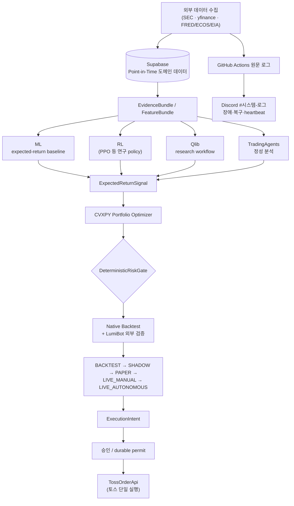

# Investment Agent

**Point-in-time 데이터 → 검증 가능한 신호 → 결정론적 위험 제한, 그다음에야 주문 후보가 되는
미국 주식 투자 연구·운용 시스템.**

미국 주식의 일별·중기 투자를 연구하고 단계적으로 운용하기 위한 실험적 시스템입니다. 이 프로젝트의
목표는 "LLM이 알아서 주문하는 봇"이 아닙니다. 신뢰할 수 있는 데이터가 같은 시점 기준의 feature와
검증 가능한 신호가 되고, 수학적 포트폴리오 구성과 결정론적 위험 제한을 거쳐서만 주문 후보가 되게
만드는 것이 목표입니다. SEC EDGAR·yfinance·FRED·ECOS·EIA 같은 공개 데이터와 명시된 provider만
쓰고, LLM은 분석과 설명을
맡을 뿐 최종 비중과 위험 한도는 항상 결정론적 코드가 정합니다.

> Python 3.11 · Supabase(Postgres) · GitHub Actions · experimental research software

> [!WARNING]
> 이 저장소는 금융 조언이나 수익을 보장하지 않습니다. Live 주문은 기본적으로 차단되어
> 있으며, 설치·테스트·모델 실행만으로 차단 플래그가 열리지 않습니다. 실제 계좌에 연결하기
> 전에 코드, 데이터 품질, broker 계약, 법적·운영 요건을 직접 검토하세요.

**목차**: [아키텍처](#아키텍처) · [먼저 알아야 할 현재 상태](#먼저-알아야-할-현재-상태) ·
[핵심 안전 원칙](#핵심-안전-원칙) · [각 계층이 하는 일](#각-계층이-하는-일) ·
[Repository 구조](#repository-구조) · [빠른 시작](#빠른-시작) ·
[안전한 첫 실행 순서](#안전한-첫-실행-순서) · [자주 쓰는 명령](#자주-쓰는-명령) ·
[문서](#문서)

## 아키텍처



데이터가 위에서 아래로 한 방향으로만 흐른다 — 상위 결과가 하위 결정에 영향을 줄 수는 있어도(예:
RiskGate 통과 실패 → 재구성), 실행 계층이 신호나 evidence를 거꾸로 고쳐 쓰지 않는다. Toss는
`TossOrderApi`를 직접 호출하는 단일 증권사 경로를 사용한다 —
자세한 경계는 [src/investment_agent/execution/README.md](src/investment_agent/execution/README.md)를 참고한다.

## 먼저 알아야 할 현재 상태

코드가 존재하는 것과 실제 운용 준비가 끝난 것은 다릅니다.

- Macro는 현재 시장 상태 시계열만 제공하며 시장 상태의 point-in-time 이력이 없습니다.
  따라서 historical replay에서는 macro evidence를 제외합니다. 기업 재무는
  `financial_versions`의 accession별 버전과 `filings` provenance를 읽고, 공시일·사용
  가능 시각·적재 시각 cutoff를 함께 적용합니다.
- Native backtester, optimizer, deterministic risk, Shadow 및 execution 안전 원장은 구현·테스트됐습니다.
- LumiBot, Qlib, LightGBM/XGBoost, Stable-Baselines3는 선택 기능입니다. adapter 테스트 통과가 실제
  장기간 모델 성과를 뜻하지 않습니다.
- 증권사 주문 연결은 토스만 지원합니다. 외부 증권사 모의주문은 제공하지 않습니다.
- Live와 Live Autonomous는 기본 비활성입니다. 이 저장소의 설치나 모델 실행이 안전 스위치를 자동으로
  열지 않습니다.

날짜가 붙은 상세 상태는 [현재 구현 상태](docs/V1_STATUS.md)를 봅니다. 수집·알림
실패는 GitHub Actions 원문 로그와 Discord `#시스템-로그`를 우선하고, 로컬 하네스 상태만
아래 명령으로 확인합니다.

```powershell
python -m investment_agent.operations.commands.harness_switch --status
```

## 핵심 안전 원칙

1. 과거 cutoff `t`에서는 `available_at <= t`인 데이터만 사용합니다.
2. point-in-time 이력을 증명할 수 없으면 current 값을 과거로 소급하지 않습니다.
3. Backtest V1과 historical RL 학습에서는 뉴스·소셜을 사용하지 않습니다.
4. 뉴스·소셜 원문은 Supabase가 아니라 로컬 DuckDB에 기사 단위로 최대 90일만 보관하고,
   ResearchStore에는 feature·label·training sample·valuation과 `build_events`가 만든
   사건·event feature 같은 재계산 가능한 파생물만 남깁니다.
5. LLM은 분석·토론·설명·signal을 생성하지만 최종 비중과 hard risk limit을 결정하지 않습니다.
6. optimizer가 목표 비중을 계산하고 RiskGate가 다시 절대 한도를 강제합니다.
7. AI 계층은 broker credential, durable control, approval secret에 접근하지 않습니다.
8. timeout/5xx 뒤 주문 성공 여부가 불명확하면 자동 재주문하지 않습니다.
9. broker가 execution truth이며 내부 장부는 broker와 reconciliation합니다.
10. kill switch, lockdown, account binding과 주문 한도는 autonomous mode에서도 해제되지 않습니다.

불변 규칙의 SSOT는 [Trading Constitution](src/investment_agent/trading/CONSTITUTION.md)입니다.

## 각 계층이 하는 일

### 1. 데이터 수집과 Supabase

`src/investment_agent/data/`의 universe·market·fundamentals·macro·institutional 도메인이
외부 원천을 수집하고, `research/features`가 저장된 원천으로 Research feature를 계산합니다.
각 도메인은 자기 저장소 경계에서만 Supabase를 조회하며 투자·분석에 필요한 도메인 사실만 저장합니다. 실행 실패, 예외 문구, 재시도 이력과 품질
진단은 DB에 쓰지 않고 GitHub Actions 원문 로그와 Discord `#시스템-로그`에 남깁니다.

`macro.observations`는 현재 시장 상태 시계열입니다. historical replay에서 point-in-time 이력이
필요한 macro evidence는 제공하지 않습니다. 기업 재무의 원장 진실 공급원은
`fundamentals.financial_versions`와 `fundamentals.filings`이며, 과거 조회는
`filed_at`·`available_at`·`ingested_at` cutoff를 사용합니다.

### 2. Evidence와 Feature

`ContextBuilder`는 ticker와 timezone-aware cutoff를 받아 가격, 기술, 재무, 예상, 거시, 일정, 기관
근거를 하나의 `EvidenceBundle`으로 조립합니다. 없는 데이터는 0으로 채우지 않고
`missing_data`에 기록합니다.

`FeatureLayer`는 같은 bundle에서 학습과 live inference가 공유하는 versioned feature를 만듭니다.
feature hash, source version, observed/available time을 보존해 training-serving skew를 줄입니다.

### 3. 후보 선정과 AI 분석

S&P 500 전체를 LLM에 보내지 않습니다. 현재 tracked universe에서 가장 오래 분석되지 않은 종목을
우선하고, 같은 coverage 집단 안에서 구조화 데이터의 변화가 큰 종목을 먼저 분석합니다. 후보 점수는
매수 점수가 아니라 **분석 순서**입니다.

TradingAgents는 Market/Fundamentals/News/Social 분석, Bull/Bear 토론과 risk reasoning을 수행해
structured `SecurityProposal`을 만듭니다. 외부 뉴스·소셜은 untrusted evidence로 표시하고 prompt
injection 표현을 제거합니다.

### 4. 모델과 포트폴리오

ML, RL, LLM 결과는 `ExpectedReturnSignal`로 정규화됩니다. CVXPY optimizer는 expected return,
confidence, covariance risk, turnover와 명시적 제약을 사용합니다. LLM output의 호환용
`target_weight`는 optimizer가 읽지 않습니다.

결과 `PortfolioProposal`은 종목·섹터·현금·turnover·concentration·volatility·beta·staleness 등을
검사하는 `DeterministicRiskGate`를 반드시 통과합니다.

### 5. 검증과 실행

Native backtest는 t일 종가 이후 생성된 목표 비중을 다음 trading session의 시가에 체결합니다.
LumiBot adapter는 같은 input manifest를 받아 독립 검증 결과를 비교합니다.

Shadow는 실제 시장 시각에 판단과 실행 가능한 manifest까지 만들지만 주문하지 않습니다.
Paper는 연구·승격 증거 단계로 유지하며 외부 모의주문을 실행하지 않습니다.
Live Manual은 Discord HMAC 승인 뒤에도 계좌·시세·시장시간·한도를 다시 확인합니다. Live Autonomous는
장기간 OOS/Paper와 무사고 증거로 발급된 durable permit이 추가로 필요합니다.

## Repository 구조

```text
src/investment_agent/
  data/                    universe · market · fundamentals · macro · institutional · news
  research/                features · datasets · models · backtest · RL
  trading/                 evidence · decision · portfolio · risk · performance
  execution/               승인 · broker · 주문 · fill · reconciliation · TCA
  reporting/               v1 read model과 reporting view consumer
  notifications/           outbox · Discord 카드 · 채널 · discord_admin
  operations/              운영 관측 · Actions · heartbeat · 운영 CLI · 로컬 하네스
  platform/                DB · clock · logging · retry · serialization · cache · usage ledger 공통 계층
  dashboard/               읽기 전용 Streamlit 화면
db/postgres/v1/                     현재 Supabase schema 선언
.github/workflows/         GitHub Actions ETL·알림·CI
docs/                      현재 아키텍처와 운영 설명
data/local/                Git에 넣지 않는 재생성 가능 DuckDB cache
artifacts/                 Git에 넣지 않는 모델·실행 산출물
```

## 빠른 시작

Python 3.11을 기준으로 합니다.

```powershell
python -m pip install uv==0.12.10
uv sync --group dev
Copy-Item .env.example .env
python -m unittest discover -s tests -t .
```

로컬 화면과 하네스 제어는 루트 실행기에서 엽니다. 인자 없이 실행하면 `운영 제어센터`와
`점검·개발 도구`만 보이는 간결한 메뉴가 열립니다. 운영 제어센터는 상태·모드 선택·시작·안전
정지와 대시보드 시작/열기를 제공하며, 변경 작업은 `harness_switch` 단일 진입점으로만 전달합니다.

```powershell
run.bat
# 운영 제어센터를 바로 실행
run.bat --control-center
# 읽기 전용 대시보드만 실행
run.bat --dashboard
```

연구 기능이 필요할 때만 선택 의존성을 설치합니다.

```powershell
uv sync --group ml
uv sync --group rl
uv sync --group research
```

`research` group은 Qlib와 LumiBot을 포함해 무겁습니다. core ETL, risk, execution 단위
테스트에는 필요하지 않습니다.

## 안전한 첫 실행 순서

```powershell
# 1. 코드만 오프라인 검증
python -m compileall -q src tests
python -m unittest discover -s tests -t .

# 2. DB 도메인 데이터 불변식 확인
python scripts/verify_data.py

# 3. GitHub Actions와 Discord #시스템-로그에서 최근 장애를 확인한 뒤,
#    LLM 없이 단일 ticker evidence와 계약 확인
python -m investment_agent.trading.decision.portfolio_shadow --ticker AAPL --dry-run

# 4. 하네스와 거래 차단 상태 확인
python -m investment_agent.operations.commands.harness_switch --status
```

실제 LLM Shadow, Paper, broker 연결은 한 번에 진행하지 않습니다. 설치와 상태 확인은
[운영](docs/OPERATIONS.md), 단계별 주문 안전은
[실행과 안전](docs/EXECUTION_AND_SAFETY.md)을 따릅니다.

## 자주 쓰는 명령

```powershell
# 현재 tracked universe에서 최대 5개 Shadow 후보 분석
python -m investment_agent.trading.decision.portfolio_shadow --limit 5

# 성숙한 판단 평가
python -m investment_agent.research.commands.evaluate --limit 200

# 뉴스·소셜 cache 90일 retention
python -m investment_agent.trading.evidence.cleanup

# JSON manifest 기반 Native backtest
python -m investment_agent.research.backtest.cli --input <INPUT.json> --output <OUTPUT.json>

# 전체 포트폴리오 구성과 RiskGate dry-run
python -m investment_agent.trading.portfolio.construct --batch-id <BATCH_ID> --stage shadow --dry-run
```

`construct_portfolio`, model promotion, execution intent, approval 명령은 ID와 실제 데이터 상태가
필요합니다. 예제 문자열을 그대로 실행하지 말고 각 주제 문서의 선행 조건을 먼저 확인합니다.

## 문서

문서를 어디서부터 읽을지 모르겠다면 [초보자용 시스템·폴더 지도](docs/README.md) 하나만
먼저 읽으세요. 공개 사용·기여에 필요한 정책은 [오픈소스 공개 준비도](docs/OPEN_SOURCE_READINESS.md),
[기여 가이드](CONTRIBUTING.md), [보안 정책](SECURITY.md), [행동 강령](CODE_OF_CONDUCT.md)에
모았습니다. `docs`의 나머지 문서는 도메인 계약과 운영 참고서입니다.

처음에는 아래 두 문서면 충분합니다.

- [초보자용 시스템·폴더 지도](docs/README.md)
- [현재 구현 상태](docs/V1_STATUS.md)

필요할 때만 [데이터](docs/DATA.md), [투자 시스템](docs/INVESTMENT_SYSTEM.md),
[자율 판단 계층](docs/AUTONOMOUS_SYSTEM.md), [실행과 안전](docs/EXECUTION_AND_SAFETY.md),
[운영](docs/OPERATIONS.md)을 골라 읽습니다.

현재 v1 구현과 schema 선언의 상태는 [v1 재구성 현황](docs/V1_STATUS.md)에 기록합니다.

개발 규칙은 [CLAUDE.md](CLAUDE.md), 환경변수 전체 목록은 [docs/ENV.md](docs/ENV.md), UI 규칙은
[DESIGN-system.md](DESIGN-system.md)입니다. 실제 API key와 broker credential은 repository에
commit하지 않습니다.

## 공개 저장소 정책

- [기여 가이드](CONTRIBUTING.md)
- [보안 취약점 신고](SECURITY.md)
- [행동 강령](CODE_OF_CONDUCT.md)
- [오픈소스 공개 준비도와 알려진 제한](docs/OPEN_SOURCE_READINESS.md)
- [서드파티 고지](THIRD_PARTY_NOTICES.md)

현재 저장소 루트에는 프로젝트 라이선스가 선언되어 있지 않습니다. 라이선스가 선택·추가되기
전까지는 소스 사용 권한을 추정하지 마세요. 공개 배포 전에 저장소 관리자가 프로젝트 라이선스를
선택하고 `LICENSE` 파일을 추가해야 합니다.
