# Investment Agent — 근거가 갖춰졌을 때만 주문이 되는 미국 주식 시스템

**공개 데이터 → 같은 시점 기준의 근거 → 검증 가능한 신호 → 결정론적 위험 한도 → 사람 승인.
이 순서를 전부 통과한 것만 주문 후보가 됩니다.**

`Python 3.11` · `Supabase(Postgres)` · `GitHub Actions` · 실험적 연구 소프트웨어

> [!WARNING]
> **실주문은 기본 차단입니다.** 설치·테스트·모델 실행 중 어느 것도 차단 플래그를 열지 않으며,
> `LIVE_ENABLED`·`TOSS_LIVE_ENABLED`는 사람이 명시적으로 켭니다.

---

## 한눈에



공개 데이터가 네 저장소에 쌓이고, 같은 시점 기준의 근거가 신호와 목표 비중이 됩니다.
그 뒤 **빨간 점선 안쪽**이 이 프로젝트의 요점입니다 — 결정론적 위험 한도와 사람 승인을
통과하지 못한 것은 주문이 되지 않습니다. 화면과 알림은 저장소를 직접 열지 않고 읽기 모델만
지나갑니다.

패키지 단위의 자세한 구조와 **허용되는 의존 방향**은
[시스템 아키텍처](docs/SYSTEM_ARCHITECTURE.md)에 있습니다.

## 왜 이렇게 만들었는가

"LLM이 알아서 주문하는 봇"이 아닙니다. 아래 다섯 가지가 이 저장소의 설계를 결정했고, 전부
테스트가 강제합니다.

| 원칙 | 구체적으로 | 어디가 강제하는가 |
|---|---|---|
| **LLM에는 비중 결정 권한이 없다** | 논지·토론·거부권만 행사합니다. 목표 비중은 CVXPY optimizer가, 절대 한도(종목 10% 등)는 `DeterministicRiskGate`가 정합니다 | `trading/risk/gate.py` |
| **과거를 아는 채로 과거를 풀지 않는다** | cutoff `t`에서는 `available_at <= t`인 데이터만 씁니다. 시점 이력을 증명할 수 없으면 현재 값을 과거로 소급하지 않습니다 | `research/evidence/` |
| **보내기 전에 기록한다** | 주문은 전송 전에 원장에 예약됩니다. 타임아웃·5xx는 실패가 아니라 *결과 불명*이고, 되물어 확인하기 전에는 **자동 재주문하지 않습니다** | `execution/orders/ledger.py` |
| **자동으로 승격되지 않는다** | 단계는 한 번에 한 칸씩만 올라가고, 마지막 칸은 결정적 증거 게이트를 통과해야 합니다 | `execution/orders/lifecycle.py` |
| **화면은 저장소를 열지 않는다** | 대시보드와 알림은 `reporting` 읽기 모델만 소비합니다. Supabase RPC 경로는 allowlist로 거르는 게 아니라 **코드에 존재하지 않습니다** | `reporting/readers/select_only.py` |

## 어디까지 올라갈 수 있는가


`live_autonomous`로 올라가려면 out-of-sample 120일·walk-forward 6구간·paper 60일 증거와
Sharpe 0.5 이상, 최대 낙폭 15% 이내, 그리고 실행·대사·위험·데이터품질 **사고 0건**이 필요합니다.
kill switch 테스트와 broker 대사도 통과해야 하고, 주문 한도 5종이 하나라도 비어 있으면 거절됩니다.
판정은 증거 해시와 함께 남아 나중에 근거를 되짚을 수 있습니다.

기준값의 출처는 이 문서가 아니라 `AutonomyCriteria`입니다.

## 지금 실제로 돌아가는 것

코드가 있다는 것과 운용 준비가 끝난 것은 다릅니다.

| | 상태 |
|---|---|
| 수집 파이프라인 | **운영 중** — GitHub Actions cron 36개가 universe·market·fundamentals·macro·institutional을 적재 |
| Discord 알림 | **운영 중** — 12종(PNG 대시보드 카드 + Embed), 중복 방지 원장이 발송 전에 선점 |
| 대시보드 | **운영 중** — 읽기 전용 Streamlit |
| backtester · optimizer · RiskGate · 실행 안전 원장 | **구현·테스트 완료** |
| Live / Live Autonomous | **기본 비활성** — 사람이 켜기 전에는 열리지 않음 |
| LumiBot · Qlib · LightGBM/XGBoost · Stable-Baselines3 | **선택 기능** — adapter 테스트 통과가 장기 성과를 뜻하지 않음 |
| 증권사 연결 | **토스 단일 경로** — 외부 모의주문 없음 |

알아 둘 한계 하나: macro는 현재 시장 상태 시계열만 있고 시점 이력이 없어, historical replay에서는
macro 근거를 제외합니다.

## 빠른 시작

```powershell
python -m pip install uv==0.12.10
uv sync --group dev
Copy-Item .env.example .env
python -m unittest discover -s tests -t .
```

로컬 화면과 하네스 제어는 루트 실행기 하나로 엽니다.

```powershell
run.bat                      # 대화형 메뉴
run.bat --control-center     # 운영 제어센터
run.bat --dashboard          # 읽기 전용 대시보드
```

연구 기능은 필요할 때만 설치합니다. `research` group은 Qlib·LumiBot을 포함해 무겁고, core
ETL·risk·execution 테스트에는 필요 없습니다.

```powershell
uv sync --group ml       # LightGBM · XGBoost
uv sync --group rl       # Stable-Baselines3
uv sync --group research # Qlib · LumiBot
```

## 안전한 첫 실행 순서

한 번에 LLM·Paper·broker를 켜지 않습니다. 위에서부터 하나씩 확인합니다.

```powershell
# 1. 네트워크 없이 코드만 검증
python -m compileall -q src tests
python -m unittest discover -s tests -t .

# 2. DB 도메인 데이터 불변식 확인
python scripts/verify_data.py

# 3. LLM 없이 단일 종목 근거와 계약만 확인
python -m investment_agent.trading.decision.analysis --ticker AAPL --dry-run

# 4. 하네스와 거래 차단 상태 확인
python -m investment_agent.operations.commands.harness_switch --status
```

수집·알림 실패는 GitHub Actions 원문 로그와 Discord `#시스템-로그`가 먼저입니다.

## 자주 쓰는 명령

```powershell
# tracked universe에서 최대 5개 Shadow 후보 분석
python -m investment_agent.trading.decision.analysis --limit 5

# 성숙한 판단 평가
python -m investment_agent.operations.commands.evaluate_decisions --limit 200

# System Portfolio 목표 갱신과 성과 요약 (주문 없음)
python -m investment_agent.operations.commands.system_portfolio --summary

# JSON manifest 기반 Native backtest
python -m investment_agent.research.backtest.cli --input <INPUT.json> --output <OUTPUT.json>

# 뉴스·소셜 cache 90일 retention
python -m investment_agent.intelligence.commands.prune_evidence_cache
```

model promotion·execution intent·approval 명령은 실제 ID와 데이터 상태가 필요합니다. 예제
문자열을 그대로 실행하지 말고 각 주제 문서의 선행 조건을 먼저 확인하세요.

## 구조

```text
src/investment_agent/
  data/            universe · market · fundamentals · macro · institutional 수집
  intelligence/    뉴스·소셜 원문과 종목 언급 (로컬 DuckDB, 90일)
  research/        feature · 팩터 · dataset · 모델 · 평가 · backtest · PIT 근거
  trading/         사건 우선순위 · 논지 · ALPHA · optimizer · RiskGate · System Portfolio
  execution/       승인 → 주문 → broker → 대사, 그 옆에서 safety가 감시
  reporting/       화면과 알림이 공유하는 읽기 모델 (SELECT 전용)
  notifications/   중복 방지 원장 · 카드 · Embed · Discord
  dashboard/       읽기 전용 Streamlit 화면
  operations/      최외곽 조립 · 스케줄 · 감시 · CLI 진입점
  platform/        DB · clock · logging · retry · serialization · cache
db/                Postgres · SQLite(runtime) · DuckDB(research · intelligence) 선언
.github/workflows/ ETL · 알림 · CI
docs/              주제 문서와 diagrams/(src · svg · html)
```

계층 사이에 **허용되는 화살표와 그 단일 예외들**은
[시스템 아키텍처](docs/SYSTEM_ARCHITECTURE.md)가 갖고, `test_architecture.py`가 강제합니다.

## 문서

**[docs/README.md](docs/README.md) 하나만 열면 됩니다.** 목적별로 읽을 문서 하나씩을 가리키는
지도이고, 주제 문서와 package README 전체 목록이 거기에 있습니다.

바로 가고 싶다면 — [시스템 아키텍처](docs/SYSTEM_ARCHITECTURE.md) ·
[저장 지도](docs/STORAGE_MAP.md) · [실행과 안전](docs/EXECUTION_AND_SAFETY.md) ·
[운영](docs/OPERATIONS.md)

개발 규칙은 [CLAUDE.md](CLAUDE.md), UI 규칙은 [DESIGN-system.md](DESIGN-system.md),
넘지 않는 선은 [Trading Constitution](src/investment_agent/trading/CONSTITUTION.md)입니다.

API key와 broker credential은 커밋하지 않습니다.
