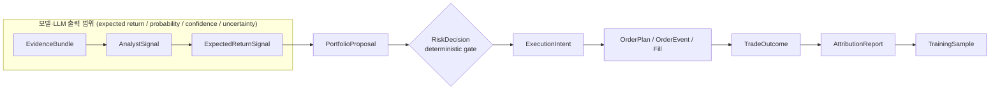
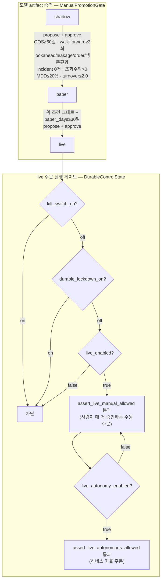

# 자율 판단 계층 — 근거 수집부터 승격까지

이 문서는 외부 투자 프레임워크에 의존하지 않는 `investment-agent`의 현재 계약과
실행 경계를 설명한다. 데이터 수집, Supabase private schema, Discord 승인, PIT 검증,
Toss execution ledger/reconciliation은 canonical package와 `db/postgres/v1/` 선언으로 연결된다.

## 현재 구조

데이터 수집은 `src/investment_agent/data/universe`, `src/investment_agent/data/market`,
`src/investment_agent/data/fundamentals`, `src/investment_agent/data/macro`,
`src/investment_agent/data/macro/releases`, `src/investment_agent/data/institutional`이 각각의
Supabase source schema에 기록한다. `src/investment_agent/research/features`는 저장된
market 원장으로 feature를 계산해 ResearchStore에 기록한다. `src/investment_agent/trading`은 현재 EvidenceBundle,
TradingAgents 선택 adapter, portfolio/risk, Native Backtest, RL 연구를 소유하며
`src/investment_agent/execution`은 승인된 ExecutionIntent 이후의 broker 경계를 소유한다.

주요 공개 경계는 다음 package가 소유한다.

```text
src/investment_agent/trading/contracts.py
  └─ Evidence/Portfolio 계약
src/investment_agent/research/contracts.py
  └─ Research artifact 계약
src/investment_agent/execution/contracts.py
  └─ ExecutionIntent/Order/Fill 계약

src/investment_agent/research/features/
  ├─ event_intelligence.py  # DuckDB 원문 → normalize/dedupe/cluster/event/feature
  └─ layer.py               # versioned feature 계산

src/investment_agent/trading/decision/
  ├─ regime.py              # 공통 MarketRegime
  ├─ candidate_ranker.py    # LLM 없는 deep-analysis priority
  ├─ desks/                 # market/fundamental/macro/event 공통 AnalystSignal
  ├─ debate.py              # 충돌·저신뢰·고위험 event일 때만 구조화 debate
  ├─ fusion.py              # numeric + desks → ExpectedReturnSignal
  └─ pipeline.py            # 위 흐름의 종목 단위 호출 경계

src/investment_agent/research/
  ├─ features/               # PIT feature 공개 경계
  ├─ commands/build_labels.py # PIT label 생성 진입점
  ├─ datasets/              # cutoff 이후 확정 label만 exact join
  ├─ models/                # Naive/Ridge/LightGBM/XGBoost/PPO 공개 경계
  ├─ training/              # fit_baseline·purged walk-forward
  ├─ evaluation/            # prediction/OOS stability metric
  └─ promotion/              # 수동 promotion gate

src/investment_agent/trading/portfolio/
  ├─ signal_book.py          # 종목 신호 모음
  ├─ constructor.py          # SignalBook + 계좌 snapshot → 목표 비중
  ├─ optimizer.py            # 비중 최적화
  ├─ ../risk/gate.py         # DeterministicRiskGate — 주문 직전 hard limit
  ├─ proposals.py / decision.py / evaluator.py / promotion.py
  └─ (snapshot contract는 src/investment_agent/execution/orders/snapshots.py)

src/investment_agent/research/backtest/      # fill/slippage/fee 가정과 walk-forward 검증
src/investment_agent/trading/performance/    # TradeOutcome/Attribution
src/investment_agent/research/               # TrainingSample/Dataset/Challenger/Promotion
src/investment_agent/execution/orders/market_state.py # single-node RAM quote cache + snapshot row
src/investment_agent/execution/orders/tca.py          # execution-level transaction-cost analysis
```

## 학습 표본과 승격

- RL 재학습(`research/commands/continuous_retrain.py`)의 표본은 `rl_feature_snapshots`·
  `rl_training_labels`와 역사 membership 원장에서만 온다. 한 갈래라도 비면 대체 표본을
  만들지 않고 실패한다 — 합성 표본으로 학습한 정책은 성적표만 그럴듯하다.
- 채점은 학습에 쓰지 않은 뒤쪽 구간(holdout)에서만 한다. 학습 구간에서 채점하면
  어떤 정책이든 통과해 승격 게이트가 아무것도 거르지 못한다.
- 승격은 샤프비율 개선·DSR 유의성에 더해 **벤치마크 대비 양수 초과수익**을 함께 요구한다.
  샤프비율만 보면 "덜 흔들리며 더 못 버는" 정책이 챔피언이 된다.
- 승격된 `active_policy.json`은 어떤 표본으로 학습했는지(`training.data_hash`,
  `membership_hash`, 구간 수, 종목)를 함께 남긴다. 없으면 그 점수를 재현할 수 없다.

**아직 연결되지 않은 것**: 승격된 정책은 현재 매매 판단에 반영되지 않는다.
`portfolio_shadow`가 `SignalBlender`에 `rl_target_weights`를 넘기지 않아 혼합이 항등이고,
`champion.zip`을 읽는 코드도 없다. 이 연결은 별도 작업이다.

## 저장 경계

- Supabase는 일봉, 재무, SEC, macro, model metadata, signal, proposal, risk,
  order/fill, reconciliation, TCA, attribution의 durable source of truth다.
- ResearchStore는 재계산 가능한 feature/label·training sample·event 파생물의 local
  source of truth다. 이 데이터에는 별도 Production Supabase schema를 만들지 않는다.
- DuckDB `src/investment_agent/trading/evidence/cache.py`는 뉴스·Reddit·StockTwits 등
  원문을 **기사·게시물 한 건당 한 행**으로 보관하고(canonical URL/content hash 포함)
  90일 retention을 적용한다. 원문은 Supabase로 복제하지 않는다. ResearchStore로 가는 것은
  research command가 만든 재계산 가능한 파생물이며, 뉴스·소셜은
  `research/commands/build_events.py`가 `events`·`event_feature_snapshots`로 압축한
  결과만 남긴다.
  같은 요청의 재호출을 막는 응답 원문은 별도 `request_cache`에 24시간만 둔다.
- `src/investment_agent/execution/orders/market_state.py`의 RAM은 최신 bid/ask/last/mid/spread/volume/
  volatility/session만 덮어쓴다. RAM은 복구 원장이 아니며, 실제 판단·주문·체결·
  reconciliation에 사용한 시점은 `quote_snapshots`에 명시적 purpose로 저장한다.

## 핵심 계약 흐름



LLM은 Evidence와 reasoning을 보조할 수 있지만 BUY/SELL 문장, 수량, broker 호출,
risk limit 변경 권한을 갖지 않는다 — 위 박스를 벗어나는 순간부터는 model output이 아니라
결정론적 코드다. 비중은 `PortfolioProposal`을 만드는 portfolio 계층이 정하고, 최종 허용은
`RiskDecision`의 deterministic gate가 담당한다.

## 이 계층이 쓰는 테이블

판단 원장과 실행 원장은 PostgreSQL이 아니라
[`db/sqlite/runtime/v1/20_decisions.sql`](../db/sqlite/runtime/v1/20_decisions.sql)과
[`db/sqlite/runtime/v1/30_execution.sql`](../db/sqlite/runtime/v1/30_execution.sql)을 사용하는
`data/local/runtime/runtime.sqlite3`가 소유한다. 재계산 가능한 연구 산출물은
`ResearchStore`의 DuckDB 경계에 보관한다.

- research artifact store: `events` · `event_feature_snapshots` · `market_regimes`
- research artifact store: `candidate_ranks` · `training_samples`
- runtime SQLite `decision_runs` · `signal_runs` · `signals`
- runtime SQLite `portfolio_proposals` · `risk_decisions` · `portfolio_decisions`
- runtime SQLite `tca_reports` · `quote_snapshots`

runtime SQLite는 local filesystem 경계와 `runtime_connection()`의 읽기 전용 연결을 사용한다.
원격 PostgreSQL에는 금융 canonical 사실과 reporting view만 둔다.

## Rollout 상태

| Phase | 범위 | 상태 |
|---|---|---|
| 1 | contracts, Event Intelligence, MarketRegime, Fast Ranker, four desks, conditional debate, signal fusion | 구현됨 |
| 2 | feature/label/dataset manifest, baseline model façade, 실제 Ridge 등 baseline 학습 CLI, purged walk-forward와 challenger 비교 경계 | 구현됨 |
| 3 | Selection/Allocation/Timing 분리, PPO allocation/timing 명세 (PPO는 broker API를 호출하지 않는다) | 구현됨 |
| 4 | RAM MarketState, quote snapshot, Reality Model 및 Native Backtest 변환 경계 | 구현됨 |
| 5 | TCA, PnL/Attribution, TrainingSample 누적 경계 | 구현됨 |
| 6 | Shadow → Paper 운영 검증, 실제 fill calibration, 충분한 walk-forward/OOS 증거 축적, 사람의 promotion 승인, Live 전환 | 별도 운영 작업 (미착수) |

Phase 6은 서로 다른 두 게이트를 통과해야 한다 — 모델 artifact의 단계 승격
(`src/investment_agent/trading/portfolio/promotion.py`의 `ManualPromotionGate`)과 실제 live 주문
실행 허가(`src/investment_agent/execution/safety/control_state.py`의 `DurableControlState`)는 별개다. 전자를
통과해 `live` 단계에 승격된 모델이라도 후자가 막혀 있으면 주문은 나가지 않는다.



현재 원격 control state는 `kill_switch_on=true`, `durable_lockdown_on=true`,
`live_enabled=false`, `live_autonomy_enabled=false`이며 이 상태를 유지한다 — 위 게이트의
첫 단계(`kill_switch_on?`)에서부터 이미 막혀 있다.
