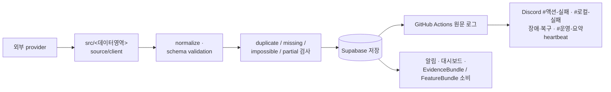
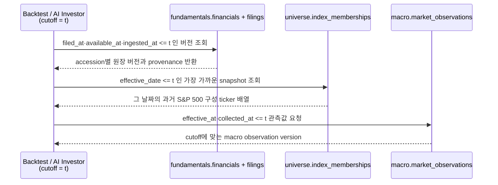

# 데이터 — Supabase, PIT, 그리고 로컬 저장소

이 문서는 외부 데이터가 어디서 수집되어 어떻게 Supabase에 저장되고, 과거 시점의 미래 정보
누출을 어떻게 막는지 설명한다. 뉴스·소셜 원문은 예외적으로 로컬 DuckDB에만 저장한다.

## 전체 데이터 흐름



우선순위는 다음과 같다.

```text
PIT correctness → freshness → data quality → feature → backtest → ML → RL → AI → execution
```

모델 성과가 좋아도 critical data가 stale이면 Paper나 Live로 넘기지 않는다.

## 데이터 적재 폴더

| 폴더 | 데이터 | 대표 저장 영역 |
|---|---|---|
| `src/investment_agent/data/universe` | 회사/SEC 등록인, 거래 ticker, S&P 구성 이력 | `universe.entities`·`securities`·membership |
| `src/investment_agent/data/market` | 일봉 OHLCV, corporate actions | `market.prices_daily`·`split_events`·`dividend_events` |
| `src/investment_agent/research/features` | RSI, MACD 등 기술지표 | 로컬 ResearchStore `feature_signals_daily` |
| `src/investment_agent/data/fundamentals` | SEC 공시, 재무, 실적, 세그먼트, 기대치 | `fundamentals` schema |
| `src/investment_agent/data/institutional` | 13F 매니저·공시·보유 | `institutional` schema |
| `src/investment_agent/data/macro` | 지수·금리·환율·원자재·변동성·심리 등 일별 시장 상태 | `macro` schema |
| `src/investment_agent/data/macro/releases` | 발표 일정·예상·실제·개정 | `macro` schema |
| `src/investment_agent/research/strategies` | 규칙 전략의 월별 배분 | 로컬 ResearchStore `strategy_runs` + `strategy_allocations` |

예약 명령은 `.github/workflows/*.yml`에 있고, 플랫폼 공통 Supabase 연결·재시도·로깅은
`src/investment_agent/platform`에 있다. schema 변경은 각 package의 `sql` 선언 하나만 고치고 다시 세운다.

### Universe

Universe는 현재 수집 대상과 과거 S&P 500 구성종목을 구분한다.

- universe.entities: CIK 기준 회사/SEC 등록인 사실(회사명·SIC 등)
- universe.securities: ticker별 거래 정보와 현재 is_tracked 수집 gate
- universe.index_memberships: 날짜별 과거 S&P 500 ticker 배열

현재 is_tracked는 운영 ETL과 trading decision이 읽는 현재 상태다. 과거 연구와
backtest는 반드시 membership snapshot을 사용한다. 자세한 데이터 소유권·운영·검증은
[Universe README](../src/investment_agent/data/universe/README.md)를 따른다.

## Source of truth와 편의용 최신 표

과거 연구와 최신 화면은 필요한 데이터 모양이 다르다.

| 영역 | Historical PIT source | 최신 화면용 표현 |
|---|---|---|
| Universe | effective date/snapshot이 있는 membership history | 현재 member 목록 |
| 가격 | trade/session과 ingestion provenance가 있는 bar | 최신 quote/price view |
| 재무 | `fundamentals.financials` + `fundamentals.filings`의 PIT cutoff 조회 | reporting financial read model |
| 거시 | `macro.market_observations`의 effective/collected cutoff | `reporting.macro_latest`·`macro_observations` |
| 일정·예상 | 수집·발표·개정 시각이 있는 snapshot | 최신 일정/actual view |
| 기관 | SEC accepted time이 있는 filing/position | 최신 13F 요약 |

`financial_versions`와 `filings`가 기업 재무의 원장 진실 공급원이다. 같은 회계기간의
정정 공시는 별도 version으로 upsert하며, 과거 조회는 `filed_at`, `available_at`,
`ingested_at` cutoff를 함께 적용한다.

## PIT의 핵심 시각

- `observed_at`: 값이 설명하는 경제·시장 시점
- `available_at`: 투자자가 그 값을 알 수 있었던 최초 시각
- `collected_at`: 우리 pipeline이 받아 저장한 시각

과거 cutoff `t`에서는 반드시 `available_at <= t`인 revision만 선택한다. 예를 들어 6월 CPI가
7월에 발표됐다면 6월 30일 판단에는 사용할 수 없다. 아래 세 domain은 같은 cutoff `t`를 받아도
schema마다 다르게 반응한다.



### Macro historical replay

MACRO는 시장 관측의 version을 `macro.market_observations`에 append한다. historical replay는
`effective_at`과 `collected_at`을 모두 cutoff에 적용하고, 발표 일정·예상·revision도 같은
`macro` owner의 versioned release 표에서 읽는다.

### Fundamentals cutoff 조회

`fundamentals.financials`의 grain은 `(cik, period_end, accession_no)`다.
식별자는 ticker가 아니라 CIK다. 재무는 회사 단위 사실이라 한 회사가 여러 클래스를
상장해도 하나이기 때문이다. AI 재무 조회는 `filed_at`, `available_at`, `ingested_at`를
cutoff에 적용하고, 같은 기간의 정정공시도 별도 version으로 보존한다.

### 가격, 기술지표와 label

t일 종가 기반 판단은 t일 장 종료 뒤에만 가능하다. 기본 backtest 체결은 다음 실제 trading
session의 시가다. RSI/MACD도 당시 입력 cutoff와 provenance를 확인한다.

1D·5D·20D 미래수익 label은 feature와 분리한다. 5D 종료 가격이 확정되기 전에 해당 label이
학습 row에 나타나지 않도록 `label_available_at`, purge와 embargo를 적용한다.

## 결측과 Fail-closed

| 상황 | 처리 |
|---|---|
| 재무 정정 전 값이 필요한 historical replay | 해당 domain 결측 |
| source timestamp 없음 | current-only 또는 unavailable |
| 미래 timestamp 발견 | 계약 오류 |
| historical news archive 없음 | news/social OFF |
| 당시 universe snapshot 없음 | 승격용 backtest 중단 |
| 최신값 또는 0으로 대체 | 금지 |

Shadow에서는 optional domain 결측을 표시하고 `watch`로 낮출 수 있다. Paper/Live는 필요한
market risk와 freshness 입력이 없으면 더 엄격하게 거절한다.

## 공통 데이터 품질과 Health

모든 ETL은 다음을 일관되게 확인한다.

- duplicate와 primary identity 충돌
- missing과 unexpected row count
- impossible value와 단위/schema mismatch
- stale data와 freshness SLA
- provider/HTTP failure, rate limit과 retry eligibility
- partial ingestion과 entity coverage

`success`는 HTTP 200만 뜻하지 않는다. 예상 row 수, schema, freshness와 핵심 entity coverage까지
검증돼야 한다. 실패·취소와 provider 진단은 GitHub Actions 원문 로그에 남기고 공통
리포터가 `#운영-요약`에 실패 위치·영향·다음 행동을 보낸다. 정상 데이터의 freshness와
coverage는 각 도메인 테이블·뷰에서 계산하며, 운영 오류를 별도 DB 원장으로 복제하지 않는다.

## Segment metrics

`segment_metrics` 관련 schema와 감사 구조는 유지한다. 다만 실제 source와 coverage 품질이 충분하지
않은 상태에서 빈 표를 AI evidence처럼 노출하지 않는다. 검증된 filing rows, coverage test와 품질
gate를 갖춘 뒤 availability 상태를 올린다.

## Feature 소비 경계

- TradingAgents는 `ContextBuilder`가 만든 `EvidenceBundle`을 사용한다.
- ML/RL/Qlib은 `FeatureLayer`가 만든 version/hash가 있는 `FeatureBundle`을 사용한다.
- 하류 모델이 schema마다 임의 SQL을 복제하지 않는다.
- 결측은 0이 아니라 availability mask와 reason으로 전달한다.
- 대용량 model artifact는 로컬에 두되 version/hash metadata는 감사 원장에 남긴다.

## 뉴스·소셜은 Supabase에 저장하지 않는다

뉴스·소셜 원문의 기본 위치는 Git에 포함되지 않는 `data/local/news_social.duckdb`다.
현재 provider 호출과 화면용 메타데이터 정규화는 `src/investment_agent/data/news/provider.py`가
소유하고, Dashboard는 `src/investment_agent/reporting/news.py`의 결과 계약만 소비한다.

```text
live provider
→ 응답 blob을 기사·게시물 단위로 분해
→ canonical URL/content hash dedupe
→ DuckDB external_content(기사, 90일) + request_cache(응답 원문, 24시간)
→ sanitize → TradingAgents의 untrusted evidence
→ build_events가 사건·event feature로 압축해 ResearchStore에 적재
→ 90일 초과 자동 삭제
```

| 단계 | News/social 사용 |
|---|---|
| Backtest V1 | OFF |
| RL historical training | OFF |
| Historical EvidenceBundle | OFF |
| Shadow | ON 가능 |
| Paper | ON 가능 |
| Live | ON 가능 |

historical mode는 current provider, memory response와 DuckDB cache를 모두 차단한다. 향후 News
Backtest archive를 두게 되면 `published_at`, `available_at`, `first_seen_at`, source, canonical URL과
hash가 모두 있어야 한다.

### Cache와 중복 제거

1. provider와 request parameter가 같으면 request hash로 반복 API 호출을 생략한다.
   재사용하는 것은 `request_cache`에 24시간 보관한 **응답 원문 그대로**다 — 쪼갠 기사를
   다시 합치면 live fetch와 다른 텍스트가 모델에 들어간다.
2. 다른 provider가 같은 기사를 반환하면 canonical URL hash와 content hash로 중복 제거한다.
   이 중복제거가 성립하려면 저장 단위가 기사여야 한다. 그래서 `external_content`에는
   응답 덩어리가 아니라 **항목 하나가 한 행**으로 들어간다(title, source, canonical URL,
   published/fetched/first-seen 시각, author, 태그 기반 sentiment).

포맷을 알아보지 못한 응답은 덩어리 하나로 저장한다 — 저장이 끊기는 것보다 낫다.
현재 항목 단위로 쪼개지는 것은 yfinance 뉴스 마크다운, StockTwits 메시지, Reddit 게시물이다.

DuckDB에 담기는 본문은 **sanitize 이전 원문**이다. sanitize(`UNTRUSTED_EXTERNAL_DATA` 표시·
instruction redaction·길이 제한)는 모델에 전달하는 경로에서만 적용되며, cache hit도 같은
경로를 다시 지난다. 이 파일은 `AI_INVESTOR_SAVE_EXTERNAL_RAW`와 무관하게(그 변수는 실행별
artifact `.txt` 보존만 켠다) 유지되고, `AI_INVESTOR_LOCAL_NEWS_CACHE_ENABLED=false`로 끈다.

Supabase에는 원문이 아니라 case의 evidence provenance metadata만 남긴다. `ResearchStore`에는
`build_events`가 만든 사건·event feature 파생물을 남긴다. DuckDB는 비용 절감 cache이며 PIT source of truth나
execution audit가 아니다.

### 수집 데이터셋 (`data/local/intelligence/intelligence.duckdb` + `data/local/intelligence/parquet`)

위 `news_social.duckdb`가 LLM 판단 시점의 lazy cache라면, 이쪽은 스케줄 능동 수집
데이터셋이다. `data/news`·`data/social`이 수집·정규화하고 `data/intelligence`가
저장을 소유한다. 본문·제목은 ZSTD 압축 날짜 파티션 Parquet에 한 번만 저장하고,
DuckDB에는 중복 제거 hash·보존 날짜·entity mention과 Parquet view만 남긴다. 선언은
`db/duckdb/intelligence/v1/*.sql`에 있다.

보존 기준은 `coalesce(published_at, first_seen_at)` 90일이다 — 수집 시각이 아니다.
정리는 오래된 `date=YYYY-MM-DD/` directory를 제거한 뒤 해당 DuckDB index와 mention을
같이 삭제한다.
화면은 `reporting/readers/intelligence`를 거쳐 `read_only=True`로만 읽는다.

두 저장소는 병행 중이며, `tradingagents_adapter`를 새 저장소로 옮기는 컷오버는
후속 작업이다.

### 외부 텍스트 안전

- control character와 과도한 길이 제한
- instruction-like 문구 redaction
- `UNTRUSTED_EXTERNAL_DATA` 표시
- ticker/date 허용 범위 검증
- 외부 본문을 명령으로 실행하지 않음
- provider quota와 usage ledger 기록

이 처리는 뉴스가 사실임을 보증하지 않는다. 정성 분석 뒤에도 최종 비중은 optimizer가 만들고
hard risk는 deterministic code가 강제한다.

### Retention과 복구

```powershell
python -m investment_agent.trading.evidence.cleanup
python -m investment_agent.trading.evidence.cleanup --path data/local/news_social.duckdb --retention-days 90

# 로컬 원문 → ResearchStore의 events / event_feature_snapshots
# (하네스 feature_store 잡의 마지막 단계; Supabase trading 표에는 쓰지 않는다)
python -m investment_agent.research.commands.build_events --dry-run
```

cache가 손상되면 사용하는 프로세스를 중지하고 파일을 격리한 뒤 재생성할 수 있다. Supabase
원천 데이터나 주문 audit를 이 파일에서 복구하려 하면 안 된다.

## 관련 검증

전체 테스트에는 macro historical exclusion, fundamentals restatement, no-lookahead, feature snapshot hash,
label timing, historical news isolation, cache dedupe와 90일 retention 경계가 포함된다.
