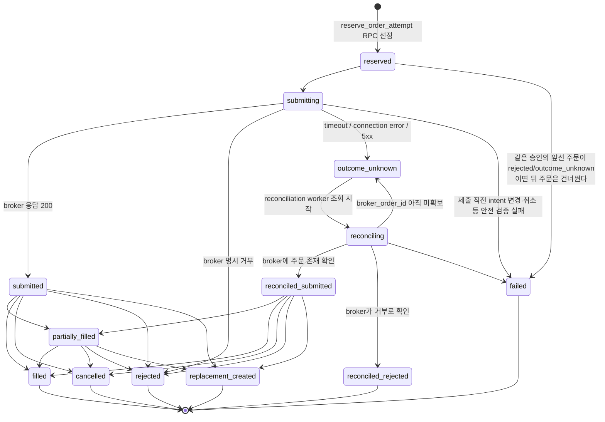

# 실행과 안전 — 주문·승인·Broker와 단계별 안전장치

`src/investment_agent/execution`은 AI와 broker 사이의 credential 격리 경계다. AI Investor는 RiskDecision과
ExecutionIntent까지만 만들며 broker API key를 보거나 주문을 직접 보내지 않는다.

## 전체 실행 흐름

```text
approved RiskDecision
→ expiring ExecutionIntent
→ fresh Broker AccountSnapshot
→ TargetWeightOrderPlanner
→ immutable order manifest + hash
→ Discord 승인 또는 제한된 autonomy permit
→ 제출 직전 account/quote/session/risk 재검증
→ TossOrderApi
→ order attempt/event ledger
→ broker order/fill/position/cash reconciliation
```

## Broker-independent contract

```text
Toss worker → TossOrderApi → 토스증권
```

broker별 응답은 내부 canonical object로 변환한다.

| 기능 | 공통 반환 계약 |
|---|---|
| account/cash | `BrokerAccount` |
| positions | `BrokerPosition` 목록 |
| quote | `BrokerQuote` |
| submit/cancel/status/open orders | `BrokerOrder` |
| fills | `BrokerFill` 목록 |
| reconciliation | 같은 시점의 account/order/fill snapshot |

Toss response key 변환은 adapter 내부에만 둔다. 응답 형식이 바뀌어도
optimizer와 RiskGate 계약은 바꾸지 않는다.

## Credential 격리

- Toss key, account identifier와 approval HMAC secret은 execution process에만 주입
- LLM prompt, EvidenceBundle, model artifact와 Discord card에 secret을 포함하지 않음
- GitHub-hosted runner에서 broker 주문 worker를 실행하지 않음
- 고정 IP나 로컬 listener가 필요한 주문은 로컬 실행 환경에서만 수행
- log에 authorization header, token과 전체 account number를 출력하지 않음

## Discord Live Manual 승인

Live Manual에서는 매 immutable manifest를 사람이 승인해야 한다.

```text
AI signal
→ optimizer
→ RiskGate
→ manifest hash
→ Discord HMAC button
→ 원본 identity와 TTL 검증
→ 한 번만 원자적으로 소비
→ 제출 직전 재검증
```

승인은 다음에 결박된다.

- approval ID, intent ID와 manifest hash
- risk decision, proposal과 account identity
- guild, channel, message와 approver user ID
- approve/reject action과 issued/expiry time
- 허용된 client order ID 집합

자유문장, reply, emoji reaction은 주문 승인이 아니다. 다른 message/channel에 버튼을 복사하거나
manifest/account가 바뀌면 거절한다.

## 주문 수량과 Manifest

planner는 목표 비중을 fresh quote와 account snapshot으로 whole-share 주문 수량으로 바꾸고
sell-first 순서를 만든다. 가격 변화로 notional이 승인 범위를 벗어나거나 snapshot/account가
달라지면 기존 승인을 재사용하지 않는다.

Portfolio RiskGate 통과가 주문 확정을 뜻하지 않는다. execution은 제출 직전 다음을 다시 검사한다.

- fresh quote, spread, liquidity와 halt
- market session
- order notional, daily notional과 daily order count
- daily loss와 max drawdown
- available cash/quantity와 open order
- account binding, manifest TTL와 durable control

## Idempotency와 결과불명 주문

주문 mutation 전에 client order ID와 payload hash를 DB에서 선점한다. 아래는 한 order attempt가
거칠 수 있는 전체 상태 전이이며, 허용되지 않는 전이는 `execution.append_order_attempt_event()`
SQL 함수가 그 자리에서 거부한다 — 애플리케이션 코드가 실수로 상태를 건너뛸 수 없다.



timeout, connection error나 5xx 뒤에는 broker가 실제 주문을 받았을 수 있다. 같은 client order
ID를 다시 POST하지 않고 status, open orders와 fills를 조회한다. broker order ID가 없는 결과를
ticker와 수량만으로 추정 매칭하지 않는다.

lockdown은 이 이벤트 상태 전이의 일부가 아니다. `execution_control`의
`durable_lockdown_on`이 별도로 관리하는 durable safety state이며, [Kill switch와
Lockdown](#kill-switch와-lockdown) 절을 따른다.

## Reconciliation

broker가 execution truth다. 정기적으로 다음을 비교한다.

- internal attempts와 broker orders
- internal fills와 broker fills
- expected positions와 broker positions
- internal cash와 broker cash
- 내부에 없는 external order

account/hash/quantity가 일치해 안전하게 한 가지로 해석되는 누락 snapshot만 자동 수리할 수 있다.
충돌, external order 또는 결과불명 상태가 계속되면 durable lockdown과 CRITICAL alert를 우선한다.

## Kill switch와 Lockdown

신규 risk-increasing order는 환경변수와 `execution_control`의 durable state가 모두 열려야
한다. DB 조회 실패나 state 부재도 fail-closed다. 프로세스 메모리 bool이나 LLM output으로 해제할
수 없다.

cancel과 위험 축소 close는 별도 permit/감축 판정에서 허용할 수 있지만 신규 매수와 같은 경로를
공유하지 않는다.

## 운용 단계

```text
BACKTEST → SHADOW → PAPER → LIVE_MANUAL → LIVE_AUTONOMOUS
```

| 단계 | broker 접근 | 사람 승인 | 의미 |
|---|---|---|---|
| BACKTEST | 없음 | 없음 | historical PIT로 과거 검증 |
| SHADOW | 주문 없음 | 실행 경계 유지 | 실제 시각에 제안·risk 품질 관찰 |
| PAPER | paper broker | 설정에 따라 자동 | 주문·체결·정산 운영 검증 |
| LIVE_MANUAL | live broker | 매 manifest 필수 | 제한된 실제 자금 canary |
| LIVE_AUTONOMOUS | live broker | permit 범위 내 생략 | 충분한 증거 뒤 제한 자동화 |

한 번에 한 단계만 이동한다. model artifact 승격과 시스템 운용 단계 승격도 별개다.

- `ManualPromotionGate`: artifact를 `shadow → paper → live`로 승인
- `LifecyclePromotionGate`: 시스템 권한을 5단계로 전진

Paper 단계는 외부 모의주문을 실행하지 않는다. live
artifact가 있어도 lifecycle이 LIVE_MANUAL이면 Discord 승인 없이 주문할 수 없다.

## Model 승격 최소 증거와 Live Autonomous Permit

model artifact를 Live로 승격하는 게이트(`ManualPromotionGate`)와, 시스템을 LIVE_AUTONOMOUS로
승격하는 게이트(`LifecyclePromotionGate`)는 별개이며 후자가 더 엄격하다. 겹치는 평가 기간은
중복 일수로 세지 않고, 최저 excess return·최악 drawdown·최대 turnover를 사용한다.

| 기준 | Model 승격 (Paper→Live) | Live Autonomous Permit |
|---|---|---|
| OOS 최소 기간 | 60일 | 120일 |
| walk-forward window | 최소 3개 | 최소 6개 |
| Paper 최소 기간 | 30일 | 60일 |
| 수익성 기준 | 양의 excess return | Sharpe 0.5 이상 |
| 최대 drawdown | 20% 이내 | 15% 이내 |
| turnover 상한 | 2.0 이하 | (해당 없음) |
| 사고 이력 0건 | look-ahead·leakage·survivorship·data-integrity·order incident | execution·reconciliation·risk·data-quality incident |
| 추가 검증 | `research_only=false`인 persisted evaluation | kill switch test, broker reconciliation 통과 |
| hard limit 요구 | (해당 없음) | max order/daily notional·daily order count·daily loss·drawdown 완비 |
| 최종 산출물 | 사람이 정확한 artifact/stage 확인문을 다시 입력 | evidence·criteria·hard-limit hash로 결박한 permit 발급(account·artifact 고정, 만료·취소 가능) — **아직 구현 없음** |

`LIVE_ENABLED`를 켜는 것만으로는 Live Autonomous Permit이 발급되지 않는다 — 위 표의 criteria를
모두 충족해야 한다.

Autonomous mode에서도 다음은 항상 남는다.

- deterministic portfolio/runtime risk
- stale quote/signal/proposal 검사
- max order/daily notional/order count
- daily loss와 max drawdown
- account binding과 client-order idempotency
- broker reconciliation과 external-order 탐지
- durable kill switch와 lockdown
- broker credential isolation

## 분석·검증 단계

Shadow와 연구용 Paper 단계의 기록·승격 계약은 유지합니다. 외부 증권사
모의주문 API와 worker는 제공하지 않으며, 토스 주문은 승인된 실주문 경로만 사용합니다.
Paper 증거가 필요한 승격 조건은 자동으로 완화하지 않습니다.

## 실제 자금 활성화 전 순서

1. PIT dataset과 Native backtest hash/result 재현
2. ML baseline과 RL challenger를 동일 OOS에서 비교
3. Shadow data issue, stale signal과 risk rejection 관찰
4. 사람이 artifact를 Paper로 승격
5. 오프라인 주문·취소·체결·잔고 대사 검증
6. 최소 Paper 기간과 무사고 조건 충족
7. Live Manual canary, Discord 승인과 kill-switch 복구 훈련
8. 충분한 증거가 쌓인 뒤에만 Autonomous permit 검토

실제 credential 발급, 자금 활성화와 hard-limit 결정은 사용자가 명시적으로 수행해야 한다.

## 주요 코드 위치

- `src/investment_agent/operations/commands/create_execution_intent.py`: RiskDecision→intent
- `src/investment_agent/execution/approval/ledger.py`, `approval_service.py`: 승인 생성·서명·검증·소비
- `src/investment_agent/execution/orders/planning.py`: 목표 비중→canonical orders
- `src/investment_agent/execution/brokers`: 공통 broker 계약과 Toss API
- `src/investment_agent/execution/orders/ledger.py`: attempt와 idempotency
- `src/investment_agent/execution/reconciliation/worker.py`: broker truth 대조
- `src/investment_agent/execution/safety/control.py`, `control_state.py`: durable safety
- `src/investment_agent/operations/harness`: 운영 도메인의 실행 순서, checkpoint, timeout과 재시작
