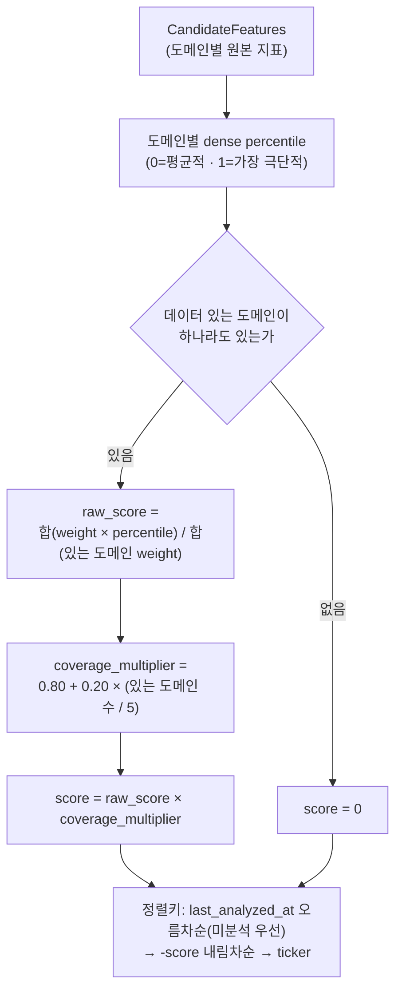
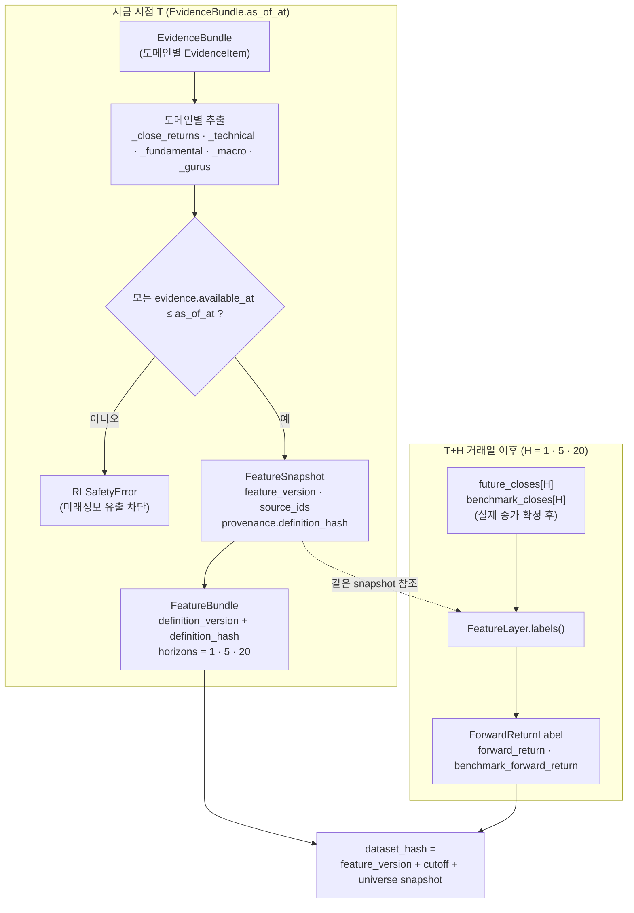

# 투자 시스템 — 판단, ML/RL, Backtest와 Portfolio Risk

이 문서는 Supabase 데이터가 투자 신호와 포트폴리오 제안으로 바뀌는 과정을 설명한다.
`src/investment_agent/trading`은 투자안을 만드는 계층이며 broker 주문을 직접 보내지 않는다.

## 전체 판단 흐름

```text
tracked universe
→ data quality·coverage·liquidity filter
→ 후보 순위와 실행 limit
→ PIT EvidenceBundle / FeatureBundle
├→ TradingAgents 정성 분석
├→ ML expected-return baseline
└→ RL challenger research
→ 공통 ExpectedReturnSignal
→ CVXPY Portfolio Optimizer
→ PortfolioProposal
→ DeterministicRiskGate
→ RiskDecision
→ Backtest 또는 Shadow/Paper/Live 실행 경계
```

LLM은 분석·토론·설명과 종목별 신호를 만든다. 최종 비중은 optimizer가 계산하고 hard risk는
RiskGate가 강제한다. AI/ML/RL은 risk policy, broker credential과 durable safety control을
수정할 권한이 없다.

## 현재 실행 경로

현재 로컬 하네스가 호출하는 분석 진입점은
`src/investment_agent/trading/decision/portfolio_shadow.py`다.

| 구분 | 파일 | 현재 역할 |
|---|---|---|
| 현재 주 경로 | `trading/decision/portfolio_shadow.py` | TradingAgents→signal→optimizer→RiskGate Shadow 실행 |
| 현재 adapter | `agents/tradingagents_adapter.py` | Supabase EvidenceBundle을 TradingAgents에 전달 |
| LLM provider | `llm.py` | OpenAI-compatible endpoint와 structured output |
| 사건 즉시 재분석 | `operations/commands/event_reanalysis.py` | 새 공시·고영향·글로벌 사건이 있는 보유 종목만 곧바로 `portfolio_shadow` |
| 가상계좌 | `trading/shadow/`, `operations/commands/virtual_books.py` | Shadow·Paper 가상계좌를 시간축으로 이어 운영(하네스 `virtual_books` job) |

### 가상계좌(Shadow·Paper)

판단 하나가 맞았는지(`decision_evaluations`)와, 그 판단들을 실제로 이어서 운용했을 때 돈을 벌었는지는
다른 질문이다. 가상계좌는 뒤의 질문에 답한다.

- **판단은 실계좌와 같은 함수다.** optimizer 계좌는 `construct.evaluate_portfolio`에 토스 계좌 대신
  가상계좌 상태를 넣는다. `paper` 계좌는 같은 함수를 `stage="paper"`로 불러 승격 확인과 fail-closed
  입력 검사를 받는다. RL challenger 계좌는 승격된 정책의 목표비중에 champion과 같은 종목 상한·최소
  현금만 적용한다.
- **체결은 판단 뒤 첫 정규장 시가**, 그 봉이 확정된 뒤에만 한다. 가격은 시가 × (1 ± 반스프레드 +
  impact·σ·√(주문액/ADV))로 optimizer의 비용 가정과 같고, 비용 재료는 체결일 **이전** 이력으로만 잰다.
- 매도 대금이 들어온 뒤의 현금 안에서만 산다. 봉 거래량 × 참여율 상한을 넘는 수량은 부분체결로 남기고
  나머지는 취소한다. 체결 안 된 주문이 남아 있으면 새 판단을 하지 않는다 — 옛 계획을 이어 사지 않는다.
- 거래정지·데이터 공백으로 체결 봉이 없으면 추정 가격으로 체결하지 않고 취소한다.
- 매 실행마다 가장 최근 확정 종가로 NAV를 기록한다(`virtual_nav`). 하네스가 여러 거래일 동안 멈춰
  있었으면 그 사이 날짜는 비어 있으므로 낙폭은 기록된 날짜 기준이다.
- Discord 승인·거절은 이 원장에 흔적을 남기지 않는다. 기본 계좌는 `shadow-champion`과
  `shadow-rl-challenger`이고, `--create paper-champion --stage paper`로 Paper 계좌를 더한다.

파일이 존재한다는 이유만으로 예약 실행 경로라고 판단하지 않는다. 실제 호출 여부는
`src/investment_agent/operations/harness_adapters.py`와 `.github/workflows`에서 확인한다.

## 후보 선정과 Evidence

S&P 500 전체를 매일 LLM에 보내지 않는다.

| 단계 | 주요 코드 | 결과 |
|---|---|---|
| Universe 확인 | `universe.py::select_tracked_tickers` | 허용 member와 제외 사유 |
| 후보 정렬 | `candidate_ranker.py::rank_candidate_features` | coverage와 변화 기반 분석 순서 |
| 근거 생성 | `context.py::ContextBuilder.build` | PIT `EvidenceBundle`, missing/warnings |
| Agent 실행 | `TradingAgentsDecisionEngine.run` | role output와 외부 evidence manifest |
| 계약 검증 | `SecurityProposal.from_dict` | ticker/as-of/range/evidence ID 검증 |
| 신호 보관 | `SignalBook` | batch, TTL, 성공·실패 ticker |

### EvidenceBundle 도메인 구성

`ContextBuilder.build`는 아래 8개 도메인을 순서대로 채우고, 그 시점에 데이터가 없는 도메인은
evidence 대신 `missing_data`에 사유를 남긴다. `news_archive`는 Supabase에 시점 저장소가 없어
매번 missing으로 남는다.

| 도메인 | 소스 | `available_at` 기준 | 비어있을 때 |
|---|---|---|---|
| market | `market.prices_daily` | 거래일 뉴욕 18:00 확정 시각(적재 시각이 있으면 둘 중 늦은 쪽, `bar_available_at`) | "market: 시점 기준 사용 가능한 가격 없음" |
| technical | ResearchStore `feature_signals_daily` + `market.prices_daily` | feature 행 `ingested_at` (과거 재현에서는 적재 시각이 늦어 비어 있다) | "technical: 시점 기준 기술지표 없음" |
| fundamentals | SEC EDGAR/FSDS, `fundamentals.financials` + `fundamentals.filings` | live: 최신 `available_at` / historical_replay: 제출일 다음 날 뉴욕 0시(`filing_available_at`) | source_kind별 문구로 "fundamentals: ..." |
| estimates | yfinance observed snapshots | 최신 `collected_at` | "estimates: 시점 기준 실제 관측 컨센서스 없음" |
| macro | `macro.series`+`observation_versions` | 관측치 `collected_at` 최댓값 | historical_replay는 항상 제외; live에서 실행·관측이 없으면 missing |
| segments | SEC XBRL, `fundamentals.segment_metrics` | filings `updated_at` | provider unavailable 여부로 사유 분기 |
| gurus | SEC 13F, `institutional.filings` + `institutional.positions` | filings `accepted_at` | "gurus: 추적 매니저의 매핑된 보유 근거 없음" |
| economic_calendar | `macro.release_events` + release versions | 최신 `collected_at` | "economic_calendar: 시점 기준 관련 발표 일정·관측값 없음" |
| news_archive | Supabase 시점 저장소 없음 | — | 항상 missing; live 외부 provider 사용 여부는 Agent 정책에 따름 |

### 후보 정렬 점수 계산

후보 점수는 매수 점수가 아니라 분석 순서다. 가장 오래 분석되지 않은 종목을 먼저 보고,
같은 조건이면 구조화 데이터 변화가 큰 종목을 우선한다. `rank_candidate_features`는 도메인별
percentile을 가중 평균해 이 우선순위를 계산한다.

| 도메인 | 가중치 | percentile로 바꾸는 신호 |
|---|---:|---|
| market | 0.30 | 20일 수익률 절대값, 20일 거래량비 log 절대값 |
| fundamentals | 0.25 | 매출 YoY 성장률 절대값, 영업이익률 절대값 |
| technical | 0.20 | RSI14의 50 이탈폭, MACD-signal 스프레드 절대값 |
| gurus | 0.15 | guru 보유자 수, guru 총 보유금액(log1p) |
| segments | 0.10 | 세그먼트 집중도, 세그먼트 품질 |

각 신호는 그날 tracked universe 안에서 dense percentile(0~1)로 바뀐다 — 값 자체의 크기가 아니라
다른 종목 대비 변화폭이 큰 종목일수록 1에 가깝다.



## TradingAgents와 LLM의 역할

TradingAgents는 Market/Fundamental/News/Social 분석, Bull/Bear 토론과 risk reasoning을 수행한다.
자연어 토론은 설명 자료이지 주문 계약이 아니다. 최종 parser는 다음과 같은 구조화 필드만
허용한다.

- ticker와 timezone-aware as-of
- signal, probability, confidence
- expected excess return과 risk score
- reasoning과 실제 bundle에 존재하는 evidence ID
- missing data와 model/engine version

다음은 계약 오류다.

- 다른 ticker/as-of 또는 허용 목록 밖 signal
- 0~1 범위 밖 probability/confidence
- 존재하지 않는 evidence ID
- NaN/Infinity expected return
- 빈 reasoning 또는 임의 schema field

호환용 `target_weight`가 output에 있어도 optimizer 입력에서는 무시한다.

### 외부 텍스트와 비용

뉴스·소셜은 live 계열에서만 untrusted evidence로 사용할 수 있다. URL/content 중복 제거,
instruction-like text 제거, 길이 제한과 provider quota/cache를 적용한다. broker key와 execution
control은 prompt/context에 포함하지 않는다.

```text
tracked universe
→ 정량 후보 축소
→ AI_INVESTOR_DAILY_LIMIT
→ request/content cache
→ provider daily cap
→ 소수 ticker만 deep analysis
```

`OpenAICompatibleClient`는 원격 endpoint와 Ollama/local model 교체를 허용하지만 provider,
model, prompt와 engine version이 달라지면 별도 artifact로 기록하고 Shadow 검증을 다시 한다.

## Memory와 평가

`memory.py`는 horizon이 끝나고 `evaluator.py`가 실제 결과를 기록한 case만 같은 ticker의 참고
기억으로 사용한다. 아직 미래 가격이 확정되지 않았거나 benchmark가 없으면 0점으로 만들지 않고
미평가로 남긴다. 기억은 현재 evidence를 대체하지 않고 주문 권한도 없다.

## Feature Layer

`FeatureLayer`는 `EvidenceBundle.as_of_at` 이하 evidence만 사용해 version/hash가 있는
`FeatureBundle`을 만든다. 이는 현재 TradingAgents 주 실행 경로의 필수 호출이 아니라 ML/RL/Qlib
학습과 serving이 공유할 연구 입력 경계다.

feature와 1D·5D·20D label은 시각적으로 분리한다 — feature는 `as_of_at` 시점에 바로 만들어지지만,
label은 그 뒤 실제 종가가 확정돼야만 만들어진다. dataset identity에는 feature version, cutoff,
universe snapshot과 dataset hash가 포함된다.



같은 `snapshot`(feature_version·as_of_at·ticker)을 참조해야만 feature와 label이 나중에 하나의
학습 row로 합쳐진다 — label을 feature와 같은 시점에 만들지 않는 이유가 이 시차다.

### 과거 재현(`historical_replay`)의 규칙

가격·재무는 과거 시점을 그대로 재현할 수 있어서, 실시간 label이 쌓이기를 기다리지 않고 과거
10년 이상으로 계량 모델을 학습·검증한다. 결과를 조용히 부풀리는 경로는 코드가 막는다.

| 함정 | 규칙 | 위치 |
|---|---|---|
| 장 마감 뒤 공시를 그날 알았다고 가정 | 제출일 D 공시는 D+1 뉴욕 0시부터 사용 | `data/fundamentals/domain/filing.py` |
| 뒤늦게 적재한 봉을 "몰랐던 가격"으로 처리 | 봉 가용 시각은 거래일 뉴욕 18:00(적재 시각이 있으면 늦은 쪽) | `data/market/domain/calendar.py` |
| 과거 시가총액이 이후 분할만큼 작아짐 | 저장 종가는 현재 분할 기준이므로(새 분할마다 전체 이력 재수집) 수익률은 그대로 쓰고, 과거 공시 주식 수에 표지 기준일 이후 분할 비율을 곱한다 | `research/valuation/inputs.py` |
| 살아남은 기업만으로 학습 | 과거 시점 종목은 그때의 S&P 500 멤버. 멤버십을 모르면 현재 목록으로 대체하지 않고 실패 | `research/datasets/universe.py` |
| 정정 공시를 과거에 적용 | cutoff까지 공개된 가장 늦은 공시 버전(`financial_versions`) | `fundamentals` 읽기 경계 |
| 계절성이 성장률로 들어감 | 성장률은 같은 회계기간 전년 대비 | `trading/evidence/tools.py` |

과거 재현에서 비는 것도 있다. 뉴스·소셜, 수집 전 애널리스트 추정치(`captured_live` 이전),
시점 이력이 없는 거시 관측, 적재 시각이 늦은 기술지표는 결측이고, 상장폐지 종목은 가격 원천에
이력이 없으면 결측으로 남는다. LLM 판단은 모델이 이미 미래를 학습했으므로 과거 재현 대상이 아니다.

## ML baseline을 먼저 비교한다

`src/investment_agent/research/models/baselines.py`는 같은 train/validation/OOS 배열로 다음 모델을 비교한다.

| 모델 | 목적 | 의존성 |
|---|---|---|
| Naive | 복잡한 모델이 실제로 개선됐는지 기준 | NumPy |
| Ridge | 안정적 선형 expected return | NumPy |
| LightGBM | 비선형 tree boosting 비교 | 선택 설치 |
| XGBoost | 독립 boosting 구현 비교 | 선택 설치 |

목표는 **`SIGNAL_HORIZON_DAYS`(20거래일) 초과수익** 하나다(`trading/decision/constants.py`). TradingAgents
의견·ML label·공분산·optimizer가 모두 이 기간을 쓰고, 모델에 적히는 기간은 dataset의 label 정의
(`forward_return_20d`)가 정한다. 다른 기간으로 학습한 모델은 배율로 환산해 섞지 않고 채택하지 않는다.
RMSE/MAE와 방향 정확도 외에,
학습 결과에는 **OOS 날짜별 단면 IC**(`research/evaluation/alpha.py`: 평균 IC·ICIR·t-통계량·
상위-하위 분위 spread)가 `out_of_sample_alpha`로 남는다. 날짜를 섞은 순위 상관은 시장 전체의
공통 움직임을 순위 능력으로 착각하므로 채택·신뢰도 판단에 쓰지 않는다.

### ML을 판단에 합치는 경로

```text
TradingAgents SecurityProposal ─┐
                                ├→ research/ml_serving.py (fusion) → SignalBatch → construct.py
채택된 ML artifact + PIT feature ┘
```

- 채택은 `python -m investment_agent.research.commands.adopt_ml_model --artifact <json>` 하나다.
  재로딩 가능한 모델(naive·ridge는 계수, LightGBM·XGBoost는 저장한 booster 원문 — 단일 스레드·deterministic
  학습이라 같은 dataset이 같은 artifact hash를 낸다)이고, OOS 평균 IC > 0, IC t ≥ 2, OOS 20일 이상, 분위 spread > 0일
  때만 `artifacts/trading/ml_models/active_ml_model.json`으로 복사된다.
- ML 반영 비중은 사람이 정하지 않는다. ML 몫 = 신뢰도 = min(0.8, 평균 IC × 10)이고 나머지가 TradingAgents
  몫이다. t < 2면 0이라 합치지 않는다. LLM이 스스로 적는 confidence는 검증된 적이 없어 비율에 쓰지 않는다.
- ML은 기대수익·상승확률·신뢰도만 바꾼다. `exit`·`reduce` 같은 행동은 TradingAgents 의견 그대로이고,
  부정 의견(avoid·watch·exit)의 기대수익을 0 위로 올리지 못한다.
- 추론 feature는 판단 시점 이전에 공개된 가장 최근 한 날짜의 **전 종목** snapshot으로 결측을 대체한다
  (학습 dataset과 같은 규칙). 분석한 몇 종목만으로 중앙값을 내면 training-serving skew가 생긴다.
- 하네스 `ml_challengers` job(주 1회, `research/commands/ml_challengers.py`)이 최근 2년 feature·label로
  naive·ridge·LightGBM·XGBoost를 같은 purged split에서 다시 학습한다. 채택 조건을 통과하고 현
  champion보다 OOS ICIR이 높은 후보를 `candidates/latest_summary.json`에 추천으로 남기지만
  **`active_ml_model.json`은 건드리지 않는다** — 채택은 `adopt_ml_model`, 사람의 행위다. 학습 dataset은
  창 안에서 한 번이라도 S&P 500이었던 종목까지 포함한다(생존 편향 방지).
- 반영되면 LLM·ML 조합이 새 artifact ID로 기록되어, paper/live는 그 조합이 승격돼야 실행된다.
  `AI_INVESTOR_ML_FUSION_ENABLED=false`면 비교만 기록한다.

### 분석 후보의 우선 레인

정기 후보 순위는 오래 안 본 종목을 앞세운다. 그 앞에 `candidate_ranker.priority_candidates`가
**마지막 분석 이후 새 정보가 생긴 종목**을 먼저 넣는다 — tier 0은 보유 중이면서 새 공시(`filed_at`)나
고영향 사건(`event_feature_snapshots`)이 공개된 종목과 한 번도 분석하지 않은 보유종목, tier 1은
미보유지만 중요도 0.75 이상 사건이 난 종목이다. 보유 목록은 최근 7일 안의 live position snapshot이다.

```powershell
uv sync --group ml
python -m unittest tests.investment_agent.research.rl.test_baseline
```

### 사건 기반 즉시 재분석

하네스 `event_reanalysis` job(10분 주기, `operations/commands/event_reanalysis.py`)은 로컬 뉴스·소셜을 사건으로
다시 압축한 뒤 `SupabaseRepository.event_reanalysis_priorities`로 지금 다시 볼 종목을 고른다 — 보유
종목의 새 공시·고영향 사건(위 우선 레인)과, 검증된 **글로벌 사건**(ticker 없음)에 민감한 보유 종목이다.
한 번에 3종목만 `portfolio_shadow`로 분석하고, 그 사건 뒤에 이미 분석한 종목은 다시 고르지 않는다.
결과는 보통의 signal batch라 매매는 optimizer·RiskGate·승인을 거친다.

글로벌 사건은 `trading/decision/event_impact.py`가 이렇게 옮긴다.

```text
사건 원문 → 테마(유가·금리·관세·반도체·금융·지정학·원자재) → 대표 ETF → 보유 종목의 ETF 민감도 → 재분석
```

재분석 대상이 되려면 서로 다른 제공자 두 곳 이상(단일 출처 루머 배제), 고영향 중요도, 대표 ETF의
사건 다음 거래일 수익률 크기가 직전 20일 일간 변동성보다 큼(시장 확인), 보유 종목 민감도 절대값 0.5
이상을 모두 만족해야 한다. 원문은 저장하지 않고 테마 이름만 사건 metadata에 남긴다. 뉴스 수집 주기
(intelligence job)가 길면 글로벌 사건 반응도 그만큼 늦다 — 공시는 실적 감시 job이 1분 주기로 적재한다.

## Dataset split과 재현성

시계열 투자 데이터는 random shuffle하지 않는다.

```text
train
→ label horizon이 경계를 넘는 row purge
→ embargo
→ validation
→ out-of-sample
→ rolling/walk-forward 반복
```

같은 날짜의 종목 cross-section은 같은 split에 두며, 현재 S&P 구성 종목을 과거 전체에 고정하지
않는다. universe snapshot이 없는 구간은 승격 dataset으로 만들지 않는다.

모든 artifact에는 다음 identity를 남긴다.

- algorithm과 parameter
- feature version과 dataset hash
- train/validation/OOS 기간
- random seed와 code commit
- model file SHA-256
- 평가 metric과 benchmark

파일과 DB metadata/hash가 일치하지 않으면 inference와 promotion에 사용하지 않는다.

## RL은 ML 다음의 Challenger다

`src/investment_agent/research/rl`은 Stable-Baselines3 PPO를 대표 baseline으로 사용한다. action은 주문 수량이
아니라 target-weight policy다. environment는 transaction cost, turnover와 drawdown penalty를
반영한다.

```text
동일 OOS PPO 결과가 ML baseline보다 우수
→ challenger 후보
그 외
→ research_only
```

PPO라는 이름만으로 실전에 승격하지 않는다. 여러 walk-forward window와 Paper 무사고 조건을
별도로 통과해야 한다. algorithm class 경계를 통해 A2C/SAC/TD3/DDPG 등을 나중에 추가할 수 있다.

승격된 정책도 TradingAgents·ML 기대수익을 바꾸지 않는다. `portfolio_shadow`는 목표비중을
challenger 후보로만 계산해 기록한다(`research/rl/serving.compute_rl_target_weights`). 비중을
"평균 대비 초과비중 × 배율"로 기대수익에 되돌려 섞으면 이미 위험·비용을 반영한 결과를 목적함수에
다시 넣어 같은 위험을 두 번 센다. 비교는 같은 기간·비용 가정의 Shadow 포트폴리오 성과로 한다.

## Qlib의 제한된 사용 범위

`qlib_adapter.py`는 PIT `FeatureSnapshot`을 `(datetime, instrument)` frame으로 바꾸고
`DataHandlerLP`/`DatasetH`와 recorder에 연결한다.

Qlib는 다음만 담당한다.

- versioned research dataset 구성
- train/valid/test segment와 rolling workflow
- experiment parameter, metric와 artifact 기록

Supabase ETL이나 이 프로젝트의 source of truth를 Qlib vendor data로 교체하지 않는다.

```powershell
uv sync --group research
```

## 공통 ExpectedReturnSignal

ML/RL/TradingAgents output은 다음 계약으로 정규화한다.

| 필드 | 의미 |
|---|---|
| `symbol` | canonical symbol |
| `expected_return` | horizon 예상 수익률 |
| `confidence` | 0~1 신뢰도 |
| `risk_score` | 0~1 상대 위험 |
| `horizon_days` | 판단 경로는 `SIGNAL_HORIZON_DAYS`(20). 공분산도 같은 기간이어야 한다 |
| `source`/`version` | model/engine artifact identity |
| `timestamp` | timezone-aware 생성시각 |
| `evidence_ids` | 사용한 stable evidence IDs |

## Portfolio Optimizer

`RiskAwareOptimizer`는 CVXPY로 다음 목적을 결정론적으로 최적화한다.

```text
expected return × confidence
- risk aversion × variance
- turnover penalty (L1)
- Σ 반스프레드·|Δw| + Σ impact·σ·√(NAV/ADV)·|Δw|^1.5
```

거래비용 항은 cvxportfolio의 선형+1.5승 시장충격 모형이다. 주문이 20일 평균 거래대금(ADV)에
비해 클수록 단위 비용이 커져, 기대수익이 약간 높아도 거래하기 비싼 종목은 비중이 줄어든다.
반스프레드는 호가 이력이 없어 ADV 구간(1·3·10bp)으로 근사한다 — TCA 실측이 쌓이면 대체할 자리다.
늘리는 금액은 ADV의 5%(`max_adv_participation`)를 넘지 못한다. 매도는 이 한도로 묶지 않는다.
paper/live는 비용 재료(거래량·변동성)가 없으면 fail-closed한다. 실행 원장에 같은 종목 체결이
5건 이상 쌓이면 승인 기준가 대비 평균 체결가·수수료로 잰 편도 비용 중앙값이 추정 반스프레드보다
클 때만 그 값으로 **올린다**(`calibrate_trading_costs`) — 몇 건의 유리한 체결로 비용을 낮춰 잡으면
회전이 늘어난 손해가 나중에 드러난다. 포트폴리오 시장 베타는 RiskGate의 사후 검사와 같은 상한
(`max_abs_beta`)을 optimizer 제약으로도 건다. 미분석 보유가 이미 상한을 넘기면 신호 종목은 베타를
지금보다 늘리지 못한다. 총합 1, long-only, 종목·섹터 최대, 현금 최소와 turnover 최대를 명시적
constraint로 사용한다. 실전 경로(`construct.py`)는 PIT 가격 260일의 Ledoit-Wolf 수축 공분산을
넣고, covariance가 없으면 risk score 기반의 보수적 diagonal 근사를 metadata에 표시한다.

종목 의견의 **행동**은 기대수익과 별개로 비중의 방향을 강제한다.

| action | optimizer 제약 | 이유 |
|---|---|---|
| `exit` | 비중 = 0 | 전량 청산 명령. 기대수익만 낮추면 turnover 벌점이 잔량을 남긴다 |
| `reduce`·`avoid`·`watch` | 비중 ≤ 현재 | 늘리지 못하게만 막고 얼마나 줄일지는 optimizer가 정한다 |
| `open`·`increase`·`hold` | 없음 | 의견이다. 자금이 한정돼 있어 더 나은 후보에 밀려 0이 될 수 있어야 한다 |

turnover 최대는 **재량 매매**에만 건다. `exit` 청산과 종목 상한 초과분의 현금화를 먼저 반영한
출발점에서 turnover를 잰다. 그렇지 않으면 여러 종목을 한꺼번에 빼야 하는 날 한도가 위험 축소를
막는다(optimizer는 infeasible, RiskGate는 잘라 둔 비중을 도로 살린다).

## DeterministicRiskGate

optimizer 결과도 반드시 RiskGate를 통과한다.

- 종목·섹터 비중, 최대 position 수와 최소 position
- 최소 cash와 최대 turnover(청산·상한 준수분을 뺀 재량 turnover, 축소는 그 출발점 쪽으로)
- `exit` 의견을 받은 보유가 남아 있으면 거부
- volatility, beta, concentration/HHI와 최대 pairwise correlation
- stale proposal

주문 notional·daily loss·drawdown·stale quote·market session은 RiskGate가 아니라 실행 단계
(`execution/orders/live_worker.py`, `execution/safety/control.py`)가 주문 직전에 검사한다.
### Regime 위험 예산

`trading/risk/regime_budget.py`가 판단 시점까지의 SPY 일봉(20일 수익률·20일 실현 변동성·252일
고점 대비 낙폭)으로 regime을 정하고, 기본 한도를 **조이기만** 한다.

| regime | 종목 상한 | 섹터 상한 | 최소 현금 | 신규 위험 |
|---|---|---|---|---|
| RISK_ON·NORMAL | 기본 | 기본 | 기본 | 허용 |
| RISK_OFF | ×0.8 | ×0.8 | ≥15% | 허용 |
| CRISIS | ×0.5 | ×0.6 | ≥40% | 금지(어떤 종목도 현재 비중을 넘지 못함) |

조인 정책은 `portfolio-risk:<regime>` key로 원장에 따로 남는다(같은 key·version은 무시되므로).
최소 현금도 의무 출발점에 들어가, turnover 축소가 채워 둔 현금을 되돌리지 않는다. optimizer는 움직일
수 없는 미분석 보유가 허용하는 만큼만 현금을 요구하고, 나머지는 RiskGate가 비례로 현금화한다.
배율은 초기값이며 쌓이는 stress 지표 분포로 다시 보정한다.

RiskDecision 원장의 market risk 기록에는 평소 변동성과 따로 꼬리 위험(`stress`)이 남는다 —
5거래일 historical CVaR95, 최근 창의 최악 5·20거래일 손실, 시장 -10% 충격 시 베타 손실.
그중 **5거래일 CVaR95는 hard limit**이다(`PortfolioRiskPolicy.cvar_95_5d_limit`, 정책 v2). 새 숫자를
들이지 않으려고 기본 상한을 연 변동성 상한(30%)을 5거래일로 옮긴 정규분포의 CVaR95(≈8.7%)로
둔다 — 역사적 꼬리가 그보다 나쁘면 변동성 숫자가 가린 위험이다. paper/live는 이 값이 없으면 거부한다.
최악 구간 손실과 베타 충격은 분포가 쌓일 때까지 기록이다.

**스트레스 시나리오**(`trading/risk/stress.py`)는 대표 ETF 충격을 비중 손실로 옮긴다 — SPY -10%,
QQQ -15%, XLK -20%, IWM -15%, TLT -16%(금리 약 +100bp), DBC +20%(원자재 급등), XLF -20%, XLE -25%.
시나리오마다 해당 ETF 하나에 대한 단일 회귀 민감도를 쓴다(서로 거의 같이 움직이는 ETF를 한꺼번에
회귀하면 계수가 불안정하다). 어떤 시나리오 손실이든 `stress_loss_limit`(기본 = 베타 상한 × 10%, 즉
베타 상한 포트폴리오가 시장 -10%에서 잃는 만큼)를 넘으면 RiskGate가 위험 자산 전체를 같은 비율로
현금화해 정확히 한도로 맞춘다. 손실이 비중에 선형이라 가능하고, 회전율 한도 뒤에 적용해 위험 축소를
회전율 때문에 되돌리지 않는다. paper/live는 민감도가 없으면 거부한다. 충격 크기는 초기 정의다.

실계좌 주문이 완전히 체결되면 대사(`reconciliation/worker.py`)가 승인 기준가 대비 TCA를 한 번
기록한다(`tca_summary`). 호가 스냅샷이 없어 arrival은 승인 기준가이고, 기준가나 평균 체결가가 없으면
비용을 지어내지 않고 경보만 낸다.

주문 직전 거래 상태는 셋이다(`execution/safety/control.py`).

| 상태 | 조건 | 허용 |
|---|---|---|
| `ACTIVE` | 정상 | 매수·매도 |
| `REDUCING` | 당일 손실 또는 drawdown 한도 도달 | 보유 수량 이하를 파는 매도만 |
| `HALTED` | 실주문 꺼짐·kill switch·durable lockdown | 없음 |

손실 한도가 매도까지 막으면 탈출구가 닫힌다. 보유 수량을 모르는 매도는 줄인다고 증명할 수
없어 늘리는 주문으로 본다. REDUCING인데 주문표에 매수가 섞여 있으면 매도만 골라 내보내지
않고 승인을 소비하기 전에 멈춘다. 원장에 결과가 확정되지 않은 주문(`planned`·`submitted`·
`partially_filled`·`outcome_unknown`·`reconciling`)이 하나라도 있으면 재시작 직후를 포함해
새 실주문을 내지 않는다.

새 live intent가 저장되면, 아직 주문이 하나도 나가지 않은 이전 승인 대기 intent는 `cancelled`
(`superseded_by`)로 닫힌다. 시간이 지나서가 아니라 더 새로운 판단이 대체했기 때문이다. 이미 주문이
나간 intent는 건드리지 않는다 — 미체결 취소는 운영자 승인이 필요한 별도 동작이고, 미체결이 있는 동안
새 포트폴리오 구성 자체가 막힌다.

보유를 줄이는 매도가 주문 한도(`max_order_notional`)를 넘으면 한도 이하 자식 주문 여러 건으로 계획
단계에서 나눈다. 전부 승인 카드에 보이므로 승인한 것과 나가는 것이 같고, 총액 한도는 그대로다. 매수는
나누지 않고 거부한다. 시간 분할 TWAP은 쓰지 않는다 — 실주문 permit이 120초·주문표 1장 단위라 시간을
두고 나눠 내려면 permit 모델을 느슨하게 하거나 조각마다 승인해야 하기 때문이다.

현재 현금으로 매수를 다 댈 수 없으면 주문표는 **매도만** 담는다(`funding_phase=funding_sells`).
아직 체결되지 않은 매도대금은 현금으로 치지 않는다. 매수 일부만 고르지 않는 이유는, 무엇을
살지는 분석 순서가 아니라 optimizer가 실제 현금으로 다시 정해야 하기 때문이다.

한 signal batch는 원칙적으로 실행을 한 번만 한다. 예외는 하나다 — 직전 주문표가 `funding_sells`였고
그 주문이 모두 종결(체결·취소·거부)됐으면, 같은 batch로 **한 번 더** 포트폴리오를 구성한다
(`execution/db.py`의 `funding_followup_allowed`). 이때 계좌를 새로 읽어 다시 최적화하므로 부분체결로
생긴 실제 현금만 쓰고, 그 사이 가격이 움직였으면 그것도 반영된다. 후속 실행은 batch당 1회라
체결 부족 → 재매도가 같은 신호로 되풀이되지 않는다. 진입 재판단(entry review)이 이미 만료됐으면
실행 단계의 진입 가격 검사가 막고, 매수는 다음 batch로 넘어간다.

문서의 기본값은 설명용이며 실제 SSOT는 `OptimizerPolicy`와 `PortfolioRiskPolicy` 코드다.
LLM prompt나 문서 수정으로 완화할 수 없다.

| 제한 | V1 기본 설명값 |
|---|---:|
| 종목 최대 | 10% |
| 섹터 최대 | 30% |
| turnover 최대 | 25% |
| 현금 최소 | 5% |
| 최대 종목 수 | 25 |
| 최소 position | 0.5% |
| proposal age | 36시간 |
| 연환산 volatility | 30% |
| absolute beta | 1.5 |

Paper/Live에서 필수 market-risk 입력이 없으면 fail-closed한다.

## Partial universe와 Full portfolio

하루에 5종목만 분석했다면 그 결과는 `partial_universe`이지 전체 계좌 목표가 아니다.

```text
partial SignalBatch
+ fresh AccountSnapshot
+ 유효한 과거 SignalBook records
→ PortfolioConstructor
→ full_portfolio
→ RiskGate
```

미분석 보유는 유지하고 명시적 exit/reduce만 줄인다. 현재 universe에서 빠진 기존 보유는 추가
매수할 수 없지만 위험을 줄이는 매도는 허용할 수 있다.

## Native Backtest

`WeightBacktestEngine`은 실행 중 DB나 인터넷을 조회하지 않고 완전한 `BacktestRequest`만 소비한다.

- t 종가 뒤 생성한 `WeightPoint`
- 다음 실제 session인 t+1 시가 체결
- PIT universe snapshot과 OHLCV
- commission, minimum fee, slippage와 sell fee
- split/dividend corporate action
- order/fill/cash/position/NAV append-only ledger

월요일 종가로 판단했다면 월요일 종가에 체결하지 않는다. 화요일이 휴장이면 다음 실제 session
시가를 사용한다. effective session이 틀리면 engine이 거절한다.

metric은 Total Return, CAGR, Sharpe, Sortino, Max Drawdown, volatility, turnover, win rate,
exposure, transaction cost와 trade count다.

```powershell
python -m investment_agent.research.backtest.cli --input <INPUT.json> --output <OUTPUT.json>
```

## LumiBot 외부 검증

`LumiBotValidationEngine`은 Native와 같은 bars, weights, corporate actions, calendar와 cost model을
사용한다. 공통 input manifest hash가 다르면 비교하지 않는다. metric별 tolerance를 넘으면
`is_compatible=false`로 표시하며 차이를 평균 내거나 숨기지 않는다.

adapter와 comparator 단위 테스트 통과는 장기간 실제 LumiBot run이 완료됐다는 뜻이 아니다.
실제 실행 가능 여부는 `LIVE_ENABLED`·`TOSS_LIVE_ENABLED` 상태와
[실행과 안전](EXECUTION_AND_SAFETY.md)의 단계 정의가 정한다.

## 평가와 승격 근거

| 평가 | 용도 |
|---|---|
| In-sample | 학습 적합 여부; 단독 승격 금지 |
| Validation | parameter 선택; OOS로 간주 금지 |
| Out-of-sample | 보지 않은 기간 성능; 필수 |
| Walk-forward | 여러 시장 구간 반복; 필수 |
| Regime | 상승·하락·고변동 취약성 |
| Benchmark | SPY 등 명시 benchmark 대비 |
| Paper | 실제 latency·주문·정산; Live 승격 필수 |

평균 하나가 나쁜 window를 가리지 않도록 최저 excess return, 최악 drawdown과 최대 turnover를
보수적으로 집계한다.

## 실행 예

```powershell
# Supabase context만 확인; LLM/provider/broker 호출 없음
python -m investment_agent.trading.decision.portfolio_shadow --ticker AAPL --dry-run

# 현재 주 TradingAgents Shadow 경로
python -m investment_agent.trading.decision.portfolio_shadow --ticker AAPL --limit 1
```

live candidate entry에 오래된 `--as-of`를 억지로 넣어 historical replay처럼 사용하지 않는다.
역사 분석은 versioned feature와 backtest workflow를 사용한다.
