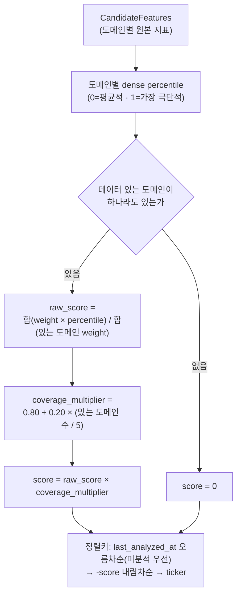
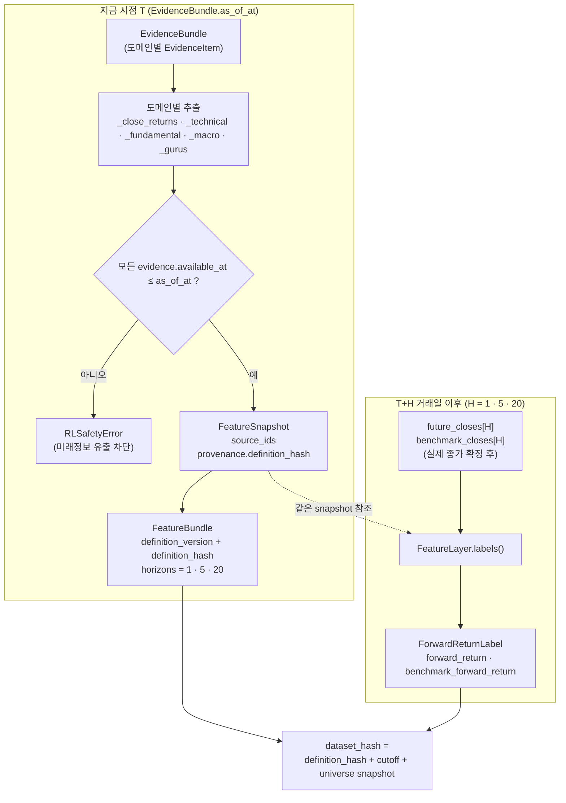

# 투자 시스템 — System Portfolio와 My Portfolio

프로그램은 데이터로 종목 기대수익을 판단하고 위험을 고려해 목표비중을 정한 뒤 **System Portfolio**에서
그 전략을 100% 자동으로 추적한다. 사용자는 그 성과와 근거를 보고 실제 Toss 계좌(**My Portfolio**)도
현재 System 목표를 따라갈지 Discord에서 선택한다.

## 전체 흐름


어떤 근거가 어떤 순서로 신호가 되는지.

*소스: `docs/diagrams/src/trading-analysis.dataflow.json` — 그림을 고치려면 이 파일을 고치고 `python scripts/build_diagrams.py`. 본문 폭에서는 글자가 작다 — 이미지를 눌러 원본으로 보거나 `docs/diagrams/html/trading-analysis.html`을 브라우저로 연다.*

```text
DATA (재무·가격·밸류에이션·추정치·거시·공시·사건)
→ FEATURES (PIT feature store, factor 횡단면)
→ ALPHA        trading/decision/alpha.py
   factor 사전값(IC×σ×z) + champion ML 예측(OOS IC 신뢰도만큼) → TradingAgents 거부권·소폭 조정
   → 종목별 기대초과수익·confidence(근거 일치도), 필요할 때만 제약(force_exit·block_increase)
→ PORTFOLIO    trading/system/target.py
   위험예산(trading/risk/budget.py) → cvxpy optimizer → no-trade band → 꼬리위험 축소 → DeterministicRiskGate
→ SYSTEM TARGET WEIGHTS
→ SYSTEM PORTFOLIO   trading/system/engine.py · accounting.py
   비중 기반 NAV(시작 100)·SPY 대비·낙폭·회전율·비용
══════════ 여기까지 실계좌·Discord 승인과 완전히 독립 (테스트 강제) ══════════
SYSTEM TARGET + 새 Toss 계좌 스냅샷
→ MY PORTFOLIO FOLLOW   trading/my_portfolio.py
   목표비중 × (현금 + 보유 평가액) − 현재 보유 = 주문, 목표에 없는 보유는 전량 매도
→ Discord 승인 → Toss 주문 → 원장·대사 (execution/)
```

LLM은 논지·근거·위험을 만든다. 최종 비중은 optimizer가 계산하고 hard risk는 RiskGate가 강제한다.
AI/ML/RL은 risk policy, broker credential과 durable safety control을 수정할 권한이 없다.

| 영역 | 질문 하나 | 코드 |
|---|---|---|
| DATA | 무슨 사실을 알고 있는가? | Supabase 원본 창고 + 로컬 사본(`data/market/local_mirror`) |
| FACTOR | 우리 철학에서 어떤 기업이 기본적으로 좋은가? | `research/features/factors.py` |
| ML | 그 상태가 실제 미래 초과수익으로 이어졌는가? | `research/ml_serving.py`(champion) |
| TRADINGAGENTS | 숫자가 놓친 중요한 이유·위험이 있는가? | `trading/decision/analysis.py` |
| EVENT | 지금 다시 분석해야 하는가? | `operations/commands/event_reanalysis.py` |
| ALPHA ENGINE | 이 종목의 기대초과수익은 얼마인가? | `trading/decision/alpha.py` |
| PORTFOLIO ENGINE | 몇 % 보유해야 하는가? | `trading/system/target.py` |
| SYSTEM PORTFOLIO | 이 전략을 100% 따르면 성과가 어떤가? | `trading/system/engine.py` |
| REAL | 현재 System 목표를 실계좌에 어떻게 복제할까? | `trading/my_portfolio.py`, `execution/` |
| RESEARCH | 지금 방법보다 더 좋은 방법이 있는가? | ML challenger·RL·factor IC·Ablation(`research/system_validation/ablation.py`) |

## 저장소: 원본 창고와 계산 작업장

Supabase는 가격·재무·공시·거시·13F 같은 **원본 금융데이터 창고**다. Feature·Factor·ML·RL·Backtest와
System Portfolio는 로컬에서 계산하고, 판단·승인·주문 원장도 로컬 runtime SQLite에 둔다. 판단이 종목마다
Supabase를 읽지 않게 가격·기업행위·유니버스·멤버십은 `data/market/local_mirror`가 2시간마다 로컬 Parquet 사본으로
동기화하고, `research/evidence/reader.py`의 `PitReader`가 사본을 먼저 읽는다. 사본이 없거나 30시간보다 오래되면 Supabase로
돌아간다 — 오래된 사본으로 조용히 판단하지 않는다.

## 두 세계의 경계

| | System Portfolio | My Portfolio |
|---|---|---|
| 질문 | 프로그램 판단을 100% 따랐다면? | 실제 계좌가 현재 System 목표를 따라갈까? |
| 코드 | `trading/system/`, `trading/decision/alpha.py`, `trading/risk/budget.py` | `trading/my_portfolio.py`, `execution/` |
| 읽는 것 | 가격·feature·논지·거시 | System 목표 + 새 Toss 스냅샷 |
| 읽지 않는 것 | Toss 잔고·주문·승인 원장, Discord | — |
| 하네스 job | `system_portfolio`(1시간) | `my_portfolio_follow`(승인 워크플로 모드에서만) |
| 원장 | runtime SQLite `system_targets`·`system_nav` | `intents`·`approvals`·`orders`·`fills` |

- 분석 대상 선정과 사건 재분석이 보는 "보유 종목"은 System 보유다(`SystemPortfolioStore.held_tickers`).
- System 거래비용은 가격 이력으로만 추정한다. 실계좌 체결 비용으로 보정하면 사람의 주문이 System 판단에 들어온다.
- 경계는 `tests/investment_agent/trading/system/test_system_portfolio.py`의 import 검사와 "승인 거절·수동 주문이
  있는 원장과 빈 원장에서 System NAV가 같다" 검사가 강제한다.

## 현재 실행 경로

| 구분 | 파일 | 역할 |
|---|---|---|
| 논지 분석 | `trading/decision/analysis.py` | 선정된 종목을 TradingAgents로 분석해 신호 배치(논지)로 저장. 비중을 정하지 않는다 |
| 사건 즉시 재분석 | `operations/commands/event_reanalysis.py` | System 보유 종목의 새 공시·고영향·글로벌 사건을 곧바로 분석 |
| System | `operations/commands/system_portfolio.py` | 평가 → 재조정 필요 판단 → 목표 기록 |
| My Portfolio | `operations/harness_adapters.py::follow_system_target` | 최신 System 목표를 새 Toss 스냅샷과 비교해 추종 제안 기록 |

파일이 존재한다는 이유만으로 예약 실행 경로라고 판단하지 않는다. 실제 호출 여부는
`src/investment_agent/operations/harness_adapters.py`와 `.github/workflows`에서 확인한다.

### System Portfolio 회계

- **목표는 판단 다음 정규장 종가에 적용한다.** 판단 시각의 종가로 비중을 바꾸면 판단할 때 몰랐던 가격 변화를 가져간다.
- 매 거래일 `NAV_t = NAV_{t-1} × Σ w_i × (종가 + 배당) × 분할비율 ÷ 전날 종가`. 전날 종가는 NAV 행에 저장한 값을 쓴다 —
  가격 이력이 분할 뒤 다시 수집돼도 수익률이 두 번 보정되지 않는다.
- 재조정일 비용 = Σ|Δw| × (추정 반스프레드 + 수수료). 이력이 모자라 추정할 수 없는 종목은 0.5%로 둔다(0으로 두지 않는다).
- 종가가 없는 보유는 전날 종가로 평가하고 `stale_price_tickers_json`에 남긴다. 목표 종목에 적용일 종가가 없으면 다음 거래일에 적용한다.
- SPY는 같은 방식의 총수익 NAV로 함께 기록한다.

### 언제 목표를 다시 만드나

- 목표가 한 번도 없었다.
- 새 factor 횡단면이 있고 마지막 목표에서 7일(`rebalance_days`)이 지났다.
- 보유 종목에 마지막 목표 뒤 논지 붕괴가 새로 기록됐다 — 주기를 기다리지 않는다.

아직 NAV에 반영되지 않은 목표가 있으면 새로 만들지 않는다. 공분산·비용·베타·스트레스·SPY 이력이 없어 목표를
만들 수 없는 날은 이전 목표를 유지하고 회차를 `failed`로 남긴다. 기본값으로 목표를 만들면 실계좌가 할 수 없는
판단이 System 성과에 섞인다.

### ALPHA — 기대초과수익과 논지

종목마다 필요한 값은 **기대초과수익**(20거래일 동안 SPY보다 얼마나 더 좋은가 — 몇 % 살지가 아니다),
confidence, 논지 상태, 제약 하나, 근거(`alpha_signals` metadata)뿐이다.

- **factor 사전값**: `IC × σ(20일) × z`. z는 종합 factor 점수의 유니버스 내 순위를 표준정규 점수로 바꾼 값(백분위
  2~98%로 절단), IC는 초기값 0.04이고 `factor_research`로 다시 정한다. factor 점수가 매수·매도·비중을 직접 정하지 않는다.
- **champion ML**: 채택된 모델의 20일 기대초과수익 예측을 ±1σ로 잘라 `(1 − s) × 사전값 + s × 예측`으로 합친다.
  s는 OOS 날짜별 단면 IC로 잰 신뢰도(최대 0.8)다. 채택 모델이 없거나 IC가 유의하지 않으면 s = 0이다.
- **논지는 검증자다**(유효 28일). TradingAgents는 `thesis`(positive·neutral·negative)·`hard_constraint`·`key_risks`를
  적는다. 명시 필드가 없는 옛 기록만 행동 단어를 한 번 해석한다(`ThesisView.thesis_state`).
- **confidence는 근거 일치도다**: factor·ML·논지 중 방향을 말한 근거가 최종 기대초과수익과 같은 방향인 비율.
  이 일치도 계산에는 LLM의 자기평가 확신을 쓰지 않는다. optimizer가 기대수익에 곱한다.
  단, 아래 positive 논지의 소폭 조정에는 `ThesisView.confidence`가 쓰인다. 이는 보정된 성공 확률이 아니다.

| 논지 상태 | 조건 | ALPHA 출력 |
|---|---|---|
| broken | `hard_constraint` = `force_exit`·`exclude` (옛 기록: 하락 전망 + `exit`) | 보유면 `force_exit`, 아니면 `block_increase`, 기대수익 ≤ 0 |
| negative | `thesis` = negative 또는 `block_new_buy` (옛 기록: 하락 전망 또는 `exit`·`reduce`·`avoid`) | `block_increase`, 기대수익 ≤ 0 |
| positive | `thesis` = positive이고 수치도 상승 | 숫자가 양수일 때만 논지 쪽으로 `0.25 × 논지 신뢰도` 이동(±1σ 절단) |
| neutral | 그 외 | 숫자 기대수익 그대로 |

- 보유하지 않은 종목에 유효한 논지가 없으면 기대수익을 절반으로 줄여 담는다(`UNVERIFIED_ENTRY_SCALED`, `unverified_entry_scale`).
  LLM은 본 종목의 거부권(부정·붕괴 논지)으로 남는다. 엄격 모드(`require_verified_entry=True`)는 편입을 막는다
  (`UNVERIFIED_ENTRY_BLOCKED`). 품질 기준에서 떨어진 종목은 늘리지 못한다.
- **대상은 품질 기준 통과 factor 상위 40종목(`candidate_count`) + 보유 종목**이다. 이 숫자는 투자 대상이 아니라
  공분산·비용 조회 규모를 묶는 계산 한도다. 점수·변동성을 모르는 보유는 고정한다.

### PORTFOLIO — 목표비중

- L1 turnover 벌점 없이 반스프레드 선형 비용만 목적함수에 두고, 비중 차이 1%p 미만은 거래하지 않는다(no-trade band, 전량 청산은 예외).
- **factor 노출 범위**: 보유 비중 가중평균 품질 점수 ≥ 0.55, 모멘텀·가치 점수 ≤ 0.80. 한 번에 맞출 수 없으면 제약 없이 풀고 `exposure_limits_relaxed`에 남긴다.
- **꼬리위험 축소**: no-trade band 뒤 목표의 5거래일 역사적 CVaR95나 연 변동성이 한도(`SystemPortfolioPolicy.max_cvar_95_5d`
  기본 8%, 변동성 30%)를 넘으면 목표를 버리지 않고 위험자산 전체를 같은 비율로 줄여 현금을 늘린다. 종목 선택과
  종목 사이 비율은 바꾸지 않는다. 결과는 `tail_risk` metadata에 남는다.
- 시장충격·거래대금 참여 한도는 두지 않는다. 따라가는 계좌가 수천 달러라 주문이 시장 거래대금에 비해 무시할 만하다.

### My Portfolio — 따라가기

- 대상은 가장 최근 **승인된** System 목표다. 10일보다 오래된 목표는 System 엔진이 멈췄다는 뜻이라 따라가지 않는다.
- 주문 금액 = 계좌 전체(현금 + 보유 평가액) × 목표비중. 목표에 없는 보유(직접 산 종목 포함)는 0 — 전량 매도.
- 과거 거절·무응답을 복구하지 않는다. 오늘 따라가면 오늘의 목표와 오늘의 계좌 차이만 주문한다.
- 모든 차이가 최소 주문금액(10달러) 미만이면 승인을 묻지 않는다. 미체결 주문이 있으면 기다린다.
- **같은 목표는 한 번만 묻는다**(거절·만료 포함, `ExecutionRepository.is_system_target_followed`). 다음 목표가 생기면 다시 묻는다.
- 수동 모델 승격(live)·새 스냅샷 신선도·승인 만료·중복 주문 방지·결과 불명 처리·대사·킬스위치는 `execution/`이 그대로 강제한다.
- live intent는 `system_target_id`가 있는 제안에서만 만들 수 있다(`create_execution_intent`).

## 후보 선정과 Evidence

S&P 500 전체를 매일 LLM에 보내지 않는다.

| 단계 | 주요 코드 | 결과 |
|---|---|---|
| Universe 확인 | `universe.py::select_tracked_tickers` | 허용 member와 제외 사유 |
| 후보 선정 | `candidate_ranker.py::select_factor_candidates` (횡단면이 없으면 `rank_candidate_features`) | 품질 기준 통과 factor 상위 명단 중 판단이 오래된 종목 |
| 근거 생성 | `research/evidence/context.py::ContextBuilder.build` | PIT `EvidenceBundle`, missing/warnings |
| Agent 실행 | `TradingAgentsDecisionEngine.run` | role output와 외부 evidence manifest |
| 계약 검증 | `SecurityProposal.from_dict` | ticker/as-of/range/evidence ID 검증 |
| 논지 보관 | `SignalBatch`·`SignalRecord` | batch, 성공·실패 ticker, ML 보정 반영 논지 |

### EvidenceBundle 도메인 구성

`ContextBuilder.build`는 아래 8개 도메인을 순서대로 채우고, 그 시점에 데이터가 없는 도메인은
evidence 대신 `missing_data`에 사유를 남긴다. `news_archive`는 Supabase에 시점 저장소가 없어
매번 missing으로 남는다.

| 도메인 | 소스 | `available_at` 기준 | 비어있을 때 |
|---|---|---|---|
| market | `market.prices_daily` | 거래일 뉴욕 18:00 확정 시각(적재 시각이 있으면 둘 중 늦은 쪽, `bar_available_at`) | "market: 시점 기준 사용 가능한 가격 없음" |
| technical | ResearchStore `feature_signals_daily` + `market.prices_daily` | feature 행 `ingested_at` (과거 재현에서는 적재 시각이 늦어 비어 있다) | "technical: 시점 기준 기술지표 없음" |
| fundamentals | SEC EDGAR/FSDS, `fundamentals.financials` + `fundamentals.filings` | live: 최신 `available_at` / historical_replay: 제출일 다음 날 뉴욕 0시(`filing_available_at`) | source_kind별 문구로 "fundamentals: ..." |
| estimates | yfinance observed snapshots | 최신 `collected_at` | "estimates: 시점 기준 실제 관측 컨센서스 없음" |
| macro | `macro.series`+`observation_versions` | 관측치 `collected_at` 최댓값 | historical_replay는 항상 제외; live에서 실행·관측이 없으면 missing |
| segments | SEC XBRL, `fundamentals.segment_metrics` | filings `updated_at` | provider unavailable 여부로 사유 분기 |
| gurus | SEC 13F, `institutional.filings` + `institutional.positions` | filings `accepted_at` | "gurus: 추적 매니저의 매핑된 보유 근거 없음" |
| economic_calendar | `macro.release_events` + release versions | 최신 `collected_at` | "economic_calendar: 시점 기준 관련 발표 일정·관측값 없음" |
| news_archive | Supabase 시점 저장소 없음 | — | 항상 missing; live 외부 provider 사용 여부는 Agent 정책에 따름 |

### factor 기반 후보 선정

LLM 분석 예산(하루 약 20종목)은 **보유할 만한 종목**에 쓴다. 가장 최근의 온전한 live feature 횡단면
(tracked의 절반 이상, 4일 이내)으로 `research/features/factors.py`가 점수를 매긴다.

| category | factor (방향) |
|---|---|
| quality | ROE·ROA·매출총이익률·FCF 마진(TTM, +), accruals·영업이익률 변동성(−) |
| balance_sheet | 이자보상배율(+), 부채/자본(−) |
| growth | TTM 매출 YoY(+), 순이익 성장(+) |
| value | 이익수익률·FCF 수익률(+), PSR(−) — **업종(SIC division) 안에서** 순위 |
| revision | 30일 추정치 상향 비율(+), EPS 추정치 변화(+) |
| momentum | 12-1개월·6-1개월 수익률(+) |

각 factor는 같은 날 백분위로 바꾸고(결측은 0점이 아니라 제외), category에 factor 절반 이상이 있어야 점수를
준다. 품질 < 0.3 또는 재무건전성 < 0.2 백분위면 후보가 아니다. 종합 점수는 category 동일가중이다.

`select_factor_candidates` 순서: ① 보유 중인데 품질 기준에서 떨어진 종목(5일 간격) ② 종합 상위 60종목 중
판단이 없거나 28일보다 오래된 종목(점수순) ③ 판단이 오래된 보유 종목. 판단이 아직 유효한 종목은 예산이
남아도 다시 보지 않는다 — 고를 종목이 없으면 `NoCandidatesDue`로 회차를 넘긴다. 새 공시·고영향 사건 레인은
여전히 맨 앞이다.

### 예전 후보 정렬 점수(횡단면이 없을 때)

factor 횡단면이 없으면(feature 적재 전·중단) 아래 순환 랭커로 고르고 `path=legacy_rotation` 경고를 남긴다.
이 점수는 매수 점수가 아니라 분석 순서다. 가장 오래 분석되지 않은 종목을 먼저 보고,
같은 조건이면 구조화 데이터 변화가 큰 종목을 우선한다. `rank_candidate_features`는 도메인별
percentile을 가중 평균해 이 우선순위를 계산한다.

| 도메인 | 가중치 | percentile로 바꾸는 신호 |
|---|---:|---|
| market | 0.30 | 20일 수익률 절대값, 20일 거래량비 log 절대값 |
| fundamentals | 0.25 | 매출 YoY 성장률 절대값, 영업이익률 절대값 |
| technical | 0.20 | RSI14의 50 이탈폭, MACD-signal 스프레드 절대값 |
| gurus | 0.15 | guru 보유자 수, guru 총 보유금액(log1p) |
| segments | 0.10 | 세그먼트 집중도, 세그먼트 품질 |

각 신호는 그날 tracked universe 안에서 dense percentile(0~1)로 바뀐다 — 값 자체의 크기가 아니라
다른 종목 대비 변화폭이 큰 종목일수록 1에 가깝다.



## TradingAgents와 LLM의 역할

저장소 소유 `decision/agents/orchestrator.py`가 Market → Fundamentals → News → Sentiment → Macro 분석가 뒤에
투자위원회 호출 한 번(`agents/committee.py`, 강세 논거·약세 논거·결론)을 실행한다 — 분석가 포함 종목당 호출 약
6번이다. 결과 dict는 토론 상태 키 모양(`investment_debate_state`·`risk_debate_state`)을 따라, 구조화 호출과
판단 기록 화면이 그대로 읽는다.
외부 TradingAgents/LangGraph runtime이나 설치 패키지 monkey patch는 사용하지 않는다.
자연어 토론은 설명 자료이지 주문 계약이 아니다. 최종 parser는 다음과 같은 구조화 필드만
허용한다.

- ticker와 timezone-aware as-of
- `thesis`(positive·neutral·negative), `hard_constraint`(none·block_new_buy·force_exit·exclude), `key_risks`
- probability, confidence, expected excess return
- reasoning과 실제 bundle에 존재하는 evidence ID
- missing data와 model/engine version

TradingAgents의 질문은 "숫자(factor·ML)가 놓친 기업·공시·뉴스·사업·이벤트 위험이 있는가"다. 사고팔기 행동과
비중은 출력하지 않는다 — 목표비중 변화에서 파생된다. `hard_constraint`는 회계부정·논지 붕괴 같은 극단 상황에만 쓴다.
저장 기록의 `signal`은 논지를 한 단어로 보여 주는 표시(`legacy_signal`)일 뿐 판단 입력이 아니다.

다음은 계약 오류다.

- 다른 ticker/as-of 또는 허용 목록 밖 thesis·hard_constraint
- 0~1 범위 밖 probability/confidence
- 존재하지 않는 evidence ID
- NaN/Infinity expected return
- 빈 reasoning 또는 임의 schema field(`signal`·`target_weight` 포함)

### 외부 텍스트와 비용

뉴스·소셜은 live 계열에서만 untrusted evidence로 사용할 수 있다. URL/content 중복 제거,
instruction-like text 제거, 길이 제한과 provider quota/cache를 적용한다. broker key와 execution
control은 prompt/context에 포함하지 않는다. runner는 뉴스 조회를 판단 날짜에서 7일 전부터 요청한다.
historical에서 외부 뉴스 호출 금지와 bundle·요청 날짜의 as-of 검증은 그대로 적용된다. 기사별 발행 시각이
없는 provider 텍스트의 정확한 intraday PIT는 보장하지 못한다. 7일은 성과 최적값이 아니라
주말·직전 사건을 같은 날짜 조회로 누락하지 않기 위한 명시적 조회 정책이다.

```text
tracked universe
→ 정량 후보 축소
→ AI_INVESTOR_DAILY_LIMIT
→ request/content cache
→ provider daily cap
→ 소수 ticker만 deep analysis
```

`OpenAICompatibleClient`는 원격 endpoint와 Ollama/local model 교체를 허용하지만 provider,
model, prompt와 engine version이 달라지면 별도 artifact로 기록하고 System Portfolio에서 다시 검증한다.

## Memory와 평가

`memory.py`는 horizon이 끝나고 `evaluator.py`가 실제 결과를 기록한 case만 같은 ticker의 참고
기억으로 사용한다. 현재 이 기억은 최종 구조화 프롬프트에 들어가며 개별 analyst나 debate의 학습 기억은 아니다.
아직 미래 가격이 확정되지 않았거나 benchmark가 없으면 0점으로 만들지 않고
미평가로 남긴다. 기억은 현재 evidence를 대체하지 않고 주문 권한도 없다.

평가된 사례와 별도로 **직전 판단**(결과 미확인)을 함께 넘긴다. 어제 무엇을 근거로 무엇이라고 했는지를
모르면 어제 늘리라던 종목을 오늘 설명 없이 줄이라고 할 수 있다. 직전 판단에는 "결과를 모른다"는
표시와 "방향을 바꾸면 새 근거 ID를 reasoning 첫 줄에 적는다"는 규칙을 붙이고, 결과 수치나 LLM의
target_weight는 넘기지 않는다. 판단 원장의 `final_decision.previous_case_key`·`previous_signal`로
방향이 뒤집힌 판단을 사후에 찾을 수 있다.

## Feature Layer

`FeatureLayer`는 `EvidenceBundle.as_of_at` 이하 evidence만 사용해 version/hash가 있는
`FeatureBundle`을 만든다. 이는 현재 TradingAgents 주 실행 경로의 필수 호출이 아니라 ML/RL/Qlib
학습과 serving이 공유할 연구 입력 경계다.

feature와 1D·5D·20D label은 시각적으로 분리한다 — feature는 `as_of_at` 시점에 바로 만들어지지만,
label은 그 뒤 실제 종가가 확정돼야만 만들어진다. dataset identity에는 정의 hash, cutoff,
universe snapshot과 dataset hash가 포함된다.



같은 `snapshot`(as_of_at·ticker)을 참조해야만 feature와 label이 나중에 하나의
학습 row로 합쳐진다 — label을 feature와 같은 시점에 만들지 않는 이유가 이 시차다.

### 과거 재현(`historical_replay`)의 규칙

가격·재무는 과거 시점을 그대로 재현할 수 있어서, 실시간 label이 쌓이기를 기다리지 않고 과거
10년 이상으로 계량 모델을 학습·검증한다. 결과를 조용히 부풀리는 경로는 코드가 막는다.

| 함정 | 규칙 | 위치 |
|---|---|---|
| 장 마감 뒤 공시를 그날 알았다고 가정 | 제출일 D 공시는 D+1 뉴욕 0시부터 사용 | `data/fundamentals/domain/filing.py` |
| 뒤늦게 적재한 봉을 "몰랐던 가격"으로 처리 | 봉 가용 시각은 거래일 뉴욕 18:00(적재 시각이 있으면 늦은 쪽) | `data/market/domain/calendar.py` |
| 과거 시가총액이 이후 분할만큼 작아짐 | 저장 종가는 현재 분할 기준이므로(새 분할마다 전체 이력 재수집) 수익률은 그대로 쓰고, 과거 공시 주식 수에 표지 기준일 이후 분할 비율을 곱한다 | `research/valuation/inputs.py` |
| 살아남은 기업만으로 학습 | 과거 시점 종목은 그때의 S&P 500 멤버. 멤버십을 모르면 현재 목록으로 대체하지 않고 실패 | `research/datasets/universe.py` |
| 정정 공시를 과거에 적용 | 기간을 처음 공개한 공시일로 자르고 정정 값은 소급(`financials`) | `fundamentals` 읽기 경계 |
| 계절성이 성장률로 들어감 | 성장률은 같은 회계기간 전년 대비 | `research/evidence/statistics.py` |

과거 재현에서 비는 것도 있다. 뉴스·소셜, 수집 전 애널리스트 추정치(`captured_live` 이전),
시점 이력이 없는 거시 관측, 적재 시각이 늦은 기술지표는 결측이고, 상장폐지 종목은 가격 원천에
이력이 없으면 결측으로 남는다. LLM 판단은 모델이 이미 미래를 학습했으므로 과거 재현 대상이 아니다.

과거 시점 snapshot은 `research.commands.backfill_research_history`가 명시적으로 쌓는다. 원격 재무·컨센서스·
주식수·세그먼트는 날짜마다 일괄 조회해 종목별 계산이 재사용하고, 날짜 결과는 Parquet에 한 번만 원자 저장한다.
`historical_replay_runs` manifest는 기대 universe, 실제 snapshot, 영구 불가 ticker, 실패 ticker를 구분한다.
중단 뒤에는 빠진 ticker만 재개하며 `--audit-only`는 날짜별 완결성을 읽기 전용 JSON으로 보고한다. 추정치
revision factor는 수집 전 시점에서 비므로, 과거 IC에서 revision category는 표본이 짧다.

### factor IC 연구

`research.commands.factor_research`가 과거 재현 snapshot마다 factor 점수와 그 뒤 5·20·60·126거래일 수익률의
Spearman 순위 상관(IC)을 재고, factor·category·종합 점수별 평균 IC·t·양수 비율·상하위 20% 수익 차이를
`artifacts/research/factor_ic/latest.json`에 쓴다. 기간은 먼저 정하지 않고 IC가 가장 크고 오래 가는 곳으로 고른다.

- 판단 간격보다 기간이 길면 수익률 구간이 겹쳐 t가 부풀려진다 — `t_stat_overlap_adjusted`로 본다.
- 기간 끝 종가가 없는 종목은 빠진다(생존 편향). 배당을 뺀 가격 수익률이다.
- 겹침 보정 t ≥ 1.5이고 평균 IC가 양수인 category만 IC 비례 가중치를 **제안**한다. `FactorModel`에 자동 반영하지 않는다.

하네스 `system_evaluation` 잡이 7일마다 기본 기간으로 다시 잰다. 정책의 IC 가정(`AlphaPolicy.information_coefficient`)과
실측이 벌어지는지 보는 자리다.

채택이 승인되면 `load_factor_model_from_ic_report(path, horizon=..., version=...)`로 특정 기간의 제안만
명시적인 새 버전으로 읽는다. 기간과 버전을 생략할 수 없고 `FactorModel()`의 기본값은 계속
`factor-v1-equal`이므로, `latest.json`이 갱신됐다는 이유만으로 운영 가중치가 바뀌지 않는다.

## ML baseline을 먼저 비교한다

`src/investment_agent/research/models/baselines.py`는 같은 train/validation/OOS 배열로 다음 모델을 비교한다.

| 모델 | 목적 | 의존성 |
|---|---|---|
| Naive | 복잡한 모델이 실제로 개선됐는지 기준 | NumPy |
| Ridge | 안정적 선형 expected return | NumPy |
| LightGBM | 비선형 tree boosting 비교 | 선택 설치 |
| XGBoost | 독립 boosting 구현 비교 | 선택 설치 |

목표는 **`SIGNAL_HORIZON_DAYS`(20거래일) 초과수익** 하나다(`src/investment_agent/forecasting.py` — Research와 Trading이 대칭으로 쓰는 최상위 공유 계약):
`excess_return_20d = 종목 20일 총수익 − SPY 20일 총수익`. TradingAgents 의견·ML label·공분산·optimizer가 모두
이 기간을 쓰고, 모델에 적히는 기간은 dataset의 label 정의(`excess_return_20d`)가 정한다. 원수익률
(`forward_return_*`)로 학습한 모델은 학습·채택·서빙 모두 거부한다 — 예측을 기대초과수익으로 쓰기 때문이다.
거래비용은 optimizer가 따로 빼므로 ML target에서 빼지 않는다. 다른 기간으로 학습한 모델은 배율로 환산해 섞지 않는다.
RMSE/MAE와 방향 정확도 외에,
학습 결과에는 **OOS 날짜별 단면 IC**(`research/evaluation/alpha.py`: 평균 IC·ICIR·t-통계량·
상위-하위 분위 spread)가 `out_of_sample_alpha`로 남는다. 날짜를 섞은 순위 상관은 시장 전체의
공통 움직임을 순위 능력으로 착각하므로 채택·신뢰도 판단에 쓰지 않는다.
겹치는 h일 label의 t는 Bartlett Newey–West HAC(h−1 lag), 유한표본 보정과 IID 분산 하한으로 계산한다.
`inference_method`, `horizon_days`, `hac_lags`, 비교용 `ic_t_stat_iid`를 함께 저장한다. ICIR 자체는
기존 평균/표준편차 정의다. 유효 IC 날짜가 h 이하이면 t=0이다. HAC는 calibration이나 OOS 우월성 증명이 아니다.

### ML을 판단에 합치는 경로

```text
채택된 ML artifact + PIT feature → research/ml_serving.py::champion_forecast → ALPHA(factor 사전값과 합침)
TradingAgents 논지 ─────────────────────────────────────────────────────────→ ALPHA(거부권·소폭 조정)
```

- 채택은 주간 `ml_challengers`가 자동으로 하고, 수동 경로는
  `python -m investment_agent.research.commands.adopt_ml_model --artifact <json>`이다. 둘 다 같은 조건이다.
  재로딩 가능한 모델(naive·ridge는 계수, LightGBM·XGBoost는 저장한 booster 원문 — 단일 스레드·deterministic
  학습이라 같은 dataset이 같은 artifact hash를 낸다)이고, 기간과 일치하는 HAC 기록, OOS 평균 IC > 0,
  IC t ≥ 2, OOS 날짜 수 > label 기간(20일), 유한한 분위 spread > 0일
  때만 `artifacts/trading/ml_models/active_ml_model.json`으로 복사된다.
- ML과 factor를 합치는 비율은 OOS 측정치에서 계산한다. ML 몫 = min(0.8, 평균 IC × 10)이고 나머지는 factor
  사전값이다. 이 배율과 상한은 정책값이며 확률 calibration 결과는 아니다. t < 2 또는 HAC 기록이 없는 구형
  artifact는 서빙하지 않고 factor로 되돌린다.
- ML은 TradingAgents 의견과 섞지 않는다. 부정 논지의 거부권은 ML 예측이 좋아도 그대로다.
- 추론 feature는 판단 시점 이전에 공개된 가장 최근 한 날짜의 **전 종목** snapshot으로 결측을 대체한다
  (학습 dataset과 같은 규칙). 분석한 몇 종목만으로 중앙값을 내면 training-serving skew가 생긴다.
- 하네스 `ml_challengers` job(주 1회, `research/commands/ml_challengers.py`)이 최근 5년 feature·label로
  naive·ridge·LightGBM·XGBoost를 같은 purged split에서 다시 학습한다. 채택 조건(비교 후보 수만큼 올린 t 문턱)을
  통과하고 현 champion보다 OOS ICIR이 높은 후보를 **자동으로 `active_ml_model.json`에 올린다.** 매주 champion을
  이번 OOS 창으로 다시 채점해 평균 IC ≤ 0 또는 t < 1이면 내리고(`candidates/retired/`), 그때는 채택 조건만
  넘은 후보로 바로 교체한다. 채택·해제는 운영 채널로 알린다. 사람이 결정하는 것은 실계좌 추종(Discord 승인)이다.
  학습 dataset은
  창 안에서 한 번이라도 S&P 500이었던 종목까지 포함한다(생존 편향 방지).
- champion이 반영되면 System 목표 artifact의 정체성(`champion_ml_artifact_id`)이 바뀌어, 실계좌 추종은 그 조합의 승격을 요구한다.

### 분석 후보의 우선 레인

정기 후보 순위는 오래 안 본 종목을 앞세운다. 그 앞에 `candidate_ranker.priority_candidates`가
**마지막 분석 이후 새 정보가 생긴 종목**을 먼저 넣는다 — tier 0은 보유 중이면서 새 공시(`filed_at`)나
고영향 사건(`event_feature_snapshots`)이 공개된 종목과 한 번도 분석하지 않은 보유종목, tier 1은
미보유지만 중요도 0.75 이상 사건이 난 종목이다. 보유 목록은 System Portfolio의 현재 보유다 — 실계좌 보유는 분석 대상 선정에 들어오지 않는다.

```powershell
uv sync --group ml
python -m unittest tests.investment_agent.research.rl.test_baseline
```

### 사건 기반 즉시 재분석

하네스 `event_reanalysis` job(10분 주기, `operations/commands/event_reanalysis.py`)은 로컬 뉴스·소셜을 사건으로
다시 압축한 뒤 `trading/decision/candidates.py`의 `CandidateSelection.event_reanalysis_priorities`로 지금 다시 볼 종목을 고른다 — 보유
종목의 새 공시·고영향 사건(위 우선 레인)과, 검증된 **글로벌 사건**(ticker 없음)에 민감한 보유 종목이다.
한 번에 3종목만 `trading.decision.analysis`로 분석하고, 그 사건 뒤에 이미 분석한 종목은 다시 고르지 않는다.
결과는 보통의 논지 기록이고, 깨진 논지는 System 목표를 주기와 무관하게 다시 만든다.

글로벌 사건은 `trading/decision/event_impact.py`가 이렇게 옮긴다.

```text
사건 원문 → 테마(유가·금리·관세·반도체·금융·지정학·원자재) → 대표 ETF → 보유 종목의 ETF 민감도 → 재분석
```

재분석 대상이 되려면 서로 다른 제공자 두 곳 이상(단일 출처 루머 배제), 고영향 중요도, 대표 ETF의
사건 다음 거래일 수익률 크기가 직전 20일 일간 변동성보다 큼(시장 확인), 보유 종목 민감도 절대값 0.5
이상을 모두 만족해야 한다. 원문은 저장하지 않고 테마 이름만 사건 metadata에 남긴다. 뉴스 수집 주기
(intelligence job)가 길면 글로벌 사건 반응도 그만큼 늦다 — 공시는 실적 감시 job이 1분 주기로 적재한다.

## Dataset split과 재현성

시계열 투자 데이터는 random shuffle하지 않는다.

```text
train
→ label horizon이 경계를 넘는 row purge
→ embargo
→ validation
→ out-of-sample
→ rolling/walk-forward 반복
```

같은 날짜의 종목 cross-section은 같은 split에 두며, 현재 S&P 구성 종목을 과거 전체에 고정하지
않는다. universe snapshot이 없는 구간은 승격 dataset으로 만들지 않는다.

모든 artifact에는 다음 identity를 남긴다.

- algorithm과 parameter
- feature 컬럼 정의 hash와 dataset hash
- train/validation/OOS 기간
- random seed와 code commit
- model file SHA-256
- 평가 metric과 benchmark

파일과 DB metadata/hash가 일치하지 않으면 inference와 promotion에 사용하지 않는다.

## RL 정책 학습은 두지 않는다

강화학습 정책(PPO 등)을 학습·보관하는 코드는 없다. 판단 경로(`trading`·`execution`·`operations`)가 비중을
정하는 것은 결정론적 optimizer이고, RL 비중을 기대수익으로 되돌려 섞으면 이미 반영한 위험·비용을 두 번 센다.
`research/rl`에 남은 것은 feature snapshot·label·멤버십 계약(`contracts.py`)과, 판단 경험 원장
(`build_decision_experiences`, 추천 성과 보고의 원천)이 쓰는 dataset·feature 조립(`decision_dataset.py`·
`features.py`·`environment.py`)이다.

## Ablation — 모듈이 실제로 성과를 개선하는가

`python -m investment_agent.operations.commands.system_ablation --start <날짜> --end <날짜>`가 같은 기간·PIT 데이터·
비용·유니버스에서 운영 System 엔진을 변형별로 돌린다(`research/system_validation/ablation.py`).

| 변형 | 바꾸는 것 |
|---|---|
| `factor_only` | ML·논지 끔 |
| `factor_ml` | 논지만 끔 |
| `factor_ml_thesis` | 운영 구성 |
| `no_tail_risk` | CVaR 축소 끔 |
| `no_market_risk` | 시장위험 예산 끔 |
| `cvar_5`·`cvar_12` | CVaR 한도만 5%·12% |

- 종목은 판단 시각의 S&P 500 멤버, factor 횡단면은 그 시각까지 공개된 행만 쓴다. 판단 기록은 운영 원장에 쓰지 않고
  System 원장은 변형마다 임시 SQLite다.
- ML 변형은 학습·검증 구간이 재현 시작 전에 끝난 artifact만 쓴다(아니면 `refused`).
- TradingAgents 논지는 그 시각까지 기록된 것만 있어, 논지 변형의 차이는 분석 기록이 쌓인 기간에서만 의미가 있다.
- ML 예측이나 논지가 한 번도 적용되지 않은 변형은 `completed`로 가장하지 않고 `insufficient_coverage`와
  이유를 남긴다. 결과의 `coverage`에는 factor category별 시점 수, ML·논지 적용 수, 위험자산 목표 수,
  CVaR 활성·구속 시점 수, 시장위험 입력·긴축 시점 수와 공통 평가 시작·종료일이 들어간다.
- 위험 정책 변형은 모두 factor-only alpha를 사용해 ML·논지 유무가 위험 정책 비교에 섞이지 않는다.
- 결과는 `artifacts/research/ablation/latest.json`. 정책 변경은 사람이 결과를 보고 코드 리뷰로 한다.

## Qlib의 제한된 사용 범위

`qlib_adapter.py`는 PIT `FeatureSnapshot`을 `(datetime, instrument)` frame으로 바꾸고
`DataHandlerLP`/`DatasetH`와 recorder에 연결한다.

Qlib는 다음만 담당한다.

- versioned research dataset 구성
- train/valid/test segment와 rolling workflow
- experiment parameter, metric와 artifact 기록

Supabase ETL이나 이 프로젝트의 source of truth를 Qlib vendor data로 교체하지 않는다.

```powershell
uv sync --group research
```

## 공통 ExpectedReturnSignal

ML/RL/TradingAgents output은 다음 계약으로 정규화한다.

| 필드 | 의미 |
|---|---|
| `symbol` | canonical symbol |
| `expected_return` | horizon 예상 수익률 |
| `confidence` | 0~1 신뢰도 |
| `risk_score` | 0~1 상대 위험 |
| `horizon_days` | 판단 경로는 `SIGNAL_HORIZON_DAYS`(20). 공분산도 같은 기간이어야 한다 |
| `source`/`version` | model/engine artifact identity |
| `timestamp` | timezone-aware 생성시각 |
| `evidence_ids` | 사용한 stable evidence IDs |
| `constraint` | 기대수익으로 표현할 수 없는 예외만: `force_exit`(보유 전량 청산), `block_increase`(늘리지 못함) |

사고팔기(신규·확대·유지·축소·청산)는 결과 비중과 직전 비중의 차이일 뿐 입력이 아니다. 입력으로 받으면 판단자가 둘이 된다.

## Portfolio Optimizer


신호가 위험예산·optimizer·RiskGate를 지나 목표 비중이 되는 경로.

*소스: `docs/diagrams/src/trading-target.dataflow.json` — 그림을 고치려면 이 파일을 고치고 `python scripts/build_diagrams.py`. 본문 폭에서는 글자가 작다 — 이미지를 눌러 원본으로 보거나 `docs/diagrams/html/trading-target.html`을 브라우저로 연다.*

`RiskAwareOptimizer`는 CVXPY로 다음 목적을 결정론적으로 최적화한다.

```text
expected return × confidence
- risk aversion × active variance      (w − E·e_SPY)ᵀΣ(w − E·e_SPY), E = 투자 가능 위험자산 비중
- turnover penalty (L1)
- Σ 반스프레드·|Δw|
```

위험을 SPY 대비(active)로 재는 것이 System 기본값이다(`SystemPortfolioPolicy.benchmark_relative_risk`). 기대수익이
SPY 대비 초과수익이므로 위험도 같은 기준이어야 한다 — 절대 분산으로 재면 주식 위험 프리미엄이 목적함수에 없어
현금이 합리적 해가 된다. 식을 펼치면 절대 분산 항에 `+2λ·E·cov(i, SPY)` 선형 항이 더해질 뿐이라 같은 solver로 푼다.
첫 풀이가 RiskGate의 최대 종목 수보다 많이 담으면 비중 상위 종목만으로 한 번 더 풀어(`cardinality_aware`) 게이트가
작은 비중을 사후에 현금으로 돌리지 않게 한다.

거래비용은 반스프레드 선형 비용 하나다. 호가 이력이 없어 20일 평균 거래대금 구간(1·3·10bp)으로 근사한다.
따라가는 계좌가 수천 달러라 시장충격·거래대금 참여 한도는 두지 않는다. 비용 재료(거래량)가 없으면 목표를 만들지 않는다. 포트폴리오 시장 베타는 RiskGate의 사후 검사와 같은 상한
(`max_abs_beta`)을 optimizer 제약으로도 건다. 미분석 보유가 이미 상한을 넘기면 신호 종목은 베타를
지금보다 늘리지 못한다. 총합 1, long-only, 종목·섹터 최대, 현금 최소와 turnover 최대를 명시적
constraint로 사용한다. System 목표(`trading/system/target.py`)는 PIT 가격 260일의 Ledoit-Wolf 수축 공분산을
넣고, covariance가 없으면 risk score 기반의 보수적 diagonal 근사를 metadata에 표시한다.

기대초과수익은 **그 종목의 신호 기간 수익률 σ의 `max_expected_return_sigma`배(기본 1)** 안으로 자른다.
1σ를 넘는 초과수익 예측은 사실상 확실한 초과성과를 주장하는 것이고 실제 신호의 순위상관은 그보다 훨씬
작다. 9/9 실측 판단 20건의 20일 기대초과수익 중앙값이 +10%, 최대 +25%였다. 자른 값은 결과의
`capped_expected_returns`와 제안 metadata에 원래 값과 함께 남긴다. 공분산이 없는 관찰용 fallback은
종목 변동성을 몰라 자르지 않는다.

비중이 바뀐 종목마다 주 사유를 결정적 규칙으로 하나 붙인다(`trading/system/target.py::trade_reasons`):
`HARD_RISK_LIMIT`(종목 상한·최소 현금까지만 줄임), `THESIS_EXIT`(force_exit), `ALPHA_DECAY`(block_increase),
`REBALANCE`(전망은 나쁘지 않으나 위험·비용 대비 더 나은 후보에 자리를 내줌), `ALPHA_OPPORTUNITY`.
Discord System Portfolio 카드와 대시보드의 "최근 목표 변경 이유"가 이 값을 그대로 보여준다.

| constraint | optimizer 제약 | 이유 |
|---|---|---|
| `force_exit` | 비중 = 0 | 논지가 깨진 보유. 기대수익만 낮추면 turnover 한도가 잔량을 남긴다 |
| `block_increase` | 비중 ≤ 현재 | 늘리지 못하게만 막고 얼마나 줄일지는 optimizer가 정한다 |
| 없음 | 없음 | 자금이 한정돼 있어 더 나은 후보에 밀려 0이 될 수 있어야 한다 |

turnover 최대는 **재량 매매**에만 건다. `force_exit` 청산과 종목 상한 초과분의 현금화를 먼저 반영한
출발점에서 turnover를 잰다. 그렇지 않으면 여러 종목을 한꺼번에 빼야 하는 날 한도가 위험 축소를
막는다(optimizer는 infeasible, RiskGate는 잘라 둔 비중을 도로 살린다).

## DeterministicRiskGate

optimizer 결과도 반드시 RiskGate를 통과한다.

- 종목·섹터 비중, 최대 position 수와 최소 position
- 최소 cash와 최대 turnover(청산·상한 준수분을 뺀 재량 turnover, 축소는 그 출발점 쪽으로)
- `forced_exits`에 오른 보유가 남아 있으면 거부
- volatility, beta, concentration/HHI와 최대 pairwise correlation
- stale proposal

주문 notional·daily loss·drawdown·stale quote·market session은 RiskGate가 아니라 실행 단계
(`execution/orders/live_worker.py`, `execution/safety/control.py`)가 주문 직전에 검사한다.
### Regime 위험 예산

`trading/risk/regime_budget.py`가 판단 시점까지의 SPY 일봉(20일 수익률·20일 실현 변동성·252일
고점 대비 낙폭)으로 regime을 정하고, 기본 한도를 **조이기만** 한다. 미확정·미공개 봉은 제외하고,
확정 봉 cutoff 대비 마지막 SPY 날짜가 4일(calendar day)을 넘으면 실패한다. 비정상 가격과 같은 날짜의
충돌 가격도 거부한다. 이 허용기간은 휴일 여유이며 정확한 거래소 세션 달력 검사는 아니다.
시장위험은 종목을 고르지 않는 Portfolio
Engine 내부 입력이다. 경계(낙폭 8%·20%, 변동성 30%·50% 등)·기간·배율은 자연법칙이 아니라 정책값이라
`MarketRiskPolicy`(`RegimeThresholds` 포함, 버전 있음) 하나에 모으고 Ablation 재현으로 다른 값과 비교한다.

| regime | 종목 상한 | 섹터 상한 | 최소 현금 | 신규 위험 |
|---|---|---|---|---|
| RISK_ON·NORMAL | 기본 | 기본 | 기본 | 허용 |
| RISK_OFF | ×0.8 | ×0.8 | ≥15% | 허용 |
| CRISIS | ×0.5 | ×0.6 | ≥40% | 금지(어떤 종목도 현재 비중을 넘지 못함) |

조인 정책은 `portfolio-risk:<regime>` key로 원장에 따로 남는다(같은 key·version은 무시되므로).
최소 현금도 의무 출발점에 들어가, turnover 축소가 채워 둔 현금을 되돌리지 않는다. optimizer는 움직일
수 없는 미분석 보유가 허용하는 만큼만 현금을 요구하고, 나머지는 RiskGate가 비례로 현금화한다.
배율은 초기값이며 쌓이는 stress 지표 분포로 다시 보정한다.

### 거시 노출 상한

가격 regime은 SPY가 이미 떨어진 뒤에 켜진다. `trading/risk/macro_exposure.py`는 가격보다 먼저 움직이는
경향이 있는 신용·변동성·시장 폭으로 **전체 주식 노출**을 낮춘다. 종목을 더 잘 고르려 하지 않는다.

| 신호 | 경계 | 위험 |
|---|---|---|
| HY OAS 수준 | ≥ 4.5% | ≥ 6.0% |
| HY OAS 63일 확대폭 | ≥ +0.75%p | ≥ +1.5%p |
| VIX | ≥ 25 | ≥ 32 |
| 200일선 상회 비율 | < 35% | < 20% |

노출 상한: 경계만 90%, 위험 1개 75%, 2개 이상 55%. 최소 현금으로 바꿔 regime 정책과 `max`로 합친다
(key `…:macro<상한%>`). 판단일 전날까지의 관측만 쓰고, 10일보다 오래됐거나 읽지 못한 series는 판단하지
않는다 — 조이지도, 멈추지도 않는다(가격 regime이 hard gate로 남는다). System 목표는 `trading/risk/budget.py::risk_budget`
하나를 거친다. 시장 상태 이름(RISK_ON·NORMAL·RISK_OFF·CRISIS)은 보고용이고 판단에 쓰이는 것은 그 결과 한도뿐이다.

RiskDecision 원장의 market risk 기록에는 평소 변동성과 따로 꼬리 위험(`stress`)이 남는다 —
5거래일 historical CVaR95, 최근 창의 최악 5·20거래일 손실, 시장 -10% 충격 시 베타 손실.
그중 **5거래일 CVaR95**는 System 목표에서 정책값 한도(`SystemPortfolioPolicy.max_cvar_95_5d`, 기본 8%)로 쓴다.
넘으면 목표를 거절하지 않고 위험자산 전체를 줄여 현금을 늘린 뒤(`fit_tail_risk`) RiskGate가 같은 한도를 다시
검사한다. CVaR는 별도 판단자가 아니라 Portfolio 안의 꼬리위험 지표다 — 종목을 고르거나 기대수익을 고치지 않는다.
한도는 Ablation 재현에서 5~12%를 비교한다. System 목표는 이 값이 없으면 만들지 않는다.
최악 구간 손실과 베타 충격은 분포가 쌓일 때까지 기록이다.

**스트레스 시나리오**(`trading/risk/stress.py`)는 대표 ETF 충격을 비중 손실로 옮긴다 — SPY -10%,
QQQ -15%, XLK -20%, IWM -15%, TLT -16%(금리 약 +100bp), DBC +20%(원자재 급등), XLF -20%, XLE -25%.
시나리오마다 해당 ETF 하나에 대한 단일 회귀 민감도를 쓴다(서로 거의 같이 움직이는 ETF를 한꺼번에
회귀하면 계수가 불안정하다). 어떤 시나리오 손실이든 `stress_loss_limit`(기본 = 베타 상한 × 10%, 즉
베타 상한 포트폴리오가 시장 -10%에서 잃는 만큼)를 넘으면 RiskGate가 위험 자산 전체를 같은 비율로
현금화해 정확히 한도로 맞춘다. 손실이 비중에 선형이라 가능하고, 회전율 한도 뒤에 적용해 위험 축소를
회전율 때문에 되돌리지 않는다. System 목표는 민감도가 없으면 만들지 않는다. 충격 크기는 초기 정의다.

주문 직전 거래 상태는 셋이다(`execution/safety/control.py`).

| 상태 | 조건 | 허용 |
|---|---|---|
| `ACTIVE` | 정상 | 매수·매도 |
| `REDUCING` | 당일 손실 또는 drawdown 한도 도달 | 보유 수량 이하를 파는 매도만 |
| `HALTED` | 실주문 꺼짐·kill switch·durable lockdown | 없음 |

손실 한도가 매도까지 막으면 탈출구가 닫힌다. 보유 수량을 모르는 매도는 줄인다고 증명할 수
없어 늘리는 주문으로 본다. REDUCING인데 주문표에 매수가 섞여 있으면 매도만 골라 내보내지
않고 승인을 소비하기 전에 멈춘다. 원장에 결과가 확정되지 않은 주문(`planned`·`submitted`·
`partially_filled`·`outcome_unknown`·`reconciling`)이 하나라도 있으면 재시작 직후를 포함해
새 실주문을 내지 않는다.

새 live intent가 저장되면, 아직 주문이 하나도 나가지 않은 이전 승인 대기 intent는 `cancelled`
(`superseded_by`)로 닫힌다. 시간이 지나서가 아니라 더 새로운 판단이 대체했기 때문이다. 이미 주문이
나간 intent는 건드리지 않는다 — 미체결 취소는 운영자 승인이 필요한 별도 동작이고, 미체결이 있는 동안
실계좌 추종 제안 자체를 만들지 않는다.

주문은 나누지 않는다. 계좌가 수천 달러라 분할·TWAP·VWAP·체결 비용 분석(TCA)이 필요 없다. 매수 1건이
주문 한도(`max_order_notional`)를 넘으면 거부하고, 위험을 줄이는 매도는 1건 한도로 막지 않는다. 총액 한도는 그대로다.
신선한 계좌 스냅샷·매수 가능 금액·매도 가능 수량·미체결 감지·중복 주문 방지·세션 확인·승인 만료·결과 불명 처리·
원장·대사·외부 주문 감지는 주문 금액과 무관하게 유지한다.

현재 현금으로 매수를 다 댈 수 없으면 주문표는 **매도만** 담는다(`funding_phase=funding_sells`).
아직 체결되지 않은 매도대금은 현금으로 치지 않는다. 매수 일부만 고르지 않는 이유는, 무엇을
살지는 매도 체결 뒤 새 계좌 스냅샷으로 System 목표와의 차이를 다시 계산해야 하기 때문이다.

한 System 목표는 원칙적으로 실행을 한 번만 한다(`system_target_execution` 선점). 예외는 하나다 — 직전 주문표가
`funding_sells`였고 그 주문이 모두 종결(체결·취소·거부)됐으면, 같은 목표를 **한 번 더** 따라간다
(`execution/db.py`의 `funding_followup_allowed`). 이때 계좌를 새로 읽어 차이를 다시 계산하므로 부분체결로
생긴 실제 현금만 쓰고, 그 사이 가격이 움직였으면 그것도 반영된다. 후속 실행은 목표당 1회다.

문서의 기본값은 설명용이며 실제 SSOT는 `OptimizerPolicy`와 `PortfolioRiskPolicy` 코드다.
LLM prompt나 문서 수정으로 완화할 수 없다.

| 제한 | V1 기본 설명값 |
|---|---:|
| 종목 최대 | 10% |
| 섹터 최대 | 30% |
| turnover 최대 | 25% |
| 현금 최소 | 5% |
| 최대 종목 수 | 25 |
| 최소 position | 0.5% |
| proposal age | 36시간 |
| 연환산 volatility | 30% |
| absolute beta | 1.5 |
| 쌍 상관 최대 | 0.95 |
| 집중도 HHI 최대 | 0.15 (발동하지 않는다 — 아래) |

필수 market-risk 입력이 없으면 System 목표를 만들지 않는다(fail-closed).

HHI 한도는 **종목 상한에 이미 가려져 있다**. HHI = Σw² ≤ max(w)·Σw 이므로 종목 상한 10%·현금 하한 5%에서
도달 가능한 최대 HHI는 0.095다(`reachable_concentration_hhi`). 0.15 한도는 어떤 입력에서도 거절을 만들지 못한다 —
`concentration_hhi_limit_binds`가 그것을 False로 말하고 위험 판정 `metrics`에 함께 남는다. 종목 상한을 올리면 이 한도가
비로소 살아난다.

## Native Backtest

`WeightBacktestEngine`은 실행 중 DB나 인터넷을 조회하지 않고 완전한 `BacktestRequest`만 소비한다.

- t 종가 뒤 생성한 `WeightPoint`
- 다음 실제 session인 t+1 시가 체결
- PIT universe snapshot과 OHLCV
- commission, minimum fee, slippage와 sell fee
- split/dividend corporate action
- order/fill/cash/position/NAV append-only ledger

월요일 종가로 판단했다면 월요일 종가에 체결하지 않는다. 화요일이 휴장이면 다음 실제 session
시가를 사용한다. effective session이 틀리면 engine이 거절한다.

metric은 Total Return, CAGR, Sharpe, Sortino, Max Drawdown, volatility, turnover, win rate,
exposure, transaction cost와 trade count다.

```powershell
python -m investment_agent.research.backtest.cli --input <INPUT.json> --output <OUTPUT.json>
```

## LumiBot 외부 검증

`LumiBotValidationEngine`은 Native와 같은 bars, weights, corporate actions, calendar와 cost model을
사용한다. 공통 input manifest hash가 다르면 비교하지 않는다. metric별 tolerance를 넘으면
`is_compatible=false`로 표시하며 차이를 평균 내거나 숨기지 않는다.

adapter와 comparator 단위 테스트 통과는 장기간 실제 LumiBot run이 완료됐다는 뜻이 아니다.
실제 실행 가능 여부는 `LIVE_ENABLED`·`TOSS_LIVE_ENABLED` 상태와
[실행과 안전](EXECUTION_AND_SAFETY.md)의 단계 정의가 정한다.

## 평가와 승격 근거

| 평가 | 용도 |
|---|---|
| In-sample | 학습 적합 여부; 단독 승격 금지 |
| Validation | parameter 선택; OOS로 간주 금지 |
| Out-of-sample | 보지 않은 기간 성능; 필수 |
| Walk-forward | 여러 시장 구간 반복; 필수 |
| Regime | 상승·하락·고변동 취약성 |
| Benchmark | SPY 등 명시 benchmark 대비 |
| Paper | 실제 latency·주문·정산; Live 승격 필수 |

평균 하나가 나쁜 window를 가리지 않도록 최저 excess return, 최악 drawdown과 최대 turnover를
보수적으로 집계한다.

## 실행 예

```powershell
# Supabase context만 확인; LLM/provider/broker 호출 없음
python -m investment_agent.trading.decision.analysis --ticker AAPL --dry-run

# 논지 분석(비중을 정하지 않음)
python -m investment_agent.trading.decision.analysis --ticker AAPL --limit 1

# System Portfolio 평가·목표 갱신 / 성과 요약
python -m investment_agent.operations.commands.system_portfolio
python -m investment_agent.operations.commands.system_portfolio --summary
```

live candidate entry에 오래된 `--as-of`를 억지로 넣어 historical replay처럼 사용하지 않는다.
역사 분석은 versioned feature와 backtest workflow를 사용한다.
