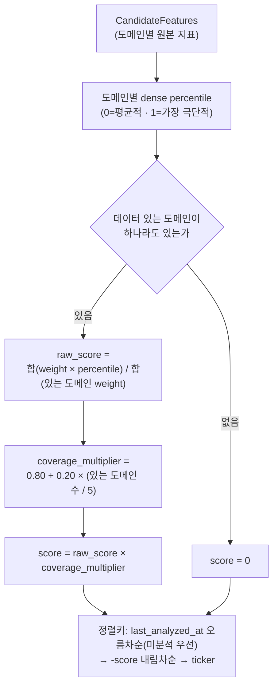
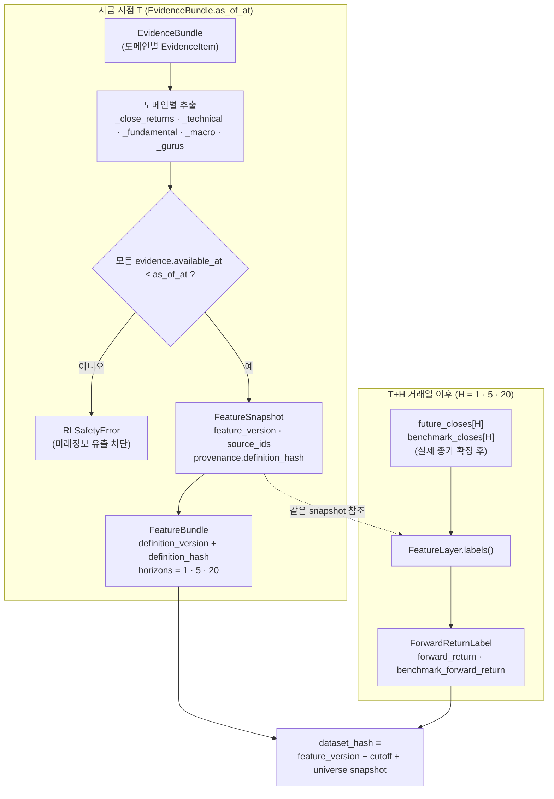

# 투자 판단, ML/RL, Backtest와 Portfolio Risk

이 문서는 Supabase 데이터가 투자 신호와 포트폴리오 제안으로 바뀌는 과정을 설명한다.
`src/investment_agent/trading`은 투자안을 만드는 계층이며 broker 주문을 직접 보내지 않는다.

## 전체 판단 흐름

```text
tracked universe
→ data quality·coverage·liquidity filter
→ 후보 순위와 실행 limit
→ PIT EvidenceBundle / FeatureBundle
├→ TradingAgents 정성 분석
├→ ML expected-return baseline
└→ RL challenger research
→ 공통 ExpectedReturnSignal
→ CVXPY Portfolio Optimizer
→ PortfolioProposal
→ DeterministicRiskGate
→ RiskDecision
→ Backtest 또는 Shadow/Paper/Live 실행 경계
```

LLM은 분석·토론·설명과 종목별 신호를 만든다. 최종 비중은 optimizer가 계산하고 hard risk는
RiskGate가 강제한다. AI/ML/RL은 risk policy, broker credential과 durable safety control을
수정할 권한이 없다.

## 현재 실행 경로

현재 로컬 하네스가 호출하는 분석 진입점은
`src/investment_agent/trading/decision/portfolio_shadow.py`다.

| 구분 | 파일 | 현재 역할 |
|---|---|---|
| 현재 주 경로 | `trading/decision/portfolio_shadow.py` | TradingAgents→signal→optimizer→RiskGate Shadow 실행 |
| 현재 adapter | `agents/tradingagents_adapter.py` | Supabase EvidenceBundle을 TradingAgents에 전달 |
| LLM provider | `llm.py` | OpenAI-compatible endpoint와 structured output |
| 보조 Shadow 경로 | `trading/decision/shadow_daily.py`, `role_runner.py` | 로컬 multi-role Shadow와 계약 검증 |

파일이 존재한다는 이유만으로 예약 실행 경로라고 판단하지 않는다. 실제 호출 여부는
`src/investment_agent/operations/harness_adapters.py`와 `.github/workflows`에서 확인한다.

## 후보 선정과 Evidence

S&P 500 전체를 매일 LLM에 보내지 않는다.

| 단계 | 주요 코드 | 결과 |
|---|---|---|
| Universe 확인 | `universe.py::select_tracked_tickers` | 허용 member와 제외 사유 |
| 후보 정렬 | `candidate_ranker.py::rank_candidate_features` | coverage와 변화 기반 분석 순서 |
| 근거 생성 | `context.py::ContextBuilder.build` | PIT `EvidenceBundle`, missing/warnings |
| Agent 실행 | `TradingAgentsDecisionEngine.run` | role output와 외부 evidence manifest |
| 계약 검증 | `SecurityProposal.from_dict` | ticker/as-of/range/evidence ID 검증 |
| 신호 보관 | `SignalBook` | batch, TTL, 성공·실패 ticker |

### EvidenceBundle 도메인 구성

`ContextBuilder.build`는 아래 8개 도메인을 순서대로 채우고, 그 시점에 데이터가 없는 도메인은
evidence 대신 `missing_data`에 사유를 남긴다. `news_archive`는 Supabase에 시점 저장소가 없어
매번 missing으로 남는다.

| 도메인 | 소스 | `available_at` 기준 | 비어있을 때 |
|---|---|---|---|
| market | `market.prices_daily` | 최신 행 `ingested_at` | "market: 시점 기준 사용 가능한 가격 없음" |
| technical | ResearchStore `feature_signals_daily` + `market.prices_daily` | feature 행 `ingested_at` | "technical: 시점 기준 기술지표 없음" |
| fundamentals | SEC EDGAR/FSDS, `fundamentals.financial_versions` + `fundamentals.filings` | live: 최신 `ingested_at` / historical_replay: `filed_at`·`available_at` cutoff | source_kind별 문구로 "fundamentals: ..." |
| estimates | yfinance observed snapshots | 최신 `collected_at` | "estimates: 시점 기준 실제 관측 컨센서스 없음" |
| macro | `macro.series`+`observation_versions` | 관측치 `collected_at` 최댓값 | historical_replay는 항상 제외; live에서 실행·관측이 없으면 missing |
| segments | SEC XBRL, `fundamentals.segment_metrics` | filings `updated_at` | provider unavailable 여부로 사유 분기 |
| gurus | SEC 13F, `institutional.filings` + `institutional.positions` | filings `accepted_at` | "gurus: 추적 매니저의 매핑된 보유 근거 없음" |
| economic_calendar | `macro.release_events` + release versions | 최신 `collected_at` | "economic_calendar: 시점 기준 관련 발표 일정·관측값 없음" |
| news_archive | Supabase 시점 저장소 없음 | — | 항상 missing; live 외부 provider 사용 여부는 Agent 정책에 따름 |

### 후보 정렬 점수 계산

후보 점수는 매수 점수가 아니라 분석 순서다. 가장 오래 분석되지 않은 종목을 먼저 보고,
같은 조건이면 구조화 데이터 변화가 큰 종목을 우선한다. `rank_candidate_features`는 도메인별
percentile을 가중 평균해 이 우선순위를 계산한다.

| 도메인 | 가중치 | percentile로 바꾸는 신호 |
|---|---:|---|
| market | 0.30 | 20일 수익률 절대값, 20일 거래량비 log 절대값 |
| fundamentals | 0.25 | 매출 YoY 성장률 절대값, 영업이익률 절대값 |
| technical | 0.20 | RSI14의 50 이탈폭, MACD-signal 스프레드 절대값 |
| gurus | 0.15 | guru 보유자 수, guru 총 보유금액(log1p) |
| segments | 0.10 | 세그먼트 집중도, 세그먼트 품질 |

각 신호는 그날 tracked universe 안에서 dense percentile(0~1)로 바뀐다 — 값 자체의 크기가 아니라
다른 종목 대비 변화폭이 큰 종목일수록 1에 가깝다.



## TradingAgents와 LLM의 역할

TradingAgents는 Market/Fundamental/News/Social 분석, Bull/Bear 토론과 risk reasoning을 수행한다.
자연어 토론은 설명 자료이지 주문 계약이 아니다. 최종 parser는 다음과 같은 구조화 필드만
허용한다.

- ticker와 timezone-aware as-of
- signal, probability, confidence
- expected excess return과 risk score
- reasoning과 실제 bundle에 존재하는 evidence ID
- missing data와 model/engine version

다음은 계약 오류다.

- 다른 ticker/as-of 또는 허용 목록 밖 signal
- 0~1 범위 밖 probability/confidence
- 존재하지 않는 evidence ID
- NaN/Infinity expected return
- 빈 reasoning 또는 임의 schema field

호환용 `target_weight`가 output에 있어도 optimizer 입력에서는 무시한다.

### 외부 텍스트와 비용

뉴스·소셜은 live 계열에서만 untrusted evidence로 사용할 수 있다. URL/content 중복 제거,
instruction-like text 제거, 길이 제한과 provider quota/cache를 적용한다. broker key와 execution
control은 prompt/context에 포함하지 않는다.

```text
tracked universe
→ 정량 후보 축소
→ AI_INVESTOR_DAILY_LIMIT
→ request/content cache
→ provider daily cap
→ 소수 ticker만 deep analysis
```

`OpenAICompatibleClient`는 원격 endpoint와 Ollama/local model 교체를 허용하지만 provider,
model, prompt와 engine version이 달라지면 별도 artifact로 기록하고 Shadow 검증을 다시 한다.

## Memory와 평가

`memory.py`는 horizon이 끝나고 `evaluator.py`가 실제 결과를 기록한 case만 같은 ticker의 참고
기억으로 사용한다. 아직 미래 가격이 확정되지 않았거나 benchmark가 없으면 0점으로 만들지 않고
미평가로 남긴다. 기억은 현재 evidence를 대체하지 않고 주문 권한도 없다.

## Feature Layer

`FeatureLayer`는 `EvidenceBundle.as_of_at` 이하 evidence만 사용해 version/hash가 있는
`FeatureBundle`을 만든다. 이는 현재 TradingAgents 주 실행 경로의 필수 호출이 아니라 ML/RL/Qlib
학습과 serving이 공유할 연구 입력 경계다.

feature와 1D·5D·20D label은 시각적으로 분리한다 — feature는 `as_of_at` 시점에 바로 만들어지지만,
label은 그 뒤 실제 종가가 확정돼야만 만들어진다. dataset identity에는 feature version, cutoff,
universe snapshot과 dataset hash가 포함된다.



같은 `snapshot`(feature_version·as_of_at·ticker)을 참조해야만 feature와 label이 나중에 하나의
학습 row로 합쳐진다 — label을 feature와 같은 시점에 만들지 않는 이유가 이 시차다.

## ML baseline을 먼저 비교한다

`src/investment_agent/research/models/baselines.py`는 같은 train/validation/OOS 배열로 다음 모델을 비교한다.

| 모델 | 목적 | 의존성 |
|---|---|---|
| Naive | 복잡한 모델이 실제로 개선됐는지 기준 | NumPy |
| Ridge | 안정적 선형 expected return | NumPy |
| LightGBM | 비선형 tree boosting 비교 | 선택 설치 |
| XGBoost | 독립 boosting 구현 비교 | 선택 설치 |

기본 목표는 5D expected return이며 1D·20D도 사용할 수 있다. RMSE/MAE뿐 아니라 방향 정확도와
cross-sectional rank correlation을 기록하고 실제 비용 반영 portfolio OOS 결과를 함께 본다.

```powershell
uv sync --group ml
python -m unittest tests.investment_agent.research.rl.test_baseline
```

## Dataset split과 재현성

시계열 투자 데이터는 random shuffle하지 않는다.

```text
train
→ label horizon이 경계를 넘는 row purge
→ embargo
→ validation
→ out-of-sample
→ rolling/walk-forward 반복
```

같은 날짜의 종목 cross-section은 같은 split에 두며, 현재 S&P 구성 종목을 과거 전체에 고정하지
않는다. universe snapshot이 없는 구간은 승격 dataset으로 만들지 않는다.

모든 artifact에는 다음 identity를 남긴다.

- algorithm과 parameter
- feature version과 dataset hash
- train/validation/OOS 기간
- random seed와 code commit
- model file SHA-256
- 평가 metric과 benchmark

파일과 DB metadata/hash가 일치하지 않으면 inference와 promotion에 사용하지 않는다.

## RL은 ML 다음의 Challenger다

`src/investment_agent/research/rl`은 Stable-Baselines3 PPO를 대표 baseline으로 사용한다. action은 주문 수량이
아니라 target-weight policy다. environment는 transaction cost, turnover와 drawdown penalty를
반영한다.

```text
동일 OOS PPO 결과가 ML baseline보다 우수
→ challenger 후보
그 외
→ research_only
```

PPO라는 이름만으로 실전에 승격하지 않는다. 여러 walk-forward window와 Paper 무사고 조건을
별도로 통과해야 한다. algorithm class 경계를 통해 A2C/SAC/TD3/DDPG 등을 나중에 추가할 수 있다.

## Qlib의 제한된 사용 범위

`qlib_adapter.py`는 PIT `FeatureSnapshot`을 `(datetime, instrument)` frame으로 바꾸고
`DataHandlerLP`/`DatasetH`와 recorder에 연결한다.

Qlib는 다음만 담당한다.

- versioned research dataset 구성
- train/valid/test segment와 rolling workflow
- experiment parameter, metric와 artifact 기록

Supabase ETL이나 이 프로젝트의 source of truth를 Qlib vendor data로 교체하지 않는다.

```powershell
uv sync --group research
```

## 공통 ExpectedReturnSignal

ML/RL/TradingAgents output은 다음 계약으로 정규화한다.

| 필드 | 의미 |
|---|---|
| `symbol` | canonical symbol |
| `expected_return` | horizon 예상 수익률 |
| `confidence` | 0~1 신뢰도 |
| `risk_score` | 0~1 상대 위험 |
| `horizon_days` | 1, 5, 20 trading days |
| `source`/`version` | model/engine artifact identity |
| `timestamp` | timezone-aware 생성시각 |
| `evidence_ids` | 사용한 stable evidence IDs |

## Portfolio Optimizer

`RiskAwareOptimizer`는 CVXPY로 다음 목적을 결정론적으로 최적화한다.

```text
expected return
- risk aversion × variance
- turnover penalty
- transaction-cost penalty
```

총합 1, long-only, 종목·섹터 최대, 현금 최소와 turnover 최대를 명시적 constraint로 사용한다.
confidence는 약한 signal의 expected return을 낮추고, covariance가 없으면 risk score 기반의
보수적 diagonal 근사를 metadata에 표시한다.

## DeterministicRiskGate

optimizer 결과도 반드시 RiskGate를 통과한다.

- 종목·섹터 비중, 최대 position 수와 최소 position
- 최소 cash와 최대 turnover
- volatility, beta, concentration/HHI와 correlated exposure
- drawdown과 daily loss 상태
- order notional, liquidity와 spread
- stale quote/signal/proposal
- trading halt와 market session

문서의 기본값은 설명용이며 실제 SSOT는 `OptimizerPolicy`와 `PortfolioRiskPolicy` 코드다.
LLM prompt나 문서 수정으로 완화할 수 없다.

| 제한 | V1 기본 설명값 |
|---|---:|
| 종목 최대 | 10% |
| 섹터 최대 | 30% |
| turnover 최대 | 25% |
| 현금 최소 | 5% |
| 최대 종목 수 | 25 |
| 최소 position | 0.5% |
| proposal age | 36시간 |
| 연환산 volatility | 30% |
| absolute beta | 1.5 |

Paper/Live에서 필수 market-risk 입력이 없으면 fail-closed한다.

## Partial universe와 Full portfolio

하루에 5종목만 분석했다면 그 결과는 `partial_universe`이지 전체 계좌 목표가 아니다.

```text
partial SignalBatch
+ fresh AccountSnapshot
+ 유효한 과거 SignalBook records
→ PortfolioConstructor
→ full_portfolio
→ RiskGate
```

미분석 보유는 유지하고 명시적 exit/reduce만 줄인다. 현재 universe에서 빠진 기존 보유는 추가
매수할 수 없지만 위험을 줄이는 매도는 허용할 수 있다.

## Native Backtest

`WeightBacktestEngine`은 실행 중 DB나 인터넷을 조회하지 않고 완전한 `BacktestRequest`만 소비한다.

- t 종가 뒤 생성한 `WeightPoint`
- 다음 실제 session인 t+1 시가 체결
- PIT universe snapshot과 OHLCV
- commission, minimum fee, slippage와 sell fee
- split/dividend corporate action
- order/fill/cash/position/NAV append-only ledger

월요일 종가로 판단했다면 월요일 종가에 체결하지 않는다. 화요일이 휴장이면 다음 실제 session
시가를 사용한다. effective session이 틀리면 engine이 거절한다.

metric은 Total Return, CAGR, Sharpe, Sortino, Max Drawdown, volatility, turnover, win rate,
exposure, transaction cost와 trade count다.

```powershell
python -m investment_agent.research.backtest.cli --input <INPUT.json> --output <OUTPUT.json>
```

## LumiBot 외부 검증

`LumiBotValidationEngine`은 Native와 같은 bars, weights, corporate actions, calendar와 cost model을
사용한다. 공통 input manifest hash가 다르면 비교하지 않는다. metric별 tolerance를 넘으면
`is_compatible=false`로 표시하며 차이를 평균 내거나 숨기지 않는다.

adapter와 comparator 단위 테스트 통과는 장기간 실제 LumiBot run이 완료됐다는 뜻이 아니다.
실제 준비 상태는 [현재 구현 상태](V1_STATUS.md)에서 구분한다.

## 평가와 승격 근거

| 평가 | 용도 |
|---|---|
| In-sample | 학습 적합 여부; 단독 승격 금지 |
| Validation | parameter 선택; OOS로 간주 금지 |
| Out-of-sample | 보지 않은 기간 성능; 필수 |
| Walk-forward | 여러 시장 구간 반복; 필수 |
| Regime | 상승·하락·고변동 취약성 |
| Benchmark | SPY 등 명시 benchmark 대비 |
| Paper | 실제 latency·주문·정산; Live 승격 필수 |

평균 하나가 나쁜 window를 가리지 않도록 최저 excess return, 최악 drawdown과 최대 turnover를
보수적으로 집계한다.

## 실행 예

```powershell
# Supabase context만 확인; LLM/provider/broker 호출 없음
python -m investment_agent.trading.decision.portfolio_shadow --ticker AAPL --dry-run

# 현재 주 TradingAgents Shadow 경로
python -m investment_agent.trading.decision.portfolio_shadow --ticker AAPL --limit 1
```

live candidate entry에 오래된 `--as-of`를 억지로 넣어 historical replay처럼 사용하지 않는다.
역사 분석은 versioned feature와 backtest workflow를 사용한다.
