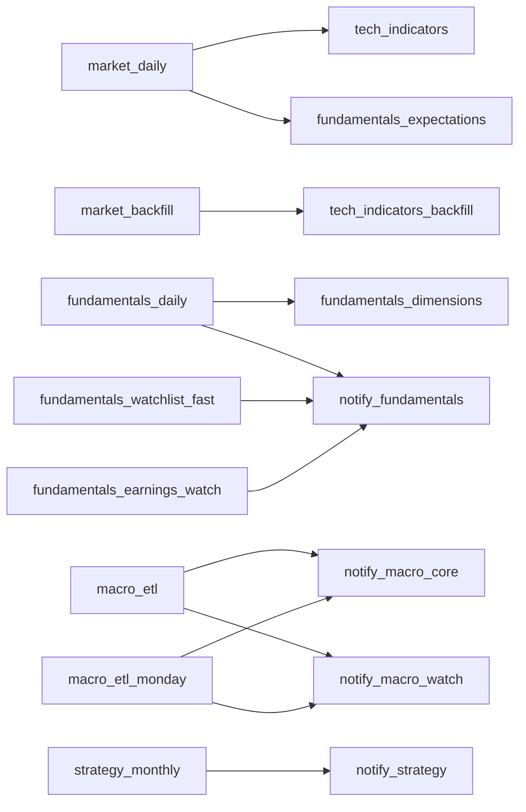

# 운영 — 설치, 자동 실행, 상태 확인과 장애 대응

이 문서는 개발 환경 설치, GitHub Actions, 로컬 자동 실행기(하네스), 모니터링과 장애 해결을
한곳에 모은 운영 안내서다. 코드·환경변수의 최종 SSOT는 루트 `CLAUDE.md`와 `.env.example`이다.

## Discord-first 운영 기록

운영 오류는 Supabase에 저장하지 않는다. 확인 순서는 Discord `#액션-실패`·`#로컬-실패`의 구조화 사건
카드 → 카드에 들어 있는 GitHub Actions 실행 링크의 원문 로그 → 로컬 하네스 JSON 로그다.

- 실패·취소된 GitHub Actions는 공통 `ops_failure_report`가 한 장의 Discord incident를 보낸다.
- 성공 실행의 partial warning처럼 워크플로를 실패시키지 않는 사건도 같은 카드 계약을 사용한다.
- 일일 heartbeat는 Actions API로 스케줄·상류/하류 체인·대기열을 점검해 시스템 로그에 남긴다.
- Discord에는 비밀값·webhook·원문 traceback을 보내지 않는다. 원문은 GitHub Actions에 둔다.

운영 실행 이력·재시도 상태·오류 원문은 GitHub Actions와 로컬 하네스 로그가 소유한다.
Supabase에는 투자 판단·주문 안전·도메인 품질에 필요한 audit 자료만 저장한다.

## 처음 설치

기준 Python은 3.11이다.

```powershell
python -m pip install uv==0.12.10
uv sync --group dev
Copy-Item .env.example .env
```

ML/RL/Qlib/LumiBot이 실제로 필요할 때만 선택 의존성을 추가한다.

```powershell
uv sync --group ml
uv sync --group rl
uv sync --group research
```

처음부터 모든 연구 library와 broker key를 넣지 않는다.

```text
core Python/tests
→ Supabase 상태 확인
→ Shadow dry-run
→ LLM Shadow
→ ML/backtest research
→ Paper read-only
→ Paper order/reconciliation
→ 사용자가 승인한 Live Manual canary
```

## 최소 환경변수와 안전 기본값

아래는 **띄우는 데 필요한 최소값과 안전 기본값**이다. 변수 전체 목록과 용도는
[ENV.md](ENV.md)에 있다.

```dotenv
SUPABASE_URL=
SUPABASE_SERVICE_KEY=
AI_INVESTOR_MODE=shadow
TRADING_KILL_SWITCH=on
TOSS_LIVE_ENABLED=false
LIVE_ENABLED=false
```

LLM Shadow에서만 provider 설정을 추가한다.

```dotenv
AI_INVESTOR_PROVIDER=openai_compatible
AI_INVESTOR_BASE_URL=
AI_INVESTOR_MODEL=
AI_INVESTOR_API_KEY=
AI_INVESTOR_EXTERNAL_NEWS_SOCIAL=false
```

첫 Shadow는 외부 뉴스·소셜을 끄고 구조화 evidence와 model output부터 검증한다. broker credential은
AI/LLM process나 GitHub-hosted runner에 넣지 않는다.

## Supabase 접근과 스키마

`.env`의 service key는 private ETL/worker용이다. public client 편의를 위해 private schema를
`anon`/`authenticated`에 열지 않는다. 스키마의 단일 기준은 각 `src/*/sql`의 선언이고,
누적 마이그레이션 이력은 두지 않는다.

다른 Supabase 프로젝트에 세울 때는 `db_bootstrap.py`로 선언을 그대로 적용한다. schema를
변경했다면 다음을 검증한다.

- 선언과 라이브 DB의 최종 모양
- exposed schema table의 RLS와 실제 grant
- view의 `security_invoker` 또는 비공개 권한
- foreign-key index와 duplicate/unused index
- Supabase security/performance advisor
- read-only query와 전체 offline tests

schema 변경 없이 문서만 수정할 때는 원격 DB를 변경하지 않는다.

### 데이터베이스 전체 재구축

> [!CAUTION]
> 아래의 `--drop-first`는 application schema와 그 데이터를 삭제하는 파괴적 작업입니다.
> 일반 설치·검증에는 사용하지 말고, 백업·maintenance hold·lockdown·별도 승인과 빈 v1
> 데이터베이스를 확인한 뒤에만 실행합니다. 이 문서의 오프라인 검증 명령은 원격 DB를
> 변경하지 않습니다.

스키마의 단일 기준은 `db/postgres/v1/*.sql`이다. `scripts/db_bootstrap.py`는 그
선언들을 FK 의존 순서대로 한 트랜잭션에 적용하므로, 선언만으로 빈 데이터베이스를
재현할 수 있다는 것이 실행으로 증명된다. 손으로 관리하는 테이블 목록은 두지 않는다 —
그런 목록은 표가 하나 늘 때마다 조용히 어긋난다.

Supabase의 `auth`, `storage`, `realtime`, `vault`와 migration metadata는 이 도구가
건드리지 않는다.

설치와 재현은 현재 선언 SQL을 빈 DB에 적용하는 방식으로 수행한다. 공개 원천에서 다시 만들
수 있는 표는 선언과 수집 명령으로 재생성하며, v1 실행 경로에는 기존 DB 전환 스크립트를 두지 않는다.

1. `db/postgres/v1/*.sql`을 고친다.
2. `python scripts/db_bootstrap.py apply --confirm <ref> --drop-first`로 다시 세운다.
3. 재적재한다(아래 순서).

`--drop-first` 없이 `apply`만 하면 `CREATE TABLE IF NOT EXISTS`라 기존 표의 모양을
재작성하지 않는다. v1 스키마를 다시 세울 때는 빈 DB 기준으로 적용하고, 선언이 빈
환경에서 서는지는 `scripts/v1_schema_probe.py`로 확인한다.

```powershell
python scripts/db_bootstrap.py plan                                   # 적용 순서만 확인
python scripts/db_bootstrap.py apply --confirm <project-ref>          # 선언 재적용(멱등)
python scripts/db_bootstrap.py apply --confirm <project-ref> --drop-first   # 데이터 전부 삭제
```

실행 전 예약 workflow와 로컬 하네스를 정지하고 maintenance hold, 로컬 execution
lockdown, 환경변수 kill switch, `execution_control`의 DB lockdown을 모두 켠다.

`--drop-first`는 여섯 application schema(`universe`, `market`, `fundamentals`, `macro`,
`institutional`, `reporting`)를 CASCADE로 지우고 다시 만든다. 드롭과 재생성이
한 트랜잭션이라 중간에 실패하면 통째로 rollback된다 — 스키마가 사라진 채로 남으면
PostgREST가 노출 목록에서 없는 스키마를 만나 Data API 전체가 503이 되기 때문이다.
도구는 커밋 뒤 노출 목록과 실재 스키마가 맞는지 확인해 알려 준다.

선언은 수집된 행에 의존하지 않으므로 수집 뒤에 따로 적용할 시드가 없다. 빈 DB는
위 `apply` 한 번으로 완성된다.

관심종목의 원본은 v1 `universe.entities`의 관심 컬럼(`watchlist_sources`)이다. 관심은
종목이 아니라 회사에 대한 것이라 CIK로 저장하고, 카드에 찍히는 ticker는 그 회사의
대표 종목(ticker 오름차순 첫 tracked 종목)을 읽기 경계에서 붙인 것이다. 등록·해제는
`python -m investment_agent.data.universe.watchlists.watchlist`가 소유한다.

`watch_from`은 등록한 날로 잡힌다 — 과거 공시가 새 이벤트처럼 한꺼번에 재발송되지
않게 하는 것이 이 값의 목적이다. 다른 날짜가 필요하면 같은 CLI의 `watch-from`으로 옮긴다.

카드 제목에 쓰는 한글명(`entities.company_name_ko`)은 토스증권 Open API로 채운다.
**어디에서도 자동으로 돌지 않는다** — 토스는 호출 IP 허용목록 기반이라 Actions에서
실행할 수 없고, 로컬 하네스에도 걸려 있지 않다. 그래서 S&P 500에 새 종목이 들어오면
그 종목만 한글명이 빈 채로 남는다. 신규 편입이 있었으면 고정 IP 환경에서 직접 돌린다.

```powershell
python -m investment_agent.data.universe.commands.universe_names
```

이미 채워진 이름은 다시 조회하지 않는다(수동 교정값을 덮어쓰지 않기 위해서다).
이름을 받지 못한 종목만 `--retry-after-days`(기본 90) 뒤에 다시 시도한다.

재구축이 끝나면 두 가지를 따로 확인한다. 선언과 라이브 DB의 **모양**이 같은지,
그리고 들어간 **값**이 말이 되는지다. 조회가 전부 성공해도 값이 틀릴 수 있으므로
한쪽만으로는 부족하다.

```powershell
# 구문: DB 없이 오프라인으로 pglast 파싱만 확인 (CI에서도 매번 돈다)
python scripts/verify_postgres_sql_syntax.py

# 선언: 빈 임시 스키마에 v1 선언을 적용해 생성 가능성 확인
python scripts/v1_schema_probe.py --only universe market

# 값: 중복·NULL·고아 참조·범위 위반 등 데이터 불변식
python scripts/verify_data.py

# 계약: 코드가 실제로 부르는 조회가 아직 성립하는지
python scripts/verify_integration.py
```

## 로컬 저장 파일 이관

Intelligence·Research DuckDB와 Runtime SQLite의 canonical 위치는 각각
`data/local/intelligence/intelligence.duckdb`, `data/local/research/research.duckdb`,
`data/local/runtime/runtime.sqlite3`다. 기존 기본 경로의 파일은 삭제하거나 덮어쓰지 않고
검증된 snapshot으로 복사한다.

먼저 읽기 전용 plan으로 원본·대상·sidecar 상태를 확인한다. 원본과 대상이 모두 있으면
도구는 자동 병합을 거부한다.

```powershell
python scripts/migrate_local_storage.py plan
```

Runtime 원장을 포함한 실제 복사 전에는 maintenance hold를 유지한다. `apply`는 SQLite
backup API 또는 DuckDB checkpoint를 사용하고, 스키마·행 수·hash를 확인한 뒤에만 대상
파일을 게시한다. legacy 원본은 그대로 남고 검증 manifest는
`data/local/artifacts/storage-migration/`에 기록된다.

```powershell
python scripts/migrate_local_storage.py apply --confirm-local-storage
```

이 명령은 Supabase나 다른 원격 DB에 연결하지 않는다.

## 로컬 실행 스크립트

루트에는 **`run.bat` 하나**만 둡니다(대화형 메뉴 = `launcher.py`). 나머지는 목적별로 나눕니다.

```text
run.bat                      대화형 제어판 (운영 제어센터 / 점검·개발 도구, 권장 진입점)
scripts/dashboard.bat        읽기 전용 Streamlit 대시보드
scripts/harness/on|off|status|switch|shadow.bat   하네스 제어
scripts/harness/maintenance.bat                   정비 보류 토글
scripts/service/             OS 서비스·예약작업 등록물
scripts/db_bootstrap.py      선언 SQL로 스키마를 세운다 (`--drop-first`는 데이터 전부 삭제)
scripts/verify_postgres_sql_syntax.py  DB 없이 pglast로 구문만 확인 (오프라인 테스트에 포함됨)
scripts/v1_schema_probe.py     빈 임시 스키마에 v1 선언이 서는지 확인
scripts/migrate_local_storage.py  legacy 로컬 DB를 보존하며 canonical 경로로 검증 복사
scripts/verify_data.py       적재된 **값**의 불변식 (중복·NULL·고아·범위)
scripts/verify_integration.py  코드가 실제로 부르는 **조회**가 성립하는지
scripts/db_capacity.py       용량 실측과 VACUUM FULL 회수 (설정된 저장 한도 대비)
scripts/actions_budget.py    cron × 실측 실행시간 = 월 사용량 (저장소 quota 대비)
```

PostgreSQL 선언은 `scripts/postgres_schema_layout.py`가 적용 순서를 단독으로 정한다.
`00_extensions.sql`은 공통 확장, `10`~`50`은 canonical 사실 스키마,
`90_reporting.sql`은 그 사실을 읽는 view다. 선언은 수집된 행을 FK로 참조하지
않으므로 빈 DB에 한 트랜잭션으로 전부 선다.

검증은 네 층이 서로 다른 질문에 답합니다 — 구문 유효성(`verify_postgres_sql_syntax`,
DB 없이 오프라인 테스트로 상시 실행)·선언 적용 가능성(`v1_schema_probe`, DB 필요)·값
(`verify_data`)·계약(`verify_integration`). 조회가 전부 성공하면서 값만 틀릴 수 있어
한 층으로는 부족합니다.

## 기본 검증

```powershell
python -m compileall -q src tests
python -m unittest discover -s tests -t .
python -m investment_agent.trading.decision.portfolio_shadow --ticker AAPL --dry-run
python -m investment_agent.operations.commands.harness_switch --status
```

네트워크 ETL은 SEC, FRED, yfinance, Supabase와 경우에 따라 Chromium이 필요하다. 네트워크가 없는
환경에서는 offline unit tests로 검증하고 provider 실패를 성공으로 바꾸지 않는다.

## 대시보드 실행

Windows에서는 다음 파일을 실행한다.

```text
scripts/dashboard.bat
```

진입점은 `src/investment_agent/dashboard/app.py`다. 대시보드는 읽기 전용이며 DB mutation, Discord 발송, 승인 변경과
주문 실행을 제공하지 않는다.

## 상태 확인

가장 먼저 Discord `#액션-실패`와 GitHub Actions를 본다. 사건 카드의 **실패 위치**와
**실행 링크**가 원인 분석의 시작점이다. 로컬 하네스 상태만 아래 명령으로 확인한다.

```powershell
python -m investment_agent.operations.commands.harness_switch --status
```

| Category | 답하는 질문 |
|---|---|
| DATA | critical pipeline이 fresh하고 품질 issue가 허용 가능한가? |
| AI | 마지막 decision run은 언제 어떤 stage로 끝났는가? |
| MODEL | artifact와 feature version은 무엇인가? |
| BACKTEST | 최근 재현 가능한 평가가 있는가? |
| PAPER | Paper run과 승격 증거가 쌓였는가? |
| EXECUTION | intent/order/fill이 정상 종료됐는가? |
| RISK | 마지막 RiskDecision과 위반은 무엇인가? |
| BROKER | 연결과 reconciliation이 정상인가? |

`unknown`은 아직 해당 domain audit 자료가 없다는 뜻일 수 있다. 데이터 freshness는 해당
도메인 테이블·뷰로 확인하고, 실행 실패 원인은 DB 상태가 아니라 Discord 사건 카드와 Actions
원문 로그로 확인한다.

## GitHub Actions

`.github/workflows`의 개별 workflow 파일(전부 언더스코어 이름이고, `notify_*`·`ci`·`ops_heartbeat` 등
데이터 ETL 외 workflow도 포함한다)이 GitHub 서버에서 데이터 ETL, 알림과 CI를 예약 실행한다.
실패하거나 취소된 source workflow는 공통 `ops_failure_report`를 호출한다. 이 리포터는 원래
workflow를 다시 실행하지 않고 실패 잡·단계·정제한 한 줄 원인만 `#운영-요약`에 보내며,
자세한 traceback과 재실행은 GitHub Actions가 보관한다.

**workflow 파일명과 `concurrency.group` 값은 다른 이름이다.** 같은 schema를 쓰는
daily/backfill/fast workflow가 같은 group 값을 공유해 서로 직렬화(동시 실행 불가, 대기)된다 —
아래 표의 왼쪽 열이 실제 `concurrency.group` 값이고, 오른쪽 열이 그 값을 선언해 서로 직렬화되는
workflow 파일들이다. econ-calendar만 예외로, `econ-calendar-etl`은 daily와 ics만 공유하고
backfill/watch/revision_audit은 각각 별도 group이라 daily와 직렬화되지 않는다.

| `concurrency.group` | 공유하는 workflow 파일 (트리거, KST) |
|---|---|
| `market-etl` | `market_daily`(화~토 08:30), `market_backfill`(수동) |
| `macro-etl` | `macro_etl`(화~토 09:25), `macro_etl_monday`(월 09:25), `macro_backfill`(수동) |
| `fundamentals-etl` | `fundamentals_daily`(화~토 12:30), `fundamentals_watchlist_fast`(화~토 06:30), `fundamentals_earnings_watch`(평일 22:00·익일 07:00), `fundamentals_integrity`(매일 18:00), `fundamentals_expectations`(market_daily 뒤, cron 없음), `fundamentals_dimensions`(fundamentals_daily 뒤 + 안전망 화~토 13:10), `fundamentals_backfill`/`fundamentals_dimensions_backfill`(수동) |
| `econ-calendar-etl` | `econ_calendar_daily`(매일 10:40), `econ_calendar_ics`(daily 뒤 + 안전망 매일 14:10) |
| `institutional-etl` | `institutional_13f`(화~토 13:40), `institutional_backfill`(수동) |
| `tech-indicators-etl` | `tech_indicators`(market_daily 뒤, cron 없음), `tech_indicators_backfill`(market_backfill 뒤, cron 없음) |
| `strategy-etl` | `strategy_monthly`(매월 1일 07:00), `strategy_backfill`(수동) |
| `universe-refresh` | `universe_monthly`(매월 1일 09:20), `universe_membership_check`(화·목·토 07:40) |

이 표에 없는 `notify_*` workflow는 각자 자기 하나만 쓰는 고유 group이라 다른 workflow와
직렬화되지 않는다 — 다만 group 값이 파일명과 글자까지 같지는 않을 수 있다(예: 파일
`notify_fundamentals.yml`의 group은 언더스코어가 아니라 `notify-fundamentals`).

이 group들 사이의 실행 순서는 cron이 아니라 `workflow_run` trigger로 이어진다 — 상류가
끝나야 하류가 뜬다(하류에는 상류가 조용히 안 도는 경우를 대비한 안전망 cron도 따로 있다,
위 표의 괄호 참고).



각 workflow는 명시적 timeout, 최소 permission, pinned dependency/cache, idempotent entrypoint와
공통 실패/취소 리포터를 가져야 한다. GitHub-hosted runner에는 broker credential을 넣지 않는다.

### 체인이 조용히 끊기는 자리

위 표가 *무엇이 언제 도는지*라면, 아래는 *왜 그렇게 이어 놨는지*다. 여기 적힌 것은 전부
에러 없이 조용히 안 도는 경우를 막으려고 그렇게 한 것이다.
- ETL 잡·`notify_*` 잡·`ci`와 공통 `ops_failure_report` 재사용 워크플로가
  `.github/workflows/`에 있습니다.
  예정 사용량은 `python scripts/actions_budget.py`로 계산합니다 — cron 빈도 × 실측
  실행시간이 저장소 quota를 넘지 않는지 cron을 늘리기 전에 먼저 봅니다.
  `notify_bootstrap`만 cron이 없습니다 — 초기 구축·재적재 직후 8종을 한 번에 내보내는
  수동 실행 전용입니다.
- **ECON은 macro와 분리된 economic-release event 파이프라인입니다.**
  `econ_calendar_daily`는 미래 일정·forecast snapshot·45일 실제 overlap만 증분 처리하고,
  `econ_calendar_watch`는 미국 지표 발표창(UTC 12~15시 평일)에서 15분마다 깨어나
  DB `scheduled_at` 기준 due release만 bounded polling합니다. 24시간 `*/5`는 한 달
  8,766회로 할당을 8배 넘깁니다 — 시드의 미국 지표 21개가 그 창 안에 들어옵니다.
  `econ_calendar_revision_audit`만 넓은 ALFRED vintage range를 확인합니다. ICS는 daily 뒤,
  Discord는 confirmed first actual 뒤에 각각 갱신합니다.
- **관심종목 실적 체인은 cron이 아니라 `workflow_run`으로 이어집니다.** SEC 일별 인덱스가
  야간에 확정되므로 `fundamentals_daily`는 03:30 UTC에 묶여 있고, 장 마감 직후 제출을 빨리
  잡으려고 `fundamentals_watchlist_fast`(21:30 UTC)가 관심종목 CIK만 submissions JSON으로
  훑습니다. `notify_fundamentals`는 fast path 뒤에 붙고, 안전망 cron을
  하루 한 번 남겨 둡니다. ETL이 무관한 CIK 하나로 exit 1 하는 일이 잦아 `conclusion`은
  `!= 'cancelled'`로만 거릅니다 — `== 'success'`로 잠그면 부분 적재된 관심종목까지 묻힙니다.
- **차원 수집은 cron이 아니라 `workflow_run`으로 기업 재무 뒤에 붙습니다.** 기업 재무가
  완료된 뒤에만 차원 데이터를 처리해 `filing_processing` 상태와 알림 read model의 순서를
  보장합니다. 안전망 cron은 별도로 유지합니다.
- **알림 워크플로는 "무엇을 보낼지"에 따라 설치할 의존성을 나눕니다.** 속보(embed)는
  `requests`만, 카드(PNG)는 Playwright·CJK 폰트까지 필요합니다. preflight가
  `should_notify`(카드)와 `should_flash`(속보)를 따로 내보내고 각 단계가 자기
  게이트를 씁니다. 카드와 속보는 각자 필요한 의존성과 실행 조건을 판정합니다.
- **매크로 알림 2종도 같은 규칙입니다.** `notify_macro_core`/`_watch`는
  상류가 둘(`macro_etl` 화~토, `macro_etl_monday` 월)이므로 **둘 다 양쪽을 들어야**
  합니다 — 한쪽만 들으면 그 요일 카드가 조용히 빕니다. 게이트는 `!= 'cancelled'`이고
  (ECOS 키 하나로 15종이 실패해도 미국 지표는 멀쩡합니다) 각자 안전망 cron을 갖습니다.
  워치도 안전망은 하루 한 번(`50 0 * * 1-6`)입니다 — `macro.market_observations`를 채우는
  것은 macro ETL뿐이고 같은 관측치는 outbox 중복방지에 걸리므로, 장중에 더 자주 돌려도
  새 경보를 만들 수 없습니다. 장중 감시가 필요하면 알림이 아니라 ETL을 더 돌립니다.
  중복은 `notification_outbox`가 막습니다 — macro·macro releases·gurus가 `producer/kind`
  컬럼으로 구분해 같은 원장을 공유합니다. 워치는 `(series_id, obs_date)` 기반 키로 load
  단계에서, 코어는 한 장짜리 묶음이라 `core.run()`이 발송 직전에 직접 확인합니다.
  경제지표 발표 중복은 같은 표에 `notification_key=f"first_actual:{event_key}"`로
  성공 발송 뒤에만 막습니다.
- **실적 수집은 하이브리드입니다.** 노트북(로컬 하네스)이 켜져 있으면
  `earnings_watch` job이 발표 예정 시각의 신뢰도에 맞춰 1분 주기로 관심종목 8-K와
  10-Q/K를 훑어 뜨는 즉시 잡습니다. 8-K는 속보를 보내고, 10-Q/K는 회사 전체·세그먼트를
  적재한 뒤 정밀 카드를 보냅니다. 꺼져 있을 때를 대비해 `fundamentals_earnings_watch`가 장전 마감 후
  (13:00 UTC = 22:00 KST)와 장후 마감 후(22:00 UTC = 07:00 KST) 두 번 안전망으로
  돕니다. 둘 다 같은 진입점(`watch_earnings`)을 쓰므로 수집 경로가 갈리지 않습니다.
- **중복 발송은 발송 *전* 선점으로 막습니다.** notification producer가
  `notification_outbox`에 `(producer, notification_key)`를 먼저 기록하고, 실제로
  선점한 쪽만 보냅니다. 발송 뒤에 기록하면 두 러너가 모두 "미발송"을 읽고 둘 다
  보낸 뒤 기록하게 되어 UNIQUE 제약이 이미 나간 메시지를 되돌리지 못합니다.
  발송 실패는 outbox 상태와 `notification_deliveries`에 남아 다음 재시도 판단의 근거가 됩니다.
- fast path는 `investment_agent.data.fundamentals.commands.check_earnings_season`으로 시즌을 먼저 판정합니다.
  근거는 `fundamentals.earnings_schedule_versions`(yfinance 발표 예정일)이고,
  `refresh_expectations`가 채웁니다. 판단 근거가 없으면(스냅샷 없음·오래됨·비어 있음)
  **항상 fail-open**입니다 — 예정일은 자주 바뀌므로 게이트가 조용히 닫히는 쪽이 더 나쁩니다.

- 패턴: `checkout` → `setup-python(3.11, pip cache)` → 필수 secret 검증 →
  `uv sync --locked --no-dev --group <domain>` → 실행 → 실패/취소 시 공통
  `ops_failure_report`가 실패 잡·단계·정제된 원인·실행 링크를 `#운영-요약`에 보낸다.
- 알림 워크플로는 추가로 Playwright Chromium + Noto CJK/emoji 폰트를 설치합니다.
- 대부분 `workflow_dispatch`로 수동 실행 가능하며 `lookback_days` 등 입력을 받습니다.

## 로컬 자동 실행기, 즉 하네스

`src/investment_agent/operations/harness`는 투자 알고리즘이 아니다. 노트북에서 다른 기능을 정해진 시간과 순서로 호출하고
중단·재시작 상태를 관리하는 운영 도구다.

```text
GitHub Actions = GitHub 서버의 자동 시간표
로컬 하네스    = 노트북의 자동 시간표와 안전한 재시작 관리자
```

하네스는 다음을 관리한다.

- process lock으로 이중 실행 차단
- job별 idempotency, timeout과 retry budget
- interrupted stage와 checkpoint
- New York session/DST schedule
- process/job heartbeat와 dead-man alert
- 전체/job kill switch와 maintenance hold

실제 AI·execution 명령 연결은 `src/investment_agent/operations/harness_adapters.py`, generic scheduler/state는
`src/investment_agent/operations/harness`에 있다. 사용자용 Windows 명령은 `scripts/harness`에 있다.

```powershell
python -m investment_agent.operations.commands.harness_switch --status
python -m investment_agent.operations.commands.harness_switch --on
python -m investment_agent.operations.commands.harness_switch --off
```

batch file이나 Task Scheduler가 내부 service entry를 직접 호출하면 공식 이중 실행 guard를 우회할
수 있으므로 `harness_switch`를 진입점으로 사용한다.

## Maintenance hold

대규모 code/schema 변경 중에는 새 자동 실행을 막는다. hold를 해제해도 trading kill switch는
자동 해제되지 않는다.

```powershell
python -m investment_agent.operations.commands.harness_switch --maintenance on --maintenance-reason "reason"
python -m investment_agent.operations.commands.harness_switch --maintenance off
```

작업 전 하네스가 정지 상태였다면 작업 후 임의로 재기동하지 않는다.

## 알림 Severity

| Severity | 예시 |
|---|---|
| INFO | 정상 완료, expected skip, Shadow/Paper summary |
| WARNING | partial ingestion, SLA 임박, rejected proposal, provider fallback |
| CRITICAL | stale critical data, retry 후 pipeline 실패, RiskGate failure, reconciliation mismatch, unknown order outcome, daily loss/drawdown breach, broker auth failure, kill switch activation |

Discord는 상태 변화와 조치 가능한 incident 중심으로 발송한다. 같은 실행의 중복 원문은
GitHub Actions에 두고, Discord에는 한 번의 구조화 사건 카드만 남긴다. 알림 도메인의
중복 발송 방지 key는 사용자에게 같은 카드를 두 번 보내지 않기 위한 업무 데이터라 계속 유지한다.

## 장애 대응 공통 순서

```text
CRITICAL alert
→ 신규 위험 kill switch/lockdown 확인
→ broker open orders와 fills 먼저 확인
→ internal intent/attempt/event 원장 대조
→ data freshness와 proposal/approval TTL 확인
→ 안전한 reconciliation 또는 수동 cancel/close
→ 원인과 해결 evidence 기록
→ 테스트 뒤에만 lockdown 해제
```

`outcome_unknown` 상황에서 ETL처럼 worker를 단순 재실행하지 않는다. broker 조회와 reconciliation이
먼저다.

## 자주 발생하는 문제

### Historical macro/fundamentals가 비어 있음

정상적인 fail-closed일 수 있다. MACRO는 시장 상태의 point-in-time 이력을 저장하지 않으므로
historical replay에서 의도적으로 제외한다. 최신 데이터 상태는 각 도메인 테이블·뷰로 확인하고,
수집 실패 원인은 Discord 사건 카드와 GitHub Actions 원문 로그에서 확인한다.

### Segment가 unavailable

검증된 source/coverage가 부족하면 의도적으로 unavailable이다. 빈 표가 evidence로 노출되는 것보다
안전하다. 품질 gate를 우회하지 않는다.

### DuckDB import 또는 cache 오류

```powershell
python -m pip install duckdb==1.5.5
python -m investment_agent.trading.evidence.cleanup
```

`data/local/news_social.duckdb`는 재생성 가능한 cache다. 사용하는 프로세스를 종료하고 손상 파일을
격리한 뒤 새로 만들 수 있지만 historical backtest에는 사용하지 않는다.

### CVXPY 또는 NumPy 충돌

`uv sync --group portfolio`를 쓴다. 그 group이 `cvxpy<1.9`로 상한을 두는 이유는
1.9+가 NumPy 2를 요구해 `secfsdstools`(<2)와 충돌하기 때문이다. 임의 최신
CVXPY/NumPy를 따로 설치해 그 경계를 넘지 않는다.

### Shadow dry-run은 성공하지만 실제 분석이 실패

dry-run은 LLM/TradingAgents를 호출하지 않는다. provider base URL/model/key, agent dependency,
structured JSON 지원, external quota와 case failure reason을 확인한다. 일부 ticker 실패는 run의
`partial` 상태로 남는다.

### 예상과 다른 후보가 선택됨

후보 점수는 매수 점수가 아니다. coverage가 오래된 cohort가 변화 점수보다 우선하며 failed case는
성공 분석으로 세지 않아 다시 앞에 올 수 있다.

### 오래된 `--as-of`가 거절됨

live candidate entry를 historical replay 우회 수단으로 쓰지 않는다. 오래된 시점은 versioned
feature/backtest workflow를 사용한다.

### Optimizer가 infeasible

weights 합계/CASH, duplicate symbol, covariance shape·정렬·finite·PSD, min cash와 max turnover의
동시 충족 여부를 확인한다. constraint를 몰래 풀어 fallback 비중을 만들지 않는다.

### RiskGate가 Shadow는 통과하고 Paper/Live는 거절

Paper/Live에는 volatility, beta, correlation 같은 market-risk 입력이 필수다. 누락을 0으로 채우지
말고 source와 freshness를 연결한다.

### Discord 승인이 거절됨

TTL, approver allowlist, guild/channel/message, intent/manifest hash, 이미 소비된 승인과 listener/
publisher의 HMAC secret 일치를 확인한다. manifest가 바뀌면 새 승인을 요청한다.

### Toss 주문이 `outcome_unknown`

같은 client order ID를 재전송하지 않는다. broker status, open orders와 fills를 조회하고
reconciliation으로 해결한다.

### Reconciliation mismatch

broker orders/fills/positions/cash를 먼저 확인한다. account/client ID/hash가 정확히 일치하는 안전한
누락만 repair하고 충돌·external order는 lockdown과 CRITICAL alert로 남긴다.

### Live가 실행되지 않음

기본 동작이다. 환경변수 외에 durable control, lockdown, kill switch, model promotion, account
binding, fresh approval/permit와 risk/session/data 검사가 필요하다. unknown 상태에서 flag를 켜지
않는다.

### 하네스가 STOPPED인데 lock file이 있음

실제 process가 없는지 확인한 뒤 공식 stop entry를 사용한다.

```powershell
python -m investment_agent.operations.commands.harness_switch --off
python -m investment_agent.operations.commands.harness_switch --status
```

lock file만 수동 삭제하면 checkpoint와 복구 정보가 어긋날 수 있다.

## Secret 관리

- `.env`, token cache와 approval HMAC 파일은 Git에 넣지 않음
- GitHub Actions에는 ETL/알림에 필요한 secret만 사용
- broker credential은 execution 장비에만 주입
- LLM process에 broker secret을 주입하지 않음
- Discord/log에 account/token/raw header를 출력하지 않음
- key rotation 후 오래된 process/cache의 이전 key 사용 여부 확인

## 설치 완료의 의미

core 환경 준비는 Live 활성화를 뜻하지 않는다. compile/test, DB 상태 조회, Shadow dry-run,
kill-switch 상태 확인과 local secret/cache의 Git 제외가 확인되면 개발 환경이 준비된 것이다.
단계 정의는 [실행과 안전](EXECUTION_AND_SAFETY.md), 투자 논리는
[투자 시스템](INVESTMENT_SYSTEM.md), 주문 안전은 [실행과 안전](EXECUTION_AND_SAFETY.md)을 본다.

## Research Actions 산출물과 로컬 운용

기술지표·전략 배분은 `data/local/research/research.duckdb`에 저장한다. GitHub hosted runner는
실행 종료 후 로컬 파일을 다음 workflow나 로컬 하네스에 공유하지 않는다.

- `tech_indicators`는 `research-features` artifact를 7일 보존한다.
- `strategy_monthly`는 `research-strategy` artifact를 90일 보존한다.
- `notify_strategy`는 자동 실행 시 정확한 상류 run ID를 받아 해당 snapshot을 내려받는다.
  수동 실행에는 성공한 `main`의 `strategy_monthly` `source_run_id`를 지정한다.
  다른 workflow·branch·PR 산출물과 누락/만료 artifact를 대체 데이터로 사용하지 않는다.
- 알림의 실행일 게이트는 상류 생성일(KST)을 사용하므로 자정 이후 지연 실행도 잃지 않는다.
- 별도 runner의 두 artifact는 서로 다른 파생 데이터 snapshot이다. 파일 하나를 다른 파일 위에
  덮어써 합치지 않는다. 유한 보존 artifact는 영구 연구 이력이나 자동 로컬 동기화가 아니다.
- 로컬 하네스·대시보드에서 지속 사용하려면 같은 `INVESTMENT_AGENT_RESEARCH_ROOT`를 사용해
  로컬 `research.features.daily`와 `research.strategies.etl`을 실행한다. 재수집/실행의 네트워크 비용과
  운영 시점은 별도로 정한다. 대시보드는 snapshot 부재를 표시하고 새 DB를 만들지 않는다.
- 알림 재시도는 outbox 상태가 결정한다. local sent_at이 없더라도 이미 발송·불명인 메시지를
  자동 재전송하지 않는다. 전략 배치를 같은 프로세스에서 무한 재조회하지 않는다.

산출물은 [공식 upload-artifact](https://github.com/actions/upload-artifact)와
[download-artifact](https://github.com/actions/download-artifact)의 run 단위 계약을 사용한다.
