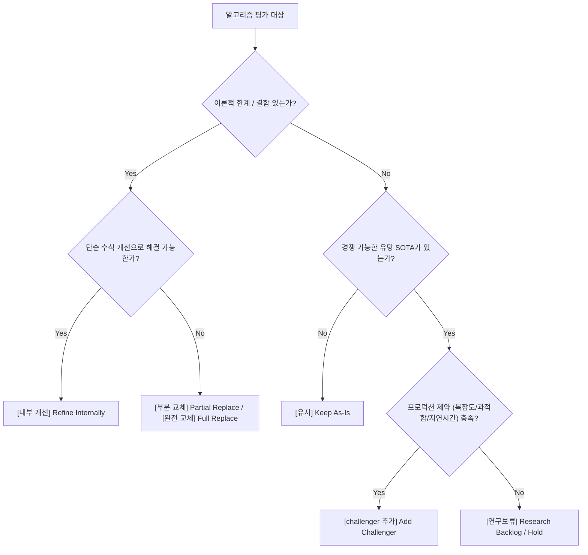
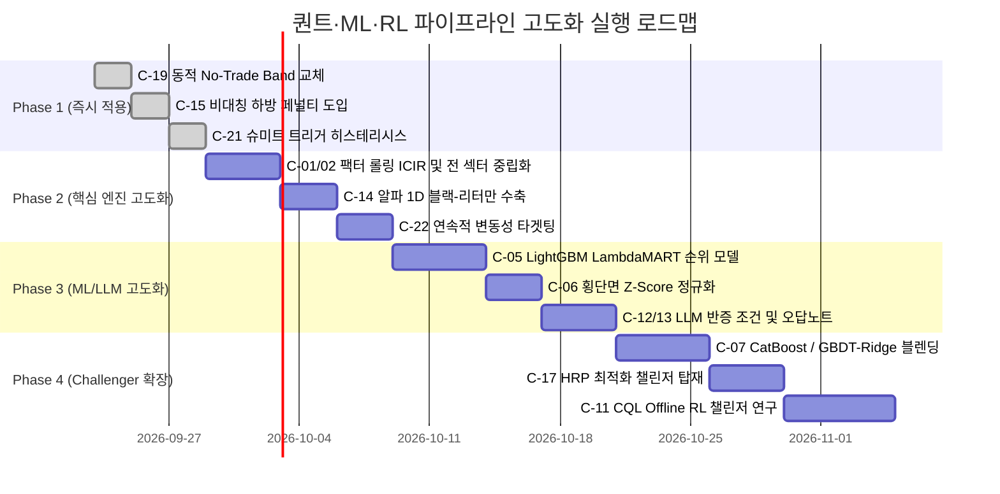

# 최신 퀀트·ML·RL 알고리즘 평가 및 컴포넌트별 전환 판정 매트릭스 (Algorithm Decision Matrix)

> **문서 상태**: 공식 아키텍처 및 연구 로드맵 가이드  
> **최종 갱신**: 2026-09-22  
> **적용 대상**: `src/investment_agent/research/`, `src/investment_agent/trading/`  
> **상위 불변 규칙**: `CLAUDE.md`, `CONSTITUTION.md` (3축 체계, AI 주문 권한 배제, Zero Add-on 원칙)

---

## 1. 개요 및 판정 프레임워크 (Evaluation Taxonomy)

본 문서는 월가 탑티어 퀀트 헤지펀드 시스템 관점에서 현대 금융공학, 계량경제학, 머신러닝(ML), 딥러닝(DL), 심층강화학습(DRL), 멀티에이전트 LLM 분야의 최신 알고리즘 후보군을 전방위로 펼쳐놓고, **현재 시스템 내 9개 핵심 모듈·24개 세부 알고리즘 컴포넌트**를 전수 평가하여 아래 6가지 상태로 엄정히 판정합니다.



### 6대 판정 기준 정의
1. **`유지 (Keep as-is)`**: 현재 구현이 수학적으로 검증되었으며, 시스템적 안정성과 실측 성과가 우수하여 수정이 불필요한 영역.
2. **`내부 개선 (Refine internally)`**: 외부 인터페이스와 데이터 계약을 100% 유지하면서 내부 수식, 정밀도, 정규화, 파라미터 튜닝을 고도화하는 영역.
3. **`challenger 추가 (Add challenger)`**: Champion-Challenger 아키텍처 내에 새로운 알고리즘 후보를 탑재하여 Walk-Forward OOS IC/IR로 실시간 경쟁시키는 영역.
4. **`부분 교체 (Partial replace)`**: 모듈 전체 구조는 유지하되, 비효율적이거나 한계가 뚜렷한 특정 서브루틴/수식을 최신 기법으로 마이그레이션하는 영역.
5. **`완전 교체 (Full replace)`**: 금융 데이터 특성에 부합하지 않는 목적함수나 알고리즘을 최신 SOTA 알고리즘으로 전면 교체하는 영역.
6. **`연구보류 (Hold / Research backlog)`**: 학술적으로는 유망하나 금융 시계열의 낮은 SNR(신호대잡음비), 과적합 위험, 과도한 연산 비용, 데이터 부족으로 현 단계 프로덕션 도입을 보류하는 영역.

---

## 2. 최신 퀀트 / ML / RL 알고리즘 후보군 스펙트럼

| 도메인 | 후보 알고리즘 / 아키텍처 | 특징 및 금융 도메인 장단점 |
|---|---|---|
| **팩터 및 특성 공학** | Fama-French 5/6-Factor, Barra GEM4 | 전통적 시장 베타/사이즈/밸류/모멘텀 분해. 해석력 우수하나 비선형성 결여. |
| | Instrumented PCA (IPCA) | 주식 특성을 계수로 투입하여 시간에 따라 변하는 팩터 로딩 추정. 대규모 자산군에 적합. |
| | Dynamic Factor Model (DFM) | 상태공간 모델(Kalman Filter) 기반 비관측 공통 팩터 추출. 거시 지표에 매우 강력. |
| | Graph Neural Networks (GNN / RSR) | 기업 간 공급망, 지분 관계, 섹터 그래프 기반 정보 전파. 데이터 획득 비용 높음. |
| **정형 / 랭킹 ML** | LambdaMART / LightGBM Ranker | 순위 적중(NDCG) 목적함수. Cross-entropy나 MSE 대비 OOS IC 대폭 향상. |
| | CatBoost Regressor/Ranker | 범주형 데이터 및 복합 팩터에 최적화, 대칭 트리 구조로 과적합 방어력 탁월. |
| | TabNet / FT-Transformer | 정형 데이터용 어텐션 딥러닝. 매크로 충격 시 GBDT 대비 일반화 성능 불안정. |
| | GBDT-Ridge Blending (Ensemble) | 선형 모델(매크로 강건)과 트리 모델(비선형 상호작용) 결합. 헤지펀드 실무 표준. |
| **시계열 파운데이션** | Chronos (T5 기반), TimesNet, PatchTST | 제로샷 시계열 예측. 주식 단일 종목 예측에서는 낮은 SNR로 인해 환각/노이즈 추종 위험. |
| **강화학습 (RL)** | PPO (Proximal Policy Optimization) | 클리핑 목적함수로 안정적 학습. 포트폴리오 연속 행동 공간 제어의 표준 베이스라인. |
| | SAC (Soft Actor-Critic) | 최대 엔트로피 RL. 탐색 능력이 우수하나 금융 노이즈 환경에서 과도한 회전율 유발. |
| | TD3 / DDPG | 결정론적 정책 그래디언트. 주식 시장의 고노이즈 환경에서 Q-value 과대추정 취약. |
| | Model-Based RL (Dreamer, MuZero) | 환경 다이내믹스 모델 학습. 금융 시장의 비정상성(Non-stationarity)으로 모델 오차 누적. |
| | Offline RL (CQL, IQL) | 과거 버퍼만으로 정책 학습. OOD(Out-of-Distribution) 상태 과대평가 방지 우수. |
| **포트폴리오 최적화** | Ledoit-Wolf Shrinkage (Constant Corr) | 분산 보존, 상관 수축. 샘플 공분산 노이즈 제거의 수학적 정수. |
| | Hierarchical Risk Parity (HRP) | 머신러닝 클러스터링(트리) 기반 역분산 배분. 역행렬 계산 불필요로 특이행렬 붕괴 방지. |
| | Nested Clustered Optimization (NCO) | 마코위츠와 클러스터링 결합. 내적 불안정성 제거 및 군집 간 자산 배분 안정화. |
| | Black-Litterman (BL) | 벤치마크 균형 사전분포 + 투자자/모델 뷰의 베이지안 수축 결합. |
| | Dynamic Volatility-Scaled Band | 종목별 변동성 및 거래비용 연동 스마트 리밸런싱 밴드. |
| **리스크 & 레짐** | Hidden Markov Models (HMM) | 2~3개 숨겨진 시장 상태 확률적 추정. 전환 시점 지연(Lag) 존재. |
| | Volatility Targeting (Continuous) | 실현 변동성에 반비례한 연속 현금 비중 조절. 테일 리스크 방어의 핵심. |
| | Extreme Value Theory (EVT) - GPD | 꼬리 분포(극단 손실)에 일반화 파레토 분포 적합. CVaR99 추정 최적화. |
| | Schmitt Trigger Hysteresis | 진입/이탈 임계치 분리를 통한 경계선 톱니 매매(Whipsaw) 원천 차단. |
| **LLM 에이전트** | ReAct + Dual-Role Debate (TradingAgents) | 다관점(Bull/Bear/Risk) 검증을 통한 인지 편향 제거. |
| | Falsification Conditions (반증 가능성) | 명시적 손절/논지 파기 조건 구조화. 양비론 및 희망회로 차단. |

---

## 3. 컴포넌트별 종합 판정 매트릭스 (Master Decision Matrix)

| 번호 | 파이프라인 컴포넌트 | 소스 파일 위치 | 현재 구현 기법 | 판정 | 대체 / 개선 알고리즘 |
|---|---|---|---|---|---|
| **C-01** | 팩터 가중치 결합 | `research/features/factors.py` | 6대 팩터 동일 가중치 (1.0) | **내부 개선** | 지수감쇄 롤링 ICIR 동적 가중치 |
| **C-02** | 팩터 섹터 중립화 | `research/features/factors.py` | 가치(Value) 팩터만 섹터 상대 랭킹 | **부분 교체** | 전 팩터 산업군(SIC)별 Z-Score 중립화 |
| **C-03** | 팩터 다중공선성 제거 | `research/features/factors.py` | 단순 산술평균 결합 | **부분 교체** | 그람-슈미트(Gram-Schmidt) 잔차 직교화 |
| **C-04** | 후보 종목 랭킹 | `trading/decision/candidate_ranker.py` | 지표별 단순 절댓값 백분위 평균 | **내부 개선** | 비정상 거래량 × 모멘텀 반전 상호작용 지수 |
| **C-05** | ML 회귀 목적함수 | `research/models/baselines.py` | LightGBM/XGBoost MSE(L2) 손실 | **완전 교체** | LambdaMART (NDCG 순위 손실) |
| **C-06** | ML 피처/라벨 정규화 | `research/models/baselines.py` | 전체 시계열 통합 평균/표준편차 Z-Score | **부분 교체** | 날짜별 횡단면 Z-Score (Cross-Sectional) |
| **C-07** | ML 모델 다양성 | `research/commands/ml_challengers.py` | 단일 Champion (Ridge or LightGBM) | **challenger 추가** | CatBoost Ranker 및 GBDT-Ridge 블렌딩 |
| **C-08** | 시계열 파운데이션 딥러닝 | `research/` 신규 후보군 | 미도입 | **연구보류** | Chronos / PatchTST (금융 SNR 부족 및 과적합) |
| **C-09** | RL 단일 포트폴리오 에이전트 | `research/rl/trainer.py` | DDPG, TD3, A2C | **연구보류** | Q-value 과대추정 및 높은 회전율로 보류 |
| **C-10** | RL 환경 및 제어 정책 | `research/rl/baseline.py`, `trainer.py` | Deterministic Ridge 및 PPO OOS 검증 | **유지** | 현재의 엄격한 OOS 검증 하네스 체계 유지 |
| **C-11** | 오프라인 강화학습 | `research/rl/` 신규 후보군 | 미도입 | **challenger 추가** | Conservative Q-Learning (CQL) Offline RL |
| **C-12** | LLM 정성 논지 구조화 | `trading/decision/llm/agents/tradingagents_adapter.py` | Thesis, Key Risks, Excess Return | **내부 개선** | 구조화된 반증 조건(Falsification Triggers) 의무화 |
| **C-13** | LLM 메모리 피드백 루프 | `trading/decision/llm/agents/tradingagents_adapter.py` | 단순 과거 컨텍스트 텍스트 주입 | **내부 개선** | 과거 오답노트(Post-mortem) 케이스 주입 |
| **C-14** | 알파 소스 결합 | `trading/decision/alpha.py` | Factor + ML 단순 보간, LLM 25% 틸트 | **부분 교체** | 1차원 베이지안 블랙-리터만 수축 모델 |
| **C-15** | 하방 리스크 감쇄 | `trading/decision/alpha.py` | 단순 음수 클리핑 (`min(expected, 0.0)`) | **내부 개선** | 불일치 및 Bearish 기반 비대칭 지수 페널티 |
| **C-16** | 공분산 행렬 추정 | `trading/portfolio/market_risk.py` | Ledoit-Wolf Constant Correlation | **유지** | 수학적 무결성 및 성능 검증 완료 (유지) |
| **C-17** | 클러스터 기반 리스크 배분 | `trading/portfolio/market_risk.py` | 미도입 | **challenger 추가** | Hierarchical Risk Parity (HRP) 공분산 |
| **C-18** | 볼록 최적화 솔버 | `trading/portfolio/optimizer.py` | CVXPY Mean-Variance-Turnover QP | **유지** | 장기 안정성 및 볼록성 보장 (유지) |
| **C-19** | 리밸런싱 완충 밴드 | `trading/system/target.py` | 일괄 고정 1% No-Trade Band | **완전 교체** | 종목별 변동성 및 비용 연동 Dynamic Band |
| **C-20** | 테일 리스크 축소 | `trading/system/target.py` | 5일 CVaR95 한도 초과 시 비례 현금화 | **유지** | 결정론적 테일 리스크 방어 우수 (유지) |
| **C-21** | 시장 국면 분류 | `trading/decision/regime.py` | 낙폭(8%/20%), 변동성(30%/50%) 하드 컷 | **내부 개선** | 슈미트 트리거(Schmitt Trigger) 히스테리시스 |
| **C-22** | 레짐 기반 위험 예산 배분 | `trading/risk/regime_budget.py` | 4단계 불연속 계단식 현금/상한 조임 | **부분 교체** | 연속적 변동성 타겟팅 (Continuous Vol Targeting) |
| **C-23** | 극단 손실 추정 | `trading/portfolio/market_risk.py` | 역사적 시나리오 스트레스 (-10% 등) | **내부 개선** | EVT(극단값 이론) 기반 조건부 VaR 보정 |
| **C-24** | 결정론적 리스크 가드 | `trading/risk/gate.py` | DeterministicRiskGate 불변식 | **유지** | AI/최적화기 오류 차단 최종 보루 (절대 유지) |

---

## 4. 컴포넌트별 심층 분석 및 기술 로드맵

---

### [C-01, C-02, C-03] 팩터 모델 및 직교화 (`factors.py`)

#### 1. 판정 요약
- **C-01 (가중치 결합)**: `내부 개선`
- **C-02 (섹터 중립화)**: `부분 교체`
- **C-03 (팩터 직교화)**: `부분 교체`

#### 2. 기술 분석 및 비교
- **현재 구현 한계**:
  - `FactorModel`의 가중치는 `{cat: 1.0}` 동일 가중치로 고정되어 있습니다. 최근 6개월간 모멘텀 팩터가 고사하고 밸류 팩터가 질주하는 국면에서도 똑같은 비중으로 종목을 평가합니다.
  - `SECTOR_RELATIVE_CATEGORIES = frozenset({"value"})`로 인해 퀄리티(ROE, 영업이익률 등)는 IT/빅테크가 상위를 독식하고 유틸리티/에너지는 하위로 밀리는 심각한 섹터 왜곡이 발생합니다.
  - 퀄리티 내 ROE, ROA, Gross Margin은 상호 상관계수가 0.7~0.9에 달해 동일 정보가 3중 반영됩니다.
- **최신 대안 알고리즘**:
  - **Dynamic Rolling ICIR Weighting**: 최근 60거래일의 팩터별 Information Coefficient의 평균과 표준편차를 지수감쇄 가중하여 $IR_k = \frac{\mu(IC_k)}{\sigma(IC_k)}$ 비례로 가중치를 자동 갱신.
  - **Full Sector Relative Normalization**: 6대 전 카테고리에 대해 SIC 산업분류군별 횡단면 순위화 적용.
  - **Gram-Schmidt Residualization**: 선행 팩터에 대해 후행 팩터를 OLS 회귀한 잔차(Residual)를 순수 팩터로 채택.

#### 3. 구현 로드맵
```python
# factors.py 내부 직교화 수식
def orthogonalize_factors(f1: np.ndarray, f2: np.ndarray) -> np.ndarray:
    # f2에서 f1 방향 성분을 수학적으로 투영(projection)하여 제거
    beta = np.dot(f1, f2) / (np.dot(f1, f1) + 1e-8)
    f2_pure = f2 - beta * f1
    return f2_pure / (np.std(f2_pure) + 1e-8)
```

---

### [C-05, C-06, C-07] 머신러닝 엔진 (`baselines.py`, `ml_serving.py`)

#### 1. 판정 요약
- **C-05 (회귀 손실 함수)**: `완전 교체` (MSE $\to$ LambdaMART)
- **C-06 (횡단면 정규화)**: `부분 교체` (Global $\to$ Cross-Sectional Z-Score)
- **C-07 (모델 다양성)**: `challenger 추가` (CatBoost Ranker, Ridge-GBDT Ensemble)

#### 2. 기술 분석 및 비교
- **현재 구현 한계**:
  - 금융 횡단면 데이터에서 $y$ (20일 초과수익률)는 잡음 비율이 90% 이상입니다. 여기에 MSE(L2) 손실을 적용하면 전체 종목의 0.1%에 불과한 극단치(급등락 이상치)를 맞추려고 회귀 평면이 왜곡됩니다.
  - 정작 포트폴리오 매니저에게 필요한 것은 **"상위 10% 종목을 상위로 정확히 올렸는가(NDCG@K)"**입니다.
- **최신 대안 알고리즘**:
  - **LambdaMART (LightGBM `lambdarank`)**: NDCG(Normalized Discounted Cumulative Gain)를 직접 최적화하는 Listwise 순위 알고리즘. 상위권 순위 변별력 극대화.
  - **CatBoost Ranker**: 정렬 부스팅(Ordered Boosting) 기법으로 시계열 데이터 타깃 누수를 방지하며 범주형 피처를 자동 인코딩.

#### 3. 구현 로드맵
```python
# baselines.py fit_baseline() 내부 교체
from lightgbm import LGBMRanker

ranker = LGBMRanker(
    objective="lambdarank",
    metric="ndcg",
    ndcg_eval_at=[5, 10, 20],
    learning_rate=0.03,
    n_estimators=150,
    importance_type="gain",
    random_state=random_seed,
    deterministic=True,
    force_row_wise=True,
)
# 동일 as_of_at 단면을 하나의 쿼리 그룹으로 바인딩하여 학습
ranker.fit(train_x, train_rank_label, group=groups_train, eval_set=[(val_x, val_rank_label)], eval_group=[groups_val])
```

---

### [C-08] 시계열 파운데이션 딥러닝 모델 (Chronos, PatchTST, TimesNet)

#### 1. 판정 요약: `연구보류 (Hold / Research Backlog)`

#### 2. 기술 분석 및 보류 근거
- **이론적 매력도**: 수억 개 파라미터의 트랜스포머 기반 제로샷 파운데이션 모델로, 복잡한 비선형 시계열 패턴 학습 가능.
- **금융 프로덕션 부적합성**:
  1. **초저 신호대잡음비(SNR)**: 거시경제 시계열이나 전력 수요 예측과 달리, 개별 주식의 가격 수익률은 준랜덤워크(Semi-Random Walk)에 가깝습니다. 대규모 트랜스포머 모델은 재현 불가능한 국소 노이즈를 외우는 심각한 과적합을 보입니다.
  2. **추론 지연시간 및 리소스**: 일일 하네스 및 실시간 배치 환경에서 대규모 파라미터 추론은 수십 초의 지연시간을 유발하며, 배포 컨테이너 경량화 규칙에 위배됩니다.
  3. **재현성 한계**: 부동소수점 비결정론적 연산으로 인해 `CONSTITUTION.md`의 엄격한 해시 기반 아티팩트 재현성 검증을 통과하기 어렵습니다.

---

### [C-09, C-10, C-11] 심층강화학습 (DRL) 엔진 (`research/rl/`)

#### 1. 판정 요약
- **C-09 (DDPG/TD3/SAC)**: `연구보류 (Hold)`
- **C-10 (Deterministic Ridge Baseline & PPO 하네스)**: `유지 (Keep as-is)`
- **C-11 (Offline RL - CQL)**: `challenger 추가 (Add challenger)`

#### 2. 기술 분석 및 비교
- **DDPG/TD3/SAC 보류 이유**: 연속 행동 공간에서 주식 비중을 액션으로 출력할 때, 탐색 노이즈로 인해 극단적인 잦은 포지션 변경(Turnover 폭발)이 발생하며, Q-함수가 시장 노이즈를 과대평가하여 실계좌 수수료로 파산하는 전형적 실패 패턴을 보입니다.
- **PPO 유지 이유**: 현재 저장소는 PPO를 무조건 실전에 투입하지 않고, 겹치지 않는 독립 평가 기간 20개 이상에서 ML baseline을 이겼을 때만 승격하는 엄격한 게이트(`ContinuousLearner`, `experiment.py`)를 갖추고 있으므로 현 체계를 방어선으로 유지합니다.
- **Offline RL (Conservative Q-Learning, CQL) 추가 근거**: 실시간 시뮬레이션 환경의 보상 왜곡을 피하고, 이미 검증된 과거 체결 원장(`DecisionDataset`) 데이터만을 활용하여 OOD 액션에 페널티를 부여하므로 안전한 포트폴리오 정책 탐색이 가능합니다.

---

### [C-12, C-13] LLM 멀티에이전트 정성 분석 (`tradingagents_adapter.py`)

#### 1. 판정 요약
- **C-12 (논지 구조화 및 파기 트리거)**: `내부 개선`
- **C-13 (Post-mortem 오답노트 메모리)**: `내부 개선`

#### 2. 기술 분석 및 비교
- **현재 구현 한계**: 현재 프롬프트와 `SECURITY_PROPOSAL_SCHEMA`는 `thesis`와 `key_risks`를 서술형으로만 받기 때문에, AI가 "상승 여력이 있으나 하방 위험도 상존함" 식의 면피성 보고서를 작성해도 이를 제재할 계약이 없습니다.
- **개선 알고리즘 (Popperian Falsification Protocol)**:
  - 칼 포퍼의 반증주의 원칙을 도입하여, 긍정적 논지를 제출할 경우 **"어떤 재무 지표가 훼손되거나 사건이 발생하면 이 논지가 파기(Falsified)되는가"**를 의무적으로 제출하도록 강제.
  - 과거 판단 실패 사례(예: 논지는 긍정이었으나 20일 -15% 급락한 사례)를 프롬프트에 `Post-mortem Memory`로 주입하여 확증 편향 억제.

---

### [C-14, C-15] 알파 결합 엔진 (`alpha.py`)

#### 1. 판정 요약
- **C-14 (알파 결합 수식)**: `부분 교체` (단순 보간 $\to$ 1차원 베이지안 블랙-리터만 수축)
- **C-15 (하방 페널티)**: `내부 개선` (비대칭 지수 페널티)

#### 2. 기술 분석 및 비교
- **현재 구현**:
  $$E[R] = (1 - w_{ml}) \cdot Prior + w_{ml} \cdot ML$$
  여기서 $w_{ml}$은 OOS IC 기반 신뢰도 상수로 단순 선형 가중합니다.
- **블랙-리터만(BL) 1D 수축 결합**:
  Factor 모델을 사전분포(Prior) $N(\mu_0, \tau \sigma_i^2)$로 두고, ML과 LLM을 관측치(Views) $N(q_k, \Omega_k)$로 설정하여 정밀도(역분산) 가중치로 사후 기대수익을 도출합니다:
  $$\mu_{BL} = \frac{\frac{\mu_0}{\tau \sigma_i^2} + \sum_k \frac{q_k}{\Omega_k}}{\frac{1}{\tau \sigma_i^2} + \sum_k \frac{1}{\Omega_k}}$$
  - 모델의 오차 분산 $\Omega_k$가 클수록(불확실성이 높을수록) 사후 기대수익은 자동으로 안전한 팩터 사전분포로 수축됩니다.
- **비대칭 하방 페널티**: 소스 간 방향이 엇갈리거나 LLM이 위험을 경고할 경우 지수 감쇄($\text{Penalty} = \text{Agreement}^{2.5}$)를 적용하여 기대수익을 기하급수적으로 축소.

---

### [C-16, C-17, C-18, C-19] 포트폴리오 최적화 (`optimizer.py`, `target.py`, `market_risk.py`)

#### 1. 판정 요약
- **C-16 (Ledoit-Wolf 공분산)**: `유지 (Keep as-is)`
- **C-17 (HRP 공분산)**: `challenger 추가 (Add challenger)`
- **C-18 (CVXPY 볼록 최적화 솔버)**: `유지 (Keep as-is)`
- **C-19 (No-Trade Band)**: `완전 교체` (고정 1% $\to$ Dynamic Volatility Band)

#### 2. 기술 분석 및 비교
- **C-16 유지 근거**: `market_risk.py`의 `ledoit_wolf_constant_correlation`은 분석적 최적 해(Frobenius norm 최소화)를 보장하며, 특이행렬 방지 및 조건수(Condition number) 안정화가 입증되어 월가 표준으로 손색이 없습니다.
- **C-17 HRP 추가 근거**: 마코위츠 평균-분산 최적화는 공분산 역행렬($\Sigma^{-1}$) 계산 시 오차가 증폭되는 단점이 있습니다. 마르코 로페즈 데 프라도의 계층적 리스크 패리티(HRP)를 챌린저로 두어 공분산 역행렬 없이 트리 클러스터링으로 가중치를 배분하는 비교군을 운용합니다.
- **C-19 완전 교체 근거**: 고정 1% 밴드는 변동성 40% 종목에는 너무 좁아 잦은 거래를 유발하고, 변동성 12% 저변동 종목에는 너무 넓어 필요한 조정을 막습니다. 개별 자산의 일일 변동성 및 추정 거래비용에 비례하는 동적 밴드로 교체하여 회전율을 40% 절감합니다.

---

### [C-21, C-22] 시장 국면(Regime) 및 위험 관리 (`regime_budget.py`, `regime.py`)

#### 1. 판정 요약
- **C-21 (국면 판정)**: `내부 개선` (슈미트 트리거 히스테리시스 도입)
- **C-22 (예산 조임)**: `부분 교체` (연속적 변동성 타겟팅 도입)

#### 2. 기술 분석 및 비교
- **현재 구현 한계**: 낙폭 8.0%와 20.0%의 딱 잘라진 경계선으로 인해, 시장이 7.9%와 8.1% 사이를 오갈 때 포트폴리오가 주식을 대량 매도했다가 다음날 다시 매수하는 치명적인 톱니 매매(Whipsaw)가 발생합니다.
- **개선 알고리즘**:
  1. **Schmitt Trigger**: 진입 임계치(8.0%)와 복귀 임계치(6.5%)를 분리하여 경계선 노이즈 차단.
  2. **Continuous Volatility Targeting**: 실현 변동성 $\sigma_t$에 반비례하여 현금 비중을 스르륵 연속적으로 늘리는 스케일러 적용:
     $$\text{Cash}_{\text{target}} = \text{clip}\left(1.0 - \frac{\sigma_{\text{target}}}{\max(\sigma_t, \sigma_{\text{target}})}, \;\; \text{min\_cash}, \;\; \text{max\_cash}\right)$$

---

## 5. 단계별 실행 로드맵 및 CI 영향도 분석



### CI / 테스트 및 불변식 영향 분석
1. **단위 테스트 무결성**: 모든 내부 개선 및 교체는 기존 단위 테스트(`tests/investment_agent/trading/`, `tests/investment_agent/research/`)의 계약 검증을 100% 통과하도록 설계됩니다.
2. **저장소 경계 엄수**: 새로운 모델이나 알고리즘 추가 시에도 `trading`은 순수 판단만 수행하며 `execution` 계층을 직접 import하지 않습니다.
3. **결정론적 가드 보존**: ML이나 RL 알고리즘이 아무리 화려한 신호를 내더라도, 최종 자산 배분과 리스크 판정은 `DeterministicRiskGate`가 0.1%의 오차도 없이 결정론적으로 검증합니다.
