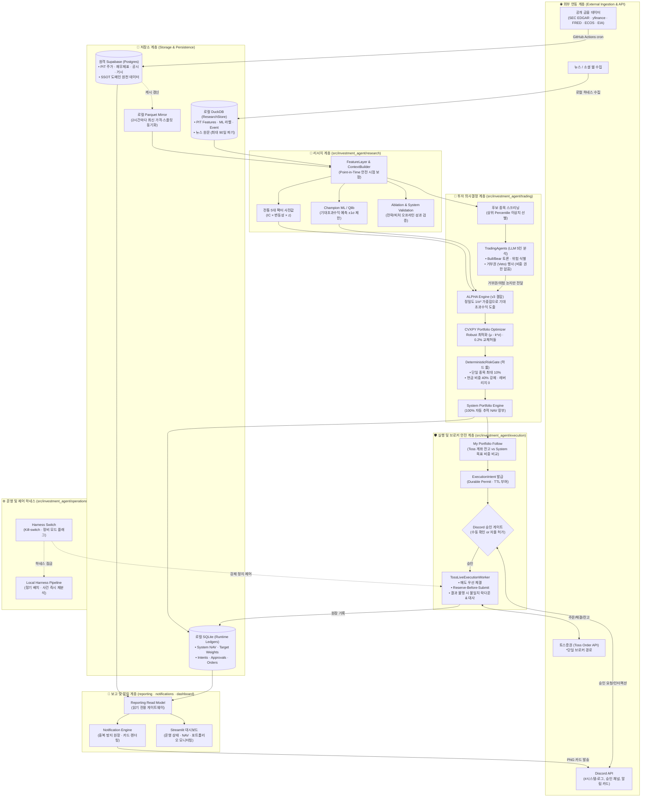

# 시스템 전체 아키텍처 (System Architecture)

> 💡 **대화형 다이어그램 (Interactive Showcase)**  
> 브라우저에서 확대/축소, 다크·라이트 테마 전환, 데이터 흐름 애니메이션 추적(Trace)이 가능한 인터랙티브 다이어그램은 아래 파일을 열어 확인하세요:  
> 🔗 **[대화형 시스템 아키텍처 다이어그램 열기 (HTML)](diagrams/system-architecture.html)**  
> *(컴파일 명세: `docs/diagrams/system-architecture.architecture.json`)*

---

## 1. 전체 아키텍처 다이어그램 (Mermaid)

---

## 2. 계층별 상세 역할과 코드 대응 관계

### 1) 저장소 계층 (Storage & Persistence)
* **Supabase (PostgreSQL)**: 모든 공식 원천 데이터의 단일 진실 공급원(SSOT). `available_at <= t` 시점 기준의 과거 재무제표, 일봉 주가, 공시 이력 저장.
* **DuckDB (`ResearchStore`)**: 연구용 파생 산출물 보관소. Feature 스냅샷, ML 학습 샘플, 이벤트 파생물 저장. 뉴스·소셜 원문은 기사 단위로 최대 90일 보관 후 폐기.
* **SQLite (Runtime Ledgers)**: 로컬 실시간 원장. `system_nav`, `system_targets`, `intents`, `approvals`, `orders`, `fills` 저장.

### 2) 리서치 계층 (`src/investment_agent/research`)
* **FeatureLayer & ContextBuilder**: 룩어헤드 편향(Look-ahead bias) 없이 과거 시점 기준의 특성 번들 생성.
* **전통 5대 팩터**: 밸류, 퀄리티, 모멘텀, 성장성, 변동성 지표를 $IC \times \sigma \times z$ 형태로 정규화하여 사전 기대수익 도출.
* **ML Serving**: Champion 머신러닝 모형(LightGBM / XGBoost / CatBoost)을 통해 잔여 초과수익을 $\pm 1\sigma$ 한도 내에서 보수적으로 예측.

### 3) 투자 판단 계층 (`src/investment_agent/trading`)
* **TradingAgents (LLM)**: 5인 에이전트(Market, Fundamental, News, Social, Risk)의 Bull/Bear 토론. **비중 결정 권한이 전혀 없으며**, 오직 논지 설명과 거부권(Veto), 위험 경고만 행사.
* **ALPHA Engine**: 정밀도($1/\sigma^2$) 역수 가중치로 팩터 사전분포와 ML 예측치를 수학적으로 융합.
* **CVXPY Optimizer**: 볼록 최적화기로 불확실성 페널티($\mu - k\sigma$)와 0.2% 교체 허들(No-trade band)을 적용해 목표 비중 산출.
* **DeterministicRiskGate**: 종목당 최대 비중 10%, 위기 시 현금 40% 강제, 레버리지 0 등 하드 리스크 룰을 절대적으로 강제.

### 4) 주문 실행 계층 (`src/investment_agent/execution`)
* **System Portfolio vs My Portfolio 분리**: 시스템 자체 알고리즘 성과(System NAV)는 실제 사용자 승인이나 체결 실패와 완전히 격리되어 100% 자동 기록됨.
* **TossLiveExecutionWorker**: 토스증권 단일 브로커 API 연동. Reserve-Before-Submit(원장 사전예약) 및 매도 우선 체결 적용. 통신 장애나 타임아웃 시 자동 재주문 없이 불일치 락다운(Fail-Closed) 진입.

### 5) 알림 및 대시보드 (`reporting`, `notifications`, `dashboard`)
* **Notification Engine**: 중복 방지 원장(`notices`, `deliveries`)을 거쳐 Discord 웹훅/봇으로 시각화된 PNG 카드와 Embed 전송.
* **Streamlit Dashboard**: 읽기 전용 게이트웨이(`SelectOnlyGateway`)를 통해 안전하게 계좌 상태와 포트폴리오 모니터링 제공.
