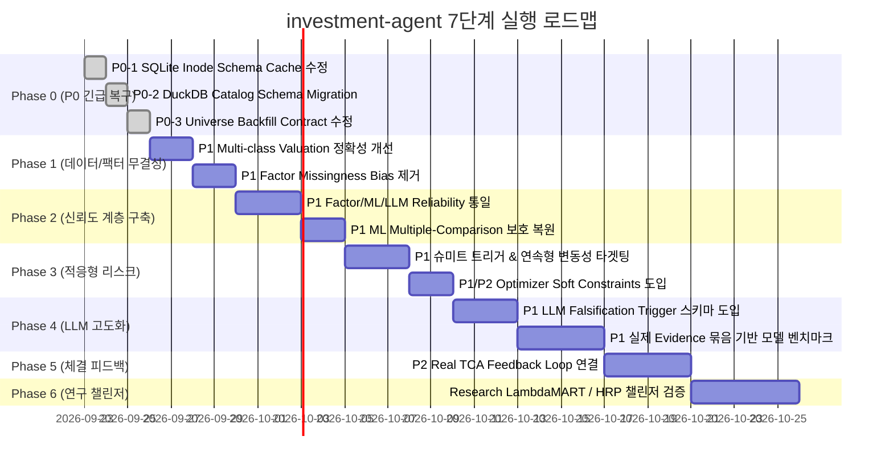

# `investment-agent` 자동매매 시스템 전면 심층분석 및 실행 청사진

> **기준 브랜치**: `main` (SHA: [`ab7e3a6`](https://github.com/parkshinyoung0831/investment-agent/commit/ab7e3a6ff33636cbb74f2218a2215d19d6480139))  
> **분석 기준일**: 2026-09-22  
> **분석 방법론**: 파일 존재 여부가 아닌 `entry point → caller → callee → DB/API → 계산 → 판단 → 저장 → downstream` 전수 추적 + 실제 GitHub Actions 실행 로그 대조 (수정 전 심층 분석 우선)  
> **상위 불변 원칙**: 3축 체계(`stage`, `execution_mode`, `source_kind`), 인간 승인과 System Portfolio 분리, Deterministic Hard-Risk, Shadow/Paper/Live 격리 절대 유지

---

## 1. Executive Summary (핵심 요약)

지금 시스템의 가장 큰 문제는 **"알고리즘이 단순하다"가 아닙니다.**  
이미 아래 핵심 요소들은 월가 탑티어 기관 수준으로 정교하게 구현되어 있습니다:
- **Point-in-Time(PIT) 데이터 무결성 및 Historical Replay 타임머신 방지**
- **로컬 Parquet Mirror / 캐시 / Batch Prefetch 체계**
- **Factor $\to$ ML $\to$ LLM/Agent $\to$ Alpha 결합 구조**
- **Ledoit-Wolf Constant-Correlation 수축 공분산 행렬**
- **거래비용 인식 볼록 최적화 (Cost-aware Convex Optimizer)**
- **결정론적 하드 리스크 게이트 (Deterministic Hard RiskGate)**
- **시장 국면(Regime)별 위험 예산 축소 체계**
- **System Portfolio(이상적 목표)와 실제 계좌(My Portfolio)의 철저한 분리**
- **Discord 승인 기반 1회 주문 및 브로커 전송 직전 신선도 재검증**
- **멱등키 보장 및 미확인 주문(Unknown-order) 재전송 금지 원칙**
- **ML/RL 챌린저와 수동 승격(Manual Promotion) 거버넌스**
- **저장소 자체 소유(Repository-owned) 멀티에이전트 그래프**
- **사후 평가 결과를 LLM Memory로 되먹이는 피드백 구조**

즉, **구조 자체를 다시 뜯어고칠 단계가 아닙니다.**

그러나 최신 코드와 실제 GitHub Actions 실행 결과(23개 run 중 성공 19, 실패 3, 진행 1)를 정밀 대조한 결과, **새로운 알고리즘 고도화보다 먼저 해결해야 할 P0 운영 결함 3건**이 현재 운영 환경에 존재합니다.

### 🚨 [P0] 최우선 해결 과제 (운영 장애 차단)
| 우선순위 | 확인된 문제 | 상태 | 근본 원인 (Root Cause) |
|---|---|---|---|
| **P0-1** | Runtime SQLite를 같은 프로세스에서 삭제 $\to$ 재생성할 때 schema 적용 건너뜀 | **CI 실패 중** | 파일 삭제 후 새 파일이 우연히 동일 `inode`를 재사용할 때 `_PREPARED` 캐시가 DDL 적용을 생략 |
| **P0-2** | `tech_indicators`가 이전 DuckDB artifact와 현재 `feature_sets` schema 불일치로 크래시 | **실제 배포 실패** | 과거 artifact 복원 후 `CREATE TABLE IF NOT EXISTS`가 구형 catalog 테이블을 마이그레이션하지 못함 |
| **P0-3** | S&P 500 편입 변경 후 `market_backfill`에 삭제된 `dataset=both` 인자를 넘겨 실패 | **HTTP 422 실패** | 워크플로 호출자-피호출자 간 input contract 불일치로 뒤이어야 할 재무제표 백필까지 연쇄 중단 |

> [!IMPORTANT]  
> 지금 당장 LambdaRank, Black-Litterman, HMM regime, 신규 Agent를 추가하기 전에 **위 P0 3건을 먼저 해결해야 합니다.** 정확성(Correctness), 데이터 무결성(Data Integrity), 거래 안전(Trading Safety)이 절대적인 P0입니다.

---

### 🎯 [P1] 시스템을 적응형(Adaptive)으로 만드는 6대 핵심 과제
P0 해결 후 시스템을 실질적으로 진화시킬 6대 핵심 작업은 다음과 같습니다:
1. **Factor/ML/LLM 신호를 단일 'Signal Reliability(신뢰도)' 체계로 통합**: 서로 다른 스케일의 confidence를 통일.
2. **연속형 Exposure Scaling 및 Schmitt Trigger Hysteresis 추가**: 고정 임계값 절벽으로 인한 톱니 매매(Whipsaw) 박멸.
3. **Factor의 결측치 재정규화 편향(Missing-data Renormalization Bias) 제거**: 데이터 부족 기업의 백분위 부풀림 차단.
4. **ML 모델 승격(Adoption) 시 다중비교(Multiple-comparison) 보호 복원**: 챌린저 비교 통계 기준과 실채택 기준의 불일치 해소.
5. **Multi-class 주식의 정확한 경제적 가치 환산 시가총액 산출**: BRK.A/B 등 이원화 주식 밸류에이션 오류 차단.
6. **LLM 멀티에이전트 개편**: 단일 `gpt-5-mini` 의존 탈피, 역할별 모델 벤치마크 및 명시적 논지 파기 조건(Falsification Triggers) 의무화.

---

## 2. 분석 범위 및 검증 상태 (Scope & Verification)

### ✅ 확인 완료 (Deep Trace)
- `src/investment_agent/operations/harness/*` 및 프로덕션 어댑터
- Data 도메인 (Market, Fundamentals, Macro, Institutional) & Local Mirror
- Research DuckDB / Feature Store / Factor Engine / Candidate Selection
- ML Training / Serving / Challenger / Adoption 파이프라인
- RL 환경 / PPO 학습기 / Continuous Learning 격리 상태
- Repository-owned LLM Graph 및 Alpha Fusion 수식
- System Portfolio, Optimizer, Ledoit-Wolf 공분산, Deterministic RiskGate
- Toss Broker 경계, 주문 승인, 멱등성, 미확인 주문 대사(Reconciliation)
- 실제 GitHub Actions 워크플로 실행 로그 및 최신 커밋 단위 테스트

### ⚠️ 부분 확인
- 전체 트리 Wide Scan을 완료했으나 수백 개 모듈의 모든 내부 구현 라인을 전부 동일 깊이로 읽은 것은 아닙니다. 핵심 런타임 경로 위주로 Deep Trace를 수행했습니다.
- 현재 실제 Supabase 모든 row의 품질은 직접 DB query하지 않았습니다.
- 실제 Toss 계좌 상태와 실제 broker 주문은 실행하지 않았습니다.
- Azure 리소스에서 현재 새 모델 deployment가 실제 가능한지는 배포 리전/쿼터 확인이 추가로 필요합니다.

### ❓ 미확인 (운영 단계 확인 필요)
- 과거 잘못 저장됐던 macro own_model row가 운영 DB에서 실제 cleanup됐는지 여부
- 실제 live 계좌에서 장기 partial fill / restart / reconciliation drill을 충분히 거쳤는지 여부
- 현재 portfolio의 실제 historical implementation shortfall 실측치
- 실제 LLM 역할별 정확도·calibration 실측치

---

## 3. 현행 시스템 구조 및 불변 원칙 (Current Architecture)

```text
External Data (SEC, yfinance, FRED, ECOS, 13F, News/Social)
  │
  ▼
Canonical Storage (Supabase Postgres + Local Parquet Mirror)
  │
  ▼
Research Layer (PIT Valuation, DuckDB Feature Store, Factor Cross-section, ML Datasets)
  │
  ├───────────────────────────────────┐
  ▼                                   ▼
Factor Engine (6 Categories)       LLM Multi-Agent Graph
  - Quality, Balance Sheet           - Market, Fundamentals, Macro
  - Growth, Value (Sector-rel)       - News, Sentiment Analysts
  - Revision, Momentum               - Bull ↔ Bear Research Debate
  │                                  - Research Manager → Trader → Risk
  │                                   │
  └───────────────► Alpha Fusion ◄────┘
                    - Factor Prior (IC × σ × z)
                    - Champion ML Forecast
                    - LLM Thesis Veto / Tilt (25%)
                    │
                    ▼
          Portfolio Optimizer (CVXPY QP)
            - Expected return
            - Ledoit-Wolf Covariance
            - Transaction Cost / Turnover Penalty
            - Position (10%), Sector (30%), Cash (5%)
            │
            ▼
          Risk / Regime Budget (NORMAL, RISK_ON, RISK_OFF, CRISIS)
            │
            ▼
          Deterministic RiskGate (하드 리스크 불변식)
            │
            ▼
          SYSTEM PORTFOLIO (이상적 목표 비중 추적)
            │
      ┌─────┴─────────────────────────┐
      ▼                               ▼
Shadow / Evaluation           My Portfolio Follow (실제 계좌)
(인간 승인 없이 계속 실행)       │
                              ▼
                        Trade Intent
                              │
                              ▼
                        Discord Approval (인간 승인)
                              │
                              ▼
                        Freshness Preflight Check
                              │
                              ▼
                        Toss Broker Execution (멱등키)
                              │
                              ▼
                        Reconciliation (Unknown 대사)
                              │
                              ▼
                        Performance Ledger / Evaluation Memory
```

> [!NOTE]  
> **유지해야 할 핵심 불변식 (Invariants)**:
> 1. **Execution authority separation**: LLM이 최종 weight 직접 결정 ❌, broker order 직접 실행 ❌. System Portfolio가 최종 weight를 계산하고 실제 계좌는 다시 approval + deterministic check를 통과합니다.
> 2. **Broker unknown outcome 처리**: POST timeout/5xx/non-JSON/ID mismatch 시 "실패했겠지" 하고 같은 주문을 다시 전송하지 않고, 무조건 `UNKNOWN → reconciliation`으로 넘깁니다.
> 3. **Deterministic RiskGate**: LLM confidence와 무관하게 symbol cap, sector cap, turnover, cash, volatility, beta, correlation, HHI, CVaR/stress를 결정론적으로 재검사합니다.
> 4. **Market covariance**: 이미 `Ledoit-Wolf constant-correlation shrinkage`가 구현되어 있으므로 단순 공분산 추가 작업은 불필요합니다.
> 5. **ML/RL 자동승격 금지**: training은 자동이어도 adoption은 명시적 수동 승격을 거칩니다.
> 6. **Local Mirror**: Supabase를 매번 원격 조회하지 않고 `Canonical Supabase → incremental local mirror → Parquet → historical/PIT research reuse` 구조를 유지합니다.

---

## 4. [P0] 최우선 해결 결함 상세 분석 (Deep Dive)

### 4.1. [P0-1] Runtime SQLite Inode 재사용으로 인한 스키마 누락
- **실제 실패 Actions Run**: [`actions/runs/35624278062`](https://github.com/parkshinyoung0831/investment-agent/actions/runs/35624278062)
- **실패 테스트**: `test_a_recreated_file_gets_the_schema_again` (`AssertionError: 1 != 2`)
- **문제 파일**: `src/investment_agent/platform/db/sqlite.py`, `tests/investment_agent/platform/test_sqlite_schema_applied_once.py`
- **Root Cause**:
  현재 `sqlite.py`는 DDL 적용 여부를 `(path, st_dev, st_ino, ddl_declarations)`를 키로 하는 메모리 캐시 `_PREPARED`에 저장합니다. 파일시스템은 삭제된 파일의 `inode`를 새로 생성된 파일에 즉시 재사용할 수 있습니다.
  ```text
  [옛 runtime.sqlite3] ──(삭제)──► [새 runtime.sqlite3 생성]
                                           │
  우연히 동일 inode 재사용 ────────────────┘
    ▼
  _PREPARED 캐시: "이미 schema 적용함"으로 착각
    ▼
  _apply_schema() 생략 ──► 테이블 미존재로 런타임 크래시
  ```
- **해결 방안 (P0 / 내부 개선)**:
  - 파일시스템 `inode`를 스키마 무결성의 진실(Truth)로 사용하지 않음.
  - DB 파일 자체의 메타데이터(`PRAGMA user_version` 또는 Schema Sentinel 테이블)를 읽어 generation을 검증:
    ```text
    cheap open → PRAGMA user_version / schema sentinel → expected generation?
      ├─ YES → DDL skip
      └─ NO  → migration / apply
    ```
  - `_PREPARED`는 성능 캐시일 뿐이며 schema correctness의 진실이어서는 안 됩니다.

---

### 4.2. [P0-2] `tech_indicators`의 DuckDB Schema Incompatibility
- **실제 실패 Actions Run**: [`actions/runs/35676785159`](https://github.com/parkshinyoung0831/investment-agent/actions/runs/35676785159)
- **발생 오류**: `_duckdb.BinderException: Table "feature_sets" does not have a column with name "feature_set"`
- **Root Cause**:
  GitHub Actions 워크플로는 이전 성공 실행의 `research.duckdb` artifact를 복원합니다. 현재 DDL은 `CREATE TABLE IF NOT EXISTS feature_sets (feature_set VARCHAR PRIMARY KEY, root_path VARCHAR NOT NULL, ...);` 형태입니다.  
  과거 artifact가 복원되면 기존 테이블이 존재하므로 DDL이 무시되고, 현재 코드에서 `ON CONFLICT(feature_set)` 쿼리를 실행할 때 구형 테이블에 `feature_set` 컬럼이 없어 크래시가 발생합니다. 이는 기술지표 production pipeline이 실제로 멈춰 있어 모멘텀/기술적 근거의 신선도가 깨지는 중대한 결함입니다.
- **해결 방안 (P0 / 무결성 복구)**:
  1. **Schema Migration**: `ResearchStore._migrate_legacy()`가 작은 카탈로그 테이블까지 명시적으로 마이그레이션하도록 수정.
  2. **Artifact Compatibility Contract**: Artifact에 최소 `store_type`, `schema_generation`, `code_commit`, `created_at`을 남기고 restore 전에 검사하여, 호환되지 않으면 artifact를 무시하고 `full rebuild` 수행.

---

### 4.3. [P0-3] S&P 500 편입 변경 후 Downstream Backfill Dispatch 실패
- **실제 현상**: S&P 500 membership 변경을 감지 (`added: BE, ILMN, P / removed: BLDR, TAP, TTD`).
  직후 워크플로가 다음 명령을 실행:
  ```bash
  gh workflow run market_backfill.yml -f scope=missing -f dataset=both
  ```
  현재 `market_backfill.yml`의 `inputs`에는 `backfill_from`, `scope`만 있고 `dataset`은 삭제되어 존재하지 않음.
- **발생 오류**: GitHub API `HTTP 422: Unexpected inputs provided: ["dataset"]`.
- **연쇄 피해**: bash step이 첫 번째 호출에서 실패하므로 이어지는 `fundamentals_backfill` 및 세그먼트 백필도 실행되지 않아, 신규 편입 종목의 과거 데이터 백필이 완전히 누락됨.
- **해결 방안 (P0 / Workflow Contract Correctness)**:
  - `universe_membership_check.yml`에서 obsolete 인자(`dataset=both`) 제거.
  - CI에서 모든 `gh workflow run XXX -f foo=` 호출을 정적 분석하여 callee 워크플로의 declared input과 맞는지 검증하는 `WorkflowWiringTest` 강제.

---

## 5. [P1] 영역별 세부 감사 및 적응형(Adaptive) 고도화 설계

### 5.1. [Data / Storage] Multi-class Valuation 정확성
- **현행 한계**: 여러 share class를 가진 기업의 주식수를 단순 합산한 뒤 특정 클래스 가격을 곱해 시가총액을 산출. `GOOG/GOOGL`처럼 경제적 권리가 1:1이면 근사 가능하나, `BRK.A/BRK.B`처럼 1:1이 아닌 경우 심각한 밸류에이션 왜곡 발생.
- **목표 아키텍처**:
  $$\text{Issuer Market Cap} = \sum_{c \in \text{classes}} (\text{Shares Outstanding}_c \times \text{Class Market Price}_c)$$
  가격이 없는 클래스는 경제적 전환 비율을 적용하고, 확인 불가 시 `valuation_supported = false`로 fail-closed 처리.

---

### 5.2. [Factor Engine] 결측치 재정규화 편향 (Missingness Bias) 제거
- **현행 한계**: `_MIN_CATEGORY_COVERAGE = 0.5` 설정으로 2개 지표 카테고리는 1개만 있어도 계산됨. 결측 카테고리는 분모에서 빠져 남은 카테고리만으로 100% 재정규화됨.  
  - 기업 A (6개 카테고리 모두 존재): 6개 평균
  - 기업 B (3개 카테고리만 존재): 3개만으로 100% 재정규화 평균
  - 결과적으로 데이터가 부실한 기업이 우연히 높은 composite 점수를 받는 왜곡 발생.
- **비교 후보군**:
  - **후보 A (Neutral Missing)**: 결측 카테고리에 0.5(중립) 부여
  - **후보 B (Coverage Penalty)**: $\text{Raw Score} \times \text{Coverage Reliability}$
  - **후보 C (Mandatory Core)**: Quality, Balance Sheet 필수 + 나머지 중 $N$개 이상
  - A/B/C를 OOS Rank IC와 turnover 기준으로 비교 검증하여 확정.

---

### 5.3. [Factor 거버넌스] 연구 $\to$ 프로덕션 수동 승격 경로 확립
- **현행**: 연구 경로(`factor_research`)에 IC, Rank IC, $t$-stat, 추천 가중치가 존재하고 `load_factor_model_from_ic_report()`도 있으나, 프로덕션은 모델 인자를 전달하지 않아 기본 `factor-v1-equal`만 사용.
- **목표**: ML과 동일하게 `research → candidate FactorModel artifact → OOS validation → candidate comparison → manual adoption → active_factor_model.json` 체계를 구축.

---

### 5.4. [ML] Model Adoption의 다중비교(Multiple-comparison) 보호 복원
- **현행 결함**: `ml_challengers.py`는 4개 모델을 비교하므로 `check_adoptable(document, comparisons=len(kinds))`로 Bonferroni-adjusted 높은 임계치를 적용. 그러나 실제 수동 채택 CLI(`adopt_ml_model.py`)는 `check_adoptable(payload)`로 `comparisons=1` 기본값을 사용하여 탈락한 후보도 수동 채택 명령으로는 통과할 수 있는 거버넌스 불일치 존재.
- **목표**: Model Artifact에 `selection_context` (후보 수, 평가 ID, 데이터셋 해시, 필수 $t$-stat 임계치)를 불변 저장하고, 채택 CLI가 이를 그대로 재검증.

---

### 5.5. [ML / RL] 검증 구조 고도화 및 RL 연구 격리
- **ML Walk-forward**: 현재 단일 60/20/20 split을 rolling/anchored walk-forward multi-window OOS로 확장하여 Mean Rank IC, ICIR, regime stability, worst-window 검증.
- **RL 격리 유지**: PPO는 연구 경로에 격리되어 있으며, deterministic optimizer를 OOS에서 장기적으로 이긴다는 명백한 증거가 나오기 전까지 실계좌 가중치 결정 권한 부여 금지.

---

### 5.6. [LLM / Multi-Agent] 명시적 반증 조건 및 벤치마크
- **저장소 자체 소유 그래프 유지**: `Market/Fundamentals/News/Sentiment/Macro → Bull/Bear → Research Manager → Trader → Risk → Portfolio Manager` 파이프라인 유지.
- **핵심 개선점**:
  1. **명시적 논지 파기 조건(Falsification Condition)** 의무화:
     ```text
     Thesis: 마진 개선 + EPS revision 상승
     Invalidation (Falsification): 다음 2개 분기 중
       - EPS revision breadth < -X
       - Operating margin < Y
       - 부채 약정 비율 악화
     ```
  2. **Agent Contradiction Map**: Bull과 Bear가 상충하는 사실을 주장할 때 `shared claim evidence id support/contradict` 맵 구축.
  3. **Confidence Calibration**: 사후 Brier Score 평가와 실제 신뢰도 보정 연결.

---

### 5.7. [최신 LLM 모델 관점] 역할별 워크로드 매핑 및 벤치마크
현재 `Azure gpt-5-mini` 단일 풀로 종목당 약 15회 호출하는 구조를 역할별로 분담:

| Workload | 1차 Benchmark 후보 | 표준 단가 (Input / Output per 1M) |
|---|---|---|
| **Analyst Extraction** | GPT-5.6 Luna | $0.20 / $1.20 |
| **Bull / Bear 토론** | Luna / Terra | Luna: $0.20/$1.20, Terra: $2.00/$12.00 |
| **Research Manager** | Terra | $2.00 / $12.00 |
| **Trader / Risk 종합** | Terra / Sol | Sol: $4.00 / $20.00 |
| **최종 판정 (High-Stakes)** | Sol | $4.00 / $20.00 |
| **오프라인 하이엔드 챌린저** | GPT-6 Astra | 고비용 오프라인 전용 |
| **독립 Provider 챌린저** | Gemini 3.8 Flash / Claude Sonnet 5 | 1M 컨텍스트, 멀티모달 씽킹 지원 |
| **초저비용 Fallback 실험** | Groq GPT-OSS 20B/120B | 131K 컨텍스트 지원 (단, groq/compound는 2026-09-21 종료됨) |

> [!IMPORTANT]  
> 실제 evidence bundle 100~500건을 고정하여 Schema Valid Rate, Citation Accuracy, Hallucination Rate, Contradiction Detection, Brier Score, Latency, Cost를 실측 비교한 후에만 모델을 변경합니다.

---

### 5.8. [Alpha Fusion] Signal과 Reliability의 완전 분리
복잡한 수식을 넣기 전, 신호와 신뢰도를 분리하여 통일된 알파 체계 구축:
$$\text{Effective Alpha} = \text{Signal} \times \text{Reliability} \times \text{Freshness} \times \text{Data Quality}$$
- Factor: Long-run prior (0.04) + Rolling OOS IC $\to$ Shrinkage reliability.
- ML: HAC t-stat 검증된 OOS IC $\to$ Calibrated reliability.
- LLM: Brier score 기반 예측 보정 신뢰도.
- 매일 스스로 파라미터를 바꾸는 과최적화 노이즈를 막기 위해, 장기 Prior에 수축(Shrinkage)시킨 후 버전 관리되는 아티팩트 승격 체계 적용.

---

### 5.9. [Portfolio / Optimizer] Factor 제약의 Hard vs Soft 분리
- **현행**: Factor exposure 제약으로 infeasible 발생 시 모든 팩터 제약을 일괄 제거하고 `exposure_limits_relaxed` 기록.
- **목표**: 
  - Hard 제약: Symbol cap, Sector cap, Cash, Long-only (절대 완화 불가)
  - Soft 제약: Quality minimum, Momentum maximum, Value maximum
  - Soft 제약에 슬랙 변수(Slack variable)와 위반 패널티(Penalty)를 적용하여, "품질 한도 3% 완화"처럼 정량적이고 최소한의 완화만 허용.

---

### 5.10. [Risk / Regime] 2-Layer 하이브리드 리스크 구조
- **현행**: 변동성 29.9%(NORMAL) vs 30.1%(RISK_OFF) 같은 고정 임계값 절벽으로 인한 톱니 매매 발생.
- **목표 (2-Layer)**:
  - **Layer 1 (Deterministic Hard Regime)**: 시스템 생존을 보장하는 `DeterministicRiskGate` 및 `CRISIS` 비상 정지 기능 유지.
  - **Layer 2 (Continuous Exposure Scaler with Hysteresis)**:
    $$\text{Exposure} = \text{Base} \times \text{VolScale} \times \text{DrawdownScale} \times \text{MacroScale} \times \text{SignalReliability}$$
    - 슈미트 트리거: 진입 임계치(8.0%)와 복귀 임계치(6.5%)를 분리.
    - 위험이 커질수록 억지로 종목을 맞추려 하지 않고 전체 Gross Exposure를 $100\% \to 92\% \to 83\% \to 71\% \to 55\%$로 부드럽게 낮춤.

---

### 5.11. [Execution / Reconciliation] 실계좌 TCA 피드백 루프
- **현행**: 거래대금 버킷 기반 반스프레드 추정 (ADV $\ge \$1\text{B} \to 1\text{bp}$, $\ge \$100\text{M} \to 3\text{bp}$, else $\to 10\text{bp}$).
- **목표**: 실계좌 체결 표본이 충분히 쌓인 후 `Decision Price, Arrival Price, Submitted Limit, Fill Price, Implementation Shortfall`을 연결하여 Optimizer의 비용 모델을 실측치로 사후 보정.

---

## 6. Priority Matrix (우선순위 종합)

| Priority | 영역 | 현재 확인된 문제 | 구체적 해결책 | 검증 방법 |
|---|---|---|---|---|
| **P0** | SQLite | Recreated file schema cache inode 오류 | DB-owned Schema Generation / PRAGMA 검증 | CI + Recreate 스트레스 테스트 |
| **P0** | Feature Store | 구형 DuckDB artifact schema 불일치 크래시 | Catalog Migration + Schema Generation Contract | Actions Restore 통합 테스트 |
| **P0** | Workflow | S&P 500 편입 후 obsolete input 디스패치 실패 | Obsolete input 제거 + Caller/Callee Contract CI | 편입 이벤트 Fixture E2E |
| **P1** | Valuation | 복수 클래스 주식 시가총액 계산 왜곡 | 클래스별 주식수 × 가격 합산 산출 | BRK.A/B, GOOG/GOOGL 단위 테스트 |
| **P1** | Factor | 결측 카테고리 재정규화 편향 | Coverage-aware 가중합 또는 Mandatory Core 강제 | OOS Rank IC 및 회전율 비교 |
| **P1** | Factor | 동일가중 v1 모델만 실전에 사용됨 | FactorModel Candidate 아티팩트 승격 체계 | 롤링 OOS 백테스트 |
| **P1** | ML | 채택 CLI에서 다중비교 보호 누락 | 아티팩트 selection context 불변 고정 | 4개 챌린저 검증 테스트 |
| **P1** | Alpha | 서로 다른 신뢰도(Confidence)의 혼용 | 통일된 Signal Reliability 계약 구축 | Brier / IC Calibration |
| **P1** | Risk | 고정 임계치 절벽으로 인한 Whipsaw | Schmitt Trigger + 연속형 변동성 타겟팅 | 급등락 시뮬레이션 Whipsaw 검증 |
| **P1** | LLM | 단일 모델 의존 및 반증 조건 부재 | Falsification Trigger 스키마화 + 모델 벤치마크 | Evidence Citation 벤치마크 |
| **P1/P2** | Optimizer | Infeasible 시 팩터 제약 전면 해제 | Hard 제약과 Soft 제약(Slack + Penalty) 분리 | 극단적 시장 시나리오 최적화 |
| **P2** | ML | 단일 60/20/20 검증 구조 | Multi-window Rolling Walk-forward 확장 | Regime별 안정성 평가 |
| **P2** | Execution | 실계좌 체결 비용(TCA) 피드백 미완성 | Implementation Shortfall 기반 비용 모델 보정 | 실계좌 체결 데이터 대사 |
| **P2** | Performance | 계좌 매칭 벤치마크 부재 | Benchmark NAV Comparison 회계 테스트 | NAV 시뮬레이션 |
| **Research** | Factor | 팩터 직교화 및 롤링 IC 가중 | Gram-Schmidt 잔차화 및 Bayesian IC 가중 | OOS Portfolio 성과 |
| **Research** | ML | LambdaMART 순위 목적함수 | LGBMRanker NDCG 최적화 비교 | OOS NDCG@K 및 Rank IC |
| **Research** | Portfolio | HRP (계층적 리스크 패리티) | 머신러닝 트리 클러스터링 공분산 챌린저 | 실현 변동성 및 샤프비율 |
| **Research** | Alpha | Black-Litterman 포트폴리오 융합 | Simple Fusion을 OOS에서 이긴 뒤에만 채택 | OOS 백테스트 |
| **Research** | RL | 프로덕션 비중 제어 | 결정론적 옵티마이저를 장기 OOS에서 이길 때까지 연구 격리 | 장기 롤링 OOS |

### ⛔ Do Not Implement (도입하지 말아야 할 것)
1. 모델 파라미터 자동 승격 (사람의 명시적 승인 필수)
2. RL에게 실계좌 주문 가중치 직접 제어 권한 부여
3. 검증 없는 단일 고비용 최신 모델(Astra 등) 전면 교체
4. 에이전트 수 무작정 증가 (Ablation 우선)
5. 불필요한 마이크로서비스 / 제네릭 플러그인 대수술
6. 소규모 계좌에 무리한 TWAP/VWAP/POV 알고리즘 주문 강제
7. 고정 결정론적 하드 리스크 게이트 해제
8. 미확인 브로커 주문 자동 재전송
9. 검증되지 않은 매일의 noisy IC를 실시간 가중치에 자동 반영

---

## 7. 단계별 실행 로드맵 (7-Phase Implementation Roadmap)



### 5대 핵심 검증 KPI 체계
모든 변경은 아래 5개 차원의 정량 지표로 검증합니다:
1. **Predictive**: Rank IC, ICIR, Brier Score, Calibration
2. **Portfolio**: Net Return, Sharpe / Sortino, Max Drawdown, CVaR, Turnover
3. **Adaptation**: False De-risk, Recovery Lag, Regime Whipsaw
4. **Execution**: Slippage, Implementation Shortfall, Fill Rate
5. **System**: Stale-data Rate, Fallback Rate, Pipeline Runtime, DB Calls, LLM Tokens/Cost

---

## 8. 세션 인수인계 가이드 (Session Handoff)

다음 작업 세션에서는 위 로드맵에 따라 **Phase 0 (P0 3건 수정) $\to$ Phase 1 순서**로 즉시 착수할 수 있도록 아래 지침을 준수합니다:

1. **Phase 0 완료 조건**:
   - `sqlite.py`의 DDL 적용 검증 방식을 DB-owned 방식으로 리팩터링하여 CI `offline-unit-tests` 완전 정상화.
   - `ResearchStore`의 카탈로그 DDL 마이그레이션 적용 및 워크플로 artifact 호환성 계약 수립.
   - `universe_membership_check.yml`의 `dataset` 인자 제거 및 워크플로 contract 테스트 통과.
2. **검증 표준 절차**:
   $$\text{Baseline} \to \text{Change} \to \text{Unit/Contract Test} \to \text{Historical Replay} \to \text{OOS Benchmark} \to \text{Shadow} \to \text{Failure Injection} \to \text{Decision}$$
