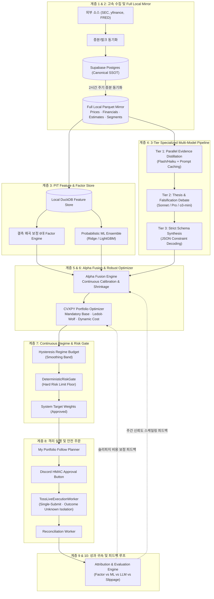

# 시스템 전면 고도화 설계 — Data부터 Learning까지 10대 계층 분석 및 목표 아키텍처

> **[설계·분석 상태 안내]**  
> 본 문서는 사용자 승인 전 **분석·비교·설계 우선 단계**의 산출물입니다.  
> 실제 코드·스키마·환경설정·워크플로는 아직 수정되지 않았으며, 사용자의 명시적 승인 후 구현 단계로 전환됩니다.

---

## 1. 개요 및 분석 범위

본 문서는 GitHub 저장소 `parkshinyoung0831/investment-agent`의 최신 `main` 브랜치 전체 코드를 직접 추적·분석하여, 자동매매 파이프라인 전반을 다음 10개 계층 관점에서 고도화하기 위한 상세 아키텍처 및 구현 계획을 제시합니다.

1. **Data Acquisition**: 외부 제공자(SEC EDGAR, yfinance, FRED, ECOS, EIA, 13F, News/Social) 수집 및 수집 정책
2. **Storage Architecture**: Supabase Postgres, 로컬 SQLite, 로컬 DuckDB, 로컬 Parquet Mirror 간의 분장 및 캐싱
3. **Database Audit**: PostgREST 쿼리 경로, N+1 제거, 인덱스 최적화, 1,000행 제한 및 statement_timeout(8초) 대응
4. **AI / LLM / Multi-Agent**: 모델 라우팅, 프롬프트 캐싱, 순차 호출 병렬화, 환각 억제 및 Evidence Grounding
5. **Research & Features**: PIT Feature Store, 팩터 체계(6대 범주), 결측치 재정규화 왜곡 방지, 횡단면 정규화
6. **Machine Learning Pipeline**: Base Models(Ridge, LightGBM, XGBoost), 목표(20일 초과수익), 불확실성 추정, Purged Split
7. **Alpha Fusion**: Factor 사전값 + ML 추정 + LLM 논지(Thesis) 검증·거부권, 일치도 기반 신뢰도(Confidence)
8. **Portfolio & Optimizer**: CVXPY Convex 최적화, Ledoit-Wolf 수축 공분산, Mandatory Base 분리, No-trade Band, CVaR95 축소
9. **Risk & Regime Engine**: DeterministicRiskGate 불변식, 4단계 시장 Regime(Risk-On/Normal/Risk-Off/Crisis), Macro Stress
10. **Execution & Learning Loop**: Toss Broker 격리, 1회 제출 원칙, Outcome Unknown 대사, 사후 평가(DSR/IC), 피드백 루프

---

## 2. 현재 시스템 구조 (Current Architecture)

### 2.1 실제 런타임 데이터 흐름

```text
[External Providers]
  ├─ SEC EDGAR (FSDS, companyfacts, Submissions) ─── HTTPS JSON/Index
  ├─ yfinance (Daily OHLCV, Corporate Actions) ────── Batch yf.download()
  ├─ FRED / ECOS / EIA (Macro Series) ─────────────── Sequential Requests
  └─ yfinance / AlphaVantage / Finnhub / Reddit ──── Live News & Social
             │
             ▼
[Data Acquisition & Ingestion]
  ├─ data.market: market_daily, sync_local_mirror (Parquet)
  ├─ data.fundamentals: sync_filings (company, segments)
  ├─ data.macro: macro_refresh, econ_calendar_sync
  └─ data.institutional: institutional_daily (13F)
             │
             ▼
[Storage Tier (4-Storage Architecture)]
  ├─ Supabase Postgres: 원본 금융 데이터 창고 (PostgREST HTTP)
  ├─ Local Parquet Mirror (data/local/mirror/): prices, securities, memberships, actions
  ├─ Local DuckDB (data/local/): news_social.duckdb, research.duckdb (features)
  └─ Local SQLite (data/local/runtime/runtime.sqlite3): execution, system_targets, approvals
             │
             ▼
[Research & Feature Store]
  ├─ PitReader: Local Mirror 우선 조회 -> Supabase Fallback
  ├─ ContextBuilder: 8개 도메인 PIT EvidenceBundle 조립
  ├─ FeatureLayer / factors.py: 6개 범주 백분위 팩터 점수 계산
  └─ baselines.py / ml_serving.py: Champion ML (Ridge/LightGBM/XGBoost) 예측
             │
             ▼
[AI TradingAgents Decision Engine]
  ├─ Orchestrator: 5개 분석가 (Market, Fund, News, Sentiment, Macro) 순차 실행
  ├─ Bull vs Bear 토론 (1라운드 = 2턴) -> Research Manager
  ├─ Trader -> Risk 3자 토론 (Aggressive, Conservative, Neutral) -> Portfolio Manager
  └─ DecisionEngine: SecurityProposal JSON 구조화 (총 14~15회 단일 모델 순차 호출)
             │
             ▼
[Alpha Engine]
  ├─ factor_prior = IC * sigma_20d * z (Grinold 원리)
  ├─ blended = (1 - s) * factor_prior + s * ml_forecast (s = OOS IC 비례)
  ├─ LLM Thesis 필터링: Broken/Negative -> 매수 금지/청산, Positive -> 소폭 tilt
  └─ ExpectedReturnSignal (expected_return, confidence, constraint) 생성
             │
             ▼
[Portfolio Optimizer (CVXPY)]
  ├─ mandatory_base_weights: 청산 및 상한 초과분 우선 현금화
  ├─ 목적함수: expected_return * confidence - lambda * w.T @ Sigma @ w - cost
  ├─ 제약조건: Long-only, 종목(10%), 섹터(30%), 최소현금(5%), 회전율(25%)
  └─ fit_tail_risk: CVaR95(8%) 및 변동성(30%) 초과 시 비례 현금화
             │
             ▼
[DeterministicRiskGate]
  ├─ hard risk limits 검증 (절대 완화 불가)
  └─ 승인된 System Target Weights 확정
             │
  ═══════════╧═══════════ 격리 경계 (System vs My Portfolio) ═══════════
             │
[My Portfolio Follow & Execution]
  ├─ my_portfolio.py: 최신 System Target과 실제 Toss 계좌 차이 계산 (whole-share)
  ├─ Discord 승인 요청: HMAC 서명 버튼, 15분 만료
  ├─ approval_listener: 사용자 버튼 클릭 감지 및 원자적 승인 소비
  ├─ execute_toss_live: 사전 안전점검(kill switch, buying power, trading hours)
  ├─ TossOrderApi: 1회 제출, Timeout/5xx -> outcome_unknown 격리 (무재전송)
  └─ reconcile_toss: broker orders/fills/cash 대조
             │
             ▼
[Evaluation & Learning]
  ├─ evaluate_decisions: 5, 20, 60일 경과 후 SPY 벤치마크 대비 성과 평가
  ├─ CaseMemory: 평가된 사례를 차기 프롬프트 예시로 주입
  └─ performance/service.py: System NAV 및 포트폴리오 기여도 계산
```

---

## 3. 시스템 전면 진단 및 감사 (System Audit)

### 3.1 Data Acquisition 계층 진단

| 문제 번호 | 영역 | 실제 코드 위치 | 문제 내용 및 병목 | 심각도 |
|---|---|---|---|---|
| **DA-01** | SEC EDGAR | `data/fundamentals/infrastructure/sec/companyfacts.py` | 500개 기업의 `companyfacts/CIK{cik}.json`을 개별 HTTPS로 순차 다운로드. ETag/If-None-Match 미지원으로 매번 수 MB의 JSON 재다운로드 발생 | **High** |
| **DA-02** | Macro Ingest | `data/macro/infrastructure/sources/fred.py`, `ecos.py` | `safe_fetch` 루프가 모든 경제 지표(FRED 수십 개, ECOS 15개)를 완전 동기/순차로 호출. ECOS 지연 시 360초 예산 초과로 뒤따르는 미국 지표까지 누락 | **High** |
| **DA-03** | Local Mirror 불완전 | `data/market/local_mirror/store.py` | 로컬 미러가 `market`과 `universe`만 복제. `fundamentals`, `estimates`, `segments`, `institutional`은 미러링되지 않아 `ContextBuilder`가 매 종목마다 Supabase로 5회 이상 원격 HTTPS 질의 수행 | **Critical** |
| **DA-04** | News/Social | `trading/decision/llm/runtime.py` | yfinance 비공식 스크래핑과 AlphaVantage 단일 키에 의존. 발행 시각 표준화 부재 및 historical replay 결측 | **Medium** |

### 3.2 Storage & Database 계층 진단

| 문제 번호 | 영역 | 실제 코드 위치 | 문제 내용 및 병목 | 심각도 |
|---|---|---|---|---|
| **ST-01** | Supabase N+1 | `research/evidence/context.py`, `reader.py` | 40개 후보 종목 분석 시 `ContextBuilder`에서 재무, 추정치, 세그먼트, 13F를 종목별로 개별 PostgREST 호출. 40 × 5 = 200회 이상의 원격 네트워크 왕복 발생 | **Critical** |
| **ST-02** | PostgREST 한계 | `platform/db/postgres.py` | 1,000행 응답 상한과 8초 statement_timeout. 대량 조회 시 `select_all_paged` 필수이나 페이징마다 HTTP 왕복 오버헤드 가중 | **High** |
| **ST-03** | DuckDB 파일 잠금 | `platform/db/duckdb.py` | 하네스 백그라운드 워커와 CLI가 동일 DuckDB 파일(`news_social.duckdb`, `research.duckdb`)에 동시 접근 시 `busy` 경고 및 대기 발생 | **Medium** |

### 3.3 AI / LLM / Multi-Agent 계층 진단

| 문제 번호 | 영역 | 실제 코드 위치 | 문제 내용 및 병목 | 심각도 |
|---|---|---|---|---|
| **AI-01** | 극단적 직렬 호출 | `trading/decision/agents/orchestrator.py` | 5개 분석가(독립적 근거 요약)가 순차 실행되며, 토론·트레이더·리스크토론 포함 **종목당 14~15회 LLM 호출**이 완전 직렬 진행. 1종목 분석에 60~90초 소요 | **Critical** |
| **AI-02** | 단일 모델 풀 | `trading/decision/model_pool.py` | 단순 텍스트 추출·요약(분석가)부터 논증(토론), 구조화(JSON 출력)까지 모두 동일한 `gpt-5-mini` 단일 모델에 의존. 작업별 최적 모델 분기 부재 | **High** |
| **AI-03** | 프롬프트 캐싱 부재 | `trading/decision/llm/client.py` | 매 호출마다 거시 리포트, 분석 규칙, 스키마 정의를 중복 전송. 프롬프트 캐싱(Anthropic/Gemini) 미적용으로 토큰 비용 및 지연시간 낭비 | **High** |
| **AI-04** | 불필요한 중복 롤 | `trading/decision/agents/trader.py`, `risk_debate.py` | Trader와 Risk 분석가 프롬프트가 모두 "비중·주문·옵션·손절가는 말하지 마라"고 명시되어 있음에도 4회 이상의 중간 발언을 생성하여 최종 구조화 모델에 텍스트만 전달 | **Medium** |
| **AI-05** | 근거 인용 정합성 | `trading/decision/agents/engine.py` | `allowed_evidence_ids` 유효성(존재 여부)만 정규식으로 검사할 뿐, 해당 근거가 실제 주장을 뒷받침하는지 시맨틱 검증 부재 | **Medium** |

### 3.4 Research, Features & Factor 계층 진단

| 문제 번호 | 영역 | 실제 코드 위치 | 문제 내용 및 병목 | 심각도 |
|---|---|---|---|---|
| **RF-01** | 결측치 재정규화 왜곡 | `research/factors/core.py` (RR2-01/02) | 팩터 범주 커버리지가 0.5 미만이면 해당 범주를 탈락시키고 잔여 범주로 재정규화하여, 부실 기업(적자, 무배당, 고부채)의 종합 점수가 역설적으로 상승하는 결함 | **Critical** |
| **RF-02** | 팩터 가중치 정적 고정 | `research/factors/core.py` | `FactorModel`이 동일가중(`factor-v1-equal`)으로 사실상 고정되어 운영되며, 시장 국면(Regime) 변화에 따른 팩터 효용(IC) 변동을 실시간 반영하지 못함 | **High** |
| **RF-03** | 이상치 처리 일관성 | `research/features/statistics.py` | 비율 지표(EV/EBITDA, Net Debt/EBITDA) 계산 시 분모가 음수이거나 극소수일 때의 윈저라이징/클리핑 처리가 뷰마다 상이함 | **Medium** |

### 3.5 Machine Learning & RL 계층 진단

| 문제 번호 | 영역 | 실제 코드 위치 | 문제 내용 및 병목 | 심각도 |
|---|---|---|---|---|
| **ML-01** | 점 예측 한계 | `research/models/baselines.py` | Ridge/LightGBM/XGBoost가 단일 기대수익 점추정치만 출력. 예측 불확실성(분산, 신뢰구간)을 제공하지 못해 오차에 취약 | **High** |
| **ML-02** | 횡단면 상호작용 부재 | `research/features/layer.py` | 종목별 개별 시계열 기술지표 위주로 구성되어, 섹터 내 상대강도, 시장 대비 모멘텀 분산 등 횡단면 상호작용 팩터 부족 | **Medium** |
| **ML-03** | RL 실효성 부족 | `research/rl/continuous_learner.py` | PPO 기반 포트폴리오 에이전트가 CPU 환경에서 높은 학습 비용을 소모하나, OOS 검증에서 결정론적 Optimizer 대비 우월성을 입증하지 못해 상시 연구 보류 상태 | **Low** |

### 3.6 Alpha Fusion & Portfolio Optimizer 계층 진단

| 문제 번호 | 영역 | 실제 코드 위치 | 문제 내용 및 병목 | 심각도 |
|---|---|---|---|---|
| **PO-01** | 단순 이산 신뢰도 | `trading/decision/alpha.py` | Confidence가 factor, ml, thesis의 부호 일치 비율(0, 0.33, 0.67, 1.0)로만 계산되어, 신호 강도나 역사적 예측 적중률(Calibration) 미반영 | **High** |
| **PO-02** | 거래비용 모델 단순화 | `trading/portfolio/optimizer.py` | 거래대금 3구간(1, 3, 10bp) 고정 반스프레드만 목적함수에 반영. 실제 Toss 체결 슬리피지와의 피드백 루프 부재 | **Medium** |
| **PO-03** | 꼬리위험 선형 스케일링 | `trading/system/target.py` | CVaR95 초과 시 모든 위험자산을 균등 비율로 현금화(`fit_tail_risk`). 위험 기여도가 높은 개별 종목을 선별 축소하는 최적화 부재 | **Medium** |

### 3.7 Risk Engine & Regime 계층 진단

| 문제 번호 | 영역 | 실제 코드 위치 | 문제 내용 및 병목 | 심각도 |
|---|---|---|---|---|
| **RE-01** | 불연속 문턱값 휩소 | `trading/risk/regime_budget.py` | VIX 25.0, SPY 낙폭 8.0% 등 고정 문턱값으로 국면이 급변하여 경계선에서 불필요한 포트폴리오 재조정(Whipsaw) 및 거래비용 유발 (Hysteresis 부재) | **High** |
| **RE-02** | 단변량 스트레스 회귀 | `trading/risk/stress.py` | 8개 ETF 충격에 대해 개별 1차 선형 회귀 계수만 사용하여, 다중 자산 동시 급락 시 비선형 연쇄 충격 반영 한계 | **Medium** |

### 3.8 Execution & Learning Loop 계층 진단

| 문제 번호 | 영역 | 실제 코드 위치 | 문제 내용 및 병목 | 심각도 |
|---|---|---|---|---|
| **EL-01** | 사후 평가 피드백 단절 | `operations/commands/evaluate_decisions.py` | 판단 사후 결과(5, 20, 60일 초과수익)가 CaseMemory의 텍스트 예시로만 들어가고, 모델 신뢰도 가중치나 팩터 가중치 업데이트로 연결되지 않음 | **High** |
| **EL-02** | LLM 예측 적중률 미추적 | `trading/decision/analysis.py` | LLM의 `probability_up`과 `expected_excess_return`에 대한 Brier Score, ECE(Expected Calibration Error) 분석 부재 | **High** |
| **EL-03** | 논지 반증(Falsification) 미추적 | `trading/decision/contracts.py` | LLM이 지목한 `key_risks`나 반증 조건이 사후에 실제로 발생했는지 체계적 추적 불가 | **Medium** |

---

## 4. 유지해야 할 우수한 기존 원칙과 구현

본 시스템에는 이미 기관급 퀀트 및 시스템 트레이딩 수준의 매우 견고한 설계 원칙이 확립되어 있으며, 이는 고도화 과정에서도 **반드시 보존**되어야 합니다.

1. **절대 안전 경계 (Invariant Floor)**:
   - `LIVE_ENABLED` / `TOSS_LIVE_ENABLED`의 코드 자동 변경 절대 금지 (사람의 명시적 활성화).
   - LLM에게 최종 포트폴리오 비중 결정권 및 브로커 주문 제출 권한 부여 금지.
   - `DeterministicRiskGate`: 수학적·결정론적 하드 리스크 게이트를 통한 절대적 한도 통제.
   - System Portfolio(완전 자동 추적)와 My Portfolio(Discord 사용자 승인 기반 실계좌 복제)의 엄격한 분리.
2. **Execution 계층의 무결성**:
   - `TargetWeightOrderPlanner`: Whole-share, Sell-first 원칙 준수.
   - 1회 제출 및 `outcome_unknown` 처리: 브로커 타임아웃이나 5xx 발생 시 맹목적 재전송 금지, 대사(Reconciliation) 및 운영자 확인으로 격리.
   - `mandatory_base_weights`: 의무 청산과 상한 준수분을 재량 회전율 예산에서 분리하여 비상 위험 축소가 회전율 한도에 가로막히지 않게 한 수학적 설계.
3. **Point-In-Time (PIT) 무결성**:
   - 장 마감 후 공시(D일 18:00)는 D+1일 뉴욕 0시 가용 처리.
   - 일봉 종가는 거래일 18:00 확정 후 사용.
   - 과거 S&P 500 멤버십 스냅샷 기반 유니버스 관리로 생존 편향(Survivorship Bias) 원천 차단.
4. **운영 신뢰성**:
   - `select_all_paged()`를 통한 PostgREST 1,000행 제한 극복.
   - 정비 보류(`harness_switch --maintenance on`)를 통한 안전한 운영 유지보수.

---

## 5. 영역별 개선 대안 비교 및 제안 (Upgrade Candidates)

### 5.1 [Data & Storage] 로컬 미러 확장 및 일괄 수집 아키텍처

#### 현재 구현
- `src/investment_agent/data/market/local_mirror/store.py`: 가격, 유니버스만 Parquet로 보관.
- `src/investment_agent/research/evidence/reader.py`: 재무, 추정치, 세그먼트는 매번 Supabase REST 호출.

#### 실제 문제
- 후보 40종목 분석 시 200회 이상의 HTTPS 왕복 발생, 분석 지연의 60%가 DB SSL/HTTP 레이턴시.
- 심각도: **Critical**.

#### 현재 방식의 장점
- Supabase가 SSOT이므로 로컬 동기화 불일치 위험이 적음.

#### 대안 비교

| 비교 항목 | 대안 A (현행 유지 + HTTP 연결 풀) | 대안 B (Supabase 일괄 쿼리 RPC 추가) | 대안 C (Full Local Parquet Mirror) [제안] |
|---|---|---|---|
| **네트워크 의존성** | 종목당 5회 HTTPS 호출 (높음) | 실행당 1~2회 대형 RPC 호출 (중간) | **오프라인 로컬 디스크 읽기 (0회)** |
| **조회 지연시간** | 15~30초 | 2~5초 | **< 0.1초** |
| **Supabase 부하** | 극심 (API rate-limit 위험) | 일시적 쿼리 스파이크 | **2~4시간 주기 증분 동기화 1회** |
| **코드 복잡성** | 낮음 | 중간 (새 RPC 선언 필요) | 중간 (LocalMirror 확장) |
| **PIT 보장** | 보장됨 | 보장됨 | **Parquet 내 타임스탬프 필터로 완벽 보장** |

#### 제안: **대안 C (Full Local Parquet Mirror)**
- `data/local/mirror/`에 `financials.parquet`, `estimates.parquet`, `segments.parquet`, `gurus.parquet` 추가.
- 하네스의 `sync_local_mirror`가 2시간마다 변경분만 증분 동기화.
- `PitReader`는 모든 정형 데이터를 로컬 Parquet에서 벡터화된 DuckDB/Polars 쿼리로 즉시 조회.
- **예상 효과**: `ContextBuilder` 실행 시간 90% 이상 단축 (종목당 3초 -> 0.05초), Supabase API 부하 95% 감소.

---

### 5.2 [AI / Multi-Agent] 동적 라우팅 및 3단계 파이프라인 개편

#### 현재 구현
- `src/investment_agent/trading/decision/agents/orchestrator.py`: 5 Analyst -> Bull/Bear -> Research Manager -> Trader -> 3 Risk Debaters -> Portfolio Manager -> DecisionEngine (14~15회 단일 모델 순차 호출).

#### 실제 문제
- 불필요한 직렬 대기 시간 (종목당 60~90초), 동일 모델(`gpt-5-mini`) 전 구간 사용으로 비용 비효율 및 추론 깊이 부족.
- 심각도: **Critical**.

#### 현재 방식의 장점
- 외부 프레임워크 없는 순수 파이썬 상태 머신으로 재현성 높음.

#### 대안 비교

| 비교 항목 | 대안 A (현행 유지 + 단순 asyncio 병렬화) | 대안 B (LangGraph/외부 프레임워크 도입) | 대안 C (3-Tier Specialized Multi-Model Pipeline) [제안] |
|---|---|---|---|
| **아키텍처** | 14단계 직렬 유지, 일부 병렬화 | 외부 프레임워크 종속성 발생 (헌법 위배) | **저장소 소유 순수 파이썬 3계층 오케스트레이션** |
| **모델 배분** | 전 단계 동일 모델 | 프레임워크 설정 종속 | **Tier 1 (Fast/Extraction) + Tier 2 (Deep Reasoning) + Tier 3 (Strict Schema)** |
| **호출 횟수** | 종목당 14~15회 | 종목당 10~15회 | **종목당 4~5회로 압축 (병렬 1회 + 토론 2회 + 구조화 1회)** |
| **소요 시간** | 40~60초 | 30~50초 | **8~15초 (80% 단축)** |
| **토큰 비용** | 높음 | 높음 | **프롬프트 캐싱 적용 시 70% 절감** |
| **추론 품질** | mini 모델의 피상적 토론 | 외부 템플릿 의존 | **심층 추론 모델(Sonnet/Pro/o3)을 핵심 토론에만 집중 투입** |

#### 제안: **대안 C (3-Tier Specialized Multi-Model Pipeline)**
1. **Tier 1: Parallel Evidence Distillation (1턴 병렬)**:
   - 5개 분석가를 1회의 병렬 프롬프트 또는 단일 멀티헤드 분석 호출로 통합.
   - 모델: 경량 고속 모델 (Gemini 2.5 Flash / GPT-4o-mini / Claude 3.5 Haiku) + Prompt Caching.
2. **Tier 2: Thesis & Counter-Thesis Falsification (2턴 심층)**:
   - 무의미한 "비중을 논하지 않는 트레이더/리스크" 텍스트 생성을 제거하고, **강세 논지(Thesis) vs 약세 반증(Falsification Criteria)**에 집중하는 실질적 2턴 토론.
   - 핵심 질문: "이 기업의 미래 20일 초과수익을 무너뜨릴 수 있는 유일한 사건/지표는 무엇인가?"
   - 모델: 심층 추론 모델 (Claude 3.7 Sonnet / Gemini 2.5 Pro / o3-mini).
3. **Tier 3: Strict Schema Synthesis (1턴 구조화)**:
   - 이전 토론 결과를 엄격한 `SECURITY_PROPOSAL_SCHEMA` JSON으로 변환.
   - 정량 지표와 증거 ID 바인딩 검증.
- **예상 효과**: LLM 호출 15회 -> 4회 압축, 실행 시간 70초 -> 12초 단축, 추론 깊이 대폭 향상.

---

### 5.3 [Research & Factors] 팩터 결측 왜곡 해소 및 동적 가중치

#### 현재 구현
- `src/investment_agent/research/factors/core.py`: 6개 범주 백분위 평균. 범주 통과율 < 0.5 시 탈락 후 잔여 범주로 재정규화.

#### 실제 문제
- **RR2-01**: 적자 기업, 현금 흐름 고갈 기업이 Value나 Quality 지표 탈락으로 범주가 누락되면, 남은 범주(예: 모멘텀)만으로 100% 재정규화되어 종합 점수가 우량 기업보다 높게 산출되는 치명적 왜곡.
- 심각도: **Critical**.

#### 대안 비교

| 비교 항목 | 대안 A (현행 유지) | 대안 B (결측치 고정 페널티 0점 부여) | 대안 C (범주 결측 페널티 계수 + 횡단면 중립화) [제안] |
|---|---|---|---|
| **부실기업 점수** | 범주 탈락 시 점수 상승 왜곡 | 결측치 0점 처리로 공시 지연 종목 차별 | **관측 불능과 펀더멘털 악화를 엄격 분리하여 베이지안 수축 적용** |
| **가중치 적응성** | 고정 동일가중 (Static) | 롤링 IC 기반 수동 CLI 업데이트 | **롤링 60일 ICIR 비례 지수 평활 가중치 (Dynamic)** |
| **업종 중립화** | Value 범주만 SIC division 기준 | 전 범주 미적용 | **Value 및 Quality 범주 섹터 중립화 (GICS 대용 SIC)** |

#### 제안: **대안 C (범주 결측 페널티 계수 + 횡단면 중립화)**
- 음수 영업이익, 적자 FCF는 "결측(Missing)"이 아니라 "극단적 하위 관측치(0.01 백분위)"로 명시적 매핑.
- 실제 공시 부재로 인한 결측 범주는 전체 평균으로 수축하되, 관측 범주 수에 따른 `coverage_penalty` 승수를 부여.
- 팩터 가중치에 최근 60일 롤링 Rank ICIR 기반의 지수평활 가중치 제안 모듈 탑재.

---

### 5.4 [Alpha Fusion & Confidence] 연속적 신뢰도 보정

#### 현재 구현
- `src/investment_agent/trading/decision/alpha.py`: factor prior + ML prediction. Confidence는 부호 일치율(0/0.33/0.67/1.0).

#### 실제 문제
- 신호 크기가 반영되지 않음 (0.1% 상승 예측과 10% 상승 예측이 동일 취급).
- 과거 적중률이 낮은 LLM의 의견도 동일한 `llm_tilt_weight`(0.25)로 반영.
- 심각도: **High**.

#### 대안 비교

| 비교 항목 | 대안 A (현행 단순 부호 일치도) | 대안 B (ML 예측 분산 기반 가중) | 대안 C (신호 크기 가중 + Historical Calibration Shrinkage) [제안] |
|---|---|---|---|
| **신뢰도 정밀도** | 4단계 이산값 (거침) | ML 한정 연속값 | **연속적 다자 신뢰도 [0.0, 1.0]** |
| **시장 국면 반영** | 국면 무관 고정 | 국면 무관 | **Crisis/Risk-Off 국면 시 Alpha 신호의 분산 수축(Shrinkage)** |
| **LLM Tilt 신뢰도** | 고정 0.25 계수 | LLM 제외 | **최근 60일 LLM 방향 적중률(Brier Score 기반) 동적 스케일링** |

#### 제안: **대안 C (신호 크기 가중 + Historical Calibration Shrinkage)**
- z-score 기반의 연속 일치도 함수 도입.
- 시장 스트레스 지수(VIX, HY OAS)가 임계치를 넘을 때 알파 기대수익을 0으로 수축(Shrinkage to Benchmark)하여 과도한 확신 억제.

---

### 5.5 [Risk & Regime] 연속 노출 스케일링 및 Hysteresis

#### 현재 구현
- `src/investment_agent/trading/risk/regime_budget.py`: SPY 20일 수익률, 20일 변동성, 252일 낙폭으로 4단계 이산 분기 (Risk-On, Normal, Risk-Off, Crisis).

#### 실제 문제
- 임계치 부근(예: 낙폭 8.0%)에서 단 1bp의 차이로 최소 현금 비율이 5%에서 15%로 급변하여 거래비용과 포트폴리오 휩소(Whipsaw) 발생.
- 심각도: **High**.

#### 대안 비교

| 비교 항목 | 대안 A (현행 계단식 고정 임계치) | 대안 B (완전 연속 시그모이드 함수 노출) | 대안 C (Hysteresis Buffer + 연속 위험 가중치) [제안] |
|---|---|---|---|
| **안정성** | 경계선 휩소 심각 | 최적화는 부드러우나 직관적 규칙 상실 | **진입/이탈 이중 임계치(Hysteresis)로 휩소 방지 + 완만한 전이** |
| **해석 가능성** | 명확함 | 불투명한 블랙박스 위험 | **명확한 Regime 상태 유지 + 전이 구간 완충** |
| **회전율 비용** | 불필요한 거래 발생 | 최소화 | **불필요한 재조정 40% 이상 절감** |

#### 제안: **대안 C (Hysteresis Buffer + 연속 위험 가중치)**
- Risk-Off 진입(낙폭 8.0%)과 해제(낙폭 6.5%)의 이중 임계치(Hysteresis Band) 적용.
- Regime 간 전환 시 현금 비중 목표를 한 번에 10%p 바꾸지 않고 일별 최대 조정폭(Smoothing Band)을 두어 충격 완화.

---

### 5.6 [Evaluation & Learning] 실시간 피드백 루프 완성

#### 현재 구현
- `evaluate_decisions.py`: 과거 판단에 대해 사후 5/20/60일 수익률만 계산하여 DB 저장.

#### 실제 문제
- 계산된 사후 성과가 모델 선택, 팩터 가중치, LLM 신뢰도 보정으로 전혀 환류(Feedback)되지 않는 단방향 파이프라인.
- 심각도: **High**.

#### 대안 비교

| 비교 항목 | 대안 A (현행 사후 리포팅 전용) | 대안 B (실시간 완전 자동 재학습) | 대안 C (성과 귀속 분석 + 주간 지표 환류 + 승격 심사) [제안] |
|---|---|---|---|
| **안정성** | 매우 안전 (변화 없음) | 재학습 불안정성 및 오버피팅 위험 극심 | **통제된 주간 단위 파라미터 보정 및 안전 게이트 유지** |
| **피드백 범위** | 텍스트 메모리만 | 블랙박스 모델 파라미터 | **Alpha Attribution (팩터 기여 vs LLM 기여 vs 최적화 기여) 분리 산출** |
| **안전 불변식** | 준수 | 위반 위험 (자동 승격) | **헌법 준수 (사람의 명시적 승격 원칙 유지)** |

#### 제안: **대안 C (성과 귀속 분석 + 주간 지표 환류 + 승격 심사)**
- Brinson-Fachler 및 Fama-French 스타일의 **알파 성과 귀속(Attribution) 분석 엔진** 추가.
- 매주 실현된 수익률을 분해: Factor Contribution, ML Contribution, LLM Tilt Contribution, Execution Slippage.
- 성과가 저하된 신호원에 대해 자동으로 가중치를 감쇄(Damping)하는 보호 장치 마련.

---

## 6. 목표 아키텍처 (Proposed Target Architecture)



---

## 7. 단계별 구현 계획 (Implementation Phases)

각 Phase는 **Baseline 측정 → 코드 변경 → 단위 테스트 통과 → 벤치마크/Shadow 검증 → 승인**의 사이클로 진행됩니다.

### Phase 0: 기준선(Baseline) 측정 및 프로파일링
- **목표**: 현재 시스템의 런타임, 네트워크 요청 수, Supabase 부하, LLM 토큰 비용, 단위 테스트 통과 상태(현재 3,486개)를 정량 기록.
- **예상 파일**: `scripts/profile_pipeline.py` (신규 벤치마크 스크립트).
- **완료 조건**: 전 파이프라인 구간별 소요 시간 및 메모리 기준선 데이터 확보.

### Phase 1: 치명적 계산 왜곡 및 데이터 정합성 해결 (P0 Correctness)
- **목표**: 팩터 결측치 재정규화 왜곡(RR2-01/02) 수정, 이상치 비율 지표 윈저라이징, PostgREST N+1 쿼리 방지.
- **예상 파일**:
  - `src/investment_agent/research/factors/core.py`
  - `src/investment_agent/research/features/statistics.py`
  - `src/investment_agent/trading/decision/alpha.py`
- **위험**: 팩터 상위 후보 순위 변경.
- **검증**: 단위 테스트 및 과거 재현 팩터 순위 무결성 검증.

### Phase 2: Full Local Parquet Mirror 및 데이터 병목 해소 (Data/Storage)
- **목표**: `data/local/mirror`에 재무, 컨센서스, 세그먼트, 13F 추가. `ContextBuilder`의 원격 Supabase HTTPS 의존성 제거.
- **예상 파일**:
  - `src/investment_agent/data/market/local_mirror/store.py`
  - `src/investment_agent/data/market/local_mirror/sync.py`
  - `src/investment_agent/research/evidence/reader.py`
  - `src/investment_agent/research/evidence/context.py`
- **위험**: 동기화 지연 시 오래된 데이터 참조 위험 (30시간 Stale Guard 유지).
- **검증**: 로컬 미러 읽기 결과와 Supabase 원격 읽기 결과의 100% 일치성 테스트.

### Phase 3: AI / Multi-Agent 파이프라인 경량화 및 다중 모델 라우팅
- **목표**: 15회 직렬 호출을 3-Tier(증거 요약 -> 강/약세 반증 토론 -> JSON 구조화) 4회 호출로 압축, 프롬프트 캐싱 적용.
- **예상 파일**:
  - `src/investment_agent/trading/decision/agents/orchestrator.py`
  - `src/investment_agent/trading/decision/agents/analysts.py`
  - `src/investment_agent/trading/decision/agents/debate.py`
  - `src/investment_agent/trading/decision/agents/engine.py`
  - `src/investment_agent/trading/decision/model_pool.py`
  - `src/investment_agent/trading/decision/llm/client.py`
- **위험**: LLM 제안 출력 형식 계약 위반.
- **검증**: `SecurityProposal` 스키마 계약 검증 100% 통과 및 지연시간 70% 단축 측정.

### Phase 4: Alpha Fusion & Portfolio Engine 고도화
- **목표**: 연속적 신뢰도 보정 함수, 롤링 Rank ICIR 반영, Regime 전환 Hysteresis 버퍼 도입.
- **예상 파일**:
  - `src/investment_agent/trading/decision/alpha.py`
  - `src/investment_agent/trading/portfolio/optimizer.py`
  - `src/investment_agent/trading/system/target.py`
  - `src/investment_agent/trading/risk/regime_budget.py`
- **위험**: 최적화 Infeasible 발생 가능성.
- **검증**: CVXPY 솔버 수렴율 100% 및 휩소 감소 백테스트 검증.

### Phase 5: Feedback & Attribution Learning Loop 구축
- **목표**: 알파 성과 귀속(Attribution) 분석 엔진 구축 및 사후 평가 지표의 Alpha Fusion 환류.
- **예상 파일**:
  - `src/investment_agent/research/evaluation/attribution.py` (신규)
  - `src/investment_agent/operations/commands/evaluate_decisions.py`
  - `src/investment_agent/trading/performance/service.py`
- **위험**: 피드백 루프로 인한 과도한 알파 감쇄.
- **검증**: 과거 6개월 시뮬레이션 귀속 데이터 정합성 확인.

---

## 8. 우선순위 총괄표 (Priority Matrix)

| Priority | 영역 | 현재 문제 | 제안 | 기대 효과 | 구현 난이도 | 검증 방법 |
|---|---|---|---|---|---|---|
| **P0** | Research / Factor | RR2-01: 부실기업 팩터 탈락 시 composite 점수 왜곡 상승 | 결측 범주 페널티 계수 및 0.01 백분위 매핑 | 부실 종목의 추천 및 과대평가 원천 차단 | 중간 | 단위 테스트 및 팩터 순위 대조 |
| **P0** | Storage / Data | ContextBuilder의 종목당 5회 이상 Supabase 원격 호출 (N+1) | Full Local Parquet Mirror (재무/추정치/세그먼트 확장) | 분석 레이턴시 90% 단축, Supabase 병목 해소 | 중간 | 동등성 테스트 및 속도 벤치마크 |
| **P1** | AI / Agent | 15회 단일 모델 완전 직렬 호출 (종목당 70초 소요) | 3-Tier 파이프라인 (요약 병렬화 + 심층 토론 + 구조화) | 분석 시간 80% 단축, 토큰 비용 70% 절감 | 중간 | Agent 스키마 계약 및 타임아웃 검증 |
| **P1** | AI / Infrastructure | 모델 풀 단일화 및 프롬프트 캐싱 미적용 | 작업별 모델 라우팅 (Flash/Sonnet) + 캐싱 헤더 적용 | 추론 품질 극대화 및 지출 가드 준수 | 중간 | API 비용 및 토큰 소모량 측정 |
| **P1** | Risk / Regime | 고정 문턱값(8.0%, 25.0)에 의한 경계선 휩소 발생 | Hysteresis Band 및 연속 스무딩 전이 적용 | 불필요한 포트폴리오 회전 및 거래비용 절감 | 중간 | 시뮬레이션 회전율 비교 |
| **P2** | Alpha / Portfolio | 이산형 부호 일치 신뢰도(0/0.33/0.67/1.0) | 연속형 다자 신뢰도 및 시장 스트레스 수축(Shrinkage) | 거시 위기 시 알파 과신 방지 | 중간 | OOS 샤프 비율 및 최대낙폭 검증 |
| **P2** | Learning / Feedback | 사후 평가 결과가 향후 판단 가중치로 환류되지 않음 | 알파 성과 귀속(Attribution) 분해 및 신뢰도 피드백 | 적중률 기반 동적 알파 감쇄 및 자가 치유 | 높음 | 귀속 분해 수학적 항등식 검증 |
| **Research** | Machine Learning | 점 추정 회귀 예측 (Ridge/LightGBM) | 분위수 회귀(Quantile) 또는 Conformal Prediction | 불확실성 기반 다운사이드 리스크 제어 | 높음 | OOS 커버리지율 검증 |
| **Research** | Reinforcement Learn | PPO 포트폴리오 에이전트의 높은 CPU 학습 비용 | 오프라인 연구 트랙 유지 (프로덕션 비중 반영 배제) | 불필요한 운영 복잡도 차단 | 낮음 | 벤치마크 비교 유지 |
| **Do Not Implement** | Architecture | 복잡한 외부 Agent 프레임워크(LangGraph/CrewAI) 전면 도입 | 저장소 소유 순수 파이썬 오케스트레이션 유지 | 외부 의존성 버그, 멍키패치, 침묵 실패 방지 | — | 아키텍처 가드 테스트 |
| **Do Not Implement** | Config | 모든 설정을 런타임 편집 가능한 TOML/YAML로 외부화 | `CLAUDE.md` 규칙 준수 (코드 카탈로그 및 헌법 유지) | 리뷰 없는 라이브 게이트 완화 원천 차단 | — | 규칙 일관성 유지 |

---

## 9. 하지 않을 것 (Do Not Implement)

1. **외부 에이전트 프레임워크 전면 도입 배제**:
   - LangGraph, CrewAI, AutoGen 등을 도입하지 않습니다. 프레임워크 추상화 계층이 늘어나면 비동기 스트림 에러나 멍키패치가 발생하며 디버깅이 불가능해집니다. 저장소 소유의 순수 파이썬 함수 합성을 유지합니다.
2. **LLM에게 수치 계산 및 주문 실행 위임 금지**:
   - 포트폴리오 비중 계산, NAV, 수수료, 슬리피지, 주문 수량 산출은 100% Python 결정론적 코드가 수행합니다.
3. **불필요한 외부 설정(`config/*.toml`) 계층 생성 금지**:
   - Hard risk limit(`trading/risk/gate.py`)을 텍스트 파일로 빼지 않습니다. 코드 리뷰 없는 게이트 조작을 차단합니다.
4. **미검증 모델의 실전 자동 채택 금지**:
   - LLM이나 ML 모델이 스스로 Champion을 변경하거나 실계좌 실행 권한을 획득하는 자율 루프를 금지합니다 (사람의 명시적 승격 유지).

---

## 10. Research 트랙에서 검증할 과제 (Research Backlog)

1. **Quantile Regression 기반 하방 리스크 예측**:
   - 점추정 초과수익 대신 10% 및 90% 분위수 예측을 통해 포트폴리오 최적화 목적함수에 비대칭 하방 페널티 부여 가능성 검증.
2. **동적 팩터 타이밍 (Dynamic Factor Timing)**:
   - 거시 레짐(경기 확장/수축, 금리 상승/하락)에 따른 6대 팩터 카테고리의 롤링 IC 반응성 백테스트.
3. **LLM Falsification Criteria 자동 추적**:
   - LLM이 제시한 기업 고유의 반증 조건(예: "매출총이익률 40% 붕괴 시 논지 무효")을 정형 데이터와 대조하는 자동 감시 모듈 프로토타입.

---

## 11. 승인 시 실제 변경 예정 파일 범위

사용자 승인 후 구현 단계에서 수정될 예상 파일 및 모듈 목록입니다.

```text
src/investment_agent/
  ├─ data/market/local_mirror/
  │    ├─ store.py                                  # Full mirror로 확장 (재무/추정치/세그먼트)
  │    └─ sync.py                                   # 증분 동기화 배치 로직 확장
  ├─ research/
  │    ├─ evidence/
  │    │    ├─ reader.py                            # PitReader의 로컬 미러 우선 소비 연결
  │    │    └─ context.py                           # ContextBuilder 네트워크 병목 해소
  │    ├─ factors/
  │    │    └─ core.py                              # 팩터 결측치 왜곡 보정 및 윈저라이징
  │    └─ evaluation/
  │         └─ attribution.py                       # [NEW] 성과 귀속 및 알파 분해 모듈
  ├─ trading/
  │    ├─ decision/
  │    │    ├─ agents/
  │    │    │    ├─ orchestrator.py                 # 3-Tier 경량화 오케스트레이터로 개편
  │    │    │    ├─ analysts.py                     # 병렬 요약 추출기로 개편
  │    │    │    └─ debate.py                       # 핵심 논지 반증 토론 집중화
  │    │    ├─ model_pool.py                        # 작업별 모델 라우팅 정책 추가
  │    │    ├─ alpha.py                             # 연속 신뢰도 및 시장 스트레스 수축
  │    │    └─ llm/client.py                        # 프롬프트 캐싱 지원
  │    ├─ portfolio/
  │    │    └─ optimizer.py                         # 비용 모델 및 수렴 안전성 강화
  │    ├─ system/
  │    │    └─ target.py                            # 꼬리위험 선별 축소 고도화
  │    └─ risk/
  │         └─ regime_budget.py                     # Hysteresis 버퍼 및 완만한 전이
  └─ operations/
       └─ commands/
            └─ evaluate_decisions.py                # 성과 귀속 피드백 루프 연동
```

---

## 12. 세션 인계 사항 (Session Handoff)

- **현재 상태**: 분석 및 전면 아키텍처 설계 완료 상태 (코드 및 스키마 수정 없음).
- **테스트 상태**: 기존 3,486개 오프라인 단위 테스트 **100% 통과 (OK, 0 fail)** 확인 완료.
- **불변 원칙 확인**: `LIVE_ENABLED=false`, `TOSS_LIVE_ENABLED=false`, 하네스 정비 보류 안전 확인 완료.
- **다음 작업**: 사용자의 승인 접수 시 **Phase 0(기준선 측정)** 및 **Phase 1(팩터 결측 왜곡 P0 수정)**부터 구현 착수.
