# 저장 계층 최소화 검토와 Markdown 개정안

> 상태: **제안 및 구현 전 계약 검토**. 이 문서는 DB 적용 완료를 의미하지 않는다.
> 검토 기준: 2026-09-06, 로컬 체크아웃 `e6663d2`의 DDL·코드·문서.
> 원격 GitHub HEAD, 실제 Supabase 설치 상태·행 수·사용량은 이번 검토에서 확인하지 않았다.
> 개발 규칙 SSOT는 계속 `CLAUDE.md`다. 아래 교체 문안은 해당 구현·검증이 끝나는 단계에 반영한다.

## 1. 결론과 채택 범위

**Supabase = 장기 금융 사실, Parquet + DuckDB = 분석, SQLite = 로컬 판단·매매 상태**라는 경계는 채택한다.
다만 제안의 테이블 목록을 그대로 최종 DDL로 옮기면 현재 동작 중인 수집·재계산·일정 감시·승인 계약 일부가 사라진다.
이번 개편의 목표는 컬럼 수 자체를 최소화하는 것이 아니라 **필요한 의미와 복구 가능성을 유지하면서 반복 저장을 줄이는 것**이다.

특히 다음 보완을 포함해야 한다.

1. 350~400MB는 **인덱스·TOAST·시스템 기본 사용량을 포함한 전체 DB 사용 목표**로 정의한다. 여기에 인덱스 예산을 다시 더하지 않는다.
2. Market의 `ingested_at` 삭제 전에 가격 정정에 따른 Feature 재계산·로컬 동기화 계약을 교체한다.
3. 거래일만으로 일봉 공개 시각을 판정하지 않는다. 완료 세션과 데이터 조정 기준을 함께 정의한다.
4. canonical 재무를 최초 공시일에 소급해 넣지 않는다. 정정 전 값이 없는 기간은 엄격한 과거 재현에서 결측이다.
5. `fundamentals.earnings_schedule_versions`, `macro.measures`는 실제 소비자가 있으므로 유지한다.
6. Macro의 도메인 분류는 금융자산 이름보다 **발표·수정 특성**을 기준으로 재검토한다. 모든 경제지표에 과거 빈티지가 있다는 보장은 하지 않는다.
7. Parquet 전환에는 중복 제거·파일 게시·정리·잠금·재시작 복구가 필요하다. `read_parquet('**/*.parquet')` 한 줄로 운영 설계가 끝나지 않는다.
8. SQLite 이전은 PostgreSQL 승인 RPC와 복합 제약을 재구현하는 작업이다. 테이블 복사나 UUID 삭제 작업으로 취급하지 않는다.
9. Supabase 알림 상태를 제거하려면 전송을 담당할 영속 실행 주체를 먼저 정한다. GitHub Actions마다 생기는 임시 SQLite는 대체재가 아니다.
10. 이미 구현된 Market archive와 Intelligence 저장소를 재활용한다. 새로 만든다는 계획으로 되돌리지 않는다.

### 제안별 판정

| 제안 | 판정 | 최종 방향 |
|---|---|---|
| 5개 금융 도메인만 Supabase | 채택, 단계적 적용 | 금융 도메인 5개 + 금융 사실용 reporting ordinary views |
| `security_id bigint → integer` | 채택 | 값·FK·API 계약을 보존하고 물리 타입만 축소 |
| membership JSON → interval | 채택, 이력 품질 조건 | 실제 효력일과 관측일을 구분, 중첩 방지·완전성 검증 |
| `member_count` 제거 | 채택 | 저장 중복은 제거하되 구성원 수 품질 검사는 유지 |
| watchlist 부모 제거 | 조건부 채택 | 현재 기본 `fundamentals` 목록 외 사용이 없는지 확인 후 평탄화 |
| `is_tracked`도 중복이므로 제거 | 보류 | 전체 수집 gate와 관심종목 fast path는 현재 다른 책임 |
| OHLC `double precision` | 채택 | finite·OHLC 제약 보존, 주문 금액 타입과 분리 |
| 가격 행 `source` 제거 | 채택 | provider는 owner 설정, repair 여부는 boolean |
| 가격 행 `ingested_at` 제거 | 선행조건 후 채택 | 재계산 무효화·동기화·실제 판단 증거 대체 필요 |
| 가격 인덱스 2개 | 시작안으로 채택 | PK + 날짜 인덱스, INCLUDE는 대표 쿼리 측정 후 판단 |
| `financial_versions → financials` | 채택 | 숫자 정정 이력 포기, provenance·mapping·가용시각 보존 |
| 재무 금액·주식수 일괄 bigint | 일괄 적용하지 않음 | 실제 단위·소수·범위를 컬럼별 검사 |
| Macro 시장/경제 fact 분리 | 채택 | 공개 시각 정책·빈티지 지원 수준도 분리 |
| `series_key smallint` | 채택 | code UNIQUE, 키는 재배포·재시드 때 바뀌지 않음 |
| `source_params` 코드로 이동 | 채택 | 수집 설정은 코드, 데이터 해석 metadata는 유지 |
| Manager 해석을 config로 이동 | 채택 | 용량 절약보다 SSOT 개선, Reporting에서 조립 |
| 13F 원본 필드 축소 | 조건부 채택 | 중복 판별·정정 합성·정합성 검증 사용 여부 먼저 조사 |
| News/Social 90일 Parquet | 채택 | 기존 PIT 시각·mention 의미 보존, 본문 중복 적재 금지 |
| Research Wide Parquet | 채택 | 입력 버전 고정, 실제 소비하는 metadata만 생성 |
| Strategy allocations 관계형 | 채택 | 현금·공매도 정책, 실행 3축, 불변 run identity 명시 |
| `discord_sent_at` Research에서 제거 | 채택 | durable delivery state를 먼저 이전 |
| Runtime SQLite | 채택, 마지막 위험 단계 | 승인·주문 원자성·복원 후 대사까지 동등 검증 |
| 모든 run ID를 integer로 교체 | 선택 적용 | 외부 승인·hash·멱등키에 연결된 기존 ID는 보존 |
| JSONB를 raw에만 허용 | 완화 | 작고 가변적인 config나 불변 승인 증거도 정당한 용도 |

## 2. 현재 저장소에서 확인한 사실

아래 경로는 저장소 루트 기준이다. “현재”는 실제 원격 DB가 아니라 **현재 선언·구현**을 뜻한다.

| 근거 파일 | 확인 내용 | 개편에 주는 영향 |
|---|---|---|
| `db/v1/10_universe.sql` | `security_id bigint`; memberships JSONB; `is_tracked`; watchlist `sources` | 타입 축소와 membership 전환은 gate·identifier까지 함께 검토 |
| `db/v1/20_market.sql` | OHLC numeric, source, ingested_at, INCLUDE(close), ingestion index | 제안의 가격 저장 현황 설명은 일치 |
| `data/market/repository.py`¹ | `known_at`을 `ingested_at`으로 필터 | 역사 데이터 공개 기준과 로컬 관측 기준 분리 필요 |
| `research/features/db.py`¹ | `earliest_market_change_since()`가 ingestion 시각으로 정정 탐지 | timestamp 삭제는 재계산 누락으로 이어질 수 있음 |
| `data/market/archive.py`¹ | ticker별 daily Parquet를 merge 후 원자 교체 | archive 기반은 이미 있음; 불변 연구 snapshot과는 다름 |
| `data/market/retention.py`¹ | 최근 7년 daily, 그 이전 3년 일부 일봉만 유지; prune은 no-op | `prices_daily`의 일별 밀도 계약과 보존 정책 재정의 필요 |
| `db/v1/30_fundamentals.sql` | `financial_versions` PK `(cik, period_end, accession_no)`; `mapping_version`; 실적 일정 이력 | 숫자 version 삭제 범위와 일정 이력 보존을 구분 |
| `data/fundamentals/infrastructure/supabase/company_financials.py`¹ | `source_manifest`는 메모리 전용, wide 컬럼과 mapping 저장 | 행 하나의 accession만으로 복합 산출 근거가 충분한지 확인 |
| `db/v1/40_macro.sql` | `observation_versions` 공용; measures·시각 정밀도·forecast kind 존재 | 7개 테이블로 줄이는 과정에서 단위·예상 종류를 잃으면 안 됨 |
| `data/macro/releases/SOURCE_CONTRACT.md`¹ | ECOS·EIA 등 과거 빈티지 미지원/제한 명시 | 경제지표 테이블을 version으로 만들어도 과거 값이 생기지 않음 |
| `db/v1/50_institutional.sql` | `RESTATEMENT`와 `NEW HOLDINGS` 구분, source row PK | 정정 filings를 단순 latest 한 건으로 고르면 안 됨 |
| `platform/research_store.py`¹ | 기술지표 wide table, 전략 weights JSON, `discord_sent_at`, 범용 records | Feature는 현재 EAV라고 단정하지 않음; JSON·본문 혼합을 해체 |
| `db/duckdb/intelligence/v1/*.sql`, `data/intelligence/`¹ | 뉴스·소셜·mentions·collection_runs 구현 존재 | 미구현 스펙처럼 다시 시작하지 않음 |
| `db/v1/70_execution.sql`, `execution/db.py`¹ | 승인·주문 plan hash 결합, reserve/consume RPC | SQLite로 같은 불변식과 crash 처리 이식 |
| `db/v1/80_notifications.sql`, `85_operations.sql` | outbox·subscription·job health·heartbeat | 로그와 제어 상태를 구별, 제거 전 대체 consumer 필요 |
| `db/v1/90_reporting.sql` | 금융·매매·알림·운영을 모두 SQL view로 제공 | Supabase 밖 데이터의 view는 Python Reporting reader로 이전 |

¹ `src/investment_agent/` 아래 경로.

기존 hardening roadmap은 Market archive를 미구현으로 서술하지만 현재 코드에는 구현이 있다.
기존 Intelligence spec도 일부 “신규” 작업이 이미 구현된 상태다. 이 문서를 적용할 때 체크리스트를 그대로 재실행하지 말고 현재 파일과 대조한다.
graphify는 의존성 탐색 보조로 사용했다. 일부 노드가 사라진 과거 문서를 가리켜, 설계 판단은 직접 읽은 DDL·코드로 보정했다.

## 3. 저장 원칙에 추가할 두 가지 질문

사용자가 제안한 다섯 질문은 유효하다. 다만 다음도 검사한다.

- 이 값이 없으면 **중복 실행, 장애 복구, 변경 전파, 의미 해석**이 조용히 깨지는가?
- 외부에서 다시 받을 수 있더라도 **같은 내용·같은 공개 시각·같은 사용 권한·허용 가능한 비용**으로 복구할 수 있는가?

`filing_processing`, 승인 hash, forecast 종류, 단위, mapping version은 큰 분석 값이 아니어도 보존할 이유가 있다.
“계산 가능”한 값도 원본이 TTL로 사라지거나 provider가 과거 데이터를 수정하면 똑같이 재계산할 수 없다.

최종 규칙은 다음과 같다.

> 장기 canonical에는 재사용할 금융 사실과 그 의미·출처를 저장한다.
> 대규모 본문·분석 행은 Parquet에 저장하고 DuckDB는 이를 조회한다.
> 제어·승인·중복 방지·실제 돈의 원장은 작은 영속 상태로 유지한다.
> 파생 값은 기본적으로 재계산하되, 특정 연구 결과의 재현과 실제 결정 증명에 필요한 입력은 고정한다.

## 4. 500MB 예산을 올바르게 정의하기

### 4.1 중복 계산을 없앤 예산

정상 목표는 `pg_database_size(current_database())` 기준 350MB 이하, 경고 구간은 350~400MB로 제안한다.
이는 **데이터만 350MB**가 아니다. 인덱스·TOAST·빈 페이지·기본 스키마 등을 포함한 측정값이다.
400MB 이상에서는 큰 backfill·rewrite 전에 예산을 검토하고, 450MB에 도달하기 전에 history 축소·archive 검증 등 정리 작업을 끝내는 내부 운영 정책을 둔다.
이 임계치는 프로젝트 권고값이며 Supabase 공식 임계치가 아니다.

공식 문서는 Free DB 제한 500MB와 전체 disk 사용량을 구분한다. WAL·시스템 로그까지 같은 DB 예산에 중복 합산하지 말고 disk 지표로 따로 본다.
기본 프로젝트 공간도 0이 아니므로 금융 테이블에 500MB 전부를 배분할 수 없다.
출처: [Supabase database and disk size](https://supabase.com/docs/guides/platform/database-size).

MB는 본 문서 계산에서 1,000,000 bytes, MiB는 1,048,576 bytes다. 운영 화면 표기와 raw bytes를 함께 기록한다.
도메인별 퍼센트는 고정 quota로 만들지 않는다. 실제 행 수와 증가 속도로 관리한다.

### 4.2 타입 변경만으로 얼마가 줄어드는지 확정하지 않기

`bigint → integer`의 컬럼 값 자체는 4 bytes 줄지만 heap alignment와 index tuple 정렬 때문에 실제 relation이 행당 정확히 4 bytes씩 줄지는 않는다.
예를 들어 `integer + date`는 정렬상 유리할 수 있지만 다른 컬럼 순서에서는 padding이 절감분을 상쇄할 수 있다.
`numeric` 또한 값 크기에 따라 저장량이 달라져 `double precision`이 언제나 더 작다고 단정할 수 없다.
가격용 double 채택의 근거는 분석 연산·고정 폭·허용 정밀도이며 **공간 절감량은 실측**한다.
타입 근거: [PostgreSQL numeric types](https://www.postgresql.org/docs/current/datatype-numeric.html).

가격 규모 가정: 500종목 × 연 252거래일 × 7년 = 약 882,000행, 10년 = 1,260,000행.
ETF·상장폐지·과거 구성종목·복수 클래스는 별도 증가분이다. SP500 500종목만으로 생존편향 없는 전체 역사를 추정하지 않는다.
시험 결과가 모든 인덱스를 포함해 가격 행당 120/160/200 bytes라면 100만 행은 각각 약 120/160/200MB다.
이 수치는 **용량 감도 예시이며 측정 결과가 아니다**.

### 4.3 적용 전 실행할 읽기 전용 측정 SQL

다음은 실행 전 환경 확인을 거칠 측정 예시다. 이번 문서 작업에서 원격 DB에 실행하지 않았다.

```sql
SELECT pg_database_size(current_database()) AS database_bytes;

SELECT n.nspname AS schema_name, c.relname AS table_name,
       pg_table_size(c.oid) AS table_and_toast_bytes,
       pg_indexes_size(c.oid) AS index_bytes,
       pg_total_relation_size(c.oid) AS total_bytes,
       c.reltuples::bigint AS estimated_rows
FROM pg_class c
JOIN pg_namespace n ON n.oid = c.relnamespace
WHERE c.relkind = 'r'
  AND n.nspname IN ('universe','market','fundamentals','macro','institutional')
ORDER BY total_bytes DESC;
```

`pg_total_relation_size`에 이미 인덱스·TOAST가 포함된다. 다시 더하지 않는다.
행 수 추정은 최신 통계 여부를 확인하고, 타입 비교는 동일 데이터·인덱스를 가진 별도 테스트 DB에서 수행한다.
대표 조회는 단일 종목 10년, 특정일 전체 종목, 13분기 재무, 최신 경제 발표, 90일 뉴스, 최신 승인·주문이다.
`EXPLAIN (ANALYZE, BUFFERS)`와 결과 동등성, warm/cold latency를 함께 기록한다.

DELETE나 컬럼 DROP만으로 파일 크기가 즉시 줄어드는 것으로 쓰지 않는다.
일반 VACUUM은 주로 공간을 재사용 가능하게 만들며, 물리 축소를 위한 rewrite/VACUUM FULL은 잠금·추가 공간이 필요하다.
가득 찬 DB에서 원본과 사본을 동시에 만드는 계획을 피한다.
출처: [PostgreSQL routine vacuuming](https://www.postgresql.org/docs/current/routine-vacuuming.html).

## 5. Universe: identity를 보존하며 간소화

### 5.1 integer 전환

`universe.securities.security_id`와 이를 참조하는 PostgreSQL FK를 `integer`로 통일한다.
identity를 새로 발급해 값까지 바꾸지 않는다. 기존 양수 범위와 sequence 다음 값이 2,147,483,647 이하인지 확인한다.
새 설치도 seed 재실행으로 같은 security가 다른 ID를 받지 않게 한다.

CIK는 `text CHECK (cik ~ '^[0-9]{10}$')` 유지다. PostgreSQL에 `text(10)`이라는 길이 제한 타입을 선언하지 않는다.
Parquet/DuckDB dimension은 Supabase ID를 복제할 뿐 로컬에서 별도 발급하지 않는다.
로컬 snapshot에는 universe revision/hash를 남겨 ID가 다른 export끼리 join되지 않게 한다.

### 5.2 index_memberships의 기간 계약

권고 grain은 `(index_code, security_id, valid_from)`이고 유효기간은 **[valid_from, valid_to)**다.
`valid_to=NULL`은 열린 구간, 종료일 당일에는 비회원이다. 종료일이 시작일보다 커야 한다.

```sql
-- 개념 예시: 테이블 이름·구간 조건을 설명하며 최종 migration DDL은 아니다.
SELECT security_id
FROM universe.index_memberships
WHERE index_code = :index_code
  AND valid_from <= :as_of_date
  AND (valid_to IS NULL OR :as_of_date < valid_to);
```

필수 계약:

- 같은 지수·security의 기간 중첩과 열린 구간 중복을 DB에서 막는다. 권고는 date range EXCLUDE 제약이며 필요한 확장·인덱스 공간을 측정한다.
- 이 제약에 생기는 인덱스와 추가 조회 인덱스를 중복 생성하지 않는다. PK + 중첩 제약부터 시작하고 날짜/종목 인덱스는 실제 쿼리로 결정한다.
- 공식 효력일이 있는 구성 변경은 그 날짜를 사용한다. 며칠 간격 snapshot 비교만 있으면 실제 가입일을 알아냈다고 표시하지 않는다.
- 초기 snapshot의 시작 이전은 unknown이다. `-infinity`로 채워 “영원히 구성원”으로 만들지 않는다.
- membership 관측·효력 근거는 작은 `source`/`observed_at`/`date_precision` 또는 batch provenance artifact로 보존한다. snapshot과 같은 역사 자료가 없으면 PIT 지원 시작일을 명시한다.
- 수집 결과가 250개로 줄었다고 나머지 250개의 interval을 닫지 않는다. 전체 snapshot 완전성 검사 후 한 transaction으로 시작·종료를 반영한다.
- `member_count` 컬럼을 없애도 SP500 구성 수 범위·중복·미해결 ID 검증은 유지한다.
- 탈퇴 후 재가입은 새 구간이다. 당시 ticker를 identifier interval로 해석하고 상장폐지 security도 보존한다.

목록이 동일한 날마다 interval을 추가하지 않으므로 행 수가 항상 500배가 되는 구조는 아니다.
반대로 원본 JSON snapshot이 드문 변경일에만 존재한다면 공간 우위는 자동으로 성립하지 않는다. 이 변경의 1차 이유는 PIT 질의와 identity 통일이다.

### 5.3 watchlist와 tracking

현재 기본 목록은 `fundamentals`이고 source에는 `manual`, `toss`가 있다.
단일 목록으로 확정하면 부모를 제거하고 `security_id PK, sources, watch_from, removed_at`을 남길 수 있다.
`sources`는 작은 닫힌 집합이므로 `text[]` 유지도 합리적이다. 이것까지 정규화할 필요는 현재 없다.

활성 상태는 `cardinality(sources)>0`에서 읽기 시 계산한다. Toss 보유 종료가 manual 등록까지 해제하면 안 된다.
재등록 시 `watch_from`을 새 관심 시작으로 갱신할지 첫 등록일로 둘지 정하고, 과거 알림을 재발송하지 않는 테스트를 만든다.
이 한 행 모델은 전체 관심목록 변경 이력을 재현하지 않는다는 한계도 적는다.

**`securities.is_tracked`는 당장 삭제하지 않는다.** 현재 전체 수집 gate와 관심종목 집중 수집은 다르다.
이를 없애려면 “현재 지수 구성 + 수동 관심 + 실제 보유 + 전략 대상” 중 무엇이 수집 대상인지 새 규칙을 먼저 확정해야 한다.
후보 대상 union을 매번 계산할지 작은 명시적 gate를 유지할지는 별도 결정이다.

## 6. Market: 얇은 행 + 명시적인 공개·변경 계약

### 6.1 목표 저장 형태

| 테이블 | 목표 컬럼 | 유지할 제약 |
|---|---|---|
| prices_daily | security_id int, trade_date date, OHLC float8, volume bigint, is_repaired boolean | PK, FK, 양수·finite·OHLC 순서, volume >= 0 |
| split_events | security_id int, action_date date, split_ratio float8 | PK, FK, finite, ratio > 0 및 != 1 |
| dividend_events | security_id int, ex_date date, div_amount float8 | PK, FK, finite, amount >= 0 |

권고 가격 인덱스는 PK `(security_id, trade_date)`와 `(trade_date, security_id)`다.
corporate action의 날짜 인덱스는 전체 이벤트 질의가 실제 필요한지 확인해 남긴다.
boolean은 작은 값이지만 padding까지 포함한 실절감은 측정한다.

`is_repaired`는 **provider repair 또는 프로젝트 repair가 실제 적용된 행**인지 정의한다.
현재 자체 보정은 source를 바꾸지만 `repair=True` 다운로드 자체가 모든 보정 사실을 같은 방법으로 표시하는지 별도 fixture로 검증해야 한다.
기존 `source='yfinance'`를 근거 없이 “보정 없음이 확실함”으로 해석하지 않는다.
provider 버전·조정 정책·검증 결과·변경 범위는 매 행 대신 수집 batch manifest에 둔다.

### 6.2 Market에 필요한 시간은 ingestion 한 종류가 아니다

2018년 일봉을 2026년에 backfill해 2020년 전략을 연구하는 것은 허용할 수 있다.
그러나 이는 **현재 확보한 역사 가격으로 분석**하는 것이지 “2020년에 우리 시스템이 실제 받았던 응답”을 복원하는 것이 아니다.

`trade_date <= as_of`만으로는 부족하다. 장 시작 전에는 그날 종가가 없고, 단축장·거래소 timezone·휴장도 있다.
일봉 공개 가능 경계는 `session_close_at + 완료 확인 정책`으로 계산한다.
전일 완성 봉만 사용하는 전략은 이를 reader 계약으로 명시한다. 신호를 계산한 종가에 곧바로 체결했다고 가정하지 않는다.

현재 `yahoo.py`는 `auto_adjust=False, repair=True`를 사용한다.
`auto_adjust=False`라는 옵션 하나로 공급자가 과거 OHLC를 분할 전 명목가격 그대로 보존한다고 보장할 수 없다.
목표 가격의 기준을 Yahoo 제공 기준/분할 조정/배당 포함 중 하나로 문서화하고, split과 total-return 재구성에서 이중 조정을 검사한다.
배당락일은 현금 지급일이 아니다. 현재 dividend 이벤트만으로 실제 배당 입금일을 복원했다고 하지 않는다.
repair 기능 근거: [yfinance price repair](https://ranaroussi.github.io/yfinance/advanced/price_repair.html).

### 6.3 ingestion 삭제의 선행조건: 정정 전파

`research/features/db.py:earliest_market_change_since()`가 현재 ingestion timestamp를 사용한다.
이를 남긴 채 DB 컬럼만 없애면 조회 실패 또는 과거 정정 누락이 생긴다.
권고 대체 계약은 **Market batch change manifest**다.

```text
batch_id / completed_at / provider_policy_version / universe_revision
changed_security_ids
changed_date_from / changed_date_to
published_partition_hashes
status = committed
```

이는 새 대규모 Postgres version table이 아니다. archive manifest와 runtime job checkpoint로 전달한다.
변경 detection을 위해 float 비교 tolerance와 “값 동일한 재수집은 변경 아님” 규칙을 둔다.
EMA처럼 뒤 시점까지 영향이 이어지는 지표는 단순 lookback 일수만 재계산하지 말고 변경 지점부터 필요한 끝까지 갱신한다.
manifest가 없거나 누락되면 consumer는 보수적 범위 재생성·partition hash 대조로 복구하며 “변경 없음”으로 처리하지 않는다.
Cloud/Local 사이 manifest 영속 전달이 준비되지 않았다면 ingestion 컬럼 제거는 뒤로 미룬다.

`MAX(trade_date)`는 글로벌 watermark일 뿐이다. 일부 종목 누락·과거 수정·반복 실패를 알 수 없다.
Health에는 기준 세션 대비 대상 종목 충족률·gap 수·마지막 성공 batch·오류 상태를 조합한다.

### 6.4 archive와 보존 범위

현재 archive는 `artifacts/market_history/yahoo/<ticker>/daily.parquet`를 merge하여 교체한다.
이는 full daily 확보의 기반이지만 **불변 snapshot이나 모든 역사 revision 보존**은 아니다.
새 방향은 다음과 같다.

- Supabase: 운영용 **연속 daily 기간**만 보존한다. `prices_daily`에 weekly처럼 듬성듬성 남긴 봉을 섞지 않는다.
- Parquet: 확보 가능한 full daily와 corporate actions, identity mapping을 보존한다.
- 연구 실행: 실제 사용한 입력 partition/hash를 고정한다. 현재 archive 파일 덮어쓰기로 완료된 backtest 결과가 바뀌지 않게 한다.
- 장기 가격 복원 완료와 checksum 검증 전에 Supabase history를 지우지 않는다.
- archive 경로를 옮기더라도 기존 환경변수 `INVESTMENT_AGENT_MARKET_ARCHIVE_DIR` 계약을 불필요하게 중복시키지 않는다.

Actions의 runner 내부 파일은 장기 archive가 아니다. 목표 운영안은 Actions에서 이미 필요한 기간을 canonical에 적재하고,
로컬 Market 작업이 canonical 동기화와 full-history archive를 소유하는 방식이다.
Cloud 작업이 archive를 직접 만든다면 영속 목적지·완료 manifest·재다운로드 검증을 먼저 정의해야 한다.
Actions artifact/cache의 보존을 영구 보관과 동일하게 취급하지 않는다.

## 7. Fundamentals: canonical 수치와 과거 사용 가능성을 구분

### 7.1 목표 테이블

사용자 제안에 **earnings_schedule_versions를 추가**한 다음 9개를 권고한다.

```text
filings / filing_processing / financials / share_class_snapshots
segment_metrics / earnings_results / earnings_estimates
earnings_schedule_versions / analyst_consensus_snapshots
```

현재 실적 감시·시즌 판단·`reporting.earnings_schedule`이 schedule 이력을 소비한다.
재무 정정 이력을 포기하는 것과 “그 당시 어떤 발표를 예상했는가”를 버리는 것은 다르다.
같은 이유로 estimate와 consensus snapshot은 유지한다. 값이 안 바뀐 반복 수집까지 무조건 행을 추가하지는 않는다.

### 7.2 financials 한 행의 의미

기존 기업 전체 재무는 Q1~Q4 정규화 모델이다. 목표 PK는 우선 **`(cik, period_end, fiscal_period)`**로 한다.
`fiscal_year`는 metadata로 유지한다. 회계연도 변경·53주 연도 때문에 year만으로 기간 identity를 추정하지 않는다.
FY/YTD를 미래에 추가할 때 Q4와 동일하게 취급하지 말고 period basis와 시작일을 재설계한다.

wide 주요 계정은 유지하고 다음을 최소 provenance로 권고한다.

```text
cik / period_end / fiscal_year / fiscal_period
현재 wide financial metrics와 의미·품질 flag
source_accession_no → filings
mapping_version
value_available_at
updated_at
```

`source_filing_date`는 filings join으로 얻을 수 있으므로 기본적으로 중복 저장하지 않는다.
`updated_at`은 재계산 완료 시각이고, `value_available_at`은 이 값과 필요한 모든 입력이 공개된 것으로 확인되는 시각이다.
동일 출처의 단순 행이면 filing 공개 시각에서 유도할 수 있으나, Q4 차감·YTD 변환·복수 입력을 합친 행이면 가장 늦은 입력 경계가 필요하다.
`mapping_version`, `common_equity_scope`, `is_liabilities_derived` 같은 의미 구분 flag는 공간 절약을 이유로 없애지 않는다.

필드별 다른 공시를 섞어 채우는 정책이라면 단일 accession이 전체 행의 출처라는 표현은 부정확하다.
가능하면 하나의 coherent row를 재구성해 교체하고, 복합 계산에 꼭 필요한 최소 source manifest는 artifact로 보존한다.
“새 공시에 NULL인 필드를 무조건 과거 값으로 채우기”는 금지한다. 이 경우 원천과 가용시각이 섞인다.

새 정정은 무조건 마지막 도착 요청이 이기는 upsert가 아니다.
공식 공시 선후·정정 관계·품질·mapping 정책으로 승자를 결정하고, 늦게 도착한 옛 backfill이 최신 canonical을 되돌리지 않게 조건부 갱신한다.

### 7.3 공개 시각을 정정 전으로 소급하지 않기

예를 들어 2024-05-01 발표된 순이익 100이 2025-03-01 정정으로 80이 되었다고 하자.
canonical에는 80만 남긴다. 이때 80을 2024-05-01부터 알려진 값으로 반환하면 미래정보 누수다.

| 질의 | 결과 |
|---|---|
| 현재 Dashboard | 80, 최신 출처 공시 표시 |
| 2024-06-01 엄격한 historical 조회 | 80 반환 금지; 원래 값 100이 없으므로 해당 관측 결측 |
| 2025-04-01 공개정보 기준 조회 | 확인된 공개 경계를 지난 80 사용 가능 |
| 실제 당시 판단 재현 | 해당 decision이 고정한 evidence artifact 사용 |
| 최신 재무로 과거 관계를 탐색하는 연구 | 별도 허용 가능, PIT라고 표시하거나 엄격한 승격 점수로 섞지 않음 |

filings의 현 `available_at`은 DDL상 “우리가 알게 된 시각”이다.
여기에 SEC accepted/publication 시간을 조용히 덮어 정의를 바꾸지 않는다.
공시의 `public_available_at`/정밀도와 시스템 `first_seen_at`의 의미를 분리하고, 공개 시각이 없으면 보수적인 가용 경계를 쓴다.
과거 원문·정정 관계·시각을 확인하지 않은 CompanyFacts 재수집 값은 정밀한 역사 입력으로 승격하지 않는다.

canonical-only이면 정정 이후 동일 backtest의 가용 행 집합도 달라질 수 있다.
dataset manifest에 누락 비율·revision 정책·입력 hash를 기록하고, 완료된 연구의 재현은 고정 dataset으로 한다.
모든 재무 정정 이력을 다시 Parquet에 의무 저장해 사용자 정책을 우회하지 않는다. 실제 선택한 연구 입력·실제 판단 증거만 필요한 범위로 고정한다.

### 7.4 타입은 두 번째 단계

금액은 원천 단위가 USD인지, scale 적용이 끝났는지, 소수 금액을 반올림해도 되는지 확인 후 bigint를 검토한다.
weighted-average shares나 환산·차감 값은 소수 가능성이 있으므로 이름에 shares가 있다고 일괄 정수화하지 않는다.
EPS·ratio·estimate는 분석 정밀도에 맞는 double 후보이며, 회계 exact 계약이 있는 항목은 numeric 유지다.
우선 version 중복을 줄이고, 이후 실제 값 분포를 확인해 타입을 바꾼다.
현재 변환 코드만 읽은 상태에서는 전체 financial columns가 안전하게 bigint라고 확정할 수 없다.

### 7.5 Segment와 share class도 정책 일관성 확인

현재 segment PK에는 accession이 들어 있다. `financial_versions`만 바꾸고 이를 그대로 두면 재무 정정 수치 보존이 다른 곳에 남는다.
권고는 segment **동일 기간·축 집합 전체를 canonical 교체**하는 것이다. 단순 행별 upsert는 정정에서 사라진 segment를 잔존시킨다.
`segment_hash`, 축·멤버, 2차 축, `profit_measure_kind`, derived/quality 표지는 유지한다.
FY와 분기 구분, 기간 전체 교체의 transaction, 전사 합계와 coverage 검증을 구현한다.

share class는 서로 다른 `as_of_date`의 관측 이력은 유지한다. 동일 관측일·클래스의 정정 중복은 canonical 정책으로 정리한다.
class→security 미확정 상태를 삭제하거나 모두 한 종목으로 합치지 않는다.
earnings_results의 actual 정정은 event별 canonical을 검토하되 GAAP/non-GAAP·FY/분기·source가 다른 숫자는 같은 metric으로 합치지 않는다.

## 8. Macro: fact를 분리하되 의미 metadata는 유지

### 8.1 목표 구조

```text
sources
series (series_key smallint PK, series_code text UNIQUE)
measures
market_observations
economic_observation_versions
release_events
release_schedule_versions
forecast_snapshots
```

`measures`는 CPI level/YoY/MoM, NFP level/change, GDP 연율 등의 차이를 나타낸다.
현재 forecast FK·actual 계산·대표 measure 표시가 의존하므로 삭제하지 않는다.
metadata 테이블 몇 행보다 잘못된 surprise 계산의 비용이 훨씬 크다.

series에는 code/name/source/provider code/frequency/unit/country 외에 **domain, timezone, 시각 정책, vintage 지원 수준**이 필요하다.
설정과 표시 metadata를 줄이는 원칙이 의미 metadata 삭제로 번지지 않게 한다.
`series_key`는 기존 source key와 같은 smallint이지만 서로 다른 namespace다. 동일 숫자를 혼용하지 않는다.
키는 저장 후 불변으로 관리하고 로컬 export가 이 매핑을 함께 가진다.

### 8.2 market_observations

기본 grain은 `(series_key, observation_date)`, value는 finite double이다.
series별 세션·관측 기준·가용 지연이 고정된 시장 관측에만 이 3컬럼형을 적용한다.
crypto·FX·선물·지수는 날짜 경계가 다르므로 “미국 장 마감” 하나로 통일하지 않는다.
공개 시각이 매 관측마다 달라 고정 정책으로 유도할 수 없으면 예외 timestamp를 보존한다.

현재 `market_indicator`로 분류된 지표라도 경제 발표·과거 revision 성격이면 economic 쪽으로 옮긴다.
예: FRED 공급이라는 이유만으로 전부 시장 데이터도, 전부 경제 vintage도 아니다. series별 계약으로 정한다.
내부 계산된 유동성·spread·이동평균은 원천 입력과 계산 비용을 확인해 Reporting/Research 계산으로 옮기고,
독립 공급자가 발표한 index와 우리 코드가 만든 feature를 구분한다.

### 8.3 economic_observation_versions

권고 필드는 다음과 같다.

```text
series_key / observation_date / value
source_vintage_at / available_at / first_seen_at / time_precision
필요 시 source_id (관측별 출처가 실제 달라지는 series)
```

`source_vintage_at`은 공급자의 vintage 표식이며 항상 정확한 UTC 발표 시각인 것은 아니다.
`available_at`은 공개 시점 재현 경계, `first_seen_at`은 시스템 관측 경계다. 같은 값으로 무조건 채우지 않는다.
source vintage가 없으면 collector 관측으로 시작한 version임을 표시한다.
PK/UNIQUE는 공급자의 version 구분 능력을 확인해 정한다. 날짜 단위 vintage에서 같은 날 복수 정정이 가능하면 날짜만으로 덮어쓰지 않는다.

`revision_no`는 단순 순서라면 읽을 때 계산한다. provider 공식 revision 번호가 의미가 있을 때만 저장한다.
동일 vintage·동일 value 재수집은 새 revision이 아니다. `value`가 A→B→A로 바뀐 것은 세 번의 공개 상태이므로 global value dedupe로 지우지 않는다.

**경제 Macro만 full vintage 보존을 목표로 하되, provider가 실제 제공하는 범위 안에서만 보장한다.**
ALFRED backfill 가능 series와 ECOS/EIA의 수집 시작 이후 관측 이력을 구분한다.
`SOURCE_CONTRACT.md`의 제한 상태를 지우거나 최신값에 과거 발표일을 붙여 first print를 만들어내지 않는다.

### 8.4 forecast와 schedule

`forecast_snapshots`로 이름을 바꾸어도 `measure`, `forecast_kind(survey/nowcast/own_model)`, provider, effective/observed 시각을 유지한다.
NULL이 공급자 철회인지 수집 실패인지 구분하는 현재 규칙도 보존한다.
실제값과 surprise 비교는 **발표 직전 사용 가능했던 동일 measure의 예상**으로 한다.
최신 revised actual, first release actual, 당시 이전 기간 값은 서로 다른 read model이다.

schedule의 취소·추정·정확시각·date_only도 유지한다.
parser·endpoint·validation/min_coverage는 코드 config로 옮기되, DB metadata seed를 그 config에서 생성한다면 수동 SQL 값과 양쪽을 편집하지 않는다.
금융 단위/해석의 SSOT와 collector 옵션 SSOT를 각기 한 곳에 둔다.

## 9. Institutional: 작은 catalog와 원본 해석 필드

manager 해석·한국어 설명·display_order는 `data/institutional`이 소유하는 config로 옮긴다.
새 최상위 폴더를 만들기보다 도메인 내부 config를 권고한다. 데이터 DB에는 manager identity·공식 명칭·수집 대상 여부를 유지한다.
`is_active`도 SEC 원본 사실이 아니라 우리 수집 선택임을 솔직히 적는다. DB 전체를 “SEC 사실만”이라고 표현하지 않는다.

현재 `reporting.institutional_managers`는 해석 컬럼을 SQL로 반환한다.
이 config를 옮기면 SQL이 TOML을 읽을 수 없으므로 Python Reporting reader가 facts + config를 조립해야 한다.
SQL 접근만 가능한 `prompts/stock_analysis.md`에는 해석 metadata를 받을 수 없는 경계를 표시한다.
관계된 소비자 수정 없이 SQL view에서 컬럼부터 지우지 않는다.

positions는 우선 현 `source_row_no`, identifier/type, quantity/type, position_kind, value, issuer를 유지한다.
`title_of_class`, discretion, other_manager, voting은 실제 parser·중복 판별·검증에서 읽는지를 먼저 조사해 제거한다.
동일 CUSIP 행을 합치지 말고 원본 행 identity를 유지한다.
보유 금액 과거 보고 단위 변환과 quantity_type(PRN/SH), PUT/CALL 의미는 절약 대상이 아니다.

13F는 **공시 사건 이력**을 유지한다. 숫자 revision을 모든 도메인에 일반화해 보존하자는 의미가 아니다.
`RESTATEMENT`는 해당 신고의 교체, `NEW HOLDINGS`는 추가 보유 합성일 수 있으므로 단순 latest accession만 고르면 누락이 생긴다.
“Macro만 vintage” 정책의 예외로, 13F 신고·승계와 승인 같은 사건 원장은 계속 보존한다고 문서에 명시한다.

## 10. Intelligence: Parquet로 옮길 때 필요한 운영 계약

### 10.1 현재 데이터 보존과 책임

`data/intelligence`를 저장 owner로 유지하고 News/Social은 수집·정규화만 담당한다.
이미 새 `intelligence.duckdb`와 기존 `news_social.duckdb` cache가 병행 중이다.
새 분석 저장소까지 추가해 세 군데에 장기간 원문을 복제하지 않는다.
이전 시 보존기간 내 데이터와 immutable first_seen을 옮기고, reader 동등성 확인 후 구 writer를 중단한다.
“90일 TTL이므로 보존할 이력이 없다”는 기존 스펙 문장은 삭제한다. 남은 90일 자료는 다시 얻지 못할 수 있다.

계산된 sentiment는 기존 설계대로 **Research owner**다. Intelligence에는 원천 provider 라벨·entity mention 추출 결과가 남는다.
감성 점수의 위치를 다시 뒤집지 않고 Research signal Parquet 또는 작은 결과 table에서 읽는다.

### 10.2 파일 구성과 시간

```text
data/parquet/intelligence/
  news/date=YYYY-MM-DD/part-<batch-key>.parquet
  social/date=YYYY-MM-DD/part-<batch-key>.parquet
  manifests/<generation>.json
  current.json

data/local/intelligence.duckdb
  security_dimension / entity_mentions / content_keys (필요한 dedupe metadata)
  VIEW 또는 reader contract → 게시 완료된 Parquet
```

`date`는 UTC 기준 `coalesce(published_at, first_seen_at)`의 날짜다. 수집일 partition과 혼용하지 않는다.
필드에는 ID/source/title/body/url/hash 외에 **published/available/first_seen/collected 시각과 품질**을 유지한다.
Social score·댓글 수처럼 변하는 값은 마지막 관측 metadata로 명시한다.
최신 score를 과거 게시 시각의 feature로 쓰지 않는다. 관측 이력이 없다면 historical score feature는 사용할 수 없다.
본문 수정도 같은 원칙이다. item의 `first_seen_at`은 불변으로 두되 수정된 본문에는 별도 content 가용 경계를 적용한다.
최신 본문을 옛 `first_seen_at`에 연결해 과거 모델 입력으로 반환하지 않는다. 본문 revision을 보존하지 않는다면 수정 전 내용이 필요한 질의는 결측이다.

entity_mentions의 identity는 ticker 대신 `security_id`로 전환하고 표시 ticker는 dimension에서 얻는다.
`match_kind='queried'`와 실제 본문 언급을 구분하는 규칙은 유지한다.
provider 라벨과 계산 sentiment, 추출 rule version을 섞지 않는다.

### 10.3 Parquet 게시와 중복 제거

Parquet 파일에는 DB UNIQUE 제약이 없다. 기존 UNIQUE/ON CONFLICT 규칙을 그대로 삭제하면 수집 재시도마다 내용이 복제된다.
권고 절차는 다음과 같다.

1. 저장 owner에 하나의 writer lock을 건다. 자동 수집과 수동 CLI가 이를 공유한다.
2. provider/native ID와 canonical URL/hash를 검사한다. 다른 문서가 동일 짧은 제목을 가진 경우까지 지우지 않도록 identity dedupe와 내용 유사성을 분리한다.
3. staging에 ZSTD Parquet를 쓰고 스키마·행 수·hash를 검증한다.
4. 불변 파일명으로 게시하고 generation manifest를 쓴다. manifest에는 파일 목록·schema version·시간 범위·행 수·hash·retention cutoff를 둔다.
5. 같은 파일시스템에서 current manifest 포인터를 원자 교체한다. reader는 한 요청 동안 이 generation만 읽는다.
6. 작은 dedupe catalog가 manifest보다 늦게 반영된 채 죽으면 재시작 때 manifest에서 복구한다. 부분 게시 파일은 스캔하지 않는다.

본문은 활성 저장 계층에 한 번만 둔다. 파일 교체 중의 임시 사본과 재난 복구 백업은 필요한 별도 수명주기다.
파일 하나당 기사 하나는 피하고 batch/day 단위로 묶는다. 작은 파일 수·압축 시간·필터 성능을 측정해 하루 단위 compaction을 선택한다.
거대한 text corpus에서 Parquet가 무조건 최적이라고 단정하지 않는다. 현재 조회가 날짜·종목 필터 중심이므로 적합한 시작안이다.
출처: [DuckDB Parquet support](https://duckdb.org/docs/current/data/parquet/overview).

### 10.4 조회 예시의 한계

```sql
-- 정적 샘플용 예시. 운영에서는 검증된 manifest의 파일 목록을 reader가 바인딩한다.
CREATE VIEW news AS
SELECT article_id, title, published_at, first_seen_at
FROM read_parquet('/absolute/archive/news/date=*/*.parquet', hive_partitioning = true);
```

실제 reader는 루트 상대경로를 현재 cwd에 의존해 해석하지 않는다.
파일 0개일 때는 명시적 schema의 빈 결과를 반환한다. schema version이 다른 파일을 `union_by_name`으로 무조건 합쳐 오류를 숨기지 않는다.
리런마다 90일 전체 본문을 읽지 않고 기간/종목/표시 컬럼만 투영한다.

### 10.5 DuckDB 동시성 보완

기존 스펙의 `read_only=True`는 **mutation 방지**에는 맞지만, 별도 프로세스 writer와 동일 DB 파일을 동시 공유하도록 해 주지는 않는다.
이 프로젝트의 embedded DuckDB 사용에서는 한 프로세스 읽기/쓰기 또는 여러 프로세스 읽기 전용 모델을 기준으로 설계한다.
출처: [DuckDB concurrency](https://duckdb.org/docs/current/connect/concurrency).

새 서버 기술을 추가하지 않는 기본안:

- persistent DuckDB metadata 연결은 공통 프로세스 lock 아래 짧게 열고 닫는다. Dashboard는 연결을 캐시하지 않고 결과만 캐시한다.
- 큰 text/feature query는 manifest를 읽은 독립 in-memory DuckDB에서 Parquet를 조회한다.
- 게시된 immutable 파일을 reader가 사용하는 동안 정리하지 않도록 generation read lease 또는 공통 prune lock을 사용한다.
- metadata 잠금을 얻지 못하면 제한된 대기 후 마지막 검증 결과를 stale 상태로 표시한다. 주문에 필요한 데이터면 실패를 명시한다.
- metadata가 커져 이 방식이 실제 병목이 될 때만 별도 read snapshot 또는 단일 owner 서비스로 확장한다.

### 10.6 TTL과 장애 상태

90일은 rolling 90×24시간 UTC로 정의하고 `retention_at < cutoff`를 만료로 한다.
날짜 partition 전체가 만료되면 파일 삭제, 경계 날짜는 행 필터/재작성으로 정확히 처리한다.
manifest에서 제외하고 active reader가 없어진 뒤 물리 삭제한다. Windows에서 열린 파일 삭제 실패를 성공으로 기록하지 않는다.
mentions/dedupe metadata도 같은 generation의 유효 부모에 맞춘다. DB와 파일 삭제를 “한 transaction”이라고 쓰지 않는다.

collection_runs는 Intelligence에서 제거할 수 있다. 대신 SQLite `local_job_state`에 last attempt/success/status/error/last prune/count를 남긴다.
이는 무제한 로그 테이블이 아니다. parser가 전부 실패해 0건인지, 원래 새 자료가 없는지, cap 소진인지 구분할 수 있어야 한다.
최근 문제 상세는 제한된 로컬 로그 artifact에 두고 Dashboard가 이를 Health로 조립한다.

90일이 지난 원문은 자동으로 Research archive에 복제해 영구 보존하지 않는다.
90일 이전 News/Social을 포함한 완전한 backtest 재실행은 지원하지 않으며, 실제 결정 증명에 필요한 제한된 요약·ID/hash의 보존 정책을 별도로 둔다.

## 11. Research: 대용량 Wide와 불변 실행 metadata

### 11.1 목표 배치

```text
Parquet: market_archive / features / labels / datasets / walk_forward
DuckDB: security_dimension / feature_sets / dataset_runs
        strategy_runs / strategy_allocations
        model_runs / model_evaluations / backtest_runs / backtest_metrics
```

현재 `ResearchStore`의 기술지표는 이미 wide다. EAV를 wide로 바꾸는 작업으로 표현하지 않는다.
실제 변경은 대량 행을 Parquet로 옮기고 ticker identity·ingestion 필터·JSON strategy·범용 records를 정리하는 것이다.
위 metadata 표는 소비 기능이 구현될 때 생성한다. 테이블 목록을 채우려고 미사용 ML/RL 데이터를 미리 만들지 않는다.

```text
features/technical_v1/dataset=<immutable-key>/year=2025/*.parquet
features/technical_v1/dataset=<immutable-key>/year=2026/*.parquet
```

Wide 행은 `security_id, trade_date, rsi14, macd, atr, ...`처럼 정의한다.
schema/feature definition/version/input snapshot/hash는 dataset manifest로 관리한다.
연도 partition만 같다고 다른 계산 버전 결과를 한 view에서 섞지 않는다.

필수 dataset metadata는 입력 generation, universe snapshot, 가격 조정 정책, 재무 revision 정책, cutoff 규칙,
feature schema/code hash, label horizon, train/validation/test 구간, 생성 시각, row count, missingness, seed, artifact checksum이다.
공개 사실의 당시 가용성과 feature가 지금 계산된 시각을 구분한다. 오늘 재계산한 RSI라고 2020년 연구 입력을 무조건 차단하지 않는다.
반대로 현재 trained model을 과거 훈련이 끝난 모델처럼 쓰지 않는다.

### 11.2 Strategy 관계형 구조

`strategy_runs`에는 불변 run ID, strategy ID/version, decision/apply 시각, 입력 dataset key와 실행 구분을 둔다.
`strategy_allocations`는 `(run_id, security_id)` PK + finite weight다.
기존 `mode`는 기존 의미를 조사해 **stage / execution_mode / source_kind** 중 맞는 축으로 분리한다.
임의로 하나를 고르거나 세 값을 같은 의미로 저장하지 않는다.

현금은 가짜 security_id로 만들지 않는다. 별도 `cash_weight`와 base currency 등 명시적 계약으로 표시한다.
long-only에서 종목 weight 합 + cash_weight = 1을 transaction 완료 전에 검사한다.
공매도·레버리지는 별도 gross/net exposure 정책이 있을 때만 허용한다.
실제 portfolio 결정은 Runtime에 별도 불변 기록을 남긴다. 연구 allocation 수정이 이미 승인된 주문을 바꾸면 안 된다.

`discord_sent_at`은 Research에서 제거하고 `(producer, notification_key)` 상태를 runtime notification owner로 이전한다.
실제 송신 idempotency는 “연구 결과의 최신 timestamp”에서 추정하지 않는다.

## 12. Runtime: SQLite에 돈의 사실과 안전 상태를 보존

### 12.1 최소 원장은 현재 안전 제약을 포함한다

권고 목록은 사용자의 목록을 기본으로 하되 현재 기능에 필요한 다음을 빠뜨리지 않는다.

| 묶음 | 포함할 상태 |
|---|---|
| 운영 | local_job_state, 짧은 heartbeat/제어 상태, 작은 notification delivery state |
| 판단 | decision_runs, security_decisions, 실제 사용 evidence의 artifact 참조/hash |
| portfolio/risk | proposals, portfolio_weights, 최종 결정, risk_decisions/violations, 적용 policy/model digest |
| 실행 허가 | execution_control, intents, approval_requests, order_manifests, 사용 중인 autonomy_permits |
| 주문 | order_attempts, append-only attempt/order events, orders, fills, 허용 client_order_id 집합 |
| 계좌 | account_daily_snapshots, 필요한 event account/position/broker order snapshots |
| 대사 | reconciliation_runs, mismatch 근거, 결과불명 주문 상태 |

큰 TCA·ML 평가·불필요 quote history는 Research/artifact로 옮긴다.
하지만 실제 주문의 슬리피지 검증에 쓰인 기준 quote까지 삭제하지 않는다. 주문 당시 필요한 최소 관측과 시각은 증거로 남긴다.
분석용 promotion 평가는 Research에 둘 수 있지만 **실행이 채택한 policy/model 식별자·hash·허가 범위**는 Runtime에 고정한다.

### 12.2 ID와 exact 값

새 내부 row/run ID에는 SQLite `INTEGER PRIMARY KEY`를 사용할 수 있다.
기존 text ID·client_order_id·manifest hash·Discord 승인 연결을 정수화하려고 외부 identity를 바꾸지는 않는다.
SQLite INTEGER는 최대 64bit이며 PostgreSQL integer와 물리 의미가 같지 않다.

주문 금액·체결가·수량을 PostgreSQL float8 권고와 함께 SQLite REAL로 일괄 옮기지 않는다.
고정 소수점 정수+scale 또는 정규화 decimal text를 사용하고 통화·tick size·fractional quantity를 명시한다.
SQLite의 DECIMAL 선언만으로 PostgreSQL numeric 같은 exact 연산이 보장된다고 쓰지 않는다.

### 12.3 transaction과 crash 복구

현재 consume/reserve/append RPC를 SQLite transaction과 조건부 UPDATE로 이식한다.
foreign_keys=ON, WAL, 적절한 busy timeout, 안전에 필요한 synchronous 정책을 연결마다 검증한다.
WAL에서도 동시 writer는 하나다. 모든 실행 프로세스는 로컬 파일을 공유하며 활성 DB를 네트워크 드라이브/동기화 폴더로 공유하지 않는다.
운영 원장에는 전원 장애 내구성을 고려해 FULL을 기본 검토한다.
출처: [SQLite WAL](https://www.sqlite.org/wal.html).

핵심 불변식:

- approval은 intent·proposal·risk·execution_mode·account·manifest hash가 모두 일치해야 한다.
- 만료/소비된 승인은 재사용되지 않는다. read→check→write 경쟁을 transaction으로 막는다.
- broker 호출 전에 attempt를 durable reserve하고 commit한다. 네트워크 응답 대기 동안 DB write transaction을 유지하지 않는다.
- 응답을 잃은 주문은 unknown으로 남겨 대사한다. retry가 신규 broker mutation을 자동 재전송하지 않는다.
- 결정·승인·attempt·체결은 관련 hash를 바꾸며 덮어쓰지 않는다. materialized current order 상태와 event 원장을 구분한다.
- 재시작/복원 후 control state·미결 주문·잔고를 확인하고 broker reconciliation을 통과하기 전 실행을 재개하지 않는다.

원격 FK가 사라지는 대신 최소 security dimension/snapshot과 읽기 경계에서 ID를 검증한다.
Supabase 장애 시 저장된 검증 입력으로 허용되는 작업과 fresh 정보가 없어 차단할 작업을 구분한다.

### 12.4 broker raw artifact와 계좌 snapshot

토큰·credential을 제거한 응답만 artifact로 쓴다. immutable 경로, sha256, capture time, schema version을 원장에 참조한다.
파일 저장 후 DB 참조 순서와 실패 시 orphan 복구를 정의한다. 주문 성공 사실을 raw 파일 저장 실패 때문에 잃지 않는다.
hash만 있고 파일이 만료되어 없어지는 상태는 감사 가능하지 않다. 주문 증거 보존기간과 artifact 수명을 맞춘다.

계좌 일일 snapshot PK는 날짜 하나가 아니라 최소 `(broker, account_key, execution_mode, snapshot_date)`다.
cash/market_value/equity/buying_power 외에 currency·captured_at·평가 기준을 명시한다.
실제 발생 입출금·수수료·배당·이체 같은 cash flow가 없으면 equity 변화만으로 순수 투자 수익률을 계산할 수 없다.
broker 제공 현금 이동을 작은 사실 원장으로 보존하거나 재현 가능한 artifact로 참조한다.
수익률/Sharpe/drawdown은 이를 이용해 계산하되 단순 equity 증감을 수익률이라고 부르지 않는다.

일일 snapshot만으로 intraday reconciliation은 대체되지 않는다.
주문 전후·mismatch·재시작 대사에 쓰인 position/broker-order snapshot을 필요한 범위에서 남긴다.
활성 SQLite의 main 파일만 복사하지 말고 backup API 또는 안전한 checkpoint/종료 절차로 WAL과 일관된 백업을 만든다.

## 13. Cloud/Local과 알림 상태: 제거 전에 배치를 확정

현재 Cloud Actions와 Local 하네스 모두 notification 상태에 기대고 있다.
Supabase에서 notifications/operations를 제거한다는 목표는 유지하되 전환 완료 전까지 현재 상태 원장을 삭제하지 않는다.

### 권고 최종 배치

- **Cloud Actions:** Universe/Market/Fundamentals/Macro/Institutional 수집과 기본 실패 알림. 금융 source DB 적재.
- **Local 하네스:** Intelligence·Research·Trading·Execution과 결과 카드의 전송·재시도·중복 방지. runtime SQLite를 영속 owner로 사용.
- **Cloud 생존/실패 메시지:** Actions 자체 로그·run 링크 기반으로 전송하며 필요하면 재발송 가능한 best-effort 신호로 정의.
- **정규 도메인 카드:** 로컬 dispatcher가 filings/release/strategy의 자연키를 조회해 small outbox state에 선점 후 발송.

이 선택에서는 PC가 꺼지면 정규 카드가 지연될 수 있다. 복귀 시 watch_from·backlog 기간·멱등키로 catch-up한다.
PC가 꺼져 있어도 즉시 Cloud 카드가 필요하면, 영속 Cloud 상태를 별도 유지하는 요구가 생긴다.
그때는 작은 예외 outbox를 허용하거나 상시 실행 호스트를 택해야 한다. **5개 금융 스키마만 + PC offline + 상태 없는 정확한 Cloud 재시도**를 동시에 충족한다고 쓰지 않는다.
본 문서의 기본 권고는 단순한 로컬 전송 일원화이며, 이 가용성 변화는 최종 전환 전에 확정할 제품 결정이다.

Local notification state는 Discord message history가 아니다. producer/key/status/claim lease/attempt/next retry/message ID 정도의 작은 중복 방지 상태다.
전송 후 crash로 성공 기록을 못 남기면 결과불명이므로 exactly-once를 보장하지 않는다. 조회·대사·보수적 재시도 정책을 둔다.
execution의 Discord 승인 message ID는 일반 알림 로그가 아니라 승인 증거이므로 삭제 대상에서 제외한다.
subscriptions는 실제 동적 설정이 필요하면 runtime, 정적이면 notification config로 이전한다.

로컬이 멈췄다는 알림을 같은 로컬 프로세스만 담당하게 만들지 않는다.
Cloud가 로컬 heartbeat를 직접 볼 수 없다면 외부 생존 감시는 지원하지 않는다고 명시하거나 별도의 최소 heartbeat 목적지를 정한다.

## 14. Reporting과 Dashboard 계약

```mermaid
flowchart LR
    PG[Supabase 금융 사실] --> PR[금융 Reporting reader]
    PQ[Parquet] --> DQ[DuckDB 분석 query]
    DQ --> AR[분석 Reporting reader]
    SQ[Runtime SQLite] --> RR[판단·주문 Reporting reader]
    CF[도메인 config] --> PR
    PR --> RM[읽기 모델]
    AR --> RM
    RR --> RM
    RM --> UI[Dashboard]
    RM --> NT[Notifications]
```



Postgres ordinary view는 로컬 DuckDB/SQLite 파일을 직접 join하는 범용 Reporting 계층이 아니다.
`db/v1/90_reporting.sql`에는 금융 source에 대한 view만 남기고 trading/execution/job/notification view는 Python reader로 이전한다.
Dashboard는 화면별 안정된 read model을 소비한다. 도메인별 변환·계산은 owner 또는 Reporting에 둔다.

“DB가 바뀌어도 Dashboard를 바꿀 필요가 없다”는 문장은 **외부 read model을 보존하면 화면 변경을 최소화할 수 있다**로 고친다.
현재 `dashboard/db.py`의 직접 SQL 의존은 실제 adapter 교체가 필요하다.
원천 DB가 다른 상태에서는 한 요청의 전역 ACID snapshot을 약속하지 않는다.
반환 metadata에 최소 `as_of`, `observed_at`, `coverage`, `quality_status`, 입력 generation을 담아 시점 차이·stale·unavailable을 표현한다.

주요 반환 계약과 합격 기준:

| 화면 | 반환 의미 | 검증 |
|---|---|---|
| Market/Technical | 완료 일봉·같은 입력 기준 기술지표 | 같은 종목·기간 값/정렬/결측 동등 |
| Fundamentals | 최신 canonical + 공시 근거 + 역사 제한 | 정정 전 cutoff에 정정값 노출 없음 |
| Macro | level/measure/first/revised/forecast 구분 | 같은 단위·발표 전 forecast로 surprise |
| News/Social | retention·PIT·mention 의미 유지 | orphan/중복/미게시 file 노출 없음 |
| Strategy | 불변 run 및 normalized allocations | 현금 포함 합계·ID·실행축 |
| Trading/Risk/Orders | 실제 원장 상태 | account/mode/hash 결합과 unknown 표시 |
| Health | watermark + coverage + job status | 수집 없음과 실패를 구분 |

UI 변경은 `DESIGN-system.md`를 따르되 이번 저장 설계 때문에 새로운 메뉴 구조까지 함께 바꾸지는 않는다.
원격 MCP/SQL만 쓰는 prompts는 local-only Research/Execution을 읽을 수 없다는 능력 경계도 명시한다.

## 15. Markdown 파일별 개정 지도

### 15.1 지금 할 문서 변경과 구현 후 할 변경

**지금:** 이 검토 문서를 추가하고 기존 설계/계획에 후속 검토 링크를 붙인다.
현재 동작을 설명하는 README와 CLAUDE의 계약을 아직 구현되지 않은 목표로 일괄 덮어쓰지 않는다.

**각 단계 완료 때:** 아래 해당 문서와 코드·DDL·테스트를 같은 변경 묶음으로 갱신한다.
이행 계획이 완료되면 상시 계약은 중심 문서로 옮기고, 이 스펙의 처리 완료 부분은 저장소 문서 규칙에 따라 정리한다.

| 문서 | 수정 위치/내용 | 시점 |
|---|---|---|
| `CLAUDE.md` | 프로젝트 저장소 소개, owner read/write 경계, 규칙 6의 version 저장, 이름 규칙 예시, 알림 선점 저장 위치 | 관련 구현 단계마다 |
| `README.md` | 전체 데이터 흐름, 3종 DB+Parquet 역할, Cloud/Local 실행 배치 | Reporting·실행 배치 확정 후 |
| `docs/README.md` | 시스템 지도·창고 비유·뉴스/알림 흐름, 이 검토 링크 | 링크는 지금, 설명은 구현 후 |
| `docs/DATA.md` | 저장 위치 표, PIT 표/시퀀스, Fundamentals cutoff, Macro 역사 범위, 뉴스 retention, Health | 모든 데이터 계약의 중심 개정 |
| `docs/INVESTMENT_SYSTEM.md` | dataset 고정, historical missing, revised-current 연구의 제한, strategy allocation | Research 단계 |
| `docs/AUTONOMOUS_SYSTEM.md` | Evidence/Decision/Portfolio read/write store 경계 | Runtime reader 전환 단계 |
| `docs/EXECUTION_AND_SAFETY.md` | SQLite transaction, 승인 hash/unknown/재시작 대사, raw artifact, 현금 흐름 | Runtime 단계 |
| `docs/OPERATIONS.md` | Cloud/Local 표, 수집 성공·동기화 상태, archive 영속성, backup/복구/전송 가용성 | 해당 job 전환 때 |
| `docs/ENV.md` | 기존 market/archive/research/intelligence 경로, runtime/parquet 경로가 실제 구현될 때만 추가 | 경로 계약 구현과 함께 |
| `docs/V1_STATUS.md` | 현재 구현과 실제 검증 결과, 원격 설치 여부 별도 | 단계 합격 후 |
| `data/universe/README.md`¹ | interval 효력·관측·미확인 시기, int identity | Universe 단계 |
| `data/universe/watchlists/README.md`¹ | 단일 목록·source 합집합·watch_from 재등록 | watchlist 단계 |
| `data/market/README.md`¹ | 8컬럼, 완료 세션, 가격 조정, 변경 manifest, 연속 daily | Market 단계 |
| `data/fundamentals/README.md`, `ARCHITECTURE.md`¹ | canonical wide grain, provenance·public/seen cutoff | Fundamentals 단계 |
| `data/fundamentals/COLUMNS.md`, `SEGMENT_COLUMNS.md`¹ | 실제 타입/단위, Q4/YTD, segment replacement | 타입·segment 구현 때 |
| `data/macro/README.md`, `releases/README.md`¹ | 시장/경제 분리, measures 보존, forecast 이름/의미 | Macro 단계 |
| `data/macro/releases/SOURCE_CONTRACT.md`¹ | series별 public time·revision 지원, 미지원 범위 유지 | Macro 단계 |
| `data/institutional/README.md`¹ | 사실/config 분리, filings 정정 합성, 축소된 positions | Institutional 단계 |
| `research/features/README.md`, `strategies/README.md`¹ | Wide Parquet·정정 무효화·불변 run·notification 분리 | Research 단계 |
| `trading/README.md`, `execution/README.md`, `platform/README.md`¹ | runtime adapters·공통 연결 계층·artifact 소유 | Runtime 단계 |
| `operations/README.md`, `operations/harness/README.md`, `notifications/README.md`¹ | durable local state와 선점·복구 배치 | Cloud/Local 단계 |
| `dashboard/README.md`¹ | Reporting-only 조회와 stale/quality 계약 | Reporting 단계 |
| `prompts/README.md`, `stock_analysis.md`, `etf_analysis.md` | 삭제/개명된 DB 계약, canonical 한계, local 접근 불가 | SQL read model 변경과 함께 |
| 기존 Intelligence spec/plan | 본문 table→Parquet, collection_runs 이전, 동시성·TTL·dedupe 설명 대체 | 후속 구현 계획 작성 전 |
| 기존 hardening roadmap | Market archive/Intelligence 완료 여부 대조, 이 문서 단계와 우선순위 통합 | 후속 작업 선정 때 |

¹ `src/investment_agent/` 아래 경로. `AGENTS.md`에는 새 정책을 복사하지 않는다.
danger-floor는 이번 개편에서도 그대로 유지한다. 변경이 필요한 상황이라면 CLAUDE/AGENTS 양쪽과 해당 일치 테스트를 함께 다룬다.

### 15.2 CLAUDE.md 교체 문안

규칙 6은 Fundamentals 구현 완료 후 다음으로 교체한다.

> **Canonical 재무 저장.** SEC long 데이터는 변환 중에만 사용하고 기업 전체 재무는
> CIK·회계기간당 canonical wide 한 행으로 저장한다. 숫자 정정 이력은 보존하지 않는다.
> filings·처리 상태·현재 수치의 출처·mapping version·가용 경계는 유지한다.
> 과거 cutoff보다 늦게 공개된 정정값을 최초 공시 시점으로 소급해 반환하지 않는다.
> 당시 값을 복원할 수 없으면 historical reader는 결측을 반환한다. 상세 계약은 `docs/DATA.md`에 둔다.

저장소 경계 규칙은 최종 전환 후 다음 의미로 바꾼다.

> Supabase는 universe·market·fundamentals·macro·institutional의 canonical 사실을 저장한다.
> News/Social 및 대규모 Research 행은 Parquet에 저장하고 DuckDB에서 조회한다.
> 실제 판단·승인·주문·제어 상태는 로컬 SQLite가 소유한다.
> 각 data/research/trading/execution owner의 공개 repository 경계를 통하며,
> Reporting은 읽기 모델을 조립하고 Dashboard는 그 모델만 소비한다.
> Supabase 대량 읽기는 계속 `select_all_paged()`를 사용한다.

주석·명명 규칙의 `financial_versions` 예시는 `financials`로 바꾸되
`stage / execution_mode / source_kind`, identity, LLM 안전 경계는 유지한다.

### 15.3 docs/DATA.md의 교체용 PIT 표

| 도메인 | 기준 시간 | historical 계약 | 포기하는 재현 |
|---|---|---|---|
| Universe | 실제 효력 interval + 자료 coverage | 검증된 기간의 구성원만 사용 | 관측 시작 전 구성 추정 |
| Market | 완료 세션·공급자 조정 정책 | 고정 역사 가격 snapshot으로 연구 | 모든 과거 Yahoo 수정·실제 수신 응답 |
| Fundamentals | 현재 canonical 값의 public availability | cutoff 이전 가용값만; 아니면 결측 | 정정 전 수치 완전 복원 |
| Economic Macro | vintage·public availability·time precision | provider 지원 범위의 공개 version 선택 | 공급되지 않은 빈티지의 추정 생성 |
| Forecast/Schedule | 당시 관측/공개 timestamp | 발표 직전 snapshot | 최신 기대의 과거 소급 |
| Institutional | SEC accepted time·정정 합성 | 당시 신고 사건 기준 | 비공개 포지션·실제 거래 시점 |
| Intelligence | provider 공개 또는 first_seen | 90일 내 실제 가용 content/metadata만 | 삭제된 원문의 완전 replay |
| Runtime | committed decision/approval/attempt/fill | 실제 고정 evidence·원장 기준 | 저장하지 않은 broker 관측 전체 |

표 아래에는 다음 문장을 추가한다.

> `source_kind='historical_replay'`와 실제 로컬 실행 당시 수신 데이터의 재현은 동일하지 않다.
> dataset은 공개 시각 기준·시스템 관측 기준 중 사용한 정책과 입력 snapshot을 기록한다.
> 원천 관측 시점, 공개 시점, 우리 관측 시점, 계산 시점을 하나의 timestamp로 대체하지 않는다.

### 15.4 기존 Intelligence spec에서 교체할 문장

| 현재 문장/의미 | 대체 문장/의미 |
|---|---|
| 뉴스 본문을 DuckDB table에 저장 | 본문은 ZSTD Parquet, DuckDB에는 분석·dedupe metadata와 조회 계약 |
| 90일 TTL이라 보존할 이력이 없다 | 잔여 보존기간의 content와 immutable first_seen을 검증해 이전 |
| read_only=True면 수집과 화면 잠금 문제 해결 | mutation 금지와 프로세스 동시성은 별도, 짧은 metadata lock + immutable file reader |
| DB UNIQUE가 본문 중복을 보장 | 단일 writer + dedupe catalog + committed manifest 재시작 복구 |
| 부모/mention/파일을 한 transaction에서 삭제 | manifest generation 전환 후 reader 종료를 확인하고 파일·catalog 정리 |
| collection_runs에 모든 수집/정리 결과 | Runtime latest job/prune state + 제한된 오류 artifact |
| data/intelligence 안 computed sentiment | computed sentiment는 Research, 원천 라벨/mention은 data |

## 16. 구현 순서와 완료 기준

작업을 DDL 전체 교체 한 번으로 묶지 않는다. 아래 단계는 각각 독립적으로 검증 가능해야 한다.

| 단계 | 작업 | 완료 기준 |
|---|---|---|
| 0 | 공개/관측 시간·retention·Cloud/Local 가용성·예산 확정, 현재 사용량/설치 조사 | 미확정 제품 결정 기록, 실제 DB 상태 확인 |
| 1 | Reporting 공개 read model과 store adapter 경계 정리 | 같은 fixture로 결과 동등, Dashboard 직접 저장 접근 감소 |
| 2 | Parquet manifest·원자 게시·잠금·TTL, 기존 Market archive 강화 | crash/빈 파일/동시 조회·정리/복원 검증 |
| 3 | Intelligence 본문과 Research 대용량 이전, delivery state 분리 | 구/신 reader 동등, 90일 자료 이관, 불변 dataset 재실행 |
| 4 | SQLite Runtime 및 notification/job state 이전 | 승인·reserve·unknown·복원 대사 동등, cloud/local 소유 확정 |
| 5 | Supabase 금융 schema 축소: int ID, Market, canonical 재무, Macro 분리, catalog 정리 | DDL·repository·SQL views·prompts·문서·테스트 동시 갱신 |
| 6 | 삭제 후보 참조 0 확인, 구 writer 정지, 최종 cutover | 새 경로만 사용, rollback 가능, 정상 예산과 서비스 검증 |

빈 v1 설치가 확인된다면 금융 DDL을 단계 2~4와 병행 준비할 수 있다. 그러나 runtime·reporting 소비자 전환 전에 현 스키마 제거를 적용하지 않는다.
코드 graph만 읽고 “실제 Supabase는 비어 있다”고 단정하지 않는다.

### 16.1 DDL·코드 변경 묶음

- Universe: `10_universe.sql`, `11_universe_seed.sql`, `12_universe_watchlist_seed.sql`, 모든 security FK, universe repository/readers.
- Market: `20_market.sql`, models/repository/persistence/daily/backfill/archive, `research/features/db.py`, 관련 PIT readers.
- Fundamentals: `30_fundamentals.sql`, infrastructure adapters, versions/filings 모델, taxonomy/mapping, cutoff reader, integrity 검사.
- Macro: `40_macro.sql`, catalog/config, repositories, revisions, releases, forecast/actual 계산.
- Institutional: `50_institutional.sql`, manager config, positions parser/readers, reporting metadata 조립.
- 최종 Supabase 축소: `60_trading.sql`, `70_execution.sql`, `80_notifications.sql`, `85_operations.sql`의 책임을 이전한 후 bootstrap 목록에서 제거.
- `90_reporting.sql`: financial_restatements는 숫자 diff가 불가능해지므로 제거/의미 재정의. 경제·시장 read model 및 canonical financials join 교체.
- schema probe·verify_data·verify_integration·architecture 테스트·문서·prompts를 같은 단계에 갱신.

`db/v1/`는 현재 선언 SSOT를 유지한다. 적용 후의 최종 형태는 CREATE에 접고 일회성 ALTER를 계속 쌓지 않는다.
이미 데이터가 있다면 외부 백업·별도 migration 절차·사전 검증·복구 지점을 준비하며 선언 파일 수정만으로 배포됐다고 하지 않는다.
새 schema/view의 RLS·권한·exposed schema 목록도 재검증한다. 기존 private runtime 데이터를 일반 금융 read view로 노출하지 않는다.
삭제된 schema가 PostgREST 노출 목록에 남아 전체 Data API를 실패시키는 현재 저장소의 주의사항을 적용한다.

### 16.2 Runtime 작업의 필수 정비 절차

실제로 하네스·실행 코드를 고치는 단계에는 먼저 기존 명령으로 maintenance를 건다.

```powershell
python -m investment_agent.operations.commands.harness_switch --maintenance on --maintenance-reason "Runtime 저장소 이전"
```

이는 **미래 구현 단계의 절차**다. 이번 문서 작성에서 하네스나 live 설정을 변경하지 않았다.
이전 전후 모두 LIVE_ENABLED/TOSS_LIVE_ENABLED 자동 활성화 금지, risk 결정론 유지, 승인 identity·broker 권한 경계 유지다.

## 17. 테스트와 전환 합격 기준

기본 회귀 명령은 `python -m unittest discover -s tests -t .`다.
원격 provider·운영 DB에 쓰지 않는 테스트를 사용한다. 아래는 구현 단계에서 추가/갱신할 계약 테스트 목록이다.

| 영역 | 필요한 회귀 시나리오 |
|---|---|
| identity | int 범위·sequence, seed 재실행, 과거 ticker 재사용, delisted security join |
| membership | 시작/종료 당일, 재가입, overlap 거부, snapshot 일부 실패 시 대량 종료 방지, coverage 이전 unknown |
| watchlist | manual+toss 중 하나만 제거, 재등록·watch_from·알림 소급 방지 |
| market | NaN/Inf 거부, source→repair 변환, 완료 전 당일 봉 차단, split/배당 이중 조정 방지 |
| 변경 전파 | 오래된 가격 수정 후 기술지표 재계산, manifest 누락 복구, hash 동일 재수집 |
| 재무 | 늦게 도착한 옛 공시 overwrite 차단, 정정값의 과거 노출 차단, mapping version, 복합 Q4 source cutoff |
| segment | 정정에서 삭제된 member 제거, FY/분기 구분, profit measure/coverage 유지 |
| Macro | 시장→경제 경계, date_only vintage, 재수집 dedupe와 A→B→A, 미지원 과거 vintage 차단 |
| forecast | survey/nowcast 분리, 철회 vs fetch failure, 발표 전 동일 measure 선택 |
| 13F | NEW HOLDINGS 합성, RESTATEMENT 교체, 동일 identifier 복수 source rows |
| Intelligence | immutable first_seen, 89/90/91일 경계, orphan/중복, 미래 score 차단, 한글·오탐 ticker |
| 파일 운영 | 게시 전/후 crash, 빈 glob, schema mismatch, 누락 checksum, Windows reader 중 prune |
| DuckDB | 다른 프로세스 read/write 충돌에서 명확한 처리, 연결 종료, stale fallback |
| Research | dataset hash 재현, label 미래 노출 방지, 현금 포함 weight 합, 실행 3축 분리 |
| SQLite | 동시 승인 소비 1회, attempt reserve 경쟁, send 전/후 crash, unknown 재전송 금지 |
| 복구 | 일관된 SQLite backup restore, policy/permit 확인, broker 대사 전 주문 차단 |
| Reporting | 구/신 fixture 결과, local unavailable, 서로 다른 generation/stale, 대량 1,000행 초과 |
| 문서/DDL | 삭제된 table/RPC 직접 참조 없음, 새 이름 상수 사용, prompts 계약, danger-floor 일치 |

성능 합격은 데이터량·컴퓨터·쿼리 범위를 명시한 측정으로 판단한다.
최종 DB 예산, 대표 dashboard 조회 p95, 수집 쓰기 시간, 연구 scan 시간, archive 복구 시간을 기록한다.
“테이블 7개 줄었다” 또는 “unit test만 통과했다”를 용량·운영 검증 완료로 대체하지 않는다.

## 18. 전환 전 남은 결정

다음은 문서만으로 사실을 확인하거나 대신 결정할 수 없는 항목이다. 구현 단계 0에서 결과를 기록한다.

| 항목 | 권고 기본값 | 확인할 사실/선택 |
|---|---|---|
| 원격 DB 상태 | 빈 v1이면 clean bootstrap | 실제 기존 데이터·FK·ID·사용량 |
| Watchlist | 기본 한 개로 평탄화 | 실제 추가 목록 사용·CLI 외부 소비자 |
| 정규 카드 가용성 | 로컬 dispatcher 일원화 | PC offline 동안 지연을 허용하는지 |
| Market 기간 | 실측으로 정한 연속 daily | 종목 수·조회 기간·목표 여유 공간 |
| 장기 archive | 로컬 영속 저장 + 검증된 백업 | Cloud→Local 동기화·실행 호스트·복구 경로 |
| 가격 기준 | 명시된 단일 provider 정책 | Yahoo 조정 semantics와 기존 계산 동등성 |
| 재무 타입 | version 축소 먼저, numeric 점진 전환 | 단위·소수·복합 provenance 샘플 |
| historical 연구 | 공개 가능 시각 + 고정 입력 | 정정 전 재무 결측 허용 범위·승격 coverage |
| Macro vintage | provider 지원 범위만 보장 | series별 실제 취득 가능한 역사 |
| cash flows | broker 원천 사실 보존 | 입출금·배당·수수료 API/statement 확보 |

이 항목이 미확정이어도 문서와 로컬 adapter/fixture 준비는 진행할 수 있다.
관련 선택이 필요한 최종 배포·자료 폐기만 뒤로 둔다.

## 19. 권고 최종 모습

```text
SUPABASE
  universe       entities, entity_successions, securities,
                 security_identifiers, index_memberships, watchlist_members
  market         prices_daily, split_events, dividend_events
  fundamentals   filings, filing_processing, financials, share_class_snapshots,
                 segment_metrics, earnings_results, earnings_estimates,
                 earnings_schedule_versions, analyst_consensus_snapshots
  macro          sources, series, measures, market_observations,
                 economic_observation_versions, release_events,
                 release_schedule_versions, forecast_snapshots
  institutional  managers, filings, positions
  reporting      금융 facts-only ordinary views

PARQUET
  full daily archive / Intelligence 90일 content
  Research wide features / labels / datasets / walk-forward
  committed manifests / 실제 선택한 연구 입력 snapshot

DUCKDB
  intelligence: 작은 dimension·mention·dedupe metadata + Parquet reader
  research: 작은 dataset/strategy/model/backtest metadata + Parquet reader

SQLITE
  운영 최신 상태 / 최소 전송 상태
  실제 판단·evidence 참조·portfolio·risk
  제어·허가·주문표·승인·시도·이벤트·주문·체결·대사
  계좌 일일 및 필요한 사건 snapshot / 현금 이동 사실

ARTIFACT
  필요한 원천·실행 증거, hash·수명·복구 계약

Reporting → Dashboard / Notifications
```

최적화 우선순위는 **대량 본문·연구 행 중복 제거 → 안전한 reader/상태 이전 → 재무 version 축소 → 가격 행/인덱스 축소 → 작은 catalog 정리**다.
이 순서로 진행하면 사용자가 원한 저장 최소화와 분석 효율을 얻으면서, 과거 재현의 한계와 실제 주문의 안전 경계를 명확하게 유지할 수 있다.

## 20. 이번 문서 작업의 검증 기록

- 변경 범위: 본 검토 Markdown 신규 작성, 문서 지도 및 기존 spec/plan 4개에 후속 검토 링크 추가.
- 변경하지 않은 대상: Python·DDL·실제 DB·하네스 제어·live 설정. 원격 DB 용량 및 조회 성능은 측정하지 않았다.
- 문서 검사: 새 상대 링크, 코드 fence 짝, UTF-8 문자, `git diff --check` 확인.
- 오프라인 회귀: 문서 변경 전에 전체 2,262개를 실행했고 2 failures + 4 errors였다.
  UTF-8 출력 설정 후 재실행은 **2,262개, 2 failures + 2 errors**였다. 전체 통과 상태는 아니다.
- 남은 기존 실패: `trading/repository.py`의 DB 이름 리터럴 검사 1건,
  공개 정책 문서 누락 검사 1건, 하네스 허용 모듈 검증 오류 2건.
  초기 실행의 추가 2 errors는 Windows cp949 출력 인코딩 문제였으며 UTF-8 재실행에서 사라졌다.
- 위 회귀 결과는 새 저장 설계의 구현·성능·안전 검증 완료를 의미하지 않는다. 구현 단계의 합격 기준은 §17을 따른다.
