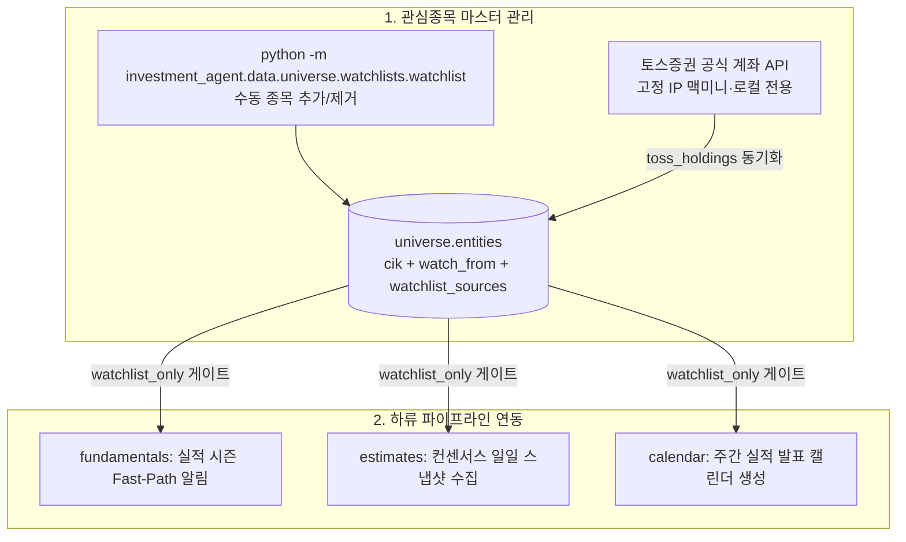

# Universe watchlists — 관심 기업 & 토스증권 보유종목 동기화

`investment_agent.data.universe.watchlists`는 SEC 실적 공시를 더 깊이 볼 **관심 기업(`universe.entities.watchlist_sources`)을 관리하고, 토스증권의 실제 보유 미국 주식을 고정 IP 로컬 환경에서 동기화하는 universe 기능**입니다.

> [!IMPORTANT]
> **핵심 설계 원칙**
> * **단일 원장 (SSOT)**: 관심은 별도 원장이 아니라 발행사 행(`universe.entities`)의 상태입니다. 관심은 종목이 아니라 회사에 대한 것이고, 공시·재무도 CIK가 identity이기 때문입니다. 카드에 찍히는 ticker는 그 회사의 대표 종목(ticker 오름차순 첫 tracked 종목)을 읽기 경계에서 붙인 값입니다.
> * **다중 출처 관리 (`sources`)**: 수동 등록(`manual`)과 토스 보유종목(`toss`) 출처를 배열로 함께 관리하여, 주식을 매도해도 수동 관심종목은 삭제되지 않고 안전하게 유지됩니다.
> * **시점 기준 수집 게이트**: 관심종목 등록 시점(`watch_from`) 이전의 사건을 새 이벤트로 취급하지 않아 과거 공시가 대량 중복 처리되지 않습니다. 실제 전송 여부는 notifications의 채널 설정이 결정합니다.

---

## 0. 관련 문서 및 전체 위치

* **상위 문서**: [루트 README.md](../../../../../README.md) · [개발 가이드 CLAUDE.md](../../../../../CLAUDE.md)
* **하류 파이프라인**:
  * [Fundamentals (Fast-Path 실적 시즌 우선 감시)](../../fundamentals/README.md)
  * [Fundamentals 예상치 (컨센서스 스냅샷)](../../fundamentals/README.md)
  * [Notifications (포럼 스레드 실적 알림)](../../../notifications/README.md)

---

## 1. 전체 관심종목 파이프라인 아키텍처



---

## 2. 핵심 개념 (초보자 가이드)

### Multi-Source 관심종목 관리 (`sources = ['manual', 'toss']`)
* **한 줄 설명**: 사용자가 직접 지정한 관심종목(`manual`)과 토스증권 계좌에서 실제 보유 중인 종목(`toss`)을 배열 형태로 단일 레코드에 결합 관리하는 방식.
* **왜 필요한가**: 주식을 매도했을 때 토스 보유종목 목록에서는 빠지더라도, 사용자가 수동으로 등록해 둔 관심종목 상태는 안전하게 유지하기 위함입니다.
* **이 프로젝트에서는**: `watchlist_sources` 배열에서 `toss` 태그만 제거하고, `manual` 태그가 남아있으면 `is_watchlisted`가 계속 true로 유지됩니다. 같은 회사의 두 클래스(GOOG/GOOGL)를 함께 보유해도 관심 기업은 하나입니다.

---

## 3. 관련 코드 및 데이터 흐름

### 주요 파일 구조
```text
src/investment_agent/data/universe/
├── infrastructure/sources/
│   └── toss_holdings.py # 토스증권 계좌·보유종목 조회 어댑터
└── watchlists/
    ├── db.py                # universe.entities 관심 컬럼 저장소 (ticker → CIK)
    ├── toss_sync.py         # 토스 보유종목 스냅샷을 관심종목에 반영
    ├── watchlist.py         # 관심종목 추가/조회/해제 CLI 진입점
    └── toss_holdings.py     # 토스 보유종목 동기화 진입점 (고정 IP 로컬 전용)
```

### 주요 함수 호출 흐름
```text
watchlist.py (add / remove / list)
  └── db.py::add_member()                            ──> universe.entities의 watchlist_sources에 manual 출처 Upsert
  └── db.py::remove_member()                         ──> manual 출처 제거 (sources 비면 is_active=false)

toss_holdings.py::main()
  └── toss_sync.py::sync_toss_holdings()
        ├── infrastructure/sources/toss_holdings.py::fetch_accounts()  ──> 토스 Open API 계좌 목록 조회
        ├── infrastructure/sources/toss_holdings.py::fetch_holdings()  ──> 계좌별 보유 미국주식 조회
        └── db.py::sync_toss_members()                ──> 보유 종목을 발행사 CIK로 접어 toss 출처 태그 동기화
```

---

## 4. 관심종목 CLI 관리 명령어

```bash
# 1. 관심종목 추가
python -m investment_agent.data.universe.watchlists.watchlist add AAPL

# 2. 특정 시점 이후 공시만 알림 받도록 추가
python -m investment_agent.data.universe.watchlists.watchlist add MSFT --watch-from 2026-08-13

# 3. 관심종목 목록 조회
python -m investment_agent.data.universe.watchlists.watchlist list

# 4. 특정 출처별 관심종목 조회
python -m investment_agent.data.universe.watchlists.watchlist list
python -m investment_agent.data.universe.watchlists.watchlist list --source toss

# 5. 관심종목 적용 시작일 변경
python -m investment_agent.data.universe.watchlists.watchlist watch-from 2026-08-13 --ticker MSFT

# 6. 관심 해제 (manual 출처 제거 — 다른 출처가 없으면 is_watchlisted=false로 전환)
python -m investment_agent.data.universe.watchlists.watchlist remove AAPL
```

---

## 5. 토스증권 계좌 보유종목 동기화 (고정 IP 로컬 전용)

토스증권 공식 Open API의 계좌/보유종목 조회를 통해 실제 매수한 미국 주식을 관심종목 `toss` 출처로 자동 반영합니다.

```bash
# 1. 쓰기 없이 토스 API 연결 및 보유종목 확인 (Dry-run)
python -m investment_agent.data.universe.watchlists.toss_holdings --dry-run

# 2. 토스 보유종목을 관심종목에 원자적 동기화
python -m investment_agent.data.universe.watchlists.toss_holdings
```

---

## 6. 수정할 때 확인할 곳

| 수정 목적 | 확인할 파일 및 함수 | 주의사항 |
|---|---|---|
| 관심 기업 추가/해제 룰 변경 | `src/investment_agent/data/universe/watchlists/db.py` (`add_member`, `remove_member`) | `watchlist_sources` 배열과 그것에서 파생되는 `is_watchlisted` 불변성 검증. 관심 갱신이 회사 사실(이름·SIC)을 덮어쓰지 않는지도 본다 |
| 토스 보유종목 파싱 수정 | `src/investment_agent/data/universe/infrastructure/sources/toss_holdings.py` (`fetch_accounts`, `fetch_holdings`) | 고정 IP 화이트리스트 환경 확인 |
