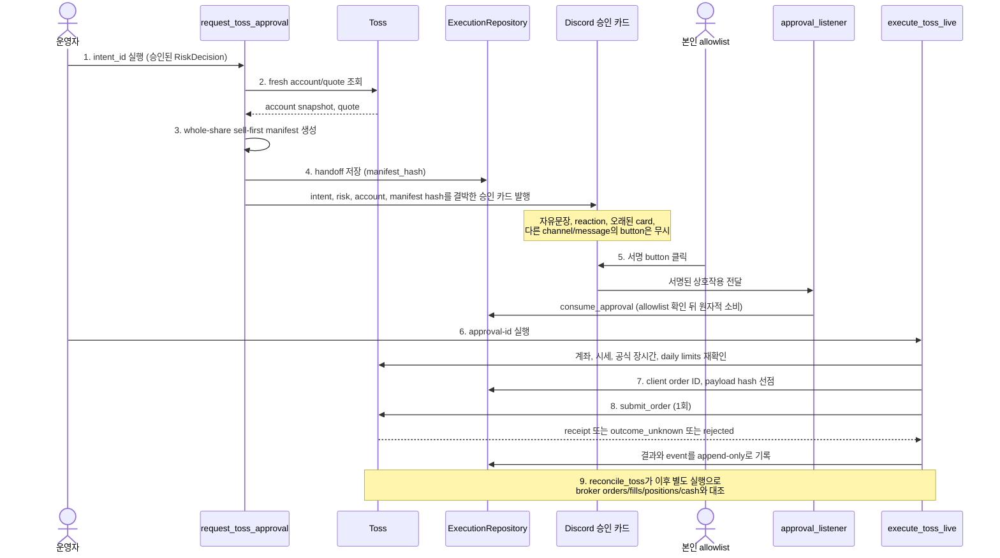

# Execution — 주문 lifecycle과 안전 경계

`investment_agent.execution`은 승인된 목표 비중을 실제 broker 주문 계약으로 바꾸는 credential 격리 계층입니다.
투자 thesis를 만들거나 LLM을 호출하지 않습니다.

## 책임 경계

```text
investment_agent.trading
  RiskDecision
    ↓
  ExecutionIntent
================ credential boundary ================
investment_agent.execution
  fresh account/quote
    ↓
  order manifest
    ↓
  Discord approval / autonomy permit
    ↓
  submit-time risk and session check
    ↓
  TossOrderApi 직접 호출
    ↓
  order attempts/events/fills/reconciliation
```

AI process에는 broker key, account secret, approval HMAC을 주입하지 않습니다. execution process도
EvidenceBundle이나 LLM prompt를 수정하지 않습니다.

## 핵심 계약

| 계약 | 파일 | 역할 |
|---|---|---|
| `ExecutionIntent` | `intents.py` | 목표 비중과 risk/proposal identity, TTL |
| `OrderPlan` | `planning.py` | broker mutation 전 주문 계획 |
| `CanonicalOrderRequest` | `brokers/contracts.py` | broker 공통 submit 계약 |
| `BrokerOrder` / `BrokerFill` | 같은 파일 | broker별 응답의 내부 표준형 |
| `ApprovalRequest` | `approvals.py` | HMAC button과 account/manifest/TTL 결박 |
| `OrderAttempt` | `ledger.py` | mutation 전 client ID/payload 예약 |
| `DurableControlState` | `control_state.py` | DB kill switch/lockdown/live flags |

## Toss 단일 실행 경로

실주문은 `orders/live_worker.py`에서 `TossOrderApi`를 직접 호출합니다.
계좌·시세·주문·체결 API는 `brokers/toss/`가 소유하며, 공통 반환 계약은
`brokers/contracts.py`에 둡니다. 주문 제출 전 승인·위험 제한·durable control을 검증합니다.

## Live Manual 흐름

1. 저장된 approved RiskDecision으로 만료 가능한 intent를 만듭니다.
2. broker에서 fresh account snapshot과 quote를 읽습니다.
3. `TargetWeightOrderPlanner`가 whole-share sell-first manifest를 만듭니다.
4. intent, risk, account, manifest hash를 Discord approval에 결박합니다.
5. 본인 allowlist의 서명 button만 pending approval을 원자적으로 소비합니다.
6. 주문 직전에 계좌·시세·공식 장시간·daily limits를 다시 확인합니다.
7. client order ID와 payload hash를 DB에 먼저 예약합니다.
8. broker에 한 번 submit하고 결과와 event를 append-only로 기록합니다.
9. broker orders/fills/positions/cash와 reconciliation합니다.

자유문장, reaction, 오래된 card, 다른 channel/message의 button은 승인으로 취급하지 않습니다.

이 9단계는 하나의 프로세스가 아니라 서로 다른 세 실행(`request_toss_approval`·`execute_toss_live`와
상시 구동 중인 `approval_listener`)에 걸쳐 있습니다. 앞의 둘은 운영자가 직접 부를 수도 있고,
`approval_workflow` 모드의 로컬 하네스가 승인 상태를 polling하다가 `approved`가 되면 부르기도 합니다.
어느 쪽이든 사람이 누른 승인 ID 없이는 주문이 나가지 않습니다. 어느 단계가 어느 프로세스·주체 소관인지는 순서 목록보다 sequence diagram이 더 분명합니다.



## 주문 결과가 불명확할 때

timeout, connection error, 5xx는 단순 실패가 아니라 `outcome_unknown`입니다.

```text
outcome_unknown
→ 같은 client order ID 재전송 금지
→ broker status/open orders/fills 조회
→ 정확한 identity로 reconciliation
→ accepted/not-found를 확인하거나 lockdown
```

ticker와 수량만 같은 주문을 임의 매칭하지 않습니다. broker order ID, client ID, account와 payload
identity가 충분하지 않으면 운영자 확인 대상으로 남깁니다.

## 분석·검증

Shadow와 연구용 Paper 단계는 주문 없는 분석·승격 증거에 사용합니다.
외부 증권사 모의주문 worker는 제공하지 않습니다. Paper 단계의 존재가
토스 모의투자 API 지원이나 실주문 권한을 의미하지 않습니다.

## Durable safety

환경변수와 `execution_control`는 AND 조건입니다.

- `TRADING_KILL_SWITCH=on`: 신규 live risk 차단
- `TOSS_LIVE_ENABLED=false`: Toss live mutation 차단
- `LIVE_ENABLED=false`: broker-independent live 차단
- 실주문은 무인 경로가 없다. `execute_toss_live`는 `--approval-id`를 반드시 받고,
  그 승인이 `approved`이고 `execution_mode='live'`일 때만 진행한다.
- durable kill switch/lockdown: process restart 뒤에도 유지

`execution_control`는 `data/local/runtime/runtime.sqlite3`(`db/sqlite/runtime/v1/30_execution.sql`)의
`execution_control` 표에 있습니다. `operations.commands.execution_controls --initialize`가 모든 권한을 닫은
행을 심고, `--manual on|off --expected-version N --reason ...`이 사람의 명시적 변경을 기록합니다. 행이
없으면 `load_control_state()`가 예외를 던져 주문 경로 전체가 막힙니다(fail-closed). `execute_toss_live`는
입구에서 한 번, 그리고 **주문 POST마다 다시** 이 값을 읽습니다 — 배치 도중 운영자가 닫으면 다음 주문부터 멈춥니다.

DB state를 읽지 못하면 허용으로 추정하지 않습니다. cancel이나 risk-reducing close는 별도 permit과
검사로만 허용할 수 있습니다.

## Reconciliation

`reconciliation.py`는 순수 비교 계약, `reconciliation_worker.py`는 Toss remote snapshot과 DB
event 저장을 담당합니다. broker가 truth입니다.

비교 대상과 현재 구현:

- internal attempt와 broker order: 주문 ID별 상태·누적 체결량·identity를 대조한다.
- expected position과 broker position: `reconciliation/positions.py`. 직전에 설명된 보유 + 그 뒤 우리 체결량이
  broker 보유와 다르면 `unexplained_position_change`로 알리고 EXECUTION_LOCKDOWN을 건다. 결과를 모르는 우리
  주문이 있으면 오판하지 않도록 미룬다.
- 내부 intent가 없는 external order: 알림과 함께 EXECUTION_LOCKDOWN을 건다.
- internal cash와 broker cash: **대사하지 않는다.** 배당·입출금·환전·수수료 정산이 정상적으로 현금을 움직여
  주문 체결만으로 설명하려 하면 매 주기 불일치가 난다.

broker ID가 없는 주문은 ticker·수량으로 추측해 붙이지 않고 unresolved로 남깁니다.

## 주요 CLI

```powershell
# 주문하지 않는 Toss preview
python -m investment_agent.operations.commands.toss_preview --intent-id <INTENT_ID>

# Discord approval card 요청
python -m investment_agent.operations.commands.request_toss_approval --intent-id <INTENT_ID>

# approval listener
python -m investment_agent.operations.commands.approval_listener

# 승인된 Live 주문 entry. 기본 안전 설정에서는 차단됨
python -m investment_agent.operations.commands.execute_toss_live --approval-id <APPROVAL_ID>

# broker truth 대조
python -m investment_agent.operations.commands.reconcile_toss
```

실제 ID, account와 credential 없이 예제 command를 그대로 실행하지 않습니다. Live 명령은 사용자의
명시적 활성화와 canary 절차 없이는 실행 대상이 아닙니다.

## 주요 문서

- [토스 실행과 단계별 안전](../../../docs/EXECUTION_AND_SAFETY.md)
- [Operations](../../../docs/OPERATIONS.md)

## 테스트

```powershell
python -m unittest tests.investment_agent.execution.test_intents
python -m unittest tests.investment_agent.execution.test_snapshots
python -m unittest discover -s tests -t .
```

Mock 테스트는 credential isolation, idempotency, approval, timeout과 mode 경계를 검증합니다. 실제
broker 인증과 계좌 운영 상태는 별도 단계 검증이 필요합니다.
