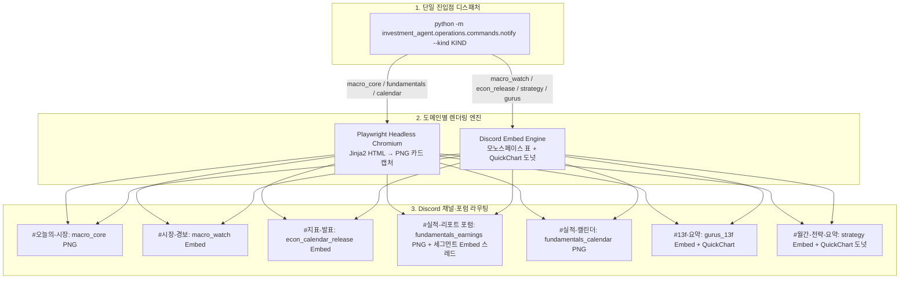

# Notifications — 시각화 알림(Playwright PNG 카드 & Discord Embed) 서브시스템

`investment_agent.notifications`는 데이터 파이프라인이 수집·계산한 데이터를 바탕으로 **Jinja2 + Playwright Headless Chromium 기반의 고해상도 PNG 대시보드 카드 또는 네이티브 Discord Embed + QuickChart 시각화를 생성하여 Discord 서버의 포럼 및 채널로 자동 발행하는 통합 알림 시스템**입니다.

> [!IMPORTANT]
> **디자인 및 발송 핵심 규칙**
> * **[DESIGN-system.md](../../../DESIGN-system.md) 준수**: 단일 Brand Blue `#3182f6`, 고정폭 모노스페이스 수치, 상승/하락 텍스트 전용 규칙을 적용합니다.
> * **단일 진입점 디스패처**: 모든 알림은 `python -m investment_agent.operations.commands.notify --kind <KIND>` 단일 명령으로 실행됩니다.
> * **실적 포럼 스레드 발행**: 분기별 200여 건의 실적 공시는 일반 채널에 나열하지 않고, **`#실적-리포트` 포럼에 종목 1개 = 스레드 1개**로 누적해 검색성과 가독성을 보장합니다.

---

## 0. 관련 문서 및 전체 위치

* **상위 문서**: [루트 README.md](../../../README.md) · [개발 가이드 CLAUDE.md](../../../CLAUDE.md)
* **디자인 토큰 SSOT**: [DESIGN-system.md](../../../DESIGN-system.md)
* **서버 채널 선언**: [Discord Admin 채널 관리](discord_admin/README.md)
* **상류 데이터 제공 파이프라인**:
  * [Macro](../data/macro/README.md) · [Econ Calendar](../data/macro/releases/README.md)
  * [Fundamentals](../data/fundamentals/README.md) — 기업 전체·차원 재무, 시장 예상치, 실적 이벤트
  * [Institutional](../data/institutional/README.md) · [Strategy](../research/strategies/README.md)

---

## 1. 전체 알림 렌더링 & 라우팅 아키텍처



---

## 2. 핵심 개념 (초보자 가이드)

### Playwright Headless Chromium 렌더링
* **한 줄 설명**: 브라우저 화면을 띄우지 않고 백그라운드(Headless)에서 HTML+CSS 템플릿을 렌더링하여 고해상도 PNG 이미지로 캡처하는 방식.
* **왜 필요한가**: Discord 기본 텍스트나 Embed만으로는 복잡한 12열 재무제표, 매크로 게이지 차트, 추세 스파크라인을 미려하게 표현할 수 없기 때문입니다.
* **이 프로젝트에서는**: `render.py`가 Jinja2 템플릿을 빌드하고 Playwright로 캡처하여 Discord 첨부 파일로 전송합니다.

### 이중 발송 방지 원장 (Deduplication)
* **한 줄 설명**: 이미 Discord로 전송된 알림인지 DB에 영구 기록하여, 스케줄러 재시도나 중복 실행 시 동일 카드가 반복 발송되지 않도록 차단하는 메커니즘.
* **이 프로젝트에서는**: `(producer, notification_key)`를 `notifications.outbox`의 자연키로 사용하고,
  실제 시도 결과는 `notifications.deliveries`에 기록합니다. 실패·전달 여부 불명 상태도 삭제하지 않습니다.

### 수신 대상 구독
알림 종류와 수신 대상은 `notifications.subscriptions`가 소유합니다. `SubscriptionReader`는
활성일·enabled 조건과 전체/종목별 구독을 읽고, producer는 `discord_targets()`로 Discord
대상을 받아 Outbox 목적지로 고정합니다. 구독이 없으면 환경변수로 조용히 대체하지 않고
실패합니다. 현재 macro core/watch가 이 경계를 사용하며, 나머지 producer도 같은 계약으로
순차 전환합니다.

---

## 3. 8대 알림 카드 명세 및 전송 포맷

| KIND | 담당 모듈 | 전송 형태 | 대상 채널 및 발송 주기 | 주요 포함 내용 |
|---|---|---|---|---|
| `macro_core` | `src/investment_agent/notifications/macro/core.py` | **PNG 대시보드** | `#오늘의-시장` (매일 KST 09:25) | 주가지수, 국채금리, 실질금리, 환율, 원자재, 레짐 게이지 |
| `macro_watch` | `src/investment_agent/notifications/macro/watch.py` | **Discord Embed** | `#시장-경보` (장중 매시간 감시) | VIX 급등, 금리/환율 임계 돌파 등 실시간 경보 |
| `econ_calendar_release` | `src/investment_agent/notifications/econ_calendar/run.py` | **Discord Embed** | `#지표-발표` (first actual 확인 직후) | CPI·고용 등 실제, Survey, Nowcast, 자체모델, 시장서프라이즈/모델오차, 개정 |
| `fundamentals_flash` | `earnings_flash/run.py` | **Discord Embed** | `notifications.subscriptions` (`fundamentals_flash`) | **[1단계 속보]** 8-K 실적 발표 당일 매출·EPS 실제/예상 서프라이즈 % 및 공시 링크 |
| `fundamentals_earnings` | `earnings_report/run.py` | **PNG + 세그먼트 Embed** | `notifications.subscriptions` (`fundamentals_earnings`) | **[2단계 정밀 카드]** 10-Q/10-K 공시 시 13분기 추세, 현금흐름 폭포수, 5개년 배당 계단 분석 |
| `fundamentals_calendar` | `src/investment_agent/notifications/earnings_calendar/run.py` | **PNG 대시보드** | `#실적-캘린더` (매주 월 KST 08:30) | 이번 주 실적 발표 예정 기업 캘린더 및 10-K/10-Q 구분 표기 |
| `gurus_13f` | `src/investment_agent/notifications/institutional/run.py` | **Embed + QuickChart** | `notifications.subscriptions` (`institutional`) | 버핏 등 거장 7인 13F 신규매수/추가/축소/전량매도 델타 및 컨센서스 |
| `strategy` / `strategy_summary` | `src/investment_agent/notifications/strategy/service.py` | **Embed + QuickChart** | `notifications.subscriptions` (`strategy`, `strategy_summary`) | 퀀트 자산배분 6종(GEM, HAA 등) 목표 비중 도넛 차트 & 리밸런싱 근거 |
| `investment_portfolio` | `src/investment_agent/notifications/investment/run_portfolio.py` | **Discord Embed** | `notifications.subscriptions` (`investment_portfolio`) | 하루 1장 종합 — RiskGate 승인/거절과 위반 사유, 목표 비중, 분석 성공 비율 |
| `investment_candidates` | `src/investment_agent/notifications/investment/run_candidates.py` | **Discord Embed** | `notifications.subscriptions` (`investment_candidates`) | 신뢰도 상위 N종목 심층 — 신호·기대 초과수익·근거, **확보하지 못한 근거**까지 |
| `investment_trades` | `src/investment_agent/notifications/investment/run_trades.py` | **Discord Embed** | `notifications.subscriptions` (`investment_trades`) | 실제 주문·체결 수량/평균가, 승인 ID로 판단까지 역추적 |

---

## 4. 관련 코드 및 디렉토리 구조

### 주요 파일 구조
```text
src/investment_agent/notifications/
├── channels/            # Discord transport와 채널 라우팅
│   ├── discord.py       # Discord 전송 경계
│   └── routing.py       # 실적 포럼 태그 대응표(sic_division_name → EARNINGS_TAGS)
├── subscriptions.py     # notifications.subscriptions 활성 수신 대상 reader (읽기 전용)
├── earnings_flash/      # 8-K 실적 속보 알림 모듈
│   ├── candidates.py    # 미발송 8-K 속보 조회
│   ├── embeds.py        # DESIGN-system.md 색 토큰 기반 실적 속보 Rich Embed 빌더
│   └── run.py           # Discord 포럼 스레드 발송
├── earnings_report/     # 10-Q/10-K 정밀 펀더멘탈 카드 모듈
│   ├── card.py          # 13분기 추세, 현금흐름, 5개년 월별 배당 계단 계산
│   ├── render.py        # Jinja2 HTML 빌드(render) + Playwright PNG 캡처(shoot_png)
│   └── templates/       # Jinja2 HTML 대시보드 템플릿
├── earnings_calendar/   # 예정 실적 카드·palette·render
├── macro/               # 연속 지표 코어 카드·장중 경보
├── econ_calendar/       # 경제지표 발표 모듈
├── institutional/       # 13F 기관 지분 알림
├── strategy/            # 퀀트 자산배분 리밸런싱 모듈
└── investment/          # 자동매매 판단·체결 보고 모듈 (파이프라인이 아니라 execution 원장이 원천)
    ├── run_*.py         # outbox 등록·전송 진입점
    ├── embeds.py        # embed 조립 (순수 함수)
    ├── embeds.py        # embed 조립 (순수 함수)
    └── run_portfolio.py / run_candidates.py / run_trades.py
```

### 주요 함수 호출 흐름
```text
operations/commands/notify.py::main(--kind fundamentals_earnings) ──> KINDS 매핑으로 디스패치
  └── investment_agent.notifications.earnings_report.run:run()
        ├── candidates.py::load_pending()                ──> 미발송 신규 공시 조회
        ├── notifications.outbox::Outbox.enqueue()       ──> notifications.outbox에 스냅샷 선점
        ├── card.py::build()                              ──> 렌더 컨텍스트 계산
        ├── render.py::render() + render.py::shoot_png()  ──> Jinja2 HTML 빌드 + Playwright PNG 캡처
        └── notifications.service::NotificationService  ──> Discord 전송 후 deliveries 기록
```

---

## 5. 실행 및 로컬 테스트 가이드

```bash
# 1. 매일 아침 매크로 종합 대시보드 카드 테스트
python -m investment_agent.notifications.macro.core

# 2. 장중 매크로 임계 돌파 경보 테스트
python -m investment_agent.notifications.macro.watch

# 3. 경제지표 신규 발표 알림 테스트
python -m investment_agent.operations.commands.notify --kind econ_calendar_release

# 4. 실적 발표 카드 (포럼 스레드) 테스트
python -m investment_agent.operations.commands.notify --kind fundamentals_earnings

# 5. 주간 실적 발표 캘린더 카드 테스트
python -m investment_agent.operations.commands.notify --kind fundamentals_calendar

# 6. 거장 13F 레이더 알림 테스트
python -m investment_agent.operations.commands.notify --kind gurus_13f

# 7. 월간 퀀트 전략 리밸런싱 알림 테스트
python -m investment_agent.operations.commands.notify --kind strategy

# 8. 자동매매 보고서 3종
python -m investment_agent.operations.commands.notify --kind investment_portfolio
python -m investment_agent.operations.commands.notify --kind investment_candidates
python -m investment_agent.operations.commands.notify --kind investment_trades
```

---

## 6. 수정할 때 확인할 곳

| 수정 목적 | 확인할 파일 및 함수 | 주의사항 |
|---|---|---|
| 카드 시각 디자인 수정 | PNG 카드를 만드는 각 패키지가 소유한 `templates/*.html.j2` (예: `earnings_report/templates/earnings.html.j2`) | [DESIGN-system.md](../../../DESIGN-system.md) 색상 토큰 준수, 패키지 간 공유 금지 |
| Playwright 뷰포트 크기 조정 | 각 PNG 카드 패키지의 `render.py` (`shoot_png`의 `viewport_width`, 기본 1080) | 모바일 가독성 유지 |
| Discord 채널 라우팅 변경 | `notifications.subscriptions`의 kind/target 행 | `src/investment_agent/notifications/discord_admin` manifest는 채널 구조 동기화용으로 유지 |
| 중복 방지 키 룰 수정 | 각 producer의 `run.py`와 `notifications/outbox.py` (`enqueue`·`claim`·`record`) | `(producer, notification_key)` 원자적 기록과 전달 이력 보장 |
