# Discord Admin — 코드 기반 선언적 Discord 서버 관리 (IaC)

`investment_agent.notifications.discord_admin`은 Discord 서버의 **카테고리, 채널, 역할, 권한, 포럼 태그, 온보딩 안내문을 코드로 선언(`manifest.py`, `roles.py`)하고 Discord REST API와 동기화하는 로컬 전용 인프라 관리 도구**입니다.

> [!IMPORTANT]
> **핵심 설계 원칙 (Default Read-Only & Zero Drift)**
> * **코드 단일 기준 (SSOT)**: 채널·역할은 `manifest.py`·`roles.py`를 고치는 것으로만 반영합니다. 자세한 원칙은 [CLAUDE.md](../../../../CLAUDE.md) 12번 참고.
> * **길드 레벨 읽기 전용 (`@everyone`)**: `@everyone` 역할에서 '메시지 보내기' 권한을 길드 전체 단위로 박탈하여 새로 추가되는 채널도 기본적으로 안전한 읽기 전용으로 열립니다.
> * **안전한 격리**: `#투자-승인`, `#운영-요약` 등 민감한 운영 채널은 `@everyone`에게 완전 은닉(`private`)되며 오직 전용 봇과 모더레이터에게만 노출됩니다.

---

## 0. 관련 문서 및 전체 위치

* **상위 문서**: [루트 README.md](../../../../README.md) · [개발 가이드 CLAUDE.md](../../../../CLAUDE.md)
* **연계 시스템**: [Notify (채널 라우팅)](../README.md) · [Execution (#투자-승인 채널)](../../execution/README.md) · [Operations (#운영-요약)](../../operations/README.md)

---

## 1. 전체 서버 구조 및 카테고리 분류

서버 카테고리는 데이터 출처가 아니라 **사용자의 확인 주기(Cadence)** 기준으로 분류됩니다.

```mermaid
flowchart TD
    subgraph START["✦ START HERE (시작 및 공지)"]
        C1["#시작하기 · #서버-규칙 · #업데이트-노트"]
    end

    subgraph DESK["📊 MARKET DESK (일일/실시간 시장)"]
        C2["#오늘의-시장 · #지표-발표 · #시장-경보"]
    end

    subgraph EARN["💰 EARNINGS (기업 실적)"]
        C3["#실적-캘린더 · #실적-리포트 포럼"]
    end

    subgraph RSCH["🔭 RESEARCH (스마트머니 및 전략)"]
        C4["#13f-요약 · #월간-전략-요약"]
    end

    subgraph COMM["◆ COMMUNITY (회원 커뮤니티)"]
        C5["#라운지 · #라운지-보이스"]
    end

    subgraph LAB_CAT["🧪 LAB (비공개 실험용)"]
        C7["#랩-카드 · #랩-시스템로그 · #랩-포럼"]
    end

    subgraph OPS_CAT["⚙ OPERATIONS (비공개 운영 및 승인)"]
        C6["#투자-승인 · #운영-요약 · #모더레이터-알림"]
    end
```



---

## 2. 핵심 개념 (초보자 가이드)

### Infrastructure as Code (IaC) 방식으로 Discord 관리
* **한 줄 설명**: 마우스로 Discord GUI에서 채널을 만들거나 권한을 누르는 대신, 파이썬 코드(`manifest.py`, `roles.py`)에 서버의 모든 설정을 적어두고 자동으로 동기화하는 방식.
* **왜 필요한가**: 실수로 권한을 잘못 주어 비공개 투자 승인 채널이 일반 유저에게 노출되거나, 채널 삭제/재생성 시 ID가 꼬이는 사고를 원천 방지하기 위함입니다.
* **이 프로젝트에서는**: `entries/sync.py`가 `sync.py::plan()`으로 코드와 실제 Discord 서버 상태의 차이점(Diff)을 계산하여 안전하게 적용합니다.

---

## 3. 채널 구조 및 역할 권한 매트릭스

| 카테고리 | 채널명 | 연결 알림 / 역할 | 권한 정책 |
|---|---|---|---|
| **✦ START HERE** | `#시작하기`, `#서버-규칙`, `#업데이트-노트` | 안내문 및 패치노트 | 읽기 전용 (관리자만 작성) |
| **📊 MARKET DESK** | `#오늘의-시장`, `#지표-발표`, `#시장-경보` | `macro_core`, `econ_calendar_release`, `macro_watch` | 읽기 전용 (카드봇 전용) |
| **💰 EARNINGS** | `#실적-캘린더`, **`#실적-리포트 (포럼)`** | `fundamentals_calendar`, `fundamentals_earnings` | 읽기 전용 (스레드 내부 댓글만 `◆ 라운지` 허용) |
| **🔭 RESEARCH** | `#13f-요약`, `#월간-전략-요약` | `gurus_13f`, `strategy` | 읽기 전용 (카드봇 전용) |
| **◆ COMMUNITY** | `#라운지`, `#라운지-보이스` | 회원 자유 소통 | `◆ 라운지` 역할 보유자 채팅 가능 |
| **🧪 LAB** | `#랩-카드`, `#랩-시스템로그`, `#랩-포럼` | 카드 디자인·형식 실험용, 발송 기록 안 남김 | 비공개 (아래 참고) |
| **⚙ OPERATIONS** | **`#투자-승인`**, `#운영-요약`, `#모더레이터-알림` | AI 투자 주문 승인 및 하트비트 | **비공개 (승인봇 · 모더레이터 전용)** |

`#실적-리포트`는 현재 실적 포럼의 선언 이름이다. 매니페스트에 없는 서버 채널은
자동 삭제하지 않으므로 별도 정리가 필요하면 선언과 운영 절차를 함께 검토한다.

**LAB은 선언만으로 실제로 쓰이지 않는다.** `DISCORD_CHANNEL_LAB_CARDS`와
`DISCORD_CHANNEL_LAB_OPS`는 `manifest.py`가 채널 ID를 써넣는 것 말고는 어디서도 읽는
코드가 없다 — "카드 디자인을 다듬을 때 운영 채널 대신 여기로"가 실제로 되려면 알림 코드가
채널 상수를 LAB 짝으로 바꾸는 스위치가 있어야 하는데 지금은 없다. `DISCORD_CHANNEL_LAB_FORUM`만
`earnings_flash/run.py`의 fallback 한 곳에서 쓰인다. 지금은 테스트할 때 해당
`DISCORD_CHANNEL_*` 환경변수를 수동으로 LAB 값으로 덮어써야 한다.

### 역할 (`roles.py`)

| 역할 | Discord 이름 | 부여 대상 | 핵심 권한 |
|---|---|---|---|
| `member` | ◆ 라운지 | 온보딩에서 대화 참여를 고른 사람 | `#라운지` 채팅, `#실적-리포트` 스레드 댓글 |
| `mod` | 🛡 모더레이터 | 사람 모더레이터 | 메시지·스레드 정리, 타임아웃·추방(차단·서버 구조 변경은 없음) |
| `cardbot` | 🤖 ATLAS 카드봇 | `DISCORD_BOT_TOKEN` 봇 | 길드 레벨 권한 한 벌로 모든 채널에 카드·embed 발송 |
| `approvalbot` | 🔐 ATLAS 승인봇 | `DISCORD_APPROVAL_BOT_TOKEN` 봇 | `#투자-승인`에서만 카드·서명 버튼 처리(다른 채널은 못 봄) |

핵심 설계는 **`@everyone`에서 '메시지 보내기'를 길드 레벨로 뺀 것** 하나다. 채널마다 deny를
다는 방식이 아니라서 새 채널은 자동으로 읽기 전용이고, `cardbot`은 채널 오버라이트 없이
길드 권한만으로 모든 채널에서 동작한다. 예외는 위 표의 `lounge`·`earnings` 채널 오버라이트와
private 카테고리(LAB·OPERATIONS) 셋뿐이며, private 카테고리의 봇 오버라이트는 사람이 적지
않고 매니페스트의 `private: True` 표시에서 자동으로 나온다.

---

## 4. 관련 코드 및 디렉토리 구조

### 주요 파일 구조
```text
src/investment_agent/notifications/discord_admin/
├── client.py            # Discord REST API HTTP 클라이언트 (Bot 토큰·Guild ID 설정 포함)
├── manifest.py          # 카테고리/채널/포럼 선언적 명세 (SSOT)
├── roles.py             # 역할·권한 비트필드 선언 명세 (SSOT) 및 diff 계산
├── sync.py              # 채널 명세 vs 현재 상태 diff 계산 (plan())
├── guide.py             # #시작하기·#서버-규칙 안내문 embed 명세
├── onboarding.py        # Server Guide(온보딩) payload 구성
├── envfile.py           # .env 채널 ID 갱신
└── entries/
    ├── sync.py          # 채널·포럼 동기화 진입점
    ├── roles.py         # 역할·권한 동기화 진입점
    ├── guide.py         # 안내문 동기화 진입점
    └── onboarding.py    # Server Guide 동기화 진입점
```

### 주요 함수 호출 흐름
```text
entries/sync.py::main()
  ├── client.py::fetch_channels()                 ──> Discord REST API로 실제 서버 상태 조회
  ├── sync.py::plan()                              ──> manifest.py 선언 vs 현재 상태 차이점 계산
  ├── client.py::create_channel() / reorder() 등   ──> --apply일 때 실제 반영
  └── envfile.py::update()                         ──> .env 채널 ID 갱신
```

sync → roles → guide → onboarding 순서로 이어지는 나머지 세 진입점도 같은 모양이다 —
각 `entries/*.py::main()`이 자기 짝인 `roles.py`/`guide.py`/`onboarding.py`의 계획 함수를
불러 diff를 보여주고, `--apply`일 때만 `client.py`로 실제 반영한다.

---

## 5. 실행 및 동기화 가이드 (로컬 전용)

```bash
# 1. 채널 및 포럼 구조 동기화 (.env의 채널 ID 자동 갱신)
python -m investment_agent.notifications.discord_admin.entries.sync --apply

# 2. 역할 및 권한 동기화 (기본 읽기 전용 및 비공개 채널 오버라이트)
python -m investment_agent.notifications.discord_admin.entries.roles --apply

# 3. 권한 보안 감사 (비공개 채널 노출 여부 점검) — roles가 실제로 @everyone deny와
#    봇 allow를 채널별로 보여준다. sync는 채널 구조만 보고 권한은 보지 않는다.
python -m investment_agent.notifications.discord_admin.entries.roles

# 4. #시작하기 및 #서버-규칙 안내 메시지 배포
python -m investment_agent.notifications.discord_admin.entries.guide --apply

# 5. Server Guide(온보딩) 동기화 — onboarding.py의 ENABLED=False라 지금은 꺼져 있다.
#    커뮤니티 채널이 5개를 넘어야 Discord가 활성화를 허용한다(그전엔 API가 350001로 막는다).
python -m investment_agent.notifications.discord_admin.entries.onboarding --apply
```

---

## 6. 수정할 때 확인할 곳

| 수정 목적 | 확인할 파일 및 함수 | 주의사항 |
|---|---|---|
| 신규 Discord 채널/포럼 추가 | `src/investment_agent/notifications/discord_admin/manifest.py` | 추가 후 알림 패키지의 채널 환경변수와 동기화 |
| 역할별 권한 비트 조정 | `src/investment_agent/notifications/discord_admin/roles.py` | `@everyone` 기본 읽기 전용 정책 엄수 |
| Discord REST API 변경 대응 | `src/investment_agent/notifications/discord_admin/client.py` | Bot Rate Limit 헤더 준수 |
