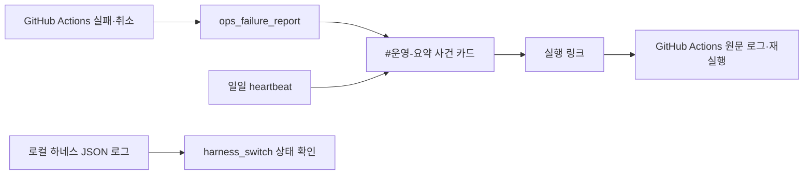

# Operations — Discord-first 운영 관측과 로컬 하네스

`investment_agent.operations`는 운영 오류를 DB에 적재하지 않습니다. GitHub Actions 원문 로그를 사실 기준으로
삼고, 사람이 빠르게 대응할 수 있는 요약은 Discord `#운영-요약`에 남깁니다. 로컬 투자
하네스의 상태·checkpoint·재시작 관리는 별도 로컬 파일로 유지합니다.



## 기록 경계

| 저장 위치 | 보관하는 것 | 보관하지 않는 것 |
|---|---|---|
| Discord `#운영-요약` | 장애·취소·복구·heartbeat, 실패 위치, 정제된 원인, 영향, 다음 행동, 실행 링크 | 비밀값, webhook, 원문 traceback |
| GitHub Actions | 잡/단계 원문 로그, 실행 이력, 재실행 | 장기 운영 요약 카드 |
| 로컬 JSON 로그 | 하네스 process·checkpoint·실시간 진단 | Supabase 운영 원장 |
| Supabase | 시장·공시·재무·투자 결정·주문 같은 도메인 사실 | pipeline run, retry state, 오류 문구, traceback |

## 핵심 구성

- `incidents.py`: 비밀값·mention을 가리고 구조화된 Discord incident embed를 만듭니다.
- `commands/workflow_failure.py`: Actions API에서 실패 잡과 단계를 찾아 한 줄 원인을 추출합니다.
- `.github/workflows/ops_failure_report.yml`: 모든 source workflow가 재사용하는 실패/취소 리포터입니다.
- `commands/heartbeat.py`: Actions 스케줄·상류/하류 chain·알림 대기열을 매일 점검합니다. 시스템
  로그 전송 실패는 성공으로 처리하지 않습니다.
- `harness/`: 고정 IP 장비에서 TradingAgents 분석·승인·주문 경계를 오케스트레이션합니다.

## 장애를 확인하는 순서

1. `#운영-요약`의 최신 사건 카드에서 **실패 위치**, **원인**, **다음 행동**을 확인합니다.
2. 카드의 **실행 링크**를 열어 GitHub Actions의 실패 단계와 전체 원문 로그를 읽습니다.
3. 수정 뒤 Actions에서 재실행합니다. 같은 오류를 DB에서 상태 변경해 닫는 방식은 쓰지 않습니다.
4. 로컬 실행 문제라면 아래 하네스 상태와 로컬 JSON 로그를 함께 봅니다.

```powershell
python -m investment_agent.operations.commands.harness_switch --status
python -m investment_agent.operations.commands.heartbeat
```

## 로컬 하네스 안전 제어

```powershell
# 하네스 상태
python -m investment_agent.operations.commands.harness_switch --status

# 공식 기동·정지 경로
python -m investment_agent.operations.commands.harness_switch --on --mode analysis_only
python -m investment_agent.operations.commands.harness_switch --off

# 코드·스키마 작업 중 기동 보류
python -m investment_agent.operations.commands.harness_switch --maintenance on --maintenance-reason "작업 사유"
python -m investment_agent.operations.commands.harness_switch --maintenance off
```

`MAINTENANCE_HOLD`는 하네스 기동 자체를 막습니다. `TRADING_KILL_SWITCH`와
`EXECUTION_LOCKDOWN`은 주문 안전을 위한 별도 제어이므로 maintenance 해제가 이 둘을
바꾸지 않습니다. 하네스 상세 설계는 [harness README](harness/README.md)를 따릅니다.

## Discord 채널과 환경변수

채널 선언은 [src/investment_agent/notifications/discord_admin/manifest.py](../notifications/discord_admin/manifest.py)가 단일 기준입니다.
운영 알림은 **실패가 난 곳**으로 갈라집니다 — `DISCORD_WEBHOOK_OPS_ACTIONS`는
`#액션-실패`, `DISCORD_WEBHOOK_OPS_LOCAL`은 `#로컬-실패` webhook을 가리키고,
어느 쪽을 쓸지는 부르는 쪽이 아니라 런타임이 `GITHUB_ACTIONS`로 정합니다.
`DISCORD_CHANNEL_OPS_*`는 heartbeat 감시 대상 채널 ID입니다. 채널 구조 변경은
Discord UI가 아니라 manifest를 고친 뒤 `investment_agent.notifications.discord_admin.entries.sync`로 적용합니다.

## DB 기준

운영 상태의 현재 DB owner는 `operations`이며, 오류 원문은 Discord·GitHub Actions·로컬
JSON 로그가 소유합니다. 신규 설치와 재구축은 `scripts/db_bootstrap.py`가 읽는 현재 선언
SQL만 적용합니다.
