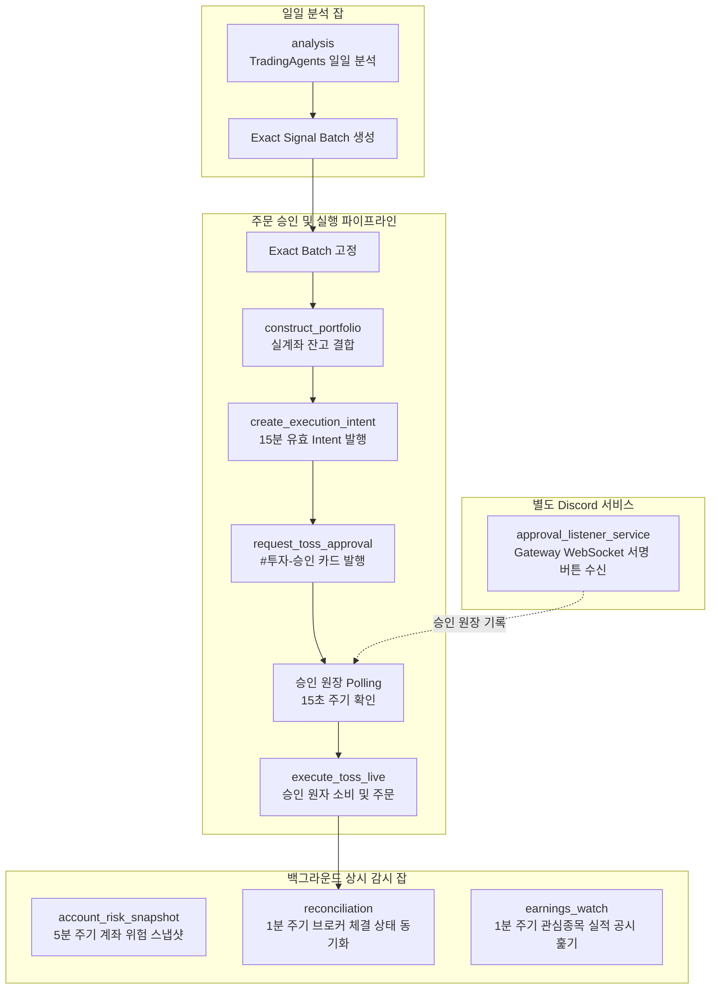
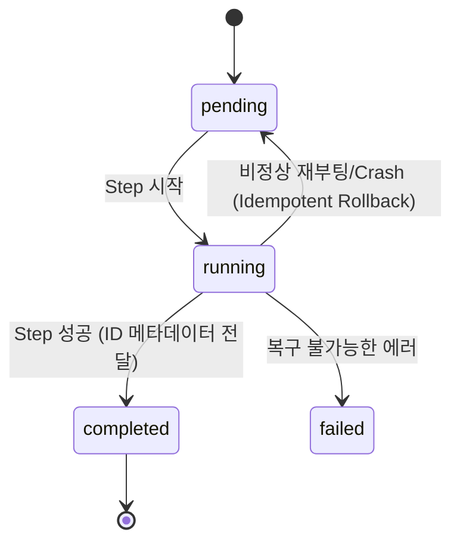

# Investment Operations Harness — 로컬 상시 오케스트레이션 계층

`investment_agent.operations.harness`는 execution 경계와 공유하는 고정 IP 장비(Windows PC 또는 Mac mini)의 **TradingAgents 분석, 전체 포트폴리오 비중 산출, Discord 승인 요청, 실시간 브로커 주문 및 체결 동기화(Reconciliation)를 단일 프로세스로 오케스트레이션하고 장애/재부팅 시 멱등하게 복구하는 상시 운영 하네스**입니다.

* **상위 문서**: [Operations README.md](../README.md) · [루트 README.md](../../../../README.md) · [개발 가이드 CLAUDE.md](../../../../CLAUDE.md)
* **연계 계층**: [Trading](../../trading/README.md) · [Execution](../../execution/README.md)

> [!IMPORTANT]
> **핵심 안전 및 격리 원칙**
> 1. **모듈 분리**: generic `harness/` 코드는 브로커(Toss) SDK를 직접 import하지 않으며, 어댑터([`investment_adapters.py`](../harness_adapters.py))를 통해서만 격리 실행합니다.
> 2. **Latest 추측 금지**: `batch_id → risk_decision_id → intent_id → approval_id`로 이어지는 정확한 ID 체인을 고정하여 파이프라인 단계 간 데이터 불일치를 원천 방지합니다.
> 3. **안전 기본값**: `TRADING_KILL_SWITCH=on`, `TOSS_LIVE_ENABLED=false`가 기본이며, 서비스 설치만으로 실주문이 활성화되지 않습니다.

---

## 1. 상시 하네스 아키텍처



---

## 2. 운영 모드 비교 (`analysis_only` vs `approval_workflow`)

하네스는 운영 단계에 따라 안전하게 모드를 분리하여 구동할 수 있습니다.

| 항목 | `analysis_only` (기본값) | `approval_workflow` |
|---|---|---|
| **용도** | 시장 분석 및 연구 신호 축적 | 실계좌 승인 및 주문 연동 |
| **TradingAgents 분석** | ✅ 정상 주기 실행 | ✅ 정상 주기 실행 |
| **포트폴리오 비중 산출** | ⏸ 실행 안 함 (Paused) | ✅ 실행 |
| **Discord 승인 요청** | ⏸ 실행 안 함 (Paused) | ✅ 실행 (`#투자-승인`) |
| **Toss 계좌 감시/체결동기화** | ⏸ 실행 안 함 (Paused) | ✅ 5분 위험 감시 / 1분 체결 동기화 |
| **`TRADING_KILL_SWITCH=on` 시** | 분석 정상 유지 | 포트폴리오~주문 일시중지, 감시만 읽기 전용 유지 |
| **실적 속보 수집(`earnings_watch`)** | ✅ 정상 주기 실행 | ✅ 정상 주기 실행 |

`earnings_watch`는 주문이 아니라 공시 수집이라 모드·거래 kill switch 어느 쪽으로도
멈추지 않습니다. 창 판정은 진입점(`--session auto`)이 ET 기준으로 직접 하고, 창 밖이면
대상 0건으로 즉시 끝나 SEC를 때리지 않습니다. 노트북이 꺼져 있을 때는 Actions의
`fundamentals_earnings_watch`가 같은 진입점을 안전망으로 돌립니다.

---

## 3. 세션 시간대 및 멱등적 장애 복구

### 뉴욕 현지 거래 세션 (America/New_York)
* **신규 분석 시작 윈도우**: 평일 **09:40 ~ 14:30 ET** (DST 자동 반영). 장 개장 직후 변동성 및 장 마감 직전 주문 위험을 피한 시간대에만 신규 판단을 시작합니다.
* **계좌 위험 감시 윈도우**: 평일 **09:15 ~ 16:30 ET** (정규장 전체 및 전후 마진 감시).

### 원자적 체크포인트 및 재시작 복구

* **체크포인트 원자 교체**: 상태 파일(`state.json`)은 임시 파일 생성 후 atomic rename 방식으로 교체하여 쓰기 도중 충돌이 발생해도 파일 손상이 없습니다.
* **프로세스 이중 실행 방지**: OS 파일 락(`state.json.lock`)과 Task Scheduler의 `IgnoreNew` 옵션으로 중복 인스턴스 생성을 원천 차단합니다.
* **Idempotency Key**: 각 핸들러는 `run_id + stage_id` 기반의 고유 키를 사용하여 재시도 시에도 중복 주문이나 중복 카드 발행을 방지합니다.

---

## 4. 다중 킬스위치 (Kill Switch) 매트릭스

장애 상황 시 특정 컴포넌트만 정밀하게 차단할 수 있는 환경변수 스위치를 제공합니다. (미설정 또는 알 수 없는 값은 안전을 위해 `on`으로 fail-closed 처리됩니다.)

| 환경변수명 | 차단 범위 | 기본값 |
|---|---|---|
| `TRADING_KILL_SWITCH` | 포트폴리오 산출, Intent 발행, 승인 요청, 실주문 발주 전역 차단 | `on` (안전 차단) |
| `HARNESS_JOB_INVESTMENT_ANALYSIS_KILL_SWITCH` | TradingAgents 일일 분석 잡 차단 | `off` |
| `HARNESS_JOB_INVESTMENT_PIPELINE_KILL_SWITCH` | 하네스 전체 파이프라인 잡 차단 | `off` |
| `HARNESS_JOB_ACCOUNT_RISK_SNAPSHOT_KILL_SWITCH` | 계좌 위험 스냅샷 수집 잡 차단 | `off` |
| `HARNESS_JOB_TOSS_RECONCILIATION_KILL_SWITCH` | 브로커 체결 상태 동기화 잡 차단 | `off` |

---

## 5. 실행 및 서비스 등록 가이드

### 안전한 CLI 실행

```bash
# 1. 종합 보안 및 안전성 감사 (Preflight Security Check)
    python -m investment_agent.operations.commands.security_audit

# 2. 암호학적 256비트 HMAC 서명 키 생성
    python -m investment_agent.operations.commands.security_audit --generate-hmac

# 3. 계획 출력 (완전한 Dry-run, 쓰기 없음)
    python -m investment_agent.operations.commands.investment_harness

# 4. analysis_only 모드로 1회 tick 즉시 실행
    python -m investment_agent.operations.commands.investment_harness --run-once

# 5. analysis_only 상시 데몬 구동 — 기동 경로는 harness_switch 하나뿐이다
    python -m investment_agent.operations.commands.harness_switch --on

# 6. approval_workflow 상시 데몬 구동 (승인 연동)
    python -m investment_agent.operations.commands.harness_switch --on --mode approval_workflow

# 7. Discord Gateway 승인 버튼 리스너 서비스 별도 구동
    python -m investment_agent.operations.commands.approval_listener_service

# 8. 하네스 상태 및 하트비트 헬스체크
    python -m investment_agent.operations.commands.investment_harness --health

# 9. 비정상 상태 감지 시 Discord Ops 채널로 경보 발송
    python -m investment_agent.operations.commands.investment_harness --health --alert-ops

# 10. 비상 긴급 정지 (하네스 프로세스 즉시 종료 및 잡 일시중지)
    python -m investment_agent.operations.commands.emergency_stop --kill

# 11. 비상 정지 + .env 킬스위치까지 영구 잠금
    python -m investment_agent.operations.commands.emergency_stop --kill --lockdown-env
```

`investment_harness.py --serve`를 직접 부르지 않는다 — '이미 실행 중' 가드와 상태 기록은
`harness_switch.py`의 `start_harness_service`/`stop_harness_service`에만 있어서, 직접 부르면
그 가드를 건너뛰어 같은 하네스가 두 벌 뜬다. `--run-once`·`--health`처럼 상시 데몬을 띄우지
않는 1회성 호출은 `investment_harness.py`를 직접 불러도 안전하다.

---

### OS 서비스(백그라운드 데몬) 등록

하네스와 Discord Gateway 리스너는 **독립된 2개의 OS 서비스**로 등록됩니다.

```bash
# Windows Task Scheduler XML 등록 계획 미리보기
    python -m investment_agent.operations.commands.install_investment_harness --platform windows

# macOS launchd plist 등록 계획 미리보기
    python -m investment_agent.operations.commands.install_investment_harness --platform macos

# 실제 Windows 작업 등록 (명시적 확인 문자열 필수)
    python -m investment_agent.operations.commands.install_investment_harness --platform windows \
  --apply --confirm REGISTER_INVESTMENT_SERVICES
```

---

## 6. 운영 파라미터 환경변수

| 변수명 | 기본값 | 설명 |
|---|---:|---|
| `HARNESS_NY_SESSION_START` / `_END` | `09:40` / `14:30` | 신규 분석 시작 허용 구간 (뉴욕 현지 시각) |
| `HARNESS_NY_RISK_START` / `_END` | `09:15` / `16:30` | 계좌 스냅샷 및 체결 동기화 가동 구간 |
| `HARNESS_APPROVAL_POLL_SEC` | `15` | Discord 승인 완료 여부 Polling 주기(초) |
| `HARNESS_ANALYSIS_TIMEOUT_SEC` | `7200` | TradingAgents 분석 서브프로세스 최대 허용 시간(초) |
| `HARNESS_APPROVAL_REQUEST_TIMEOUT_SEC` | `180` | 계좌 조회 및 승인 카드 발송 타임아웃(초) |
| `HARNESS_EXECUTION_TIMEOUT_SEC` | `600` | 실주문 발주 워커 타임아웃(초) |
| `HARNESS_RISK_SNAPSHOT_TIMEOUT_SEC` | `180` | 계좌 위험 스냅샷 저장 타임아웃(초) |
| `HARNESS_RECONCILE_TIMEOUT_SEC` | `180` | 체결 상태 재조정 타임아웃(초) |
