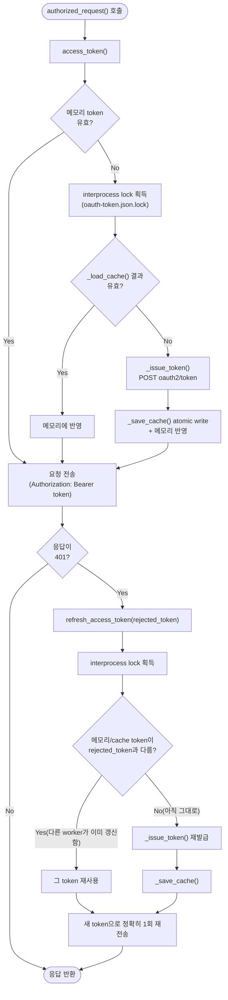

# Platform — 플랫폼 인프라 & 공유 헬퍼 모듈

`investment_agent.platform`은 모든 데이터 파이프라인과 알림 워커가 공유하는 **Supabase 클라이언트, JSON 구조화 로깅, 재시도 데코레이터, 직렬화·시계·저장소 헬퍼 등 핵심 플랫폼 인프라 모듈**입니다.

> [!IMPORTANT]
> **핵심 설계 원칙**
> * **단일 기준 (SSOT)**: 파이프라인 개별적으로 Supabase 클라이언트를 생성하지 않고 `from investment_agent.platform.db.postgres import sb`로 단일 인스턴스를 공유합니다.
> * **구조화 로깅**: `print()` 사용을 엄격히 금지하며, `investment_agent.platform.logging.get_logger(__name__)`을 통해 JSON 표준 포맷으로 로그를 출력합니다.
> * **검증 가능한 페이지네이션**: 일반 조회는 안정된 정렬키와 `select_all_paged()`를 사용합니다. 수십만 행처럼 깊은 offset이 생기는 조회는 복합 인덱스와 키셋 커서를 사용합니다.

---

## 0. 관련 문서 및 전체 위치

* **상위 문서**: [루트 README.md](../../../README.md) · [개발 가이드 CLAUDE.md](../../../CLAUDE.md)
* **모든 서브패키지가 의존**: `investment_agent.data.universe`, `investment_agent.data.market`, `investment_agent.data.fundamentals`, `investment_agent.data.institutional`, `investment_agent.data.macro`, `investment_agent.data.macro.releases`, `investment_agent.research.strategies`, `investment_agent.trading`, `investment_agent.execution`, `investment_agent.notifications`, `investment_agent.operations`

---

## 1. 주요 모듈 맵 및 역할

```text
src/investment_agent/platform/
├── db/
│   ├── postgres.py   # Supabase 클라이언트와 1,000행 분할 페이징 읽기
│   ├── duckdb.py     # 로컬 DuckDB 파일 열기와 선언 적용
│   ├── sqlite.py     # 실행 원장(runtime.sqlite3) 연결 경계
│   └── __init__.py   # 재수출하지 않는다 (아래 참고)
├── artifacts.py      # 큰 산출물을 DB 밖에 두고 주소와 지문만 남긴다
├── cache.py          # 선택적 Streamlit 데이터 캐시 경계
├── clock.py          # 시장 시계와 일봉 확정 시각 헬퍼
├── external_usage.py # 외부 provider 호출량의 원자적 로컬 원장
├── logging.py        # stdout JSON 구조화 로거
├── retry.py          # 네트워크 재시도 정책과 데코레이터
├── serialization.py  # 안정적 JSON 직렬화와 콘텐츠 해시
├── storage_paths.py  # 로컬 저장소의 canonical 경로와 저장소 루트
└── __init__.py       # 패키지 마커
```

`db/`는 저장 기술마다 한 파일이고 **`__init__.py`가 아무것도 재수출하지 않는다.**
`platform.db`만 적으면 세 저장소 중 무엇을 여는지 이름이 말하지 않고, Supabase를
열려던 자리에서 로컬 SQLite를 열어도 import는 성공한다. 부르는 쪽이
`db.postgres` · `db.duckdb` · `db.sqlite`를 명시한다.

연구 산출물 저장소는 표 이름을 알기 때문에 platform이 아니라
`research/storage/repository.py`가 소유한다 — platform에는 투자 의미가 없는 기술만 둔다.

저장소 루트는 `storage_paths.repository_root()`로 찾는다. `parents[N]`으로 깊이를 세면
모듈을 한 단계 옮기는 순간 조용히 다른 폴더를 가리킨다.

`cache.py`와 `external_usage.py`는 특정 데이터 도메인에 속하지 않는 기술 경계다. 캐시는
화면 실행 환경이 없어도 함수 import가 가능해야 하며, provider 사용량 원장은 네트워크
호출 전에 원자적으로 슬롯을 예약한다.

---

## 2. 핵심 헬퍼 모듈 사용법

### 1) Supabase 클라이언트 및 대량 페이징 (`db/postgres.py`)
```python
from investment_agent.platform.db.postgres import sb, select_all_paged

# 수천 행 규모 조회. 페이지 경계를 고정할 PK 정렬을 반드시 지정한다.
rows = select_all_paged(
    lambda: sb.schema("universe").table("securities").select("ticker").eq("is_tracked", True),
    order_by="ticker",
)
```

### 2) JSON 구조화 로깅 (`logging.py`)
```python
from investment_agent.platform.logging import get_logger

logger = get_logger(__name__)
logger.info("ETL completed: rows=%d duration_sec=%.2f", 503, 1.25)
```

### 3) 재시도 데코레이터 (`retry.py`)
```python
from investment_agent.platform.retry import retry_on_5xx, network_retry

@retry_on_5xx(attempts=3, max_wait=15)
def call_external_api(url: str) -> dict:
    ...
```

### 4) 토스 OAuth 캐시 및 락 (`src/investment_agent/execution/brokers/toss/auth.py`)
여러 프로세스가 동시에 토큰을 갱신하려 할 때 `artifacts/toss_auth/oauth-token.json.lock` 파일 락으로
동시성을 제어하고 1개 토큰을 안전하게 재사용합니다. `authorized_request()`는 이 발급/갱신 판단을
감싸 401을 **정확히 한 번만** 재시도합니다.



이 흐름 덕분에 같은 자격증명을 쓰는 worker 여러 개가 401을 동시에 맞아도, 잠금을 먼저 잡은
쪽만 실제로 재발급하고 나머지는 그 결과(메모리 또는 cache 파일)를 재사용합니다.

---

## 3. 수정할 때 확인할 곳

| 수정 목적 | 확인할 파일 및 함수 | 주의사항 |
|---|---|---|
| Supabase 클라이언트 초기화 변경 | `src/investment_agent/platform/db/postgres.py` (`service_client`, `anon_client`) | Service vs Anon 키 분리 유지 |
| JSON 로깅 포맷 필드 추가 | `src/investment_agent/platform/logging.py` (`JsonFormatter`) | stdout 한 줄 JSON 유지 |
| SEC 요청 속도(Rate limit) 조정 | `src/investment_agent/data/universe/sec.py` | 초당 10회 제한(SEC 공식 정책) 엄수 |
