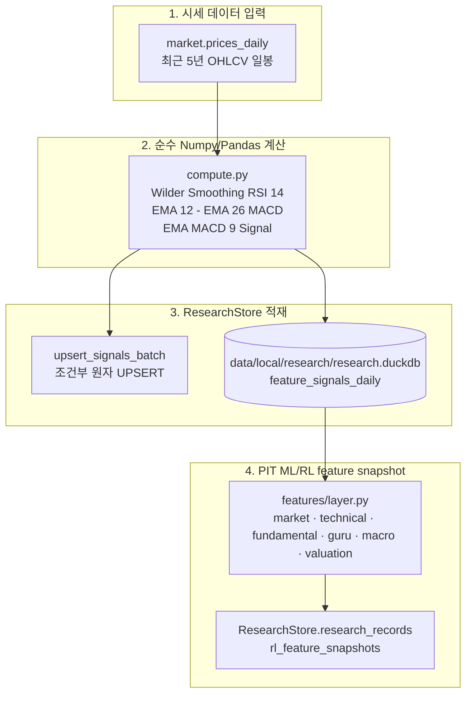

# Research Features — 일간 기술지표와 PIT 학습 입력

`investment_agent.research.features`는 v1 `market.prices_daily`와 각 도메인의
시점 보장 입력을 feature로 계산해 local `ResearchStore`에 저장하는 Research 도메인입니다.
Production Supabase에는 Research schema를 만들지 않습니다.

> [!IMPORTANT]
> **핵심 설계 원칙 (계산과 저장 경계)**
> * **ResearchStore 단일 저장소**: 기술지표와 versioned ML/RL feature snapshot은 local DuckDB에 저장하고, Supabase에 Research schema를 추가하지 않습니다.
> * **외부 라이브러리 비의존**: 무거운 외부 라이브러리(`pandas-ta` 등)에 의존하지 않고, 순수 `numpy`/`pandas`로 Wilder Smoothing과 지수이동평균(EMA)을 직접 구현합니다.
> * **결정적 재계산**: 저장 구간 앞에 워밍업 구간을 두어 같은 가격 이력은 같은 RSI·MACD를 만듭니다.
> * **멱등 저장**: 입력 identity별 upsert와 변경 감지로 같은 입력을 다시 실행해도 의미 없는 쓰기를 만들지 않습니다.
> * **PIT 차단**: historical replay에서는 당시 cutoff 이전에 available한 입력만 허용하고, 없는 도메인은 결측으로 유지합니다.

---

## 0. 관련 문서 및 전체 위치

* **상위 문서**: [루트 README.md](../../../../README.md) · [개발 가이드 CLAUDE.md](../../../../CLAUDE.md)
* **상류 파이프라인**: [Market (일별 시세)](../../data/market/README.md)
* **하류 파이프라인**:
  * [Trading (후보 종목 랭킹 및 가격 특징량)](../../trading/README.md)
  * [Notifications (차트 지표 및 모멘텀)](../../notifications/README.md)

---

## 1. 전체 데이터 파이프라인 아키텍처



---

## 2. 핵심 개념 (초보자 가이드)

### 일간 기술지표와 PIT feature snapshot
* **일간 기술지표**: RSI(14), MACD(12, 26, 9)를 `feature_signals_daily`에 저장합니다. 이 표는
  `market.prices_daily`의 security identity를 현재 ticker로 투영한 결과입니다.
* **PIT feature snapshot**: `features/layer.py`가 가격·기술지표·재무·기관·macro·valuation을
  하나의 고정 컬럼 계약으로 묶어 `rl_feature_snapshots`에 저장합니다. 결측은 0으로 숨기지 않고
  값과 `__is_missing` 표식을 함께 보존합니다.

### Wilder's Smoothing
* **한 줄 설명**: J. Welles Wilder가 고안한 지수이동평균 방식으로, 가중치 $\alpha = 1/N$을 적용하여 급격한 가격 변화에 덜 민감하고 부드러운 모멘텀을 산출하는 기법.
* **이 프로젝트에서는**: `compute.py`의 `rsi(close, length=14)` 함수에서 Wilder's Smoothing을 직접 구현하여 외부 라이브러리 없이 RSI(14)를 계산합니다.

---

## 3. 주요 기술지표 및 계산 정의

| 구분 | 지표명 | 계산 파라미터 및 산출 공식 | 제공 위치 |
|---|---|---|---|
| **저장형 지표** | **RSI (14)** | Wilder Smoothing ($\alpha = 1/14$), 0~100 범위 모멘텀 강도 | `feature_signals_daily` |
| **저장형 지표** | **MACD** | $EMA_{12}(Close) - EMA_{26}(Close)$ | `feature_signals_daily` |
| **저장형 지표** | **MACD Signal** | $EMA_9(MACD)$ | `feature_signals_daily` |
| **PIT snapshot** | **Market / technical** | 가격 수익률·변동성·RSI·MACD와 결측 표식 | `rl_feature_snapshots` |
| **PIT snapshot** | **Fundamental / guru** | 재무 성장·마진·부채와 기관 보유 변화 | `rl_feature_snapshots` |
| **PIT snapshot** | **Macro / valuation** | 고정 macro series와 valuation ratio·규모 | `rl_feature_snapshots` |

---

## 4. 관련 코드 및 데이터 흐름

### 주요 파일 구조
```text
src/investment_agent/research/features/
├── compute.py           # 순수 Numpy/Pandas 기반 RSI, MACD, EMA 계산 엔진
├── db.py                # 가격 조회·조건부 원자 UPSERT·변경 감지
├── etl.py               # run() 오케스트레이션
├── retention.py         # 730일 초과 과거 데이터 정리(Pruning)
├── daily.py             # 일일 증분 계산 진입점 (market_daily 완료 후 트리거)
├── backfill.py          # 신규 종목/전체 종목 저장 구간 백필 진입점
└── (shared) platform/research_store.py # ResearchStore DuckDB 저장소
```

### 주요 함수 호출 흐름
```text
daily.py::main()
  └── etl.py::run(workflow="daily")
        ├── prices.py::load_prices()                  ──> 저장 구간 + 750거래일 워밍업 조회
        ├── compute.py::compute_all()                 ──> RSI(14), MACD(12,26,9) 계산
        ├── db.py::changed_indicators()               ──> 최근 구간 중 실제 변경 행 선별
        ├── db.py::upsert_indicators()                ──> local DuckDB 조건부 적재
        └── retention.py::prune_history()             ──> 730일 이전 오래된 행 정리

build_features.py::main()
  └── FeatureLayer.build()               ──> PIT market/technical/fundamental/guru/macro/valuation 계산
        └── ResearchStore.research_records.rl_feature_snapshots upsert
```

---

## 5. 실행 및 검증 가이드

```bash
# 1. 일일 증분 계산 (Market Daily 완료 후 새 거래일 지표 계산)
python -m investment_agent.research.features.daily

# 2. 신규 종목 또는 전체 저장 구간 기술지표 백필
python -m investment_agent.research.features.backfill

# 3. 모델/RL용 PIT feature snapshot 생성
python -m investment_agent.research.commands.build_features --dry-run
```

두 명령 모두 같은 가격 이력에 대해 결정적입니다. 백필 직후 같은 명령을 재실행했을 때 `affected=0`이어야 정상입니다.

---

## 6. 수정할 때 확인할 곳

| 수정 목적 | 확인할 파일 및 함수 | 주의사항 |
|---|---|---|
| RSI / MACD 계산 알고리즘 수정 | `src/investment_agent/research/features/compute.py` (`rsi`, `macd`) | 저장값의 재현성을 위해 750거래일 워밍업 유지 |
| feature 추가 | `compute.py`, `layer.py` | `FEATURE_COLUMNS`, missing 표식, feature version을 함께 검토 |
| 보존 기간 변경 | `src/investment_agent/research/features/retention.py` (`prune_history`) | ResearchStore의 저장 정책과 일관되게 조정 |

---

## 7. 유용한 SQL 점검 쿼리

저장형 RSI·MACD는 로컬 DuckDB의 `feature_signals_daily`에서 ticker와 날짜로 읽습니다.
모델 입력은 `rl_feature_snapshots`에서 feature version과 `as_of_at`을 함께 확인합니다.

```sql
-- 1. AAPL 최근 10거래일 저장형 기술지표 조회
select
  ticker, trade_date, rsi14, macd, macd_signal
from feature_signals_daily
where ticker = 'AAPL'
order by trade_date desc
limit 10;
-- Python에서 ResearchStore.features_for_ticker("AAPL", limit=10)로 읽는다.

-- 2. S&P 500 중 RSI 과매도(RSI < 30) 및 과매수(RSI > 70) 종목 탐색
select ticker, trade_date, rsi14
from feature_signals_daily
where rsi14 < 30 or rsi14 > 70
order by trade_date desc, ticker;
-- Python에서 DuckDB feature_signals_daily를 읽어 스크리닝한다.
```
