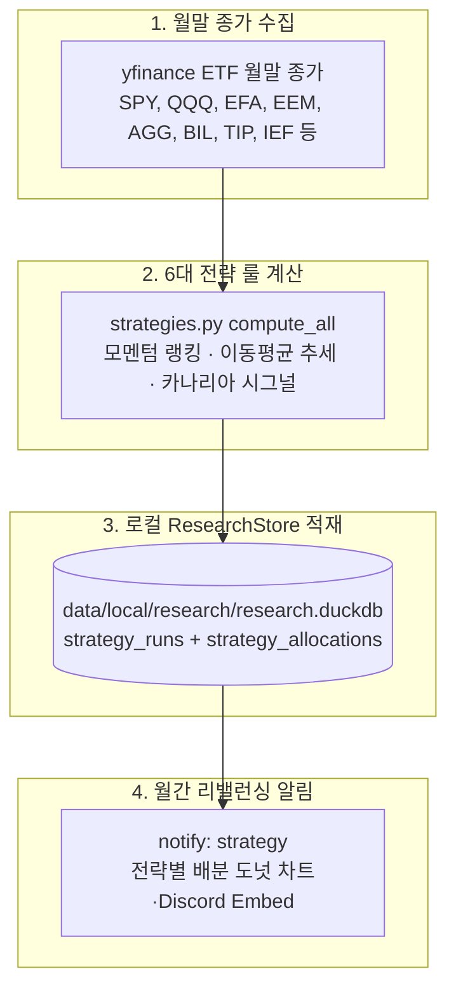

# Strategy — 팩터/룰 기반 자산배분 전략 6종 파이프라인

`investment_agent.research.strategies`는 자산배분 ETF 유니버스를 기반으로 **월말 종가를 활용해 팩터·모멘텀·추세추종 기반 자산배분 전략 6종의 목표 비중을 산출하고 로컬 DuckDB에 적재하는 연구 도메인**입니다. Discord 알림은 이 로컬 read model을 읽고, Production Supabase에는 Research schema를 만들지 않습니다.

> [!IMPORTANT]
> **핵심 설계 원칙 (Service-Role 전용 & 원자적 배분)**
> * **단일 기준 (SSOT)**: `catalog.py`의 `STRATEGY_CATALOG`와 계산 함수 등록이 완벽히 동기화되어 어긋남 시 실행이 차단됩니다.
> * **월간 멱등성**: `(strategy_id, apply_date)` 단위로 유일 키가 적용되어 재실행 시에도 중복 없이 멱등적으로 비중이 갱신됩니다.

---

## 0. 관련 문서 및 전체 위치

* **상위 문서**: [루트 README.md](../../../../README.md) · [개발 가이드 CLAUDE.md](../../../../CLAUDE.md)
* **하류 파이프라인**:
  * [Notifications (월간 전략 리밸런싱 알림 및 도넛 차트)](../../notifications/README.md)
  * [Trading (벤치마크 및 포트폴리오 비교)](../../trading/README.md)

---

## 1. 전체 데이터 파이프라인 아키텍처



---

## 2. 핵심 개념 (초보자 가이드)

### 듀얼 모멘텀 (Dual Momentum)
* **상대 모멘텀 (Relative Momentum)**: 여러 자산(예: 미국 주식 vs 선진국 주식) 중 과거 1~12개월 수익률이 더 높은 1등 자산을 선택하는 방식.
* **절대 모멘텀 (Absolute Momentum)**: 선택된 1등 자산이 단기 안전자산(BIL/단기국채)보다 수익률이 높을 때만 투자하고, 그렇지 않으면 현금/채권으로 대피하는 하방 방어 기법.

### 카나리아 지표 (Canary Asset - TIP)
* **한 줄 설명**: 광산의 카나리아처럼 시장의 위험 징후를 가장 먼저 감지하는 선행 자산 (미국 물가연동채 `TIP`).
* **이 프로젝트에서는**: HAA(Hybrid Asset Allocation) 전략에서 TIP의 1/3/6/12개월 모멘텀이 마이너스로 돌아서면 즉시 안전자산(IEF/BIL)으로 포트폴리오를 전환합니다.

---

## 3. 지원하는 6대 퀀트 자산배분 전략 ([`catalog.py`](catalog.py))

| 전략 ID | 전략명 (Strategy Name) | 핵심 알고리즘 및 룰 | 원작자 / 출처 |
|---|---|---|---|
| `gem` | **GEM (Global Equities Momentum)** | 미국주식(SPY) vs 전세계주식(VEU) 상대모멘텀 + 무위험자산(BIL) 절대모멘텀 | Gary Antonacci (2014) |
| `adm` | **ADM (Accelerating Dual Momentum)** | 1/3/6개월 가중 모멘텀으로 미국/글로벌/채권 중 최우수 자산 집중 배분 | Engineered Portfolio (2018) |
| `dmsr` | **DMSR (Dual Momentum Sector Rotation)** | S&P 500 11개 섹터 ETF 중 12개월 모멘텀 상위 4개 섹터 균등 배분 | SPDR 11 Sectors Rotation |
| `gtaa5` | **GTAA-5 (Global Tactical Asset Allocation)** | 글로벌 5대 자산군(주식·외국주식·채권·원자재·리츠) 10개월 이동평균 추세추종 | Mebane Faber (2007) |
| `haa_bal` | **HAA-Balanced (Hybrid Asset Allocation)** | 카나리아 지표(TIP)로 위험 회피 판별 후 모멘텀 상위 4개 자산 분산 | Wouter Keller (2023) |
| `haa_sim` | **HAA-Simple (Hybrid Asset Allocation)** | 카나리아 지표(TIP)로 판별 후 최우수 공격 자산 1개 집중 배분 | Wouter Keller (2023) |

---

## 4. 관련 코드 및 데이터 흐름

### 주요 파일 구조
```text
src/investment_agent/research/strategies/
├── catalog.py           # 6대 전략 정의, 대상 ETF 유니버스, 카탈로그 (SSOT)
├── strategies.py        # GEM, ADM, DMSR, GTAA-5, HAA 알고리즘 계산 엔진
├── db.py                # allocations 쿼리 계층
├── etl.py               # main() CLI 진입점, _run_monthly()/_run_backfill() 오케스트레이션
└── retention.py         # 로컬 ResearchStore 보존 정책
```

### 주요 함수 호출 흐름
```text
etl.py::main()
  ├── sources/yfinance.py::download_monthly_close()  ──> yfinance 월말 종가 수집
  ├── strategies.py::compute_all()                    ──> 6대 전략별 목표 비중 계산
  └── db.py::upsert_allocation()                       ──> local DuckDB 적재
```

---

## 5. 실행 및 검증 가이드

```bash
# 1. 월간 정기 배분 계산 (매월 1일 실행)
python -m investment_agent.research.strategies.etl

# 2. 기본 시작월(2017년 1월)부터 과거 전체 전략 배분 백필
python -m investment_agent.research.strategies.etl --backfill-from

# 3. 월간 전략 리밸런싱 Discord 알림 테스트
python -m investment_agent.operations.commands.notify --kind strategy
```

---

## 6. 수정할 때 확인할 곳

| 수정 목적 | 확인할 파일 및 함수 | 주의사항 |
|---|---|---|
| 새로운 자산배분 전략 추가 | `src/investment_agent/research/strategies/catalog.py` & `strategies.py` | 카탈로그와 계산 함수 ID 동기화 |
| 모멘텀 계산 기간 변경 | `src/investment_agent/research/strategies/strategies.py` | 월말 종가 결측치 처리 검토 |
| 리밸런싱 적용일(apply_date) 규칙 수정 | `src/investment_agent/research/strategies/etl.py` | 매월 1일 멱등성 유지 |

---

## 7. 유용한 SQL 점검 쿼리

로컬 점검은 `ResearchStore().allocations()`를 사용한다. `strategy_runs`는 계산 한 번의
시점·mode·signal metadata를, `strategy_allocations`는 `(run_id, asset_symbol)`별 weight를
보관한다. Discord 발송 상태는 이 표에 저장하지 않고 runtime SQLite outbox가 소유한다.
이 영역에는 Production Supabase schema나 migration 파일을 만들지 않는다.
