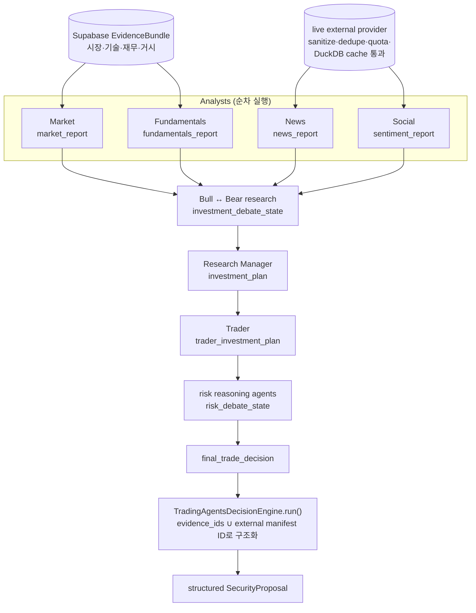

# Trading — 근거에서 포트폴리오까지의 판단 계층

`investment_agent.trading`는 구조화된 투자 근거를 종목 기대수익으로 바꾸고, 위험을 고려한 목표비중을
**System Portfolio**에서 추적한 뒤, 실제 계좌(**My Portfolio**)가 그 목표를 따라갈 주문 계획을 만드는
계층입니다. 증권사 credential을 갖거나 주문 API를 호출하지 않습니다. System은 실계좌·승인을 모릅니다.

상위 불변 규칙은 [CONSTITUTION.md](CONSTITUTION.md)가 갖습니다.

## 이 package의 책임

```text
tracked universe
  ↓
candidate_ranker                 분석할 종목(System 보유·새 정보·factor 상위). 비중은 정하지 않음
  ↓
ContextBuilder → EvidenceBundle cutoff 시점에 볼 수 있었던 구조화 근거
  ↓
decision/analysis.py            TradingAgents 논지 → 신호 배치
  ↓
decision/alpha.py               factor 사전값(IC×σ×z) + champion ML + 논지 검증 → 기대초과수익·제약
  ↓
system/target.py                risk/budget → RiskAwareOptimizer → no-trade band → DeterministicRiskGate
  ↓
system/engine.py                System 목표 기록, 비중 기반 NAV
══════ 여기까지 실계좌·Discord 승인과 독립 ══════
my_portfolio.py                 System 목표 − 새 Toss 스냅샷 = 추종 제안·RiskDecision
  ↓
ExecutionIntent                 이 지점부터 `investment_agent.execution`이 소유
```

## 하지 않는 일

- broker key, 계좌 비밀번호, OAuth token 저장
- 주문 제출·취소·체결 조회
- LLM이 지정한 비중을 그대로 최종 목표 비중으로 채택
- current macro/fundamentals를 과거 시점 데이터로 위장
- historical replay에서 현재 뉴스 API나 DuckDB live cache 사용
- 자동 모델 승격 또는 kill switch 해제

## 핵심 계약

| 계약 | 정의 | 의미 |
|---|---|---|
| `EvidenceItem` | `research/evidence/contracts.py` | domain별 payload와 observed/available time, source, stable ID |
| `EvidenceBundle` | `research/evidence/contracts.py` | 하나의 ticker·cutoff·source kind에 대한 근거와 결측 목록 |
| `FeatureBundle` | `feature_layer.py` | 학습과 inference가 공유하는 feature 정의 hash |
| `FeatureSnapshot` | `rl/contracts.py` | 저장 가능한 종목×시점 feature row |
| `SecurityProposal` | `portfolio/contracts.py` | LLM의 종목별 정성 판단. 주문 권한 없음 |
| `ExpectedReturnSignal` | `portfolio/optimizer.py` | ALPHA의 기대초과수익·근거 일치도·제약을 optimizer에 전달 |
| `SignalBatch` | `portfolio/signal_book.py` | 요청·성공·실패 종목과 artifact가 고정된 분석 batch |
| `PortfolioProposal` | `portfolio/contracts.py` | System의 단일 optimizer가 만든 CASH 포함 목표 비중 |
| `RiskDecision` | 같은 파일 | policy/input hash와 승인 또는 위반 결과 |
| `ExecutionIntent` | `src/investment_agent/execution/orders/intents.py` | paper/live 실행 계층으로 넘길 수 있는 유일한 의도 |

모든 저장 ID는 가능한 범위에서 canonical JSON의 SHA-256으로 안정적으로 만듭니다. 같은 입력을
재시도할 때 다른 주문 의도나 평가 대상으로 보이지 않게 하기 위해서입니다.

## Universe와 후보 선정

현재 live/Shadow 신규 위험 universe는 `universe.securities.is_tracked=true`입니다. CLI에서 ticker를
직접 입력해도 이 조건을 우회하지 못합니다.

`candidate_ranker.py`는 다음 순서로 LLM 분석 후보를 고릅니다.

```text
tracked universe
→ 새 공시·고영향 사건이 생긴 종목(우선 레인)
→ 보유 중인데 factor 품질 기준에서 떨어진 종목
→ 품질 기준 통과 factor 종합 상위 60종목 중 판단이 없거나 28일보다 오래된 종목(점수순)
→ 판단이 오래된 보유 종목
→ 실행 limit (판단이 유효한 종목은 예산이 남아도 다시 보지 않음)
```

한 회사의 여러 주식(GOOG·GOOGL, FOX·FOXA, NWS·NWSA)은 CIK로 묶어 앞선 한 종목만 분석하고, 빈 칸은 다음
후보가 채운다. 분석하지 않은 주식은 같은 회사의 최신 논지를 자기 종목 이름으로 쓴다(`thesis_views`).

factor 점수는 가장 최근의 온전한 live feature 횡단면에서 `research/features/factors.py`가 계산합니다
(품질·재무건전성·성장·업종 내 가치·추정치 상향·12-1 모멘텀). 횡단면이 없으면 예전 coverage 우선 순환
랭커로 고르고 `path=legacy_rotation` 경고를 남깁니다 — 그 계산은
[CANDIDATE_SELECTION.md](CANDIDATE_SELECTION.md)를 봅니다.

## Context와 PIT 경계

`ContextBuilder.build(ticker, as_of_at, source_kind=...)`(`research/evidence/context.py`)는 각 domain repository를
호출해 bundle을 만듭니다. 계약·조립기·통계와 PIT 읽기(`PitReader`)는 Research가 소유하고 Trading은
`research/adapters/trading.py`로만 가져옵니다.

| Domain | live Shadow | historical replay |
|---|---|---|
| Market | cutoff 이전 ingested bar | cutoff 이전 ingested bar와 당시 universe |
| Technical | 저장된 RSI/MACD row | 저장 row만; 현재 가격 재계산 view 제외 |
| Fundamentals | `financials` 최신 원장 | `filed_at`·`available_at`·`ingested_at` cutoff를 적용한 version |
| Estimates | 실제 관측 snapshot | reconstructed row 제외 |
| Macro | 완료된 최신 market-state collection run | point-in-time 이력이 없어 historical replay에서는 제외 |
| Segment | trusted filing/metric이 있을 때만 | 현재 unavailable이면 명시적 결측 |
| Gurus | SEC accepted time 기준 | accepted/ingested cutoff 기준 |
| Economic calendar | collected/as-of 기준 | actual revision과 forecast cutoff 기준 |
| News/social | Agent의 live provider 단계 | 항상 OFF |

근거가 없으면 빈 객체나 0을 넣지 않고 `missing_data`에 사람이 읽을 수 있는 이유를 기록합니다.
`available_at > as_of_at`인 `EvidenceItem`은 계약 생성 자체가 실패합니다.

## Feature layer

`FeatureLayer.build()`는 가격 수익률, technical, fundamentals, macro, 13F를 동일 정의로
`FeatureBundle`로 변환합니다. **컬럼 집합은 도메인 결측과 무관하게 항상 같습니다**
(`FEATURE_COLUMNS`) — 행마다 컬럼이 달라지면 dataset 결합 자체가 실패하기 때문입니다.
거시는 `MACRO_SERIES` allowlist 밖 series를 컬럼으로 만들지 않고, 결측은 0으로 채우지 않고
`None`으로 남긴 뒤 `<name>__is_missing` 지표를 함께 저장합니다. 학습 행렬을 만들 때만
`impute_cross_section()`이 같은 시점 종목들의 중앙값으로 대체합니다.

bundle은 다음을 함께 보존합니다.

- ticker와 `as_of_at`
- feature definition version
- 정렬된 numeric features
- 각 domain의 source/version/available time
- 결측 목록
- canonical snapshot hash

미래 return label은 feature와 별도 계약입니다. 1D·5D·20D horizon을 지원하며 label 종료 가격이
확정되기 전에는 학습에 사용할 수 없습니다. 이 분리는 같은 feature 정의를 training과 live inference가
공유하면서도 미래 수익률이 inference payload에 섞이지 않게 합니다.

## TradingAgents

`decision/agents/`는 TradingAgents 역할 그래프와 공개 실행 인터페이스를,
`decision/llm/runtime.py`는 upstream 도구를 이 저장소의 데이터 경계로 교체한 실행 환경을 소유합니다.



구조화 시장·재무·거시는 Supabase bundle만 사용합니다. News/Social은 live source kind에서만 별도
provider를 호출하고 sanitize·dedupe·quota·DuckDB cache 경계를 통과합니다.

`SecurityProposal`의 새 입력 계약은 `thesis`·`hard_constraint`·`key_risks`를 요구합니다.
저장용 `signal`은 이 필드에서 파생하고 `target_weight`는 0이다. ALPHA는 명시 논지와
강제 제약을 먼저 읽고, 옛 기록에만 행동 단어를 해석한다.

## System Portfolio와 My Portfolio

- `system/target.py`는 System 자신의 현재 비중만 입력으로 받아 목표비중을 만듭니다. 계좌 스냅샷 인자가 없습니다.
  시장위험·5일 CVaR95 한도는 optimizer의 내부 입력이며 초과 시 위험자산을 현금으로 축소합니다.
- `system/engine.py`는 확정 종가로 NAV를 이어 기록하고, 목표는 판단 다음 정규장 종가에 적용합니다.
  새 factor 횡단면 + 7일 경과 또는 보유 종목의 논지 붕괴가 있을 때만 목표를 다시 만듭니다. 예외로 현금이
  직전 목표의 최소 현금 예산보다 `deploy_cash_gap`(20%p) 넘게 남아 있으면(전액 현금에서 채우는 중) 새 횡단면이
  오는 대로 다시 만듭니다 — turnover 한도는 그대로이고 채우는 간격만 줄어듭니다.
- 벤치마크만큼의 가격 창(약 1년)이 없는 신규 후보는 목표에서 빼고 `short_history_excluded`로 남깁니다.
  공분산은 모든 종목이 겹치는 구간만 쓰므로, 이력 며칠짜리 후보 하나가 목표 전체를 막거나 추정 창을 줄입니다.
- 목표 기록(`system_targets.detail.stage_trace`)은 종목마다 factor 사전값·ML·논지 직전·최종 기대수익·차단
  사유·전/제안/승인 비중을 갖습니다. `system_diagnosis`가 이것을 5·20·60·120거래일 실현 수익과 맞대어
  후보군·선택·비중·노출(규칙이 강제한 현금 / optimizer가 남긴 현금) 효과로 나눕니다.
- `my_portfolio.py`는 최신 승인 System 목표와 새 Toss 스냅샷의 차이를 live 제안으로 기록합니다. 목표에 없는
  보유는 0(전량 매도), 차이가 최소 주문금액 미만이면 묻지 않습니다. 같은 목표는 한 번만 묻습니다.
- `portfolio/signal_book.py`의 `SignalBatch`·`SignalRecord`는 분석 회차의 완전성과 논지 기록 계약입니다.

## Optimizer와 RiskGate

`RiskAwareOptimizer`의 기본 목적함수는 다음 개념입니다.

```text
confidence-adjusted expected return
 - risk_aversion × active variance (SPY 대비, benchmark_relative_risk 기본값)
 - turnover_penalty × target/current difference
```

기대수익이 SPY 대비 초과수익이므로 위험도 SPY 대비로 잰다. 절대 분산으로 재면 주식 위험 프리미엄이
목적함수에 없어 현금으로 치우친다(5년 재현 평균 현금 60% → 15%). long-only, 종목 최대 10%, 섹터 최대 30%,
turnover 최대 25%, 현금 최소 5%를 기본 제약으로 사용합니다. 첫 풀이가 RiskGate의 최대 종목 수보다 많이 담으면
비중 상위 종목만으로 한 번 더 풀어(`cardinality_aware`) 같은 노출을 한도 안에서 다시 나눕니다 — 게이트가 사후에
작은 비중을 현금으로 돌리면 노출이 줄기 때문입니다.
해가 없거나 CVXPY solver가 실패하면 임의 fallback 비중을 만들지 않습니다.

`DeterministicRiskGate`는 optimizer와 별도 방어선입니다. 작은 포지션, 종목/섹터 비중, 최대 종목
수는 결정적으로 현금화할 수 있지만 다음과 같은 실행 안전 위반은 proposal 전체를 거부합니다.

- 미래 또는 오래된 proposal
- tradable universe 밖 symbol
- Paper/Live에 필요한 volatility·beta·correlation 입력 누락
- volatility, beta, correlation, concentration 절대 한도 초과
- turnover 또는 필수 sector mapping 위반

`portfolio.market_risk`는 같은 point-in-time `market.prices_daily` 이력에서 공통 거래일 수익률을
맞춘 뒤, 연율 변동성·SPY beta·최대 쌍별 상관·최대 낙폭을 계산해 Paper/Live RiskGate에 전달합니다.
가격 이력·정렬이 모자라면 수치를 추정하지 않고 RiskGate가 실행을 거부합니다.

정확한 판단·optimizer·RiskGate 흐름은
[투자 시스템](../../../docs/INVESTMENT_SYSTEM.md)을 봅니다.

## Backtest, ML, RL, Qlib

- `src/investment_agent/research/backtest/`: 완전한 `BacktestRequest`만 받는 Native engine과 append-only ledger
- `src/investment_agent/research/backtest/validation.py`: LumiBot PandasData adapter와 metric comparator
- `research/models/baselines.py`: Naive, Ridge, LightGBM, XGBoost 공통 train/evaluate contract
- `rl/baseline.py`: 해석 가능한 deterministic ridge policy
- `rl/trainer.py`: `FinRLTrainer`가 SB3 algorithm class를 감싼다
- `rl/experiment.py`: PPO OOS 평가가 ML baseline을 이겼는지 판정
- `qlib_adapter.py`: ResearchStore feature snapshot을 Qlib `DatasetH`와 recorder로 연결

Qlib, LumiBot, LightGBM/XGBoost, SB3는 선택 dependency입니다. import 가능한 것과 실제 장기간
성과가 검증된 것은 구분합니다.

## 평가와 승격

모델 artifact에는 feature 컬럼 목록, dataset hash, train/validation/OOS 기간, seed, parameter, code
version과 artifact hash를 저장합니다. `ManualPromotionGate`는 현재 model artifact stage를
`shadow → backtest → out_of_sample → walk_forward → paper → live` 순서로 한 단계씩만 올리며,
단계마다 사람이 정확한 확인 문구로 승인합니다. 이 순서와 확인 문구, 실주문 직전 검사
(`has_approved_chain`)는 `research/promotion/gate.py` 한 곳에 있고, `trading/promotion.py`의
`PromotionLedger`가 원장에서 현재 단계와 승인 기록을 읽어 그 검사에 넘깁니다.

execution의 5단계 lifecycle과 model artifact의 6단계 저장 stage는 서로 다른 축입니다.

| 축 | 값 | 의미 |
|---|---|---|
| Model artifact stage | shadow → backtest → out_of_sample → walk_forward → paper → live | 어떤 실행 범위에서 이 artifact를 사용할 수 있는가 |
| Operational lifecycle | backtest → shadow → paper → live_manual → live_autonomous | 시스템이 사람 승인 없이 어디까지 행동할 수 있는가 |
| Source kind | live_shadow / historical_replay | 데이터가 실제 시각인지 역사 replay인지 |

`mode` 한 필드로 이 세 개를 섞지 않습니다.

## 주요 파일

```text
src/investment_agent/trading/
  decision/analysis.py         TradingAgents 논지 분석 진입점(비중을 정하지 않음)
  decision/alpha.py            factor 사전값 + champion ML + 논지 검증 → 기대초과수익·제약
  decision/candidate_ranker.py 분석 후보 순위 계산(System 보유·새 정보·factor 상위)
  decision/candidates.py       후보 선정 판단 로직(`CandidateSelection`: 후보·재분석 우선순위·factor 횡단면·논지)
  decision/universe.py         tracked universe 검증
  evidence/                    dossier·renderer·history(근거 보관·설명). PIT 조립은 research/evidence
  portfolio/optimizer.py       CVXPY 목표비중
  portfolio/market_risk.py     공분산·베타·거래비용·시장위험 재료
  portfolio/signal_book.py     분석 배치·논지 기록 계약
  risk/budget.py               시장·거시 입력 → 위험 한도
  risk/gate.py                 DeterministicRiskGate
  system/                      System Portfolio(target·accounting·engine·store)
  my_portfolio.py              System 목표를 따라가는 실계좌 추종 제안
  performance/                 My Portfolio 성과(입출금 반영 시간가중 수익률)
  repository.py                trading 원장 repository(`TradingRepository`)와 원장 연결 기반(`LedgerAccess`)
  promotion.py                 모델 승격의 원장 역할(`PromotionLedger`) — 실주문 직전 검사와 수동 승격 명령이 쓴다
  supabase_repository.py       Trading 원장 게이트웨이(`PitReader`·`CandidateSelection`·`PromotionLedger` 합성, ticker↔security_id 변환)
```

## 주요 CLI

```powershell
# PIT 밸류에이션 관측값 적재 (PER/PBR/PSR/FCF yield). feature보다 먼저 돈다
python -m investment_agent.research.commands.build_valuations --limit 5 --dry-run

# PIT feature snapshot 적재 (ML/RL 학습 dataset의 원천, LLM 미호출)
python -m investment_agent.research.commands.build_features --limit 5 --dry-run

# 미래 구간이 끝난 snapshot에만 초과수익 label 부착
python -m investment_agent.research.commands.build_labels --horizon 5 --dry-run

# 확정 label을 비용 반영 학습 표본으로 (왕복 수수료·슬리피지 적용)
python -m investment_agent.research.commands.build_training_samples --dry-run

# 원장을 학습용 dataset JSON으로 내보냄 (label 확정분만, 시점 내 결측 대체)
python -m investment_agent.research.commands.export_dataset --output artifacts/datasets/v2.json

# Evidence만 검증하고 LLM을 호출하지 않음
python -m investment_agent.trading.decision.analysis --ticker AAPL --dry-run

# 현재 tracked universe에서 논지 분석
python -m investment_agent.trading.decision.analysis --limit 5

# System Portfolio 평가·목표 갱신과 성과 요약
python -m investment_agent.operations.commands.system_portfolio
python -m investment_agent.operations.commands.system_portfolio --summary

# 운영 엔진 그대로 과거 구간에서 구성 요소 ablation 비교
python -m investment_agent.operations.commands.system_ablation --start 2025-01-01 --end 2025-12-31

# 성숙한 case 평가
python -m investment_agent.operations.commands.evaluate_decisions --limit 200

# 완전한 JSON manifest로 Native backtest
python -m investment_agent.research.backtest.cli --input <INPUT.json> --output <OUTPUT.json>

# cache retention
python -m investment_agent.intelligence.commands.prune_evidence_cache --retention-days 90
```

승격과 intent 명령은 실제 ID와 저장된 평가 근거가 필요합니다.

```powershell
python -m investment_agent.operations.commands.promote_model --artifact-id <ARTIFACT_ID> --to-stage paper --approved-by owner --confirm "PROMOTE <ARTIFACT_ID> shadow->paper"

python -m investment_agent.operations.commands.create_execution_intent --risk-decision-id <RISK_DECISION_ID> --execution-mode paper --confirm <RISK_DECISION_ID>
```

## 테스트

### 판단 학습과 성과 보고

종목 판단 원문은 매수 여부와 관계없이 보존합니다. `build_decision_experiences`는 당시의
신호·확률·확신도·기대수익과 이후 확정된 가격·배당·분할을 연결합니다. 원본을 사람이
수정하거나 실제로 매수해야 학습되는 구조가 아닙니다. 관측 전 미래 라벨은 제외하며,
같은 판단의 최초 경험은 다시 덮어쓰지 않습니다. 가정한 거래비용을 반영한 가상 성과는
실제 계좌 수익률과 구분합니다.

```powershell
python -m investment_agent.operations.commands.build_decision_experiences --as-of <TIMEZONE_ISO_TIMESTAMP>
python -m investment_agent.research.commands.continuous_retrain --dry-run
python -m investment_agent.operations.commands.update_performance
```

하네스는 판단 경험을 매일 만들고 성과 집계·누락 알림 재시도를 5분마다 수행합니다.
분석 일부 실패나 승인 대기와 무관하게 보고 주기가 실행됩니다. 새로운 알림 주제
`ai.performance`는 알림 원장의 baseline 설정 후 `investment_performance`로 발송합니다.
설정 명령은 `python -m investment_agent.operations.commands.notify_ledger baseline --topic ai.performance`입니다.
`DISCORD_CHANNEL_AI_REPORTS`를 사용하고, 반복된 동일 보고서는 중복 발송하지 않습니다.
승인 카드의 ✅ 버튼은 서명된 주문안에 대한 일회 승인입니다. 일반 메시지 이모지 반응으로
주문하지 않으며, 지정 승인자·만료·주문 hash·위험 검증을 모두 통과해야 합니다.

실계좌 성과는 저장된 체결과 계좌 평가를 사용합니다. 개별 체결이 없으면 브로커의
누적 체결량·평균가를 차분하여 관측 시각 기준으로 계산하고, 주문 수수료·세금은 수량
비례 배분합니다. 최근 7일 내 종결 주문도 비용 정정을 확인합니다. 초기 원가, 입출금
내역 또는 수수료가 확인되지 않으면 해당 손익·시간가중 수익률은 미확인으로 남습니다.
`performance_events`는 출처가 있는 초기 보유·입출금·배당·분할·자료 완전성 증거만
수용합니다. 계좌 입출금이 없었다고 자동으로 가정하지 않습니다.

PPO 학습은 겹치지 않는 기간으로 나눈 동일 holdout에서 기존 정책과 후보를 비교합니다.
기본적으로 독립 평가 기간 20개 이상이 필요하며 부족하면 대기합니다. `--dry-run`은
자료 준비 상태만 확인합니다. 실제 학습은 해시·종목 순서·특징 버전을 포함한 후보를
저장하고 활성 정책을 자동으로 교체하지 않습니다. 검증된 후보의 명시적 채택은
`continuous_retrain --adopt-candidate <CANDIDATE_JSON>`으로 수행합니다. RL 후보와 채택은
Research에 남고, System 목표는 채택 champion ML과 결정론적 포트폴리오 엔진만 사용합니다.

최초 실행 제어 원장은 `execution_controls --initialize`로 비활성 상태로 만듭니다.
이후 `execution_controls`로 버전을 확인하고, 운영자가 `--manual on --expected-version
<VERSION> --reason <REASON> --confirm I_CONFIRM_MANUAL_APPROVAL_EXECUTION`을 명시해야
DB의 수동 승인 실행을 허용합니다. 환경변수의 live·kill 게이트와 정비 보류·lockdown,
모델 승격, Discord listener는 별도 조건이며 이 명령이 자동 변경하지 않습니다.

### 순환 분석

하네스의 기본 분석 주기는 3시간입니다. 보유 후보 판단은 28일간 유효하고 하루 모델 예산은 약
20종목이라, 회차마다 판단이 오래된 후보만 고르고 없으면 배치 없이 넘깁니다. 실패한 시도도 순서에
반영하며, LLM 예산이 부족하면 남은 종목은 다음 회차에 이어갑니다. 분석은 장외에도 수행합니다.

실계좌는 System 목표를 따라가기만 하므로 주문 직전 LLM 진입 재판단을 두지 않습니다. 가격 보호는 실행 단계의
지정가 band와 승인 만료가 담당합니다. 승인 카드의 서명된 ✅ 버튼으로만 승인합니다.

### 오프라인 검증

```powershell
python -m unittest discover -s tests -t .
python -m unittest tests.investment_agent.research.features.test_layer
python -m unittest tests.investment_agent.trading.portfolio.test_optimizer
python -m unittest tests.investment_agent.research.backtest.test_validation
```

단위 테스트는 외부 provider, 실제 Supabase 쓰기, broker 계정을 호출하지 않습니다. 실제 연동은
[운영](../../../docs/OPERATIONS.md)의 절차를 따라 단계별로 진행합니다.
